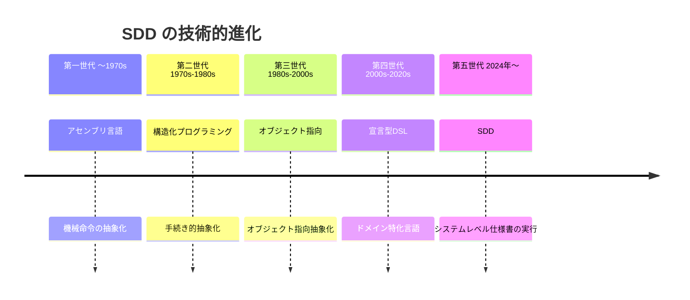
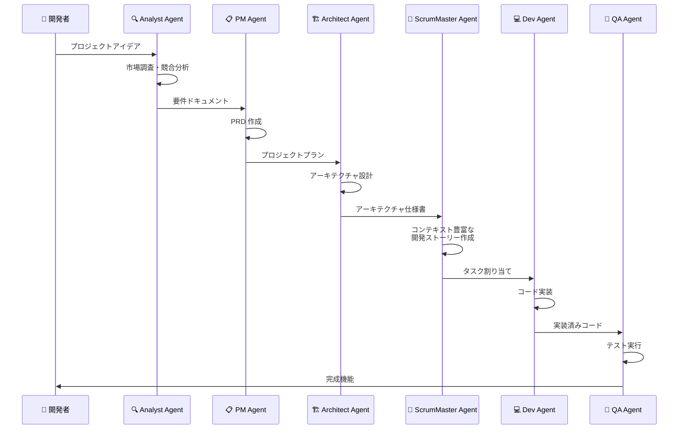
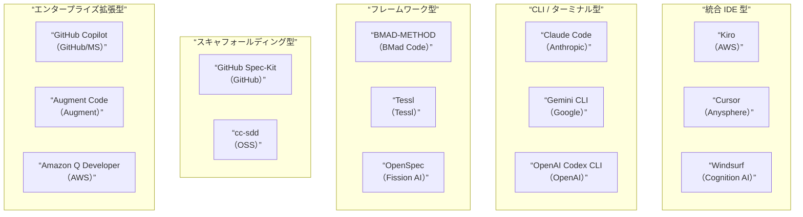
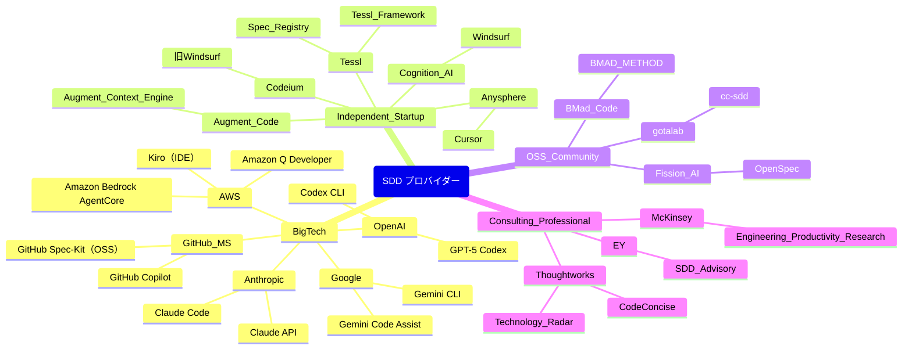
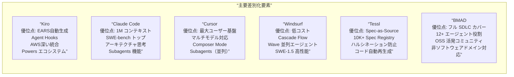
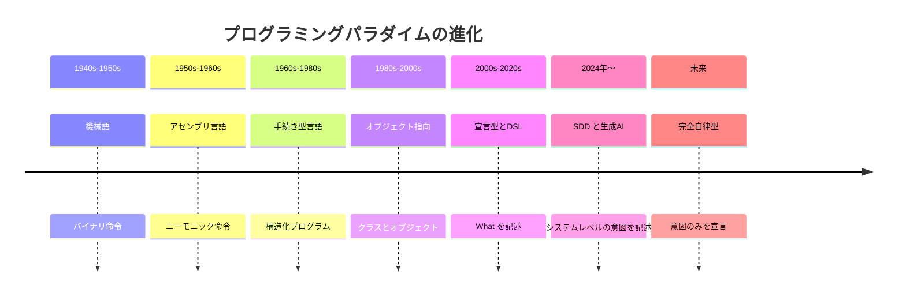

# AIによるSpec Driven Development (SDD) トレンド調査レポート

**調査対象期間:** 2024年〜2026年3月  
**調査基準日:** 2026年3月12日  
**分類:** 技術動向・市場調査

—

## 目次

1. エグゼクティブサマリー
2. SDD の定義と背景
3. SDD 台頭の構造的要因
4. SDD の三層モデル
5. SDD のコアワークフロー
6. 主要技術と技術スタック
7. 主要ツール・プラットフォーム詳細
8. フレームワーク・方法論比較
9. 主要プロバイダー一覧
10. 競合ポジショニング分析
11. 市場データと導入効果
12. コンプライアンスとガバナンスへの影響
13. 課題とリスク
14. 将来展望
15. 結論

—

## 1. エグゼクティブサマリー

Spec Driven Development (SDD) は、2025年にソフトウェアエンジニアリングの新たなパラダイムとして急浮上した開発手法である。その核心は「仕様書（スペック）を主要なアーティファクト（成果物）とし、AIコーディングエージェントがその仕様に基づいてコードを生成する」という考え方にある。

SDD は「vibe coding（感覚的なコーディング）」という概念とは対照的に、2025年に登場した最も重要な実践のひとつであり、AI ツールへの適応においてソフトウェアエンジニアリングがいかに急速に進化しているかを示している。 [![](claude-citation:/icon.png?validation=CC39EF63-90EF-49A1-97EF-A837587B24C8&citation=eyJlbmRJbmRleCI6NzA4LCJtZXRhZGF0YSI6eyJmYXZpY29uVXJsIjoiaHR0cHM6XC9cL3d3dy5nb29nbGUuY29tXC9zMlwvZmF2aWNvbnM/c3o9NjQmZG9tYWluPW1lZGl1bS5jb20iLCJzaXRlRG9tYWluIjoibWVkaXVtLmNvbSIsInNpdGVOYW1lIjoiTWVkaXVtIiwidHlwZSI6IndlYnBhZ2VfbWV0YWRhdGEifSwic291cmNlcyI6W3siaWNvblVybCI6Imh0dHBzOlwvXC93d3cuZ29vZ2xlLmNvbVwvczJcL2Zhdmljb25zP3N6PTY0JmRvbWFpbj1tZWRpdW0uY29tIiwic291cmNlIjoiTWVkaXVtIiwidGl0bGUiOiJTcGVjLWRyaXZlbiBkZXZlbG9wbWVudC4gVW5wYWNraW5nIG9uZSBvZiAyMDI14oCZcyBrZXkgbmV34oCmIHwgYnkgVGhvdWdodHdvcmtzIHwgTWVkaXVtIiwidXJsIjoiaHR0cHM6XC9cL3Rob3VnaHR3b3Jrcy5tZWRpdW0uY29tXC9zcGVjLWRyaXZlbi1kZXZlbG9wbWVudC1kODU5OTVhODEzODcifV0sInN0YXJ0SW5kZXgiOjU5MiwidGl0bGUiOiJTcGVjLWRyaXZlbiBkZXZlbG9wbWVudC4gVW5wYWNraW5nIG9uZSBvZiAyMDI14oCZcyBrZXkgbmV34oCmIHwgYnkgVGhvdWdodHdvcmtzIHwgTWVkaXVtIiwidXJsIjoiaHR0cHM6XC9cL3Rob3VnaHR3b3Jrcy5tZWRpdW0uY29tXC9zcGVjLWRyaXZlbi1kZXZlbG9wbWVudC1kODU5OTVhODEzODciLCJ1dWlkIjoiNjI3MTBlMjItYWFhNy00OGI5LWE3MjItYzc3MjgxNGJiZTA3In0%3D “Medium”)](https://thoughtworks.medium.com/spec-driven-development-d85995a81387)

2024〜2025年にかけて三つの力が収束し、SDD を信頼性の高い AI 生成プロダクションコードのためのワークフローとして位置付けた。AI コード生成は重要な能力閾値を超えたが、同時にリスクも伴っている。学術的分析によると、LLM は脆弱なコードをベンチマーク全体で 9.8〜42.1% の割合で生成するとされる。SDD は実行可能な仕様書をアクティブな検証ゲートとして組み込むことでこれに対応する。 [](https://www.augmentcode.com/guides/what-is-spec-driven-development)

SDD は伝統的なアーキテクチャを逆転させ、仕様書を実行可能かつ権威ある存在とする。宣言された意図を AI 生成と検証によって検証済みコードへと変換し、アーキテクチャの決定論性を提供する。継続的な強制を通じてドリフトを排除するが、スキーマ設計とコントラクトファーストの推論という新たなエンジニアリング規律を要求する。 [](https://www.infoq.com/articles/spec-driven-development/)

—

## 2. SDD の定義と背景

### 2.1 定義

SDD において、仕様書はプライマリアーティファクトである。コードでも、フレームワークでも、Jira チケットでもない。仕様書が真実の唯一の情報源であり、その他はすべて下流の存在となる。 [![](claude-citation:/icon.png?validation=CC39EF63-90EF-49A1-97EF-A837587B24C8&citation=eyJlbmRJbmRleCI6MTIwMiwibWV0YWRhdGEiOnsiZmF2aWNvblVybCI6Imh0dHBzOlwvXC93d3cuZ29vZ2xlLmNvbVwvczJcL2Zhdmljb25zP3N6PTY0JmRvbWFpbj1jZXNhcnNvdG92YWxlcm8ubmV0Iiwic2l0ZURvbWFpbiI6ImNlc2Fyc290b3ZhbGVyby5uZXQiLCJzaXRlTmFtZSI6IkPDqXNhciBTb3RvIFZhbGVybyIsInR5cGUiOiJ3ZWJwYWdlX21ldGFkYXRhIn0sInNvdXJjZXMiOlt7Imljb25VcmwiOiJodHRwczpcL1wvd3d3Lmdvb2dsZS5jb21cL3MyXC9mYXZpY29ucz9zej02NCZkb21haW49Y2VzYXJzb3RvdmFsZXJvLm5ldCIsInNvdXJjZSI6IkPDqXNhciBTb3RvIFZhbGVybyIsInRpdGxlIjoiU0REIGFuZCB0aGUgRnV0dXJlIG9mIFNvZnR3YXJlIERldmVsb3BtZW50IiwidXJsIjoiaHR0cHM6XC9cL3d3dy5jZXNhcnNvdG92YWxlcm8ubmV0XC9ibG9nXC9zZGQtYW5kLXRoZS1mdXR1cmUtb2Ytc29mdHdhcmUtZGV2ZWxvcG1lbnQuaHRtbCJ9XSwic3RhcnRJbmRleCI6MTEwOSwidGl0bGUiOiJTREQgYW5kIHRoZSBGdXR1cmUgb2YgU29mdHdhcmUgRGV2ZWxvcG1lbnQiLCJ1cmwiOiJodHRwczpcL1wvd3d3LmNlc2Fyc290b3ZhbGVyby5uZXRcL2Jsb2dcL3NkZC1hbmQtdGhlLWZ1dHVyZS1vZi1zb2Z0d2FyZS1kZXZlbG9wbWVudC5odG1sIiwidXVpZCI6IjIyMTVmODIyLWNmNWUtNGFmMS04ZjdmLWI3MmY0YzE3NzI3ZCJ9 “César Soto Valero”)](https://www.cesarsotovalero.net/blog/sdd-and-the-future-of-software-development.html)

より正式には、次のように定義される：

SDD とは、AI コーディングエージェントの支援を受けながら、よく設計されたソフトウェア要求仕様書をプロンプトとして使用し、実行可能なコードを生成する開発パラダイムである。ただし、仕様書とは何か、SDD における仕様書の役割については、業界内でさまざまな意見がある。 [![](claude-citation:/icon.png?validation=CC39EF63-90EF-49A1-97EF-A837587B24C8&citation=eyJlbmRJbmRleCI6MTM1OCwibWV0YWRhdGEiOnsiZmF2aWNvblVybCI6Imh0dHBzOlwvXC93d3cuZ29vZ2xlLmNvbVwvczJcL2Zhdmljb25zP3N6PTY0JmRvbWFpbj1tZWRpdW0uY29tIiwic2l0ZURvbWFpbiI6Im1lZGl1bS5jb20iLCJzaXRlTmFtZSI6Ik1lZGl1bSIsInR5cGUiOiJ3ZWJwYWdlX21ldGFkYXRhIn0sInNvdXJjZXMiOlt7Imljb25VcmwiOiJodHRwczpcL1wvd3d3Lmdvb2dsZS5jb21cL3MyXC9mYXZpY29ucz9zej02NCZkb21haW49bWVkaXVtLmNvbSIsInNvdXJjZSI6Ik1lZGl1bSIsInRpdGxlIjoiU3BlYy1kcml2ZW4gZGV2ZWxvcG1lbnQuIFVucGFja2luZyBvbmUgb2YgMjAyNeKAmXMga2V5IG5ld+KApiB8IGJ5IFRob3VnaHR3b3JrcyB8IE1lZGl1bSIsInVybCI6Imh0dHBzOlwvXC90aG91Z2h0d29ya3MubWVkaXVtLmNvbVwvc3BlYy1kcml2ZW4tZGV2ZWxvcG1lbnQtZDg1OTk1YTgxMzg3In1dLCJzdGFydEluZGV4IjoxMjI0LCJ0aXRsZSI6IlNwZWMtZHJpdmVuIGRldmVsb3BtZW50LiBVbnBhY2tpbmcgb25lIG9mIDIwMjXigJlzIGtleSBuZXfigKYgfCBieSBUaG91Z2h0d29ya3MgfCBNZWRpdW0iLCJ1cmwiOiJodHRwczpcL1wvdGhvdWdodHdvcmtzLm1lZGl1bS5jb21cL3NwZWMtZHJpdmVuLWRldmVsb3BtZW50LWQ4NTk5NWE4MTM4NyIsInV1aWQiOiIwNjg0M2NkNy1iZGM3LTQ5ZTUtOWFkNS0wM2JmNWIxMjg0OTkifQ%3D%3D “Medium”)](https://thoughtworks.medium.com/spec-driven-development-d85995a81387)

### 2.2 SDD の系譜

**title: SDD の技術的系譜**



SDD は第五世代プログラミングのシフトを表し、抽象化をシステムレベルまで高める。エンジニアは意図を宣言的に定義し、プラットフォームは生成と検証を通じて実行を具現化する。アーキテクチャはもはや助言的なものではなく、実行可能で強制可能なものとなる。 [](https://www.infoq.com/articles/spec-driven-development/)

### 2.3 「Vibe Coding」との対比

2025年2月2日にアンドレイ・カルパシー氏が「vibe coding」という言葉を作って以来、開発者たちはAI支援コーディングツールを通じてフルアプリケーションを作成できるようになった。Y Combinator の2025年冬コホートの25%は、コードベースの95%が AI 生成されたものを持っている。 [](https://dev.to/danielsogl/spec-driven-development-sdd-a-initial-review-2llp)

しかし、vibe coding の問題点も顕在化した：

LLM はコード品質、アーキテクチャの選択、API パターン、セキュリティ基準において不足することが多い。これは LLM の能力がプロの開発者と比べて劣っているからではなく、開発者が自分の欲しいものを正確に定義することに苦労しているからである。 [](https://dev.to/danielsogl/spec-driven-development-sdd-a-initial-review-2llp)

—

## 3. SDD 台頭の構造的要因

SDD が2024〜2025年にかけて急浮上した背景には、技術的・ビジネス的・規制的な三つの構造的要因が重なった。

### 3.1 技術的要因

**title: AI コード生成の普及**

```mermaid
graph LR
    A[“LLM 能力の向上<br/>(200K+ トークン)”] —>|”仕様全体の処理が可能”| B[“大規模仕様の<br/>消化能力”]
    C[“AI エージェント化<br/>(Agentic AI)”] —>|”自律的な多段階実行”| D[“Spec→Code<br/>パイプライン実現”]
    E[“構造化フォーマット対応<br/>(OpenAPI, JSON Schema)”] —>|”機械可読な仕様”| F[“自動検証の<br/>実現”]
    B —> G[“SDD の実用化”]
    D —> G
    F —> G
```

技術的な理由は単純である：コンテキストウィンドウが現在は200K+ トークンと大きくなり、包括的な仕様書を処理できるようになった。AI モデルは OpenAPI、JSON Schema、構造化ドキュメントなどの正式な仕様フォーマットを理解する。 [![](claude-citation:/icon.png?validation=CC39EF63-90EF-49A1-97EF-A837587B24C8&citation=eyJlbmRJbmRleCI6MjczOCwibWV0YWRhdGEiOnsiZmF2aWNvblVybCI6Imh0dHBzOlwvXC93d3cuZ29vZ2xlLmNvbVwvczJcL2Zhdmljb25zP3N6PTY0JmRvbWFpbj1zb2Z0d2FyZXNlbmkuY29tIiwic2l0ZURvbWFpbiI6InNvZnR3YXJlc2VuaS5jb20iLCJzaXRlTmFtZSI6IlNvZnR3YXJlU2VuaSIsInR5cGUiOiJ3ZWJwYWdlX21ldGFkYXRhIn0sInNvdXJjZXMiOlt7Imljb25VcmwiOiJodHRwczpcL1wvd3d3Lmdvb2dsZS5jb21cL3MyXC9mYXZpY29ucz9zej02NCZkb21haW49c29mdHdhcmVzZW5pLmNvbSIsInNvdXJjZSI6IlNvZnR3YXJlU2VuaSIsInRpdGxlIjoiU3BlYy1Ecml2ZW4gRGV2ZWxvcG1lbnQgaW4gMjAyNTogVGhlIENvbXBsZXRlIEd1aWRlIHRvIFVzaW5nIEFJIHRvIFdyaXRlIFByb2R1Y3Rpb24gQ29kZSAtIFNvZnR3YXJlU2VuaSIsInVybCI6Imh0dHBzOlwvXC93d3cuc29mdHdhcmVzZW5pLmNvbVwvc3BlYy1kcml2ZW4tZGV2ZWxvcG1lbnQtaW4tMjAyNS10aGUtY29tcGxldGUtZ3VpZGUtdG8tdXNpbmctYWktdG8td3JpdGUtcHJvZHVjdGlvbi1jb2RlXC8ifV0sInN0YXJ0SW5kZXgiOjI2MTYsInRpdGxlIjoiU3BlYy1Ecml2ZW4gRGV2ZWxvcG1lbnQgaW4gMjAyNTogVGhlIENvbXBsZXRlIEd1aWRlIHRvIFVzaW5nIEFJIHRvIFdyaXRlIFByb2R1Y3Rpb24gQ29kZSAtIFNvZnR3YXJlU2VuaSIsInVybCI6Imh0dHBzOlwvXC93d3cuc29mdHdhcmVzZW5pLmNvbVwvc3BlYy1kcml2ZW4tZGV2ZWxvcG1lbnQtaW4tMjAyNS10aGUtY29tcGxldGUtZ3VpZGUtdG8tdXNpbmctYWktdG8td3JpdGUtcHJvZHVjdGlvbi1jb2RlXC8iLCJ1dWlkIjoiNTc3NDg3MjUtNTQ5Ny00YjhiLWFkYjMtNzU0MDAxMGYwNTAyIn0%3D “SoftwareSeni”)](https://www.softwareseni.com/spec-driven-development-in-2025-the-complete-guide-to-using-ai-to-write-production-code/)

### 3.2 ビジネス的要因

Google の CEO によると、2025年4月の時点で Google のコードの約30%は AI によって作成されており、オートコンプリート提案を含めると約50%に達する。このシフトは開発者の日常業務に大きな影響を与えている。コードは生成が速くなる一方、その基盤となる仕様書の品質へと焦点が移りつつある。 [![](claude-citation:/icon.png?validation=CC39EF63-90EF-49A1-97EF-A837587B24C8&citation=eyJlbmRJbmRleCI6MjkxMSwibWV0YWRhdGEiOnsiZmF2aWNvblVybCI6Imh0dHBzOlwvXC93d3cuZ29vZ2xlLmNvbVwvczJcL2Zhdmljb25zP3N6PTY0JmRvbWFpbj1tbS1zb2Z0d2FyZS5jb20iLCJzaXRlRG9tYWluIjoibW0tc29mdHdhcmUuY29tIiwic2l0ZU5hbWUiOiJNbS1zb2Z0d2FyZSIsInR5cGUiOiJ3ZWJwYWdlX21ldGFkYXRhIn0sInNvdXJjZXMiOlt7Imljb25VcmwiOiJodHRwczpcL1wvd3d3Lmdvb2dsZS5jb21cL3MyXC9mYXZpY29ucz9zej02NCZkb21haW49bW0tc29mdHdhcmUuY29tIiwic291cmNlIjoiTW0tc29mdHdhcmUiLCJ0aXRsZSI6IlNwZWMgRHJpdmVuIERldmVsb3BtZW50IChTREQpIGluIHRoZSBhZ2Ugb2YgQUkiLCJ1cmwiOiJodHRwczpcL1wvd3d3Lm1tLXNvZnR3YXJlLmNvbVwvZW5cL21vcmUtdGhlLW5ld3Nyb29tXC9kZXRhaWxcL2hvdy1jb21wYW5pZXMtY2FuLXByZXZlbnQtYWktcHJvamVjdC1mYWlsdXJlcy0xXC8ifV0sInN0YXJ0SW5kZXgiOjI3NTcsInRpdGxlIjoiU3BlYyBEcml2ZW4gRGV2ZWxvcG1lbnQgKFNERCkgaW4gdGhlIGFnZSBvZiBBSSIsInVybCI6Imh0dHBzOlwvXC93d3cubW0tc29mdHdhcmUuY29tXC9lblwvbW9yZS10aGUtbmV3c3Jvb21cL2RldGFpbFwvaG93LWNvbXBhbmllcy1jYW4tcHJldmVudC1haS1wcm9qZWN0LWZhaWx1cmVzLTFcLyIsInV1aWQiOiJlMDU2YzFmOS0wOTkzLTQ5OTQtOWUxNS1lNjYwYzdlOWU5NWYifQ%3D%3D “Mm-software”)](https://www.mm-software.com/en/more-the-newsroom/detail/how-companies-can-prevent-ai-project-failures-1/)

追跡している600社以上の組織では、60%以上が AI から少なくとも25%の生産性向上を見ている。OpenAI との共同調査では、開発者採用率が80〜100%の企業では110%以上の利益が得られることが示された。 [![](claude-citation:/icon.png?validation=CC39EF63-90EF-49A1-97EF-A837587B24C8&citation=eyJlbmRJbmRleCI6MzAyMCwibWV0YWRhdGEiOnsiZmF2aWNvblVybCI6Imh0dHBzOlwvXC93d3cuZ29vZ2xlLmNvbVwvczJcL2Zhdmljb25zP3N6PTY0JmRvbWFpbj1tY2tpbnNleS5jb20iLCJzaXRlRG9tYWluIjoibWNraW5zZXkuY29tIiwic2l0ZU5hbWUiOiJNY0tpbnNleSAmIENvbXBhbnkiLCJ0eXBlIjoid2VicGFnZV9tZXRhZGF0YSJ9LCJzb3VyY2VzIjpbeyJpY29uVXJsIjoiaHR0cHM6XC9cL3d3dy5nb29nbGUuY29tXC9zMlwvZmF2aWNvbnM/c3o9NjQmZG9tYWluPW1ja2luc2V5LmNvbSIsInNvdXJjZSI6Ik1jS2luc2V5ICYgQ29tcGFueSIsInRpdGxlIjoiQUkgaW4gc29mdHdhcmUgZGV2ZWxvcG1lbnQ6IGJvb3N0aW5nIHByb2R1Y3Rpdml0eSB8IE1jS2luc2V5IiwidXJsIjoiaHR0cHM6XC9cL3d3dy5tY2tpbnNleS5jb21cL2NhcGFiaWxpdGllc1wvbWNraW5zZXktdGVjaG5vbG9neVwvb3VyLWluc2lnaHRzXC9tZWFzdXJpbmctYWktaW4tc29mdHdhcmUtZGV2ZWxvcG1lbnQtaW50ZXJ2aWV3LXdpdGgtamVsbHlmaXNoLWNlby1hbmRyZXctbGF1In1dLCJzdGFydEluZGV4IjoyOTEzLCJ0aXRsZSI6IkFJIGluIHNvZnR3YXJlIGRldmVsb3BtZW50OiBib29zdGluZyBwcm9kdWN0aXZpdHkgfCBNY0tpbnNleSIsInVybCI6Imh0dHBzOlwvXC93d3cubWNraW5zZXkuY29tXC9jYXBhYmlsaXRpZXNcL21ja2luc2V5LXRlY2hub2xvZ3lcL291ci1pbnNpZ2h0c1wvbWVhc3VyaW5nLWFpLWluLXNvZnR3YXJlLWRldmVsb3BtZW50LWludGVydmlldy13aXRoLWplbGx5ZmlzaC1jZW8tYW5kcmV3LWxhdSIsInV1aWQiOiJkYzgwYjQ4NS1kZDdmLTQ0YjgtYWM0OS1iNTkzNDI5M2EwMTMifQ%3D%3D “McKinsey & Company”)](https://www.mckinsey.com/capabilities/mckinsey-technology/our-insights/measuring-ai-in-software-development-interview-with-jellyfish-ceo-andrew-lau)

### 3.3 規制的要因

コンプライアンス要件が仕様書を証拠として扱うようになった。EU AI Act は高リスク AI システムに対して、2026年8月2日から義務への準拠を要求しており、禁止された慣行に対しては最大3500万ユーロまたはグローバル年間売上高の7%の罰金が科される。 [](https://www.augmentcode.com/guides/what-is-spec-driven-development)

**title: SDD 台頭の三要素**

```mermaid
flowchart TD
    A[“技術的成熟<br/>LLM能力・長コンテキスト”] —>|”可能性の実現”| D[“SDD の急浮上<br/>2024-2025”]
    B[“ビジネス圧力<br/>AI技術債務の蓄積”] —>|”必要性の発生”| D
    C[“規制環境<br/>EU AI Act / ISO 42001”] —>|”制度的後押し”| D
```

—

## 4. SDD の三層モデル

SDD はその実装の深度によって三層に分類できる。これはAugment Code社が整理したモデルであり、業界での標準的理解となりつつある。

**title: SDD の三層スペクトラム**

```mermaid
graph TD
    L1[“Layer 1<br/>Spec-First Development<br/>（仕様ファースト）”] —>|”より深いガバナンス”| L2[“Layer 2<br/>Spec-Anchored Development<br/>（仕様アンカー）”]
    L2 —>|”最高レベルの統合”| L3[“Layer 3<br/>Spec-as-Source Development<br/>（仕様＝ソース）”]
    L1 — D1[“仕様書が実装を制約<br/>コードが主な成果物”]
    L2 — D2[“ガバナンス層・憲法的制約<br/>監視チェックポイント付き”]
    L3 — D3[“仕様書がソースコードそのもの<br/>コードは生成物に過ぎない”]
```

Spec-First Development は最もアクセスしやすい入口点である。チームはコーディングが始まる前に仕様書を書き、AI 支援実装を導く。コードが主な成果物であり、仕様書は AI エージェントが生成するものを制約する。Spec-Anchored Development はガバナンス層、憲法的制約、監視チェックポイントを追加する。Spec-as-Source Development はスペクトラムの最も遠い端にあり、仕様書が文字通りソースコードとなる。 [](https://www.augmentcode.com/guides/what-is-spec-driven-development)

### 4.1 三層の詳細比較

| 層 | 名称 | 仕様書の役割 | コードの地位 | 主な採用ツール |
|—|—|—|—|—|
| L1 | Spec-First | 実装を制約 | 主要成果物 | Cursor, Claude Code |
| L2 | Spec-Anchored | 実行検証ゲート | 派生成果物 | Kiro, GitHub Spec-Kit |
| L3 | Spec-as-Source | 唯一の真実の源 | 生成される副産物 | Tessl Framework |

—

## 5. SDD のコアワークフロー

SDD の実装は多くのツールで共通のフェーズ構造を持つ。

### 5.1 標準的なフェーズ

**title: SDD 標準ワークフロー**

```mermaid
flowchart TD
    REQ[“Phase 1: 要件定義<br/>（Specify）<br/>ユーザーストーリー・受け入れ基準<br/>EARS記法など”] —>|”要件確定”| DES
    DES[“Phase 2: 設計<br/>（Design）<br/>アーキテクチャ・システム設計<br/>技術スタック選定”] —>|”設計確定”| PLAN
    PLAN[“Phase 3: 計画<br/>（Plan）<br/>実装タスク分解<br/>依存関係の整理”] —>|”タスク確定”| IMPL
    IMPL[“Phase 4: 実装<br/>（Implement）<br/>AIエージェントによるコード生成”] —>|”実装完了”| VERIFY
    VERIFY[“Phase 5: 検証<br/>（Verify）<br/>仕様との差異チェック<br/>テスト実行”] —>|”検証失敗”| REQ
    VERIFY —>|”検証合格”| MERGE
    MERGE[“マージ・デプロイ”]
    HUMAN[“👤 人間のレビュー<br/>（各フェーズ）”] -.-|”監督・修正”| REQ
    HUMAN -.-|”監督・修正”| DES
    HUMAN -.-|”監督・修正”| PLAN
    HUMAN -.-|”監督・修正”| VERIFY
```

### 5.2 EARS 記法について

EARS（Easy Approach to Requirements Syntax）は SDD で広く採用される要件記述の構造化記法である。

Kiro は自然言語プロンプトを受け取り、EARS 記法による明確な要件と受け入れ基準へと変換し、意図と制約を明示的にする。 [](https://kiro.dev/)

**title: EARS 記法の構文パターン**

```
EARS 構文パターン：

ユビキタス要件：
  The <システム> shall <要件>

イベント駆動要件：
  When <イベント>, the <システム> shall <要件>

状態駆動要件：
  While <状態>, the <システム> shall <要件>

オプション要件：
  Where <特徴が含まれる>, the <システム> shall <要件>

条件付き要件：
  If <条件>, then the <システム> shall <要件>
```

EARS 記法は LLM への入力として半構造化されており、曖昧さを減らしてコード生成の精度を高める役割を果たす。

### 5.3 仕様書ファイルの典型的な構造

多くの実践者は、ビジネス要件仕様書と技術仕様書を分離することを強調する。ただし実際には、その境界を明確に定義することはしばしば難しい。 [![](claude-citation:/icon.png?validation=CC39EF63-90EF-49A1-97EF-A837587B24C8&citation=eyJlbmRJbmRleCI6NTcwMiwibWV0YWRhdGEiOnsiZmF2aWNvblVybCI6Imh0dHBzOlwvXC93d3cuZ29vZ2xlLmNvbVwvczJcL2Zhdmljb25zP3N6PTY0JmRvbWFpbj1tZWRpdW0uY29tIiwic2l0ZURvbWFpbiI6Im1lZGl1bS5jb20iLCJzaXRlTmFtZSI6Ik1lZGl1bSIsInR5cGUiOiJ3ZWJwYWdlX21ldGFkYXRhIn0sInNvdXJjZXMiOlt7Imljb25VcmwiOiJodHRwczpcL1wvd3d3Lmdvb2dsZS5jb21cL3MyXC9mYXZpY29ucz9zej02NCZkb21haW49bWVkaXVtLmNvbSIsInNvdXJjZSI6Ik1lZGl1bSIsInRpdGxlIjoiU3BlYy1kcml2ZW4gZGV2ZWxvcG1lbnQuIFVucGFja2luZyBvbmUgb2YgMjAyNeKAmXMga2V5IG5ld+KApiB8IGJ5IFRob3VnaHR3b3JrcyB8IE1lZGl1bSIsInVybCI6Imh0dHBzOlwvXC90aG91Z2h0d29ya3MubWVkaXVtLmNvbVwvc3BlYy1kcml2ZW4tZGV2ZWxvcG1lbnQtZDg1OTk1YTgxMzg3In1dLCJzdGFydEluZGV4Ijo1NjM1LCJ0aXRsZSI6IlNwZWMtZHJpdmVuIGRldmVsb3BtZW50LiBVbnBhY2tpbmcgb25lIG9mIDIwMjXigJlzIGtleSBuZXfigKYgfCBieSBUaG91Z2h0d29ya3MgfCBNZWRpdW0iLCJ1cmwiOiJodHRwczpcL1wvdGhvdWdodHdvcmtzLm1lZGl1bS5jb21cL3NwZWMtZHJpdmVuLWRldmVsb3BtZW50LWQ4NTk5NWE4MTM4NyIsInV1aWQiOiJlYmI0NWI0NC00YTE2LTQxZmEtOWRjYS01OTdhYzlhNGRiZDIifQ%3D%3D “Medium”)](https://thoughtworks.medium.com/spec-driven-development-d85995a81387)

**title: 典型的な仕様書ファイル構造（Markdown ベース）**

```
.kiro/
  steering/          # プロジェクト全体のコーディング規約・原則
    product.md       # プロダクトコンテキスト
    structure.md     # ファイル構造・アーキテクチャ
    tech.md          # 技術スタック・制約
  specs/
    <feature-name>/
      requirements.md    # 要件・受け入れ基準 (EARS記法)
      design.md          # アーキテクチャ・システム設計
      tasks.md           # 実装タスクリスト（チェックボックス形式）
```

—

## 6. 主要技術と技術スタック

### 6.1 コアテクノロジー

SDD を構成する主要な技術要素を整理する。

**title: SDD を支える技術スタック全体像**

```mermaid
graph TD
    subgraph SPEC[“仕様レイヤー（Specification Layer）”]
        MD[“Markdown 仕様書<br/>(.md ファイル)”]
        OAPI[“OpenAPI / JSON Schema<br/>(構造化仕様)”]
        EARS_N[“EARS 記法<br/>(要件記述)”]
        BDD[“BDD / Gherkin<br/>(振る舞い仕様)”]
    end
    subgraph CTX[“コンテキストエンジニアリング（Context Layer）”]
        CE[“Context Engineering<br/>（文脈設計）”]
        MCP_L[“MCP（Model Context Protocol）<br/>（外部知識連携）”]
        VDB[“Vector DB<br/>（意味検索）”]
        KG[“Knowledge Graph<br/>（知識グラフ）”]
    end
    subgraph AGENT[“エージェントレイヤー（Agent Layer）”]
        LLM[“LLM<br/>（Claude, GPT, Gemini等）”]
        AGTOOL[“Agent Framework<br/>（ツール呼び出し）”]
        PERSONA[“Persona Mapping<br/>（役割ペルソナ）”]
    end
    subgraph VALID[“検証レイヤー（Validation Layer）”]
        CICD[“CI/CD パイプライン<br/>（仕様ドリフト検出）”]
        CONTRACT[“Contract Testing<br/>（契約テスト）”]
        PROP[“Property-Based Testing<br/>（性質ベーステスト）”]
    end
    SPEC —>|”仕様をコンテキストに変換”| CTX
    CTX —>|”構造化コンテキストを提供”| AGENT
    AGENT —>|”コード生成”| VALID
    VALID —>|”ドリフト検出時に仕様へ差し戻し”| SPEC
```

### 6.2 MCP（Model Context Protocol）

MCP は SDD エコシステムにおける重要なインフラである。

MCP サーバーを構築し、プラットフォームの知識を開発者がすでに作業している環境に直接表示できるようにした。目標は、エージェントが企業内の適切な情報を見つける場所を理解できるようにすることである。 [![](claude-citation:/icon.png?validation=CC39EF63-90EF-49A1-97EF-A837587B24C8&citation=eyJlbmRJbmRleCI6NzM2MywibWV0YWRhdGEiOnsiZmF2aWNvblVybCI6Imh0dHBzOlwvXC93d3cuZ29vZ2xlLmNvbVwvczJcL2Zhdmljb25zP3N6PTY0JmRvbWFpbj1tY2tpbnNleS5jb20iLCJzaXRlRG9tYWluIjoibWNraW5zZXkuY29tIiwic2l0ZU5hbWUiOiJNY0tpbnNleSAmIENvbXBhbnkiLCJ0eXBlIjoid2VicGFnZV9tZXRhZGF0YSJ9LCJzb3VyY2VzIjpbeyJpY29uVXJsIjoiaHR0cHM6XC9cL3d3dy5nb29nbGUuY29tXC9zMlwvZmF2aWNvbnM/c3o9NjQmZG9tYWluPW1ja2luc2V5LmNvbSIsInNvdXJjZSI6Ik1jS2luc2V5ICYgQ29tcGFueSIsInRpdGxlIjoiQUkgaW4gc29mdHdhcmUgZGV2ZWxvcG1lbnQ6IEJvb3N0aW5nIHRydXN0IGFuZCBwcm9kdWN0aXZpdHkgfCBNY0tpbnNleSIsInVybCI6Imh0dHBzOlwvXC93d3cubWNraW5zZXkuY29tXC9jYXBhYmlsaXRpZXNcL21ja2luc2V5LXRlY2hub2xvZ3lcL291ci1pbnNpZ2h0c1wvYnVpbGRpbmctdHJ1c3QtdG8tc2NhbGUtYWktaW50ZXJ2aWV3LXdpdGgtdGhlLWNlby1vZi1zdGFjay1vdmVyZmxvdyJ9XSwic3RhcnRJbmRleCI6NzI2NSwidGl0bGUiOiJBSSBpbiBzb2Z0d2FyZSBkZXZlbG9wbWVudDogQm9vc3RpbmcgdHJ1c3QgYW5kIHByb2R1Y3Rpdml0eSB8IE1jS2luc2V5IiwidXJsIjoiaHR0cHM6XC9cL3d3dy5tY2tpbnNleS5jb21cL2NhcGFiaWxpdGllc1wvbWNraW5zZXktdGVjaG5vbG9neVwvb3VyLWluc2lnaHRzXC9idWlsZGluZy10cnVzdC10by1zY2FsZS1haS1pbnRlcnZpZXctd2l0aC10aGUtY2VvLW9mLXN0YWNrLW92ZXJmbG93IiwidXVpZCI6ImU4ZTcwNTlkLWYxOTQtNDYzMi1hZDJjLTYyYjMwNDlmZjc5MCJ9 “McKinsey & Company”)](https://www.mckinsey.com/capabilities/mckinsey-technology/our-insights/building-trust-to-scale-ai-interview-with-the-ceo-of-stack-overflow)

**title: SDD における MCP の役割**

```mermaid
flowchart LR
    AGENT_N[“AI Agent<br/>（Kiro / Claude Code等）”] —>|”ツール呼び出し”| MCP_S[“MCP Server”]
    MCP_S —>|”JIRA データ取得”| JIRA[“JIRA<br/>チケット管理”]
    MCP_S —>|”Confluence 取得”| CONF[“Confluence<br/>ドキュメント”]
    MCP_S —>|”DB クエリ”| DB[“Database<br/>スキーマ情報”]
    MCP_S —>|”AWS リソース”| AWS_S[“AWS API<br/>インフラ情報”]
    MCP_S —>|”コード構造”| REPO[“Git Repository<br/>コードベース”]
    MCP_S —>|”ライブラリ仕様”| SPEC_REG[“Spec Registry<br/>（Tessl等）”]
```

Kiro はリモートを含むネイティブ MCP 統合をサポートし、ドキュメント・データベース・API などに接続できるため、作業する場所に自分の世界を持ち込むことができる。 [](https://kiro.dev/)

### 6.3 コンテキストエンジニアリング

SDD はコンテキストエンジニアリングなしには失敗する。仕様書は単独では存在しないからだ。AI エージェントが200タスクのプロジェクトのタスク47を実装する場合、タスク1から46のコンテキストが必要である。 [![](claude-citation:/icon.png?validation=CC39EF63-90EF-49A1-97EF-A837587B24C8&citation=eyJlbmRJbmRleCI6ODA2MSwibWV0YWRhdGEiOnsiZmF2aWNvblVybCI6Imh0dHBzOlwvXC93d3cuZ29vZ2xlLmNvbVwvczJcL2Zhdmljb25zP3N6PTY0JmRvbWFpbj13ZWJ1aWxkLWFpLmNvbSIsInNpdGVEb21haW4iOiJ3ZWJ1aWxkLWFpLmNvbSIsInNpdGVOYW1lIjoiV2VCdWlsZC1BSSIsInR5cGUiOiJ3ZWJwYWdlX21ldGFkYXRhIn0sInNvdXJjZXMiOlt7Imljb25VcmwiOiJodHRwczpcL1wvd3d3Lmdvb2dsZS5jb21cL3MyXC9mYXZpY29ucz9zej02NCZkb21haW49d2VidWlsZC1haS5jb20iLCJzb3VyY2UiOiJXZUJ1aWxkLUFJIiwidGl0bGUiOiJBbGlnbmluZyBTcGVjLURyaXZlbiBEZXZlbG9wbWVudCBhbmQgQ29udGV4dCBFbmdpbmVlcmluZyBGb3IgMjAyNiDigJQgV2VCdWlsZC1BSSIsInVybCI6Imh0dHBzOlwvXC93d3cud2VidWlsZC1haS5jb21cL2luc2lnaHRzXC9hbGlnbmluZy1zcGVjLWRyaXZlbi1kZXZlbG9wbWVudC1hbmQtY29udGV4dC1lbmdpbmVlcmluZy1mb3ItMjAyNiJ9XSwic3RhcnRJbmRleCI6Nzk1NywidGl0bGUiOiJBbGlnbmluZyBTcGVjLURyaXZlbiBEZXZlbG9wbWVudCBhbmQgQ29udGV4dCBFbmdpbmVlcmluZyBGb3IgMjAyNiDigJQgV2VCdWlsZC1BSSIsInVybCI6Imh0dHBzOlwvXC93d3cud2VidWlsZC1haS5jb21cL2luc2lnaHRzXC9hbGlnbmluZy1zcGVjLWRyaXZlbi1kZXZlbG9wbWVudC1hbmQtY29udGV4dC1lbmdpbmVlcmluZy1mb3ItMjAyNiIsInV1aWQiOiI2MDYwZDAwYS0zM2E0LTQ2NGQtOTUwNC0wODZjMDEzNTZiMzUifQ%3D%3D “WeBuild-AI”)](https://www.webuild-ai.com/insights/aligning-spec-driven-development-and-context-engineering-for-2026)

SDD とコンテキストエンジニアリングの関係は相補的である：

- **SDD** → 「何を」作るかを定義
- **コンテキストエンジニアリング** → 「どのように」AI に適切な情報を提供するかを管理

### 6.4 Spec Drift（仕様ドリフト）の検出

仕様ドリフトは、AI コーディングエージェントが文書化されていない制約に違反する出力を生成する際に、多サービスアーキテクチャを管理するエンジニアリングチームが直面する永続的な問題である。従来のテストは機能バグを検出するがサービス境界をまたぐアーキテクチャ違反を見逃す。 [](https://www.augmentcode.com/guides/what-is-spec-driven-development)

**title: 仕様ドリフト検出メカニズム**

```mermaid
sequenceDiagram
    participant Dev as 開発者
    participant Spec as 仕様書
    participant Agent as AI Agent
    participant Code as 生成コード
    participant CI as CI/CD
    participant Alert as アラート

    Dev ->> Spec : 仕様書作成・更新
    Spec ->> Agent : コンテキストとして提供
    Agent ->> Code : コード生成
    Code ->> CI : プッシュ
    CI ->> CI : 仕様との差異チェック
    CI —>> Alert : ドリフト検出時に通知
    Alert ->> Dev : 差異レポート
    Dev ->> Spec : 仕様の修正または承認
```

—

## 7. 主要ツール・プラットフォーム詳細

### 7.1 Amazon Kiro（AWS）

**概要:**
Kiro はプロトタイプから本番環境へのスペック駆動開発でアジャイルな開発を実現する。仕様書・ステアリング・スマートコンテキスト管理により、Kiro はプロンプトの背後にある意図を理解し、大規模なコードベースでの複雑な機能をより少ない手順で実装できる。 [](https://kiro.dev/)

AWS は2025年7月に Kiro をリリースした。Kiro は spec 駆動開発でコンセプトから本番環境への開発を支援する AI IDE である。 [![](claude-citation:/icon.png?validation=CC39EF63-90EF-49A1-97EF-A837587B24C8&citation=eyJlbmRJbmRleCI6OTA2NCwibWV0YWRhdGEiOnsiZmF2aWNvblVybCI6Imh0dHBzOlwvXC93d3cuZ29vZ2xlLmNvbVwvczJcL2Zhdmljb25zP3N6PTY0JmRvbWFpbj1hbWF6b24uY29tIiwic2l0ZURvbWFpbiI6ImFtYXpvbi5jb20iLCJzaXRlTmFtZSI6IkFXUyIsInR5cGUiOiJ3ZWJwYWdlX21ldGFkYXRhIn0sInNvdXJjZXMiOlt7Imljb25VcmwiOiJodHRwczpcL1wvd3d3Lmdvb2dsZS5jb21cL3MyXC9mYXZpY29ucz9zej02NCZkb21haW49YW1hem9uLmNvbSIsInNvdXJjZSI6IkFXUyIsInRpdGxlIjoiQVdTIHJlOkludmVudCAyMDI1IFJlY2FwIGZvciBBdXRvbW90aXZlIGFuZCBNYW51ZmFjdHVyaW5nIHwgQW1hem9uIFdlYiBTZXJ2aWNlcyIsInVybCI6Imh0dHBzOlwvXC9hd3MuYW1hem9uLmNvbVwvYmxvZ3NcL2luZHVzdHJpZXNcL2F3cy1yZWludmVudC0yMDI1LXJlY2FwLWZvci1hdXRvbW90aXZlLWFuZC1tYW51ZmFjdHVyaW5nXC8ifV0sInN0YXJ0SW5kZXgiOjg5ODgsInRpdGxlIjoiQVdTIHJlOkludmVudCAyMDI1IFJlY2FwIGZvciBBdXRvbW90aXZlIGFuZCBNYW51ZmFjdHVyaW5nIHwgQW1hem9uIFdlYiBTZXJ2aWNlcyIsInVybCI6Imh0dHBzOlwvXC9hd3MuYW1hem9uLmNvbVwvYmxvZ3NcL2luZHVzdHJpZXNcL2F3cy1yZWludmVudC0yMDI1LXJlY2FwLWZvci1hdXRvbW90aXZlLWFuZC1tYW51ZmFjdHVyaW5nXC8iLCJ1dWlkIjoiMzI2ZWM0OTYtMDhlMC00NWM1LTliMDctMGI3MDFiMWRiOGFjIn0%3D “AWS”)](https://aws.amazon.com/blogs/industries/aws-reinvent-2025-recap-for-automotive-and-manufacturing/)

**主な機能:**

Kiro は自然言語プロンプトを EARS 記法の明確な要件と受け入れ基準に変換し、意図と制約を明示的にする。要件が固まると、Kiro はコードベースを分析して要件を満たすアーキテクチャ・システム設計・技術スタックを提案する。次に、依存関係に基づいてシーケンスされた個別タスクと、オプションの包括的なテストを含む実装計画を作成する。 [](https://kiro.dev/)

**Agent Hooks（エージェントフック）:**
Kiro は AI 開発を念頭に置いて構築されており、SDD の実装に加えて、プロジェクトで何かが起こったときに AI エージェントをトリガーする方法を提供する。たとえば、ファイルが保存されたときにドキュメントを更新するフックを定義できる。 [![](claude-citation:/icon.png?validation=CC39EF63-90EF-49A1-97EF-A837587B24C8&citation=eyJlbmRJbmRleCI6OTM5MywibWV0YWRhdGEiOnsiZmF2aWNvblVybCI6Imh0dHBzOlwvXC93d3cuZ29vZ2xlLmNvbVwvczJcL2Zhdmljb25zP3N6PTY0JmRvbWFpbj10ZWNoY2hhbm5lbC5jb20iLCJzaXRlRG9tYWluIjoidGVjaGNoYW5uZWwuY29tIiwic2l0ZU5hbWUiOiJUZWNoQ2hhbm5lbCIsInR5cGUiOiJ3ZWJwYWdlX21ldGFkYXRhIn0sInNvdXJjZXMiOlt7Imljb25VcmwiOiJodHRwczpcL1wvd3d3Lmdvb2dsZS5jb21cL3MyXC9mYXZpY29ucz9zej02NCZkb21haW49dGVjaGNoYW5uZWwuY29tIiwic291cmNlIjoiVGVjaENoYW5uZWwiLCJ0aXRsZSI6IlNwZWMtRHJpdmVuIERldmVsb3BtZW50IGFuZCBDb250ZXh0IEVuZ2luZWVyaW5n4oCUQSBTbWFydGVyIEFwcHJvYWNoIHRvIEFJLUVuYWJsZWQgQ29kaW5nIC0gVGVjaENoYW5uZWwiLCJ1cmwiOiJodHRwczpcL1wvdGVjaGNoYW5uZWwuY29tXC9hcnRpZmljaWFsLWludGVsbGlnZW5jZVwvc2RkLWFuZC1jb250ZXh0LWVuZ2luZWVyaW5nXC8ifV0sInN0YXJ0SW5kZXgiOjkyNzMsInRpdGxlIjoiU3BlYy1Ecml2ZW4gRGV2ZWxvcG1lbnQgYW5kIENvbnRleHQgRW5naW5lZXJpbmfigJRBIFNtYXJ0ZXIgQXBwcm9hY2ggdG8gQUktRW5hYmxlZCBDb2RpbmcgLSBUZWNoQ2hhbm5lbCIsInVybCI6Imh0dHBzOlwvXC90ZWNoY2hhbm5lbC5jb21cL2FydGlmaWNpYWwtaW50ZWxsaWdlbmNlXC9zZGQtYW5kLWNvbnRleHQtZW5naW5lZXJpbmdcLyIsInV1aWQiOiI2ZTYzODFmMi0xMGEwLTRkM2UtYTBhNi00ODA5MDZmOGEwODcifQ%3D%3D “TechChannel”)](https://techchannel.com/artificial-intelligence/sdd-and-context-engineering/)

**Kiro Powers（パワー機能）:**
Kiro Powers はパートナーによって検証された厳選されたプリパッケージ化された機能のリポジトリを提供する。Powers は専門知識モジュールであり、特定のテクノロジーとフレームワークの即時知識を Kiro エージェントに与える。各 Power は通常、3つのコンポーネントを組み合わせて機能する：MCP サーバーによる直接接続、ステアリングファイルによるベストプラクティス、オプションの検証フックによるコンプライアンス確認。 [](https://aws.amazon.com/blogs/database/introducing-amazon-aurora-powers-for-kiro/)

**価格体系:**
無料ティアは月間ユーザーあたり50のエージェントインタラクションを含む。Pro ティアは月額19ドルで1,000インタラクション、Pro+ ティアは月額39ドルで3,000インタラクションを提供する。 [](https://caylent.com/blog/kiro-first-impressions)

**採用状況:**
プレビュー期間中に25万人を超える開発者が Kiro を使用した。 [![](claude-citation:/icon.png?validation=CC39EF63-90EF-49A1-97EF-A837587B24C8&citation=eyJlbmRJbmRleCI6OTc5MiwibWV0YWRhdGEiOnsiZmF2aWNvblVybCI6Imh0dHBzOlwvXC93d3cuZ29vZ2xlLmNvbVwvczJcL2Zhdmljb25zP3N6PTY0JmRvbWFpbj1hbWF6b24uY29tIiwic2l0ZURvbWFpbiI6ImFtYXpvbi5jb20iLCJzaXRlTmFtZSI6IkFtYXpvbiBXZWIgU2VydmljZXMiLCJ0eXBlIjoid2VicGFnZV9tZXRhZGF0YSJ9LCJzb3VyY2VzIjpbeyJpY29uVXJsIjoiaHR0cHM6XC9cL3d3dy5nb29nbGUuY29tXC9zMlwvZmF2aWNvbnM/c3o9NjQmZG9tYWluPWFtYXpvbi5jb20iLCJzb3VyY2UiOiJBbWF6b24gV2ViIFNlcnZpY2VzIiwidGl0bGUiOiJQb3dlciB5b3VyIHN0YXJ0dXAgd2l0aCAxIHllYXIncyB3b3J0aCBvZiBLaXJvIFBybyssIG5vdyBhdmFpbGFibGUgdGhyb3VnaCBBV1MgU3RhcnR1cHMgfCBBV1MgU3RhcnR1cHMiLCJ1cmwiOiJodHRwczpcL1wvYXdzLmFtYXpvbi5jb21cL3N0YXJ0dXBzXC9sZWFyblwvcG93ZXIteW91ci1zdGFydHVwLXdpdGgtMS15ZWFyLW9mLWtpcm8tcHJvLXBsdXMtbm93LWF2YWlsYWJsZS10aHJvdWdoLWF3cy1zdGFydHVwcz9sYW5nPWVuLVVTIn1dLCJzdGFydEluZGV4Ijo5NzU5LCJ0aXRsZSI6IlBvd2VyIHlvdXIgc3RhcnR1cCB3aXRoIDEgeWVhcidzIHdvcnRoIG9mIEtpcm8gUHJvKywgbm93IGF2YWlsYWJsZSB0aHJvdWdoIEFXUyBTdGFydHVwcyB8IEFXUyBTdGFydHVwcyIsInVybCI6Imh0dHBzOlwvXC9hd3MuYW1hem9uLmNvbVwvc3RhcnR1cHNcL2xlYXJuXC9wb3dlci15b3VyLXN0YXJ0dXAtd2l0aC0xLXllYXItb2Yta2lyby1wcm8tcGx1cy1ub3ctYXZhaWxhYmxlLXRocm91Z2gtYXdzLXN0YXJ0dXBzP2xhbmc9ZW4tVVMiLCJ1dWlkIjoiOTRjNjZhNGEtMjkxZi00NjNkLWE3NTItMjZjOTllNTdmMjBkIn0%3D “Amazon Web Services”)](https://aws.amazon.com/startups/learn/power-your-startup-with-1-year-of-kiro-pro-plus-now-available-through-aws-startups?lang=en-US)

**title: Kiro の三フェーズワークフロー**

```mermaid
flowchart LR
    P1[“Phase 1: Specify<br/>自然言語プロンプト<br/>→ EARS要件仕様書<br/>→ 受け入れ基準”] —>|”要件承認”| P2[“Phase 2: Design<br/>コードベース分析<br/>→ アーキテクチャ設計<br/>→ 技術スタック”] —>|”設計承認”| P3[“Phase 3: Plan<br/>実装タスク分解<br/>→ 依存関係整理<br/>→ テスト設計”]
    P3 —>|”実装開始”| IMPL_K[“AIエージェントによる<br/>コード実装”]
    IMPL_K —>|”Hooks発火”| HOOK[“Agent Hooks<br/>自動ドキュメント更新<br/>テスト自動実行<br/>セキュリティスキャン”]
```

—

### 7.2 GitHub Spec-Kit

**概要:**
Spec Driven Development と AI 生成コードの相乗効果に特化的に取り組み、適切なツールで支援するワンツールキットが「GitHub Spec Kit」である。 [![](claude-citation:/icon.png?validation=CC39EF63-90EF-49A1-97EF-A837587B24C8&citation=eyJlbmRJbmRleCI6MTAzMzUsIm1ldGFkYXRhIjp7ImZhdmljb25VcmwiOiJodHRwczpcL1wvd3d3Lmdvb2dsZS5jb21cL3MyXC9mYXZpY29ucz9zej02NCZkb21haW49bW0tc29mdHdhcmUuY29tIiwic2l0ZURvbWFpbiI6Im1tLXNvZnR3YXJlLmNvbSIsInNpdGVOYW1lIjoiTW0tc29mdHdhcmUiLCJ0eXBlIjoid2VicGFnZV9tZXRhZGF0YSJ9LCJzb3VyY2VzIjpbeyJpY29uVXJsIjoiaHR0cHM6XC9cL3d3dy5nb29nbGUuY29tXC9zMlwvZmF2aWNvbnM/c3o9NjQmZG9tYWluPW1tLXNvZnR3YXJlLmNvbSIsInNvdXJjZSI6Ik1tLXNvZnR3YXJlIiwidGl0bGUiOiJTcGVjIERyaXZlbiBEZXZlbG9wbWVudCAoU0REKSBpbiB0aGUgYWdlIG9mIEFJIiwidXJsIjoiaHR0cHM6XC9cL3d3dy5tbS1zb2Z0d2FyZS5jb21cL2VuXC9tb3JlLXRoZS1uZXdzcm9vbVwvZGV0YWlsXC9ob3ctY29tcGFuaWVzLWNhbi1wcmV2ZW50LWFpLXByb2plY3QtZmFpbHVyZXMtMVwvIn1dLCJzdGFydEluZGV4IjoxMDI0NSwidGl0bGUiOiJTcGVjIERyaXZlbiBEZXZlbG9wbWVudCAoU0REKSBpbiB0aGUgYWdlIG9mIEFJIiwidXJsIjoiaHR0cHM6XC9cL3d3dy5tbS1zb2Z0d2FyZS5jb21cL2VuXC9tb3JlLXRoZS1uZXdzcm9vbVwvZGV0YWlsXC9ob3ctY29tcGFuaWVzLWNhbi1wcmV2ZW50LWFpLXByb2plY3QtZmFpbHVyZXMtMVwvIiwidXVpZCI6IjNkMWQyMWM3LTAxZGMtNGI2NC05ZWFjLTJlOTZjMzIyOTE0NiJ9 “Mm-software”)](https://www.mm-software.com/en/more-the-newsroom/detail/how-companies-can-prevent-ai-project-failures-1/)

GitHub は2025年9月2日に Spec Kit というオープンソース CLI をリリースした。 [](https://dev.to/danielsogl/spec-driven-development-sdd-a-initial-review-2llp)

**主な機能:**
GitHub Spec Kit はカスタマイズ性が最も高い。Copilot、Claude Code、Gemini CLI との統合をスラッシュコマンドで実現するオープンソース CLI である。ワークフローは4フェーズ：`/specify` が説明から詳細な仕様書を生成、`/plan` がスタックと制約に基づく技術実装計画を作成、`/tasks` が計画を小さなレビュー可能なチャンクに分割、エージェントが各タスクを順次実装する。 [![](claude-citation:/icon.png?validation=CC39EF63-90EF-49A1-97EF-A837587B24C8&citation=eyJlbmRJbmRleCI6MTA2MTUsIm1ldGFkYXRhIjp7ImZhdmljb25VcmwiOiJodHRwczpcL1wvd3d3Lmdvb2dsZS5jb21cL3MyXC9mYXZpY29ucz9zej02NCZkb21haW49ZGV2LnRvIiwic2l0ZURvbWFpbiI6ImRldi50byIsInNpdGVOYW1lIjoiREVWIENvbW11bml0eSIsInR5cGUiOiJ3ZWJwYWdlX21ldGFkYXRhIn0sInNvdXJjZXMiOlt7Imljb25VcmwiOiJodHRwczpcL1wvd3d3Lmdvb2dsZS5jb21cL3MyXC9mYXZpY29ucz9zej02NCZkb21haW49ZGV2LnRvIiwic291cmNlIjoiREVWIENvbW11bml0eSIsInRpdGxlIjoiU3BlYy1Ecml2ZW4gRGV2ZWxvcG1lbnQ6IFdyaXRlIHRoZSBTcGVjLCBOb3QgdGhlIENvZGUgLSBERVYgQ29tbXVuaXR5IiwidXJsIjoiaHR0cHM6XC9cL2Rldi50b1wvYm9iYnlibGFpbmVcL3NwZWMtZHJpdmVuLWRldmVsb3BtZW50LXdyaXRlLXRoZS1zcGVjLW5vdC10aGUtY29kZS0ycDVvIn1dLCJzdGFydEluZGV4IjoxMDQwMCwidGl0bGUiOiJTcGVjLURyaXZlbiBEZXZlbG9wbWVudDogV3JpdGUgdGhlIFNwZWMsIE5vdCB0aGUgQ29kZSAtIERFViBDb21tdW5pdHkiLCJ1cmwiOiJodHRwczpcL1wvZGV2LnRvXC9ib2JieWJsYWluZVwvc3BlYy1kcml2ZW4tZGV2ZWxvcG1lbnQtd3JpdGUtdGhlLXNwZWMtbm90LXRoZS1jb2RlLTJwNW8iLCJ1dWlkIjoiNTk0NDNmZTktYzAyZi00ZGZmLWFmMTUtNjYwOTAzMDE0MDA3In0%3D “DEV Community”)](https://dev.to/bobbyblaine/spec-driven-development-write-the-spec-not-the-code-2p5o)

**対応エージェント:**
GitHub Spec Kit は72,700以上のスターと2026年2月時点で110リリースを誇るオープンソースツールキットであり、Claude Code・GitHub Copilot・Amazon Q Developer CLI・Gemini CLI を含む22以上の AI エージェントプラットフォームをサポートする。 [](https://www.augmentcode.com/guides/what-is-spec-driven-development)

**制約:**
2025年9月時点で Spec Kit はまだ実験的（バージョン 0.0.30+）であり、いくつかの既知の制限がある：特定の AI ツールで初期化すると別のツールへの切り替えが困難、新規プロジェクトに最適で既存コードベースには不向き、Python 3.11+ が必要。 [](https://dev.to/danielsogl/spec-driven-development-sdd-a-initial-review-2llp)

—

### 7.3 Claude Code（Anthropic）

**概要:**
Claude Code は IDE ではない。ターミナルベースの AI エージェントであり、コードベースを読み、ファイルを編集し、コマンドを実行し、複雑な問題を思考する。「認証システムをJWTを使うようにリファクタリングしてほしい」というタスクを与えると、それを実行する。Claude Code の賭け：複雑なマルチファイルタスクには、エディター内の AI は不要で、アーキテクチャ的に思考して自律的に実行できる AI が必要だということである。 [![](claude-citation:/icon.png?validation=CC39EF63-90EF-49A1-97EF-A837587B24C8&citation=eyJlbmRJbmRleCI6MTEyMDcsIm1ldGFkYXRhIjp7ImZhdmljb25VcmwiOiJodHRwczpcL1wvd3d3Lmdvb2dsZS5jb21cL3MyXC9mYXZpY29ucz9zej02NCZkb21haW49ZGV2LnRvIiwic2l0ZURvbWFpbiI6ImRldi50byIsInNpdGVOYW1lIjoiREVWIENvbW11bml0eSIsInR5cGUiOiJ3ZWJwYWdlX21ldGFkYXRhIn0sInNvdXJjZXMiOlt7Imljb25VcmwiOiJodHRwczpcL1wvd3d3Lmdvb2dsZS5jb21cL3MyXC9mYXZpY29ucz9zej02NCZkb21haW49ZGV2LnRvIiwic291cmNlIjoiREVWIENvbW11bml0eSIsInRpdGxlIjoiQ3Vyc29yIHZzIFdpbmRzdXJmIHZzIENsYXVkZSBDb2RlIGluIDIwMjY6IFRoZSBIb25lc3QgQ29tcGFyaXNvbiBBZnRlciBVc2luZyBBbGwgVGhyZWUgLSBERVYgQ29tbXVuaXR5IiwidXJsIjoiaHR0cHM6XC9cL2Rldi50b1wvcG9ja2l0X3Rvb2xzXC9jdXJzb3ItdnMtd2luZHN1cmYtdnMtY2xhdWRlLWNvZGUtaW4tMjAyNi10aGUtaG9uZXN0LWNvbXBhcmlzb24tYWZ0ZXItdXNpbmctYWxsLXRocmVlLTNnb2YifV0sInN0YXJ0SW5kZXgiOjEwOTg0LCJ0aXRsZSI6IkN1cnNvciB2cyBXaW5kc3VyZiB2cyBDbGF1ZGUgQ29kZSBpbiAyMDI2OiBUaGUgSG9uZXN0IENvbXBhcmlzb24gQWZ0ZXIgVXNpbmcgQWxsIFRocmVlIC0gREVWIENvbW11bml0eSIsInVybCI6Imh0dHBzOlwvXC9kZXYudG9cL3BvY2tpdF90b29sc1wvY3Vyc29yLXZzLXdpbmRzdXJmLXZzLWNsYXVkZS1jb2RlLWluLTIwMjYtdGhlLWhvbmVzdC1jb21wYXJpc29uLWFmdGVyLXVzaW5nLWFsbC10aHJlZS0zZ29mIiwidXVpZCI6ImYxNDZiY2FkLWY3ZDctNGM0OS05YjM1LTUzZDYyYzg4ZDYwYyJ9 “DEV Community”)](https://dev.to/pockit_tools/cursor-vs-windsurf-vs-claude-code-in-2026-the-honest-comparison-after-using-all-three-3gof)

**コンテキストウィンドウ:**
1Mトークンコンテキストウィンドウはカテゴリを定義する優位性である。Cursor や Windsurf が focused なタスクに適しているのに対し、Claude Code はリポジトリ全体を読み込んで推論できる。 [![](claude-citation:/icon.png?validation=CC39EF63-90EF-49A1-97EF-A837587B24C8&citation=eyJlbmRJbmRleCI6MTEzMzUsIm1ldGFkYXRhIjp7ImZhdmljb25VcmwiOiJodHRwczpcL1wvd3d3Lmdvb2dsZS5jb21cL3MyXC9mYXZpY29ucz9zej02NCZkb21haW49ZGV2LnRvIiwic2l0ZURvbWFpbiI6ImRldi50byIsInNpdGVOYW1lIjoiREVWIENvbW11bml0eSIsInR5cGUiOiJ3ZWJwYWdlX21ldGFkYXRhIn0sInNvdXJjZXMiOlt7Imljb25VcmwiOiJodHRwczpcL1wvd3d3Lmdvb2dsZS5jb21cL3MyXC9mYXZpY29ucz9zej02NCZkb21haW49ZGV2LnRvIiwic291cmNlIjoiREVWIENvbW11bml0eSIsInRpdGxlIjoiQ3Vyc29yIHZzIFdpbmRzdXJmIHZzIENsYXVkZSBDb2RlIGluIDIwMjY6IFRoZSBIb25lc3QgQ29tcGFyaXNvbiBBZnRlciBVc2luZyBBbGwgVGhyZWUgLSBERVYgQ29tbXVuaXR5IiwidXJsIjoiaHR0cHM6XC9cL2Rldi50b1wvcG9ja2l0X3Rvb2xzXC9jdXJzb3ItdnMtd2luZHN1cmYtdnMtY2xhdWRlLWNvZGUtaW4tMjAyNi10aGUtaG9uZXN0LWNvbXBhcmlzb24tYWZ0ZXItdXNpbmctYWxsLXRocmVlLTNnb2YifV0sInN0YXJ0SW5kZXgiOjExMjI2LCJ0aXRsZSI6IkN1cnNvciB2cyBXaW5kc3VyZiB2cyBDbGF1ZGUgQ29kZSBpbiAyMDI2OiBUaGUgSG9uZXN0IENvbXBhcmlzb24gQWZ0ZXIgVXNpbmcgQWxsIFRocmVlIC0gREVWIENvbW11bml0eSIsInVybCI6Imh0dHBzOlwvXC9kZXYudG9cL3BvY2tpdF90b29sc1wvY3Vyc29yLXZzLXdpbmRzdXJmLXZzLWNsYXVkZS1jb2RlLWluLTIwMjYtdGhlLWhvbmVzdC1jb21wYXJpc29uLWFmdGVyLXVzaW5nLWFsbC10aHJlZS0zZ29mIiwidXVpZCI6ImNmZGI2ZTg5LTZjYTMtNGNjOC1hOTVmLWVkNjk2M2VhMDkyMSJ9 “DEV Community”)](https://dev.to/pockit_tools/cursor-vs-windsurf-vs-claude-code-in-2026-the-honest-comparison-after-using-all-three-3gof)

**SDD における役割:**
Claude Code はエージェント CLI であり、長いコンテキストウィンドウ・自律的なコーディング・Git 統合を備えている。SDD をプライマリワークフローとして採用するチームのためのツールであり、グリーンフィールドとブラウンフィールド両方のプロジェクトに対応する。 [![](claude-citation:/icon.png?validation=CC39EF63-90EF-49A1-97EF-A837587B24C8&citation=eyJlbmRJbmRleCI6MTE0OTAsIm1ldGFkYXRhIjp7ImZhdmljb25VcmwiOiJodHRwczpcL1wvd3d3Lmdvb2dsZS5jb21cL3MyXC9mYXZpY29ucz9zej02NCZkb21haW49c29mdHdhcmVzZW5pLmNvbSIsInNpdGVEb21haW4iOiJzb2Z0d2FyZXNlbmkuY29tIiwic2l0ZU5hbWUiOiJTb2Z0d2FyZVNlbmkiLCJ0eXBlIjoid2VicGFnZV9tZXRhZGF0YSJ9LCJzb3VyY2VzIjpbeyJpY29uVXJsIjoiaHR0cHM6XC9cL3d3dy5nb29nbGUuY29tXC9zMlwvZmF2aWNvbnM/c3o9NjQmZG9tYWluPXNvZnR3YXJlc2VuaS5jb20iLCJzb3VyY2UiOiJTb2Z0d2FyZVNlbmkiLCJ0aXRsZSI6IlNwZWMtRHJpdmVuIERldmVsb3BtZW50IGluIDIwMjU6IFRoZSBDb21wbGV0ZSBHdWlkZSB0byBVc2luZyBBSSB0byBXcml0ZSBQcm9kdWN0aW9uIENvZGUgLSBTb2Z0d2FyZVNlbmkiLCJ1cmwiOiJodHRwczpcL1wvd3d3LnNvZnR3YXJlc2VuaS5jb21cL3NwZWMtZHJpdmVuLWRldmVsb3BtZW50LWluLTIwMjUtdGhlLWNvbXBsZXRlLWd1aWRlLXRvLXVzaW5nLWFpLXRvLXdyaXRlLXByb2R1Y3Rpb24tY29kZVwvIn1dLCJzdGFydEluZGV4IjoxMTM1MywidGl0bGUiOiJTcGVjLURyaXZlbiBEZXZlbG9wbWVudCBpbiAyMDI1OiBUaGUgQ29tcGxldGUgR3VpZGUgdG8gVXNpbmcgQUkgdG8gV3JpdGUgUHJvZHVjdGlvbiBDb2RlIC0gU29mdHdhcmVTZW5pIiwidXJsIjoiaHR0cHM6XC9cL3d3dy5zb2Z0d2FyZXNlbmkuY29tXC9zcGVjLWRyaXZlbi1kZXZlbG9wbWVudC1pbi0yMDI1LXRoZS1jb21wbGV0ZS1ndWlkZS10by11c2luZy1haS10by13cml0ZS1wcm9kdWN0aW9uLWNvZGVcLyIsInV1aWQiOiI0NjAxYjAwMy00ZDAxLTRiMmQtYTA3MC1iNTY4NGE0YTI5ZWMifQ%3D%3D “SoftwareSeni”)](https://www.softwareseni.com/spec-driven-development-in-2025-the-complete-guide-to-using-ai-to-write-production-code/)

**CLAUDE.md / AGENTS.md の活用:**
Claude Code は CLAUDE.md および AGENTS.md による命令の構造化を持っている。「SDD をやりたいなら GitHub の Spec Kit を好みのツールで使えばいい」または「プロセス管理はある程度どのツールでもできる」という主張は現在では非常に現実的である。 [![](claude-citation:/icon.png?validation=CC39EF63-90EF-49A1-97EF-A837587B24C8&citation=eyJlbmRJbmRleCI6MTE2NjgsIm1ldGFkYXRhIjp7ImZhdmljb25VcmwiOiJodHRwczpcL1wvd3d3Lmdvb2dsZS5jb21cL3MyXC9mYXZpY29ucz9zej02NCZkb21haW49ZGV2LnRvIiwic2l0ZURvbWFpbiI6ImRldi50byIsInNpdGVOYW1lIjoiREVWIENvbW11bml0eSIsInR5cGUiOiJ3ZWJwYWdlX21ldGFkYXRhIn0sInNvdXJjZXMiOlt7Imljb25VcmwiOiJodHRwczpcL1wvd3d3Lmdvb2dsZS5jb21cL3MyXC9mYXZpY29ucz9zej02NCZkb21haW49ZGV2LnRvIiwic291cmNlIjoiREVWIENvbW11bml0eSIsInRpdGxlIjoiV2h5IEtpcm8gTG9va3MgVW5hc3N1bWluZzogT3JnYW5pemluZyBEZXNpZ24gUGhpbG9zb3BoeSBEaWZmZXJlbmNlcyBpbiB0aGUgQWdlIG9mIENsYXVkZSBDb2RlIGFuZCBDdXJzb3IgLSBERVYgQ29tbXVuaXR5IiwidXJsIjoiaHR0cHM6XC9cL2Rldi50b1wvYXdzLWJ1aWxkZXJzXC93aHkta2lyby1sb29rcy11bmFzc3VtaW5nLW9yZ2FuaXppbmctZGVzaWduLXBoaWxvc29waHktZGlmZmVyZW5jZXMtaW4tdGhlLWFnZS1vZi1jbGF1ZGUtY29kZS1hbmQtMWRwOSJ9XSwic3RhcnRJbmRleCI6MTE1MjMsInRpdGxlIjoiV2h5IEtpcm8gTG9va3MgVW5hc3N1bWluZzogT3JnYW5pemluZyBEZXNpZ24gUGhpbG9zb3BoeSBEaWZmZXJlbmNlcyBpbiB0aGUgQWdlIG9mIENsYXVkZSBDb2RlIGFuZCBDdXJzb3IgLSBERVYgQ29tbXVuaXR5IiwidXJsIjoiaHR0cHM6XC9cL2Rldi50b1wvYXdzLWJ1aWxkZXJzXC93aHkta2lyby1sb29rcy11bmFzc3VtaW5nLW9yZ2FuaXppbmctZGVzaWduLXBoaWxvc29waHktZGlmZmVyZW5jZXMtaW4tdGhlLWFnZS1vZi1jbGF1ZGUtY29kZS1hbmQtMWRwOSIsInV1aWQiOiI1Yjk1ZjNiNi1iNGEyLTQxNTItOWZmMS0zYmUxMjdjYzg3YmUifQ%3D%3D “DEV Community”)](https://dev.to/aws-builders/why-kiro-looks-unassuming-organizing-design-philosophy-differences-in-the-age-of-claude-code-and-1dp9)

**価格:**
Claude Pro は月額25ドル（2025年末時点の情報。変動する可能性あり）。

—

### 7.4 Cursor

**概要:**
Cursor は2026年現在 AI コーディングツールとして最も人気があり、100万以上のユーザーと36万以上の有料顧客を持つ VS Code フォーク上に構築されたフル IDE である。 [![](claude-citation:/icon.png?validation=CC39EF63-90EF-49A1-97EF-A837587B24C8&citation=eyJlbmRJbmRleCI6MTE4NDYsIm1ldGFkYXRhIjp7ImZhdmljb25VcmwiOiJodHRwczpcL1wvd3d3Lmdvb2dsZS5jb21cL3MyXC9mYXZpY29ucz9zej02NCZkb21haW49bnhjb2RlLmlvIiwic2l0ZURvbWFpbiI6Im54Y29kZS5pbyIsInNpdGVOYW1lIjoiTnhjb2RlIiwidHlwZSI6IndlYnBhZ2VfbWV0YWRhdGEifSwic291cmNlcyI6W3siaWNvblVybCI6Imh0dHBzOlwvXC93d3cuZ29vZ2xlLmNvbVwvczJcL2Zhdmljb25zP3N6PTY0JmRvbWFpbj1ueGNvZGUuaW8iLCJzb3VyY2UiOiJOeGNvZGUiLCJ0aXRsZSI6IkN1cnNvciB2cyBXaW5kc3VyZiB2cyBDbGF1ZGUgQ29kZTogQmVzdCBBSSBDb2RpbmcgVG9vbCBpbiAyMDI2IChOb3cgd2l0aCBTb25uZXQgNC42KSB8IE54Q29kZSIsInVybCI6Imh0dHBzOlwvXC93d3cubnhjb2RlLmlvXC9yZXNvdXJjZXNcL25ld3NcL2N1cnNvci12cy13aW5kc3VyZi12cy1jbGF1ZGUtY29kZS0yMDI2In1dLCJzdGFydEluZGV4IjoxMTc1MSwidGl0bGUiOiJDdXJzb3IgdnMgV2luZHN1cmYgdnMgQ2xhdWRlIENvZGU6IEJlc3QgQUkgQ29kaW5nIFRvb2wgaW4gMjAyNiAoTm93IHdpdGggU29ubmV0IDQuNikgfCBOeENvZGUiLCJ1cmwiOiJodHRwczpcL1wvd3d3Lm54Y29kZS5pb1wvcmVzb3VyY2VzXC9uZXdzXC9jdXJzb3ItdnMtd2luZHN1cmYtdnMtY2xhdWRlLWNvZGUtMjAyNiIsInV1aWQiOiI2NDUzYjhhYi1iY2Y1LTQxOGUtODA1Zi1jYWQzOTZjZGJlZWQifQ%3D%3D “Nxcode”)](https://www.nxcode.io/resources/news/cursor-vs-windsurf-vs-claude-code-2026)

**Plan Mode（プランモード）:**
Cursor Plan Mode は、コード変更を実行する前に自動的にプランを生成し、依存関係とリスクを可視化する IDE ワークフローである。 [![](claude-citation:/icon.png?validation=CC39EF63-90EF-49A1-97EF-A837587B24C8&citation=eyJlbmRJbmRleCI6MTE5NDMsIm1ldGFkYXRhIjp7ImZhdmljb25VcmwiOiJodHRwczpcL1wvd3d3Lmdvb2dsZS5jb21cL3MyXC9mYXZpY29ucz9zej02NCZkb21haW49bWVkaXVtLmNvbSIsInNpdGVEb21haW4iOiJtZWRpdW0uY29tIiwic2l0ZU5hbWUiOiJNZWRpdW0iLCJ0eXBlIjoid2VicGFnZV9tZXRhZGF0YSJ9LCJzb3VyY2VzIjpbeyJpY29uVXJsIjoiaHR0cHM6XC9cL3d3dy5nb29nbGUuY29tXC9zMlwvZmF2aWNvbnM/c3o9NjQmZG9tYWluPW1lZGl1bS5jb20iLCJzb3VyY2UiOiJNZWRpdW0iLCJ0aXRsZSI6IlNwZWMtRHJpdmVuIERldmVsb3BtZW50OiBEZXNpZ25pbmcgQmVmb3JlIFlvdSBDb2RlIChBZ2FpbikgfCBieSBEYXZlIFBhdHRlbiB8IE1lZGl1bSIsInVybCI6Imh0dHBzOlwvXC9tZWRpdW0uY29tXC9AZGF2ZS1wYXR0ZW5cL3NwZWMtZHJpdmVuLWRldmVsb3BtZW50LWRlc2lnbmluZy1iZWZvcmUteW91LWNvZGUtYWdhaW4tMjEwMjNhYzkxMTgwIn1dLCJzdGFydEluZGV4IjoxMTg3MSwidGl0bGUiOiJTcGVjLURyaXZlbiBEZXZlbG9wbWVudDogRGVzaWduaW5nIEJlZm9yZSBZb3UgQ29kZSAoQWdhaW4pIHwgYnkgRGF2ZSBQYXR0ZW4gfCBNZWRpdW0iLCJ1cmwiOiJodHRwczpcL1wvbWVkaXVtLmNvbVwvQGRhdmUtcGF0dGVuXC9zcGVjLWRyaXZlbi1kZXZlbG9wbWVudC1kZXNpZ25pbmctYmVmb3JlLXlvdS1jb2RlLWFnYWluLTIxMDIzYWM5MTE4MCIsInV1aWQiOiJkM2QyYzNkNi1lNmU5LTQ4ZDktYjBiOC0zMmViMzVjNDdlNDYifQ%3D%3D “Medium”)](https://medium.com/@dave-patten/spec-driven-development-designing-before-you-code-again-21023ac91180)

**価格:**
Free は2,000コンプリーション・制限付きスロープレミアムリクエスト。Pro（月額20ドル）はUnlimited Tab + Auto Mode、月額20ドルのプレミアムモデルクレジット。Business（月額40ドル）は管理コントロール・一元化課金・プライバシーモード。Cursor は2025年中頃にクレジットベースシステムに切り替えた。 [![](claude-citation:/icon.png?validation=CC39EF63-90EF-49A1-97EF-A837587B24C8&citation=eyJlbmRJbmRleCI6MTIxMjcsIm1ldGFkYXRhIjp7ImZhdmljb25VcmwiOiJodHRwczpcL1wvd3d3Lmdvb2dsZS5jb21cL3MyXC9mYXZpY29ucz9zej02NCZkb21haW49ZGV2LnRvIiwic2l0ZURvbWFpbiI6ImRldi50byIsInNpdGVOYW1lIjoiREVWIENvbW11bml0eSIsInR5cGUiOiJ3ZWJwYWdlX21ldGFkYXRhIn0sInNvdXJjZXMiOlt7Imljb25VcmwiOiJodHRwczpcL1wvd3d3Lmdvb2dsZS5jb21cL3MyXC9mYXZpY29ucz9zej02NCZkb21haW49ZGV2LnRvIiwic291cmNlIjoiREVWIENvbW11bml0eSIsInRpdGxlIjoiQ3Vyc29yIHZzIFdpbmRzdXJmIHZzIENsYXVkZSBDb2RlIGluIDIwMjY6IFRoZSBIb25lc3QgQ29tcGFyaXNvbiBBZnRlciBVc2luZyBBbGwgVGhyZWUgLSBERVYgQ29tbXVuaXR5IiwidXJsIjoiaHR0cHM6XC9cL2Rldi50b1wvcG9ja2l0X3Rvb2xzXC9jdXJzb3ItdnMtd2luZHN1cmYtdnMtY2xhdWRlLWNvZGUtaW4tMjAyNi10aGUtaG9uZXN0LWNvbXBhcmlzb24tYWZ0ZXItdXNpbmctYWxsLXRocmVlLTNnb2YifV0sInN0YXJ0SW5kZXgiOjExOTUzLCJ0aXRsZSI6IkN1cnNvciB2cyBXaW5kc3VyZiB2cyBDbGF1ZGUgQ29kZSBpbiAyMDI2OiBUaGUgSG9uZXN0IENvbXBhcmlzb24gQWZ0ZXIgVXNpbmcgQWxsIFRocmVlIC0gREVWIENvbW11bml0eSIsInVybCI6Imh0dHBzOlwvXC9kZXYudG9cL3BvY2tpdF90b29sc1wvY3Vyc29yLXZzLXdpbmRzdXJmLXZzLWNsYXVkZS1jb2RlLWluLTIwMjYtdGhlLWhvbmVzdC1jb21wYXJpc29uLWFmdGVyLXVzaW5nLWFsbC10aHJlZS0zZ29mIiwidXVpZCI6ImExYWRlYTEzLWIwNjUtNGE5MC1iNDRjLTQ2OGM4MzQ1MDExNyJ9 “DEV Community”)](https://dev.to/pockit_tools/cursor-vs-windsurf-vs-claude-code-in-2026-the-honest-comparison-after-using-all-three-3gof)

—

### 7.5 Windsurf（Codeium → Cognition AI）

**概要:**
Windsurf はアジェンティック IDE の概念を Cascade により先駆けた。元々は Codeium によって構築され、OpenAI の30億ドルの買収入札が失敗し Google が CEO と共同創業者を引き抜いた後、2025年7月に Cognition AI に買収された。Windsurf は82百万ドルの ARR と350以上のエンタープライズ顧客を抱え、Cognition のもとで独立した製品として継続している。 [![](claude-citation:/icon.png?validation=CC39EF63-90EF-49A1-97EF-A837587B24C8&citation=eyJlbmRJbmRleCI6MTI0MDEsIm1ldGFkYXRhIjp7ImZhdmljb25VcmwiOiJodHRwczpcL1wvd3d3Lmdvb2dsZS5jb21cL3MyXC9mYXZpY29ucz9zej02NCZkb21haW49bnhjb2RlLmlvIiwic2l0ZURvbWFpbiI6Im54Y29kZS5pbyIsInNpdGVOYW1lIjoiTnhjb2RlIiwidHlwZSI6IndlYnBhZ2VfbWV0YWRhdGEifSwic291cmNlcyI6W3siaWNvblVybCI6Imh0dHBzOlwvXC93d3cuZ29vZ2xlLmNvbVwvczJcL2Zhdmljb25zP3N6PTY0JmRvbWFpbj1ueGNvZGUuaW8iLCJzb3VyY2UiOiJOeGNvZGUiLCJ0aXRsZSI6IkN1cnNvciB2cyBXaW5kc3VyZiB2cyBDbGF1ZGUgQ29kZTogQmVzdCBBSSBDb2RpbmcgVG9vbCBpbiAyMDI2IChOb3cgd2l0aCBTb25uZXQgNC42KSB8IE54Q29kZSIsInVybCI6Imh0dHBzOlwvXC93d3cubnhjb2RlLmlvXC9yZXNvdXJjZXNcL25ld3NcL2N1cnNvci12cy13aW5kc3VyZi12cy1jbGF1ZGUtY29kZS0yMDI2In1dLCJzdGFydEluZGV4IjoxMjE4NCwidGl0bGUiOiJDdXJzb3IgdnMgV2luZHN1cmYgdnMgQ2xhdWRlIENvZGU6IEJlc3QgQUkgQ29kaW5nIFRvb2wgaW4gMjAyNiAoTm93IHdpdGggU29ubmV0IDQuNikgfCBOeENvZGUiLCJ1cmwiOiJodHRwczpcL1wvd3d3Lm54Y29kZS5pb1wvcmVzb3VyY2VzXC9uZXdzXC9jdXJzb3ItdnMtd2luZHN1cmYtdnMtY2xhdWRlLWNvZGUtMjAyNiIsInV1aWQiOiIwNzRlYjE1MC03YWFjLTQwNzMtYjU5MS1iZGViYjJiZTEzMzIifQ%3D%3D “Nxcode”)](https://www.nxcode.io/resources/news/cursor-vs-windsurf-vs-claude-code-2026)

**Cascade と Wave リリース:**
Windsurf は Wave 13 で並列マルチエージェントセッションをリリースした。Git worktrees を使用することで、複数の Cascade エージェントがブランチ競合なしに同一リポジトリ内で同時に動作できる。SWE-1.5 は SWE-Bench-Pro でフロンティアモデルに匹敵するパフォーマンスを示し、2025年12月のリリース後3ヶ月間すべてのユーザーに無料で提供された。 [![](claude-citation:/icon.png?validation=CC39EF63-90EF-49A1-97EF-A837587B24C8&citation=eyJlbmRJbmRleCI6MTI2MjcsIm1ldGFkYXRhIjp7ImZhdmljb25VcmwiOiJodHRwczpcL1wvd3d3Lmdvb2dsZS5jb21cL3MyXC9mYXZpY29ucz9zej02NCZkb21haW49ZGV2LnRvIiwic2l0ZURvbWFpbiI6ImRldi50byIsInNpdGVOYW1lIjoiREVWIENvbW11bml0eSIsInR5cGUiOiJ3ZWJwYWdlX21ldGFkYXRhIn0sInNvdXJjZXMiOlt7Imljb25VcmwiOiJodHRwczpcL1wvd3d3Lmdvb2dsZS5jb21cL3MyXC9mYXZpY29ucz9zej02NCZkb21haW49ZGV2LnRvIiwic291cmNlIjoiREVWIENvbW11bml0eSIsInRpdGxlIjoiV2h5IEtpcm8gTG9va3MgVW5hc3N1bWluZzogT3JnYW5pemluZyBEZXNpZ24gUGhpbG9zb3BoeSBEaWZmZXJlbmNlcyBpbiB0aGUgQWdlIG9mIENsYXVkZSBDb2RlIGFuZCBDdXJzb3IgLSBERVYgQ29tbXVuaXR5IiwidXJsIjoiaHR0cHM6XC9cL2Rldi50b1wvYXdzLWJ1aWxkZXJzXC93aHkta2lyby1sb29rcy11bmFzc3VtaW5nLW9yZ2FuaXppbmctZGVzaWduLXBoaWxvc29waHktZGlmZmVyZW5jZXMtaW4tdGhlLWFnZS1vZi1jbGF1ZGUtY29kZS1hbmQtMWRwOSJ9XSwic3RhcnRJbmRleCI6MTI0MjgsInRpdGxlIjoiV2h5IEtpcm8gTG9va3MgVW5hc3N1bWluZzogT3JnYW5pemluZyBEZXNpZ24gUGhpbG9zb3BoeSBEaWZmZXJlbmNlcyBpbiB0aGUgQWdlIG9mIENsYXVkZSBDb2RlIGFuZCBDdXJzb3IgLSBERVYgQ29tbXVuaXR5IiwidXJsIjoiaHR0cHM6XC9cL2Rldi50b1wvYXdzLWJ1aWxkZXJzXC93aHkta2lyby1sb29rcy11bmFzc3VtaW5nLW9yZ2FuaXppbmctZGVzaWduLXBoaWxvc29waHktZGlmZmVyZW5jZXMtaW4tdGhlLWFnZS1vZi1jbGF1ZGUtY29kZS1hbmQtMWRwOSIsInV1aWQiOiJjOWMwZTFjMi1mZjEwLTQwYzgtOThjMi1kNmQzYTg1MjEwODgifQ%3D%3D “DEV Community”)](https://dev.to/aws-builders/why-kiro-looks-unassuming-organizing-design-philosophy-differences-in-the-age-of-claude-code-and-1dp9)

—

### 7.6 GitHub Copilot（Microsoft / GitHub）

**概要:**
GitHub Copilot は新たなエージェント機能を持つ先駆者であり、組織全体の設定を持つエンタープライズ向けとして位置づけられる。 [![](claude-citation:/icon.png?validation=CC39EF63-90EF-49A1-97EF-A837587B24C8&citation=eyJlbmRJbmRleCI6MTI3NTQsIm1ldGFkYXRhIjp7ImZhdmljb25VcmwiOiJodHRwczpcL1wvd3d3Lmdvb2dsZS5jb21cL3MyXC9mYXZpY29ucz9zej02NCZkb21haW49bG90aGFyc2NodWx6LmluZm8iLCJzaXRlRG9tYWluIjoibG90aGFyc2NodWx6LmluZm8iLCJzaXRlTmFtZSI6IkxvdGhhcnNjaHVseiIsInR5cGUiOiJ3ZWJwYWdlX21ldGFkYXRhIn0sInNvdXJjZXMiOlt7Imljb25VcmwiOiJodHRwczpcL1wvd3d3Lmdvb2dsZS5jb21cL3MyXC9mYXZpY29ucz9zej02NCZkb21haW49bG90aGFyc2NodWx6LmluZm8iLCJzb3VyY2UiOiJMb3RoYXJzY2h1bHoiLCJ0aXRsZSI6IkJhdHRsZSBvZiB0aGUgQUkgQ29kaW5nIEFnZW50czogR2l0SHViIENvcGlsb3QgdnMgQ2xhdWRlIENvZGUgdnMgQ3Vyc29yIHZzIFdpbmRzdXJmIHZzIEtpcm8gdnMgR2VtaW5pIENMSSDigJMgTG90aGFyIFNjaHVseiIsInVybCI6Imh0dHBzOlwvXC93d3cubG90aGFyc2NodWx6LmluZm9cLzIwMjVcLzA5XC8zMFwvYmF0dGxlLW9mLXRoZS1haS1jb2RpbmctYWdlbnRzLWdpdGh1Yi1jb3BpbG90LXZzLWNsYXVkZS1jb2RlLXZzLWN1cnNvci12cy13aW5kc3VyZi12cy1raXJvLXZzLWdlbWluaS1jbGlcLyJ9XSwic3RhcnRJbmRleCI6MTI2ODYsInRpdGxlIjoiQmF0dGxlIG9mIHRoZSBBSSBDb2RpbmcgQWdlbnRzOiBHaXRIdWIgQ29waWxvdCB2cyBDbGF1ZGUgQ29kZSB2cyBDdXJzb3IgdnMgV2luZHN1cmYgdnMgS2lybyB2cyBHZW1pbmkgQ0xJIOKAkyBMb3RoYXIgU2NodWx6IiwidXJsIjoiaHR0cHM6XC9cL3d3dy5sb3RoYXJzY2h1bHouaW5mb1wvMjAyNVwvMDlcLzMwXC9iYXR0bGUtb2YtdGhlLWFpLWNvZGluZy1hZ2VudHMtZ2l0aHViLWNvcGlsb3QtdnMtY2xhdWRlLWNvZGUtdnMtY3Vyc29yLXZzLXdpbmRzdXJmLXZzLWtpcm8tdnMtZ2VtaW5pLWNsaVwvIiwidXVpZCI6Ijg4YzAzZGE5LWNiMmQtNDE3YS05NDAzLTI0ODdiZmRmMGQyZiJ9 “Lotharschulz”)](https://www.lotharschulz.info/2025/09/30/battle-of-the-ai-coding-agents-github-copilot-vs-claude-code-vs-cursor-vs-windsurf-vs-kiro-vs-gemini-cli/)

GitHub Copilot は最も成熟した IDE 統合・エンタープライズセキュリティ機能・GitHub ワークフロー統合を提供する。 [](https://www.augmentcode.com/guides/what-is-spec-driven-development)

**Coding Agent（コーディングエージェント）:**
Kiro ラベルを GitHub Issue に追加するか、コメントで `/kiro` とメンションすることで作業を割り当てられる。 [![](claude-citation:/icon.png?validation=CC39EF63-90EF-49A1-97EF-A837587B24C8&citation=eyJlbmRJbmRleCI6MTI5MjQsIm1ldGFkYXRhIjp7ImZhdmljb25VcmwiOiJodHRwczpcL1wvd3d3Lmdvb2dsZS5jb21cL3MyXC9mYXZpY29ucz9zej02NCZkb21haW49Y2F5bGVudC5jb20iLCJzaXRlRG9tYWluIjoiY2F5bGVudC5jb20iLCJzaXRlTmFtZSI6IkNheWxlbnQiLCJ0eXBlIjoid2VicGFnZV9tZXRhZGF0YSJ9LCJzb3VyY2VzIjpbeyJpY29uVXJsIjoiaHR0cHM6XC9cL3d3dy5nb29nbGUuY29tXC9zMlwvZmF2aWNvbnM/c3o9NjQmZG9tYWluPWNheWxlbnQuY29tIiwic291cmNlIjoiQ2F5bGVudCIsInRpdGxlIjoiQVdTIHJlOkludmVudCAyMDI1OiBFdmVyeSBBSSBBbm5vdW5jZW1lbnQsIEluY2x1ZGluZyBBbWF6b24gTm92YSAyIGFuZCBLaXJvIHwgQ2F5bGVudCIsInVybCI6Imh0dHBzOlwvXC9jYXlsZW50LmNvbVwvYmxvZ1wvYXdzLXJlaW52ZW50LTIwMjUtZXZlcnktYWktYW5ub3VuY2VtZW50LWluY2x1ZGluZy1hbWF6b24tbm92YS0yLWFuZC1raXJvIn1dLCJzdGFydEluZGV4IjoxMjg1OCwidGl0bGUiOiJBV1MgcmU6SW52ZW50IDIwMjU6IEV2ZXJ5IEFJIEFubm91bmNlbWVudCwgSW5jbHVkaW5nIEFtYXpvbiBOb3ZhIDIgYW5kIEtpcm8gfCBDYXlsZW50IiwidXJsIjoiaHR0cHM6XC9cL2NheWxlbnQuY29tXC9ibG9nXC9hd3MtcmVpbnZlbnQtMjAyNS1ldmVyeS1haS1hbm5vdW5jZW1lbnQtaW5jbHVkaW5nLWFtYXpvbi1ub3ZhLTItYW5kLWtpcm8iLCJ1dWlkIjoiYjUzYjcwZDktOWM4MC00OTc2LWI4MjctZTYxNGUzNDIwNDhkIn0%3D “Caylent”)](https://caylent.com/blog/aws-reinvent-2025-every-ai-announcement-including-amazon-nova-2-and-kiro)

—

### 7.7 Tessl

**概要:**
Tessl の SDD に対する答えは、構造化された仕様書に意図を捕捉することで、エージェントが明確さとガードレールを持って構築できるようにすることである。Tessl は昨年9月、最初の製品として Spec Registry（オープンベータで利用可能）と Tessl Framework（クローズドベータ）をリリースした。 [](https://tessl.io/blog/tessl-launches-spec-driven-framework-and-registry/)

**Tessl Framework:**
Tessl Framework はエージェントをレールの上に留める。コーディング前にビルドするものを定義するための仕様書（スペック）を使用し、慎重に作成されたスペックと AI が作成した「バイブスペック」の両方のワークフローを可能にする。スペックをコードベースの長期メモリとして保存し、エージェントがアプリをさらに進化させることを可能にする。 [](https://tessl.io/blog/announcing-tessls-products-to-unlock-the-power-of-agents/)

**Tessl Spec Registry:**
Tessl Spec Registry はエージェントがオープンソースをより良く使えるよう支援する。外部ライブラリの使用方法を説明する10,000以上のスペックを保持し、API ハルシネーションとバージョン混同を防ぐ。 [](https://tessl.io/blog/announcing-tessls-products-to-unlock-the-power-of-agents/)

**Spec-as-Source の位置づけ:**
Tessl は spec-anchored アプローチを明示的に目指す唯一のツールであり、spec-as-source レベルの SDD を探求している。Tessl スペックはメインのアーティファクトとして機能し、コードの先頭に `// GENERATED FROM SPEC - DO NOT EDIT` というコメントが付けられる。 [![](claude-citation:/icon.png?validation=CC39EF63-90EF-49A1-97EF-A837587B24C8&citation=eyJlbmRJbmRleCI6MTM2NDEsIm1ldGFkYXRhIjp7ImZhdmljb25VcmwiOiJodHRwczpcL1wvd3d3Lmdvb2dsZS5jb21cL3MyXC9mYXZpY29ucz9zej02NCZkb21haW49bWFydGluZm93bGVyLmNvbSIsInNpdGVEb21haW4iOiJtYXJ0aW5mb3dsZXIuY29tIiwic2l0ZU5hbWUiOiJNYXJ0aW4gRm93bGVyIiwidHlwZSI6IndlYnBhZ2VfbWV0YWRhdGEifSwic291cmNlcyI6W3siaWNvblVybCI6Imh0dHBzOlwvXC93d3cuZ29vZ2xlLmNvbVwvczJcL2Zhdmljb25zP3N6PTY0JmRvbWFpbj1tYXJ0aW5mb3dsZXIuY29tIiwic291cmNlIjoiTWFydGluIEZvd2xlciIsInRpdGxlIjoiVW5kZXJzdGFuZGluZyBTcGVjLURyaXZlbi1EZXZlbG9wbWVudDogS2lybywgc3BlYy1raXQsIGFuZCBUZXNzbCIsInVybCI6Imh0dHBzOlwvXC9tYXJ0aW5mb3dsZXIuY29tXC9hcnRpY2xlc1wvZXhwbG9yaW5nLWdlbi1haVwvc2RkLTMtdG9vbHMuaHRtbCJ9XSwic3RhcnRJbmRleCI6MTM0NzMsInRpdGxlIjoiVW5kZXJzdGFuZGluZyBTcGVjLURyaXZlbi1EZXZlbG9wbWVudDogS2lybywgc3BlYy1raXQsIGFuZCBUZXNzbCIsInVybCI6Imh0dHBzOlwvXC9tYXJ0aW5mb3dsZXIuY29tXC9hcnRpY2xlc1wvZXhwbG9yaW5nLWdlbi1haVwvc2RkLTMtdG9vbHMuaHRtbCIsInV1aWQiOiJlZWI3NDBlMy1iZjkxLTQ3MmItOTgyMS0wMzY0YmI1ZTFhNDMifQ%3D%3D “Martin Fowler”)](https://martinfowler.com/articles/exploring-gen-ai/sdd-3-tools.html)

—

### 7.8 BMAD-METHOD（BMad Code）

**概要:**
BMAD-METHOD（Breakthrough Method for Agile AI Driven Development）はオープンソースのユニバーサル AI エージェントフレームワークであり、複数ドメインにわたる AI 駆動開発のアプローチを変革する。BMAD は専門化された AI エージェントが協力して開発ライフサイクル全体を処理する協働マルチエージェントシステムを導入する。 [](https://github.com/bmad-code-org/BMAD-METHOD)

**エージェント役割:**
BMAD は特殊化された AI 役割を持つ人間のアジャイルチームをシミュレートし、「計画の不一致」と「コンテキストの消失」に対抗する。Agentic Planning では、Analyst・PM・Architect エージェントが詳細な PRD とアーキテクチャドキュメントをユーザーと協力して作成する。Context-Engineered Development では、Scrum Master エージェントが計画ドキュメントを超詳細な開発ストーリーに変換し、すべてのコンテキスト・実装詳細・アーキテクチャガイダンスを埋め込む。 [![](claude-citation:/icon.png?validation=CC39EF63-90EF-49A1-97EF-A837587B24C8&citation=eyJlbmRJbmRleCI6MTQxNjMsIm1ldGFkYXRhIjp7ImZhdmljb25VcmwiOiJodHRwczpcL1wvd3d3Lmdvb2dsZS5jb21cL3MyXC9mYXZpY29ucz9zej02NCZkb21haW49cmVkcmVhbWFsaXR5LmNvbSIsInNpdGVEb21haW4iOiJyZWRyZWFtYWxpdHkuY29tIiwic2l0ZU5hbWUiOiJSZWRyZWFtYWxpdHkncyBCbG9nIiwidHlwZSI6IndlYnBhZ2VfbWV0YWRhdGEifSwic291cmNlcyI6W3siaWNvblVybCI6Imh0dHBzOlwvXC93d3cuZ29vZ2xlLmNvbVwvczJcL2Zhdmljb25zP3N6PTY0JmRvbWFpbj1yZWRyZWFtYWxpdHkuY29tIiwic291cmNlIjoiUmVkcmVhbWFsaXR5J3MgQmxvZyIsInRpdGxlIjoiV2hhdCBJcyBTcGVjLURyaXZlbiBEZXZlbG9wbWVudCAoU0REKT8gSW4tRGVwdGggQ29tcGFyaXNvbiBvZiBPcGVuLVNvdXJjZSBGcmFtZXdvcmtzOiBCTUFEIHZzIHNwZWMta2l0IHZzIE9wZW5TcGVjIHZzIFByb21wdFgiLCJ1cmwiOiJodHRwczpcL1wvcmVkcmVhbWFsaXR5LmNvbVwvYmxvZ1wvLXNkZGJtYWQtdnMtc3BlYy1raXQtdnMtb3BlbnNwZWMtdnMtcHJvbXB0eFwvIn1dLCJzdGFydEluZGV4IjoxMzg5OCwidGl0bGUiOiJXaGF0IElzIFNwZWMtRHJpdmVuIERldmVsb3BtZW50IChTREQpPyBJbi1EZXB0aCBDb21wYXJpc29uIG9mIE9wZW4tU291cmNlIEZyYW1ld29ya3M6IEJNQUQgdnMgc3BlYy1raXQgdnMgT3BlblNwZWMgdnMgUHJvbXB0WCIsInVybCI6Imh0dHBzOlwvXC9yZWRyZWFtYWxpdHkuY29tXC9ibG9nXC8tc2RkYm1hZC12cy1zcGVjLWtpdC12cy1vcGVuc3BlYy12cy1wcm9tcHR4XC8iLCJ1dWlkIjoiZjllZTczOTctZjE2YS00OTdiLWI5MzQtNTZmMWViODA2ZmZmIn0%3D “Redreamality’s Blog”)](https://redreamality.com/blog/-sddbmad-vs-spec-kit-vs-openspec-vs-promptx/)

**コミュニティ規模:**
BMAD-METHOD は GitHub で19,100スター・2,800フォーク・アクティブな Discord コミュニティを持つ。 [![](claude-citation:/icon.png?validation=CC39EF63-90EF-49A1-97EF-A837587B24C8&citation=eyJlbmRJbmRleCI6MTQyNDYsIm1ldGFkYXRhIjp7ImZhdmljb25VcmwiOiJodHRwczpcL1wvd3d3Lmdvb2dsZS5jb21cL3MyXC9mYXZpY29ucz9zej02NCZkb21haW49cmVkcmVhbWFsaXR5LmNvbSIsInNpdGVEb21haW4iOiJyZWRyZWFtYWxpdHkuY29tIiwic2l0ZU5hbWUiOiJSZWRyZWFtYWxpdHkncyBCbG9nIiwidHlwZSI6IndlYnBhZ2VfbWV0YWRhdGEifSwic291cmNlcyI6W3siaWNvblVybCI6Imh0dHBzOlwvXC93d3cuZ29vZ2xlLmNvbVwvczJcL2Zhdmljb25zP3N6PTY0JmRvbWFpbj1yZWRyZWFtYWxpdHkuY29tIiwic291cmNlIjoiUmVkcmVhbWFsaXR5J3MgQmxvZyIsInRpdGxlIjoiV2hhdCBJcyBTcGVjLURyaXZlbiBEZXZlbG9wbWVudCAoU0REKT8gSW4tRGVwdGggQ29tcGFyaXNvbiBvZiBPcGVuLVNvdXJjZSBGcmFtZXdvcmtzOiBCTUFEIHZzIHNwZWMta2l0IHZzIE9wZW5TcGVjIHZzIFByb21wdFgiLCJ1cmwiOiJodHRwczpcL1wvcmVkcmVhbWFsaXR5LmNvbVwvYmxvZ1wvLXNkZGJtYWQtdnMtc3BlYy1raXQtdnMtb3BlbnNwZWMtdnMtcHJvbXB0eFwvIn1dLCJzdGFydEluZGV4IjoxNDE3OSwidGl0bGUiOiJXaGF0IElzIFNwZWMtRHJpdmVuIERldmVsb3BtZW50IChTREQpPyBJbi1EZXB0aCBDb21wYXJpc29uIG9mIE9wZW4tU291cmNlIEZyYW1ld29ya3M6IEJNQUQgdnMgc3BlYy1raXQgdnMgT3BlblNwZWMgdnMgUHJvbXB0WCIsInVybCI6Imh0dHBzOlwvXC9yZWRyZWFtYWxpdHkuY29tXC9ibG9nXC8tc2RkYm1hZC12cy1zcGVjLWtpdC12cy1vcGVuc3BlYy12cy1wcm9tcHR4XC8iLCJ1dWlkIjoiYjMyOWMwYzItMmY4Ni00NjQ3LTkwN2UtMmFjMmE3MTUxODkzIn0%3D “Redreamality’s Blog”)](https://redreamality.com/blog/-sddbmad-vs-spec-kit-vs-openspec-vs-promptx/)

**title: BMAD エージェントチームの連携フロー**



—

### 7.9 OpenSpec（Fission AI）

**概要:**
Fission AI の OpenSpec は、AI コーディングアシスタントをより予測可能で検証可能にすることに焦点を当てた軽量なオープンソース仕様駆動フレームワークである。主な差別化要素は、真実の源（現在実装されているもの）と提案された変更を、それらを別の場所に保持し別々に追跡することで分離することである。これにより OpenSpec はグリーンフィールド実装（0→1）だけでなく、既存の振る舞いの変更（1→n）にも対応できる。 [![](claude-citation:/icon.png?validation=CC39EF63-90EF-49A1-97EF-A837587B24C8&citation=eyJlbmRJbmRleCI6MTUyMDEsIm1ldGFkYXRhIjp7ImZhdmljb25VcmwiOiJodHRwczpcL1wvd3d3Lmdvb2dsZS5jb21cL3MyXC9mYXZpY29ucz9zej02NCZkb21haW49dGVjaGNoYW5uZWwuY29tIiwic2l0ZURvbWFpbiI6InRlY2hjaGFubmVsLmNvbSIsInNpdGVOYW1lIjoiVGVjaENoYW5uZWwiLCJ0eXBlIjoid2VicGFnZV9tZXRhZGF0YSJ9LCJzb3VyY2VzIjpbeyJpY29uVXJsIjoiaHR0cHM6XC9cL3d3dy5nb29nbGUuY29tXC9zMlwvZmF2aWNvbnM/c3o9NjQmZG9tYWluPXRlY2hjaGFubmVsLmNvbSIsInNvdXJjZSI6IlRlY2hDaGFubmVsIiwidGl0bGUiOiJTcGVjLURyaXZlbiBEZXZlbG9wbWVudCBhbmQgQ29udGV4dCBFbmdpbmVlcmluZ+KAlEEgU21hcnRlciBBcHByb2FjaCB0byBBSS1FbmFibGVkIENvZGluZyAtIFRlY2hDaGFubmVsIiwidXJsIjoiaHR0cHM6XC9cL3RlY2hjaGFubmVsLmNvbVwvYXJ0aWZpY2lhbC1pbnRlbGxpZ2VuY2VcL3NkZC1hbmQtY29udGV4dC1lbmdpbmVlcmluZ1wvIn1dLCJzdGFydEluZGV4IjoxNDk4NCwidGl0bGUiOiJTcGVjLURyaXZlbiBEZXZlbG9wbWVudCBhbmQgQ29udGV4dCBFbmdpbmVlcmluZ+KAlEEgU21hcnRlciBBcHByb2FjaCB0byBBSS1FbmFibGVkIENvZGluZyAtIFRlY2hDaGFubmVsIiwidXJsIjoiaHR0cHM6XC9cL3RlY2hjaGFubmVsLmNvbVwvYXJ0aWZpY2lhbC1pbnRlbGxpZ2VuY2VcL3NkZC1hbmQtY29udGV4dC1lbmdpbmVlcmluZ1wvIiwidXVpZCI6IjMxNzQ0Y2UzLWRiZjctNGI4Ni1hN2ExLTNiMWU4ZDU5YzhjMiJ9 “TechChannel”)](https://techchannel.com/artificial-intelligence/sdd-and-context-engineering/)

—

### 7.10 Gemini CLI（Google）

**概要:**
Gemini CLI は Google のマルチモーダルエージェントランナーで、計画フェーズと MCP 拡張機能を使用して、コード生成とテストを安全に調整する。 [![](claude-citation:/icon.png?validation=CC39EF63-90EF-49A1-97EF-A837587B24C8&citation=eyJlbmRJbmRleCI6MTUzMjUsIm1ldGFkYXRhIjp7ImZhdmljb25VcmwiOiJodHRwczpcL1wvd3d3Lmdvb2dsZS5jb21cL3MyXC9mYXZpY29ucz9zej02NCZkb21haW49bWVkaXVtLmNvbSIsInNpdGVEb21haW4iOiJtZWRpdW0uY29tIiwic2l0ZU5hbWUiOiJNZWRpdW0iLCJ0eXBlIjoid2VicGFnZV9tZXRhZGF0YSJ9LCJzb3VyY2VzIjpbeyJpY29uVXJsIjoiaHR0cHM6XC9cL3d3dy5nb29nbGUuY29tXC9zMlwvZmF2aWNvbnM/c3o9NjQmZG9tYWluPW1lZGl1bS5jb20iLCJzb3VyY2UiOiJNZWRpdW0iLCJ0aXRsZSI6IlNwZWMtRHJpdmVuIERldmVsb3BtZW50OiBEZXNpZ25pbmcgQmVmb3JlIFlvdSBDb2RlIChBZ2FpbikgfCBieSBEYXZlIFBhdHRlbiB8IE1lZGl1bSIsInVybCI6Imh0dHBzOlwvXC9tZWRpdW0uY29tXC9AZGF2ZS1wYXR0ZW5cL3NwZWMtZHJpdmVuLWRldmVsb3BtZW50LWRlc2lnbmluZy1iZWZvcmUteW91LWNvZGUtYWdhaW4tMjEwMjNhYzkxMTgwIn1dLCJzdGFydEluZGV4IjoxNTI0NSwidGl0bGUiOiJTcGVjLURyaXZlbiBEZXZlbG9wbWVudDogRGVzaWduaW5nIEJlZm9yZSBZb3UgQ29kZSAoQWdhaW4pIHwgYnkgRGF2ZSBQYXR0ZW4gfCBNZWRpdW0iLCJ1cmwiOiJodHRwczpcL1wvbWVkaXVtLmNvbVwvQGRhdmUtcGF0dGVuXC9zcGVjLWRyaXZlbi1kZXZlbG9wbWVudC1kZXNpZ25pbmctYmVmb3JlLXlvdS1jb2RlLWFnYWluLTIxMDIzYWM5MTE4MCIsInV1aWQiOiI5NDRhNDE0NC0xNjA1LTQyNzktYTFiZC1mODE1OGRlMTMxYzUifQ%3D%3D “Medium”)](https://medium.com/@dave-patten/spec-driven-development-designing-before-you-code-again-21023ac91180)

Gemini CLI のマッシブな無料ティアは競合他社に対して強力なポジションをとっている。 [![](claude-citation:/icon.png?validation=CC39EF63-90EF-49A1-97EF-A837587B24C8&citation=eyJlbmRJbmRleCI6MTUzNzMsIm1ldGFkYXRhIjp7ImZhdmljb25VcmwiOiJodHRwczpcL1wvd3d3Lmdvb2dsZS5jb21cL3MyXC9mYXZpY29ucz9zej02NCZkb21haW49bG90aGFyc2NodWx6LmluZm8iLCJzaXRlRG9tYWluIjoibG90aGFyc2NodWx6LmluZm8iLCJzaXRlTmFtZSI6IkxvdGhhcnNjaHVseiIsInR5cGUiOiJ3ZWJwYWdlX21ldGFkYXRhIn0sInNvdXJjZXMiOlt7Imljb25VcmwiOiJodHRwczpcL1wvd3d3Lmdvb2dsZS5jb21cL3MyXC9mYXZpY29ucz9zej02NCZkb21haW49bG90aGFyc2NodWx6LmluZm8iLCJzb3VyY2UiOiJMb3RoYXJzY2h1bHoiLCJ0aXRsZSI6IkJhdHRsZSBvZiB0aGUgQUkgQ29kaW5nIEFnZW50czogR2l0SHViIENvcGlsb3QgdnMgQ2xhdWRlIENvZGUgdnMgQ3Vyc29yIHZzIFdpbmRzdXJmIHZzIEtpcm8gdnMgR2VtaW5pIENMSSDigJMgTG90aGFyIFNjaHVseiIsInVybCI6Imh0dHBzOlwvXC93d3cubG90aGFyc2NodWx6LmluZm9cLzIwMjVcLzA5XC8zMFwvYmF0dGxlLW9mLXRoZS1haS1jb2RpbmctYWdlbnRzLWdpdGh1Yi1jb3BpbG90LXZzLWNsYXVkZS1jb2RlLXZzLWN1cnNvci12cy13aW5kc3VyZi12cy1raXJvLXZzLWdlbWluaS1jbGlcLyJ9XSwic3RhcnRJbmRleCI6MTUzMjcsInRpdGxlIjoiQmF0dGxlIG9mIHRoZSBBSSBDb2RpbmcgQWdlbnRzOiBHaXRIdWIgQ29waWxvdCB2cyBDbGF1ZGUgQ29kZSB2cyBDdXJzb3IgdnMgV2luZHN1cmYgdnMgS2lybyB2cyBHZW1pbmkgQ0xJIOKAkyBMb3RoYXIgU2NodWx6IiwidXJsIjoiaHR0cHM6XC9cL3d3dy5sb3RoYXJzY2h1bHouaW5mb1wvMjAyNVwvMDlcLzMwXC9iYXR0bGUtb2YtdGhlLWFpLWNvZGluZy1hZ2VudHMtZ2l0aHViLWNvcGlsb3QtdnMtY2xhdWRlLWNvZGUtdnMtY3Vyc29yLXZzLXdpbmRzdXJmLXZzLWtpcm8tdnMtZ2VtaW5pLWNsaVwvIiwidXVpZCI6ImNlNTE0MWZkLTFmOGMtNGQ0YS04YTEwLWQ2ZGJhNmYzYjRjMCJ9 “Lotharschulz”)](https://www.lotharschulz.info/2025/09/30/battle-of-the-ai-coding-agents-github-copilot-vs-claude-code-vs-cursor-vs-windsurf-vs-kiro-vs-gemini-cli/)

—

### 7.11 Augment Code

**概要:**
Augment Code の Context Engine は意味的依存グラフ分析によって大規模コードベース全体のアーキテクチャコンテキストを維持し、破壊的変更とアーキテクチャドリフトの識別を可能にする。プラットフォームはマルチリポジトリ調整とエンタープライズガバナンス機能を提供し、SOC 2 Type II および ISO/IEC 42001 認証を取得している（AI コーディングアシスタントとして初めて ISO/IEC 42001 を達成）。 [](https://www.augmentcode.com/guides/what-is-spec-driven-development)

—

## 8. フレームワーク・方法論比較

### 8.1 主要 SDD ツール横断比較

| 特性 | Kiro | GitHub Spec-Kit | Tessl | BMAD-METHOD | OpenSpec |
|——|——|——————|-——|-————|———|
| 提供者 | AWS | GitHub (MS) | Tessl (独立) | BMad Code (OS) | Fission AI |
| リリース | 2025年7月 | 2025年9月 | 2025年9月 | 2025年〜 | 2025年 |
| 形態 | IDE | CLI | Framework | Framework | Framework |
| OSS | ✗ | ✓ | 一部 | ✓ | ✓ |
| 対象 | Greenfield中心 | マルチエージェント | Spec-as-Source志向 | エンタープライズ | Greenfield/Brownfield |
| EARS 対応 | ✓ | ✓ | ✗（独自） | ✗ | ✗ |
| MCP 対応 | ✓ | ✗ | ✓ | ✗ | ✗ |
| Spec Registry | 一部 | ✗ | ✓（10K+） | ✗ | ✗ |
| SDD 層 | L1-L2 | L1-L2 | L2-L3 | L1-L2 | L1-L2 |
| Brownfield 対応 | △ | △ | ✓ | ✓ | ✓ |

### 8.2 SDD ツールのアーキテクチャ分類

**title: SDD ツールのアーキテクチャ分類マップ**



### 8.3 SDD vs 従来手法の比較

**title: 開発手法の比較**

```mermaid
quadrantChart
    title SDD ツールの構造化度 vs AI 自律度
    x-axis 低い構造化度 —> 高い構造化度
    y-axis 低い AI 自律度 —> 高い AI 自律度
    quadrant-1 高自律・高構造
    quadrant-2 低構造・高自律
    quadrant-3 低自律・低構造
    quadrant-4 高構造・低自律
    Kiro: [0.85, 0.75]
    BMAD: [0.80, 0.70]
    Tessl: [0.95, 0.65]
    GitHub_Spec_Kit: [0.75, 0.60]
    Claude_Code: [0.50, 0.90]
    Cursor_Agent: [0.45, 0.85]
    Windsurf_Cascade: [0.40, 0.88]
    GitHub_Copilot: [0.35, 0.55]
    Vibe_Coding: [0.10, 0.40]
```

—

## 9. 主要プロバイダー一覧

### 9.1 Big Tech プロバイダー

**title: 主要プロバイダー全体マップ**



### 9.2 主要プロバイダー詳細

| プロバイダー | 製品名 | 種別 | 設立/発表 | 特記事項 |
|-————|———|——|————|-———|
| Amazon Web Services | Kiro | IDE | 2025年7月 | spec 駆動専用 IDE、250K+ ユーザー（プレビュー）|
| GitHub / Microsoft | GitHub Copilot | IDE 拡張 | 2021年〜 | 1.5M+ 有料ユーザー、Spec-Kit 付属 |
| GitHub / Microsoft | GitHub Spec-Kit | OSS CLI | 2025年9月 | 72.7K スター、22+ エージェント対応 |
| Anthropic | Claude Code | CLI エージェント | 2025年 | 最大1Mトークンコンテキスト |
| Google | Gemini CLI | CLI エージェント | 2025年 | 大容量無料ティア |
| OpenAI | Codex CLI | CLI エージェント | 2025年 | 構造化エンジニアリングタスク重視 |
| Anysphere | Cursor | AI IDE | 2022年〜 | 1M+ ユーザー、360K 有料ユーザー |
| Cognition AI | Windsurf | AI IDE | 2025年取得 | $82M ARR、350+ エンタープライズ顧客 |
| Tessl | Tessl Framework / Spec Registry | Framework | 2025年9月 | Spec-as-Source 先駆者、10K+ spec 登録 |
| Augment Code | Augment Context Engine | エンタープライズ | 2024年〜 | SOC 2 Type II, ISO/IEC 42001 取得 |
| BMad Code | BMAD-METHOD | OSS Framework | 2025年 | 19.1K スター、マルチエージェント |
| Fission AI | OpenSpec | OSS Framework | 2025年 | Brownfield 対応強化 |
| gotalab | cc-sdd | OSS CLI | 2025年 | Kiro スタイルを8エージェント横断で実現 |

—

## 10. 競合ポジショニング分析

### 10.1 機能面での差別化

**title: 主要ツールの機能マトリクス**



### 10.2 2026年の競合軸

2026年初頭にかけて、主要ツールはすべて「エージェントが自律的にコードを書き、テストし、修正する」方向へと進化している。Claude Code の Agent Teams、Cursor の並列 Subagents、GitHub Copilot の Coding Agent、Windsurf の並列 Cascade に見られるように、「推論の自律性と並列性」が AI コーディングツールの主要競争軸となっている。 [![](claude-citation:/icon.png?validation=CC39EF63-90EF-49A1-97EF-A837587B24C8&citation=eyJlbmRJbmRleCI6MjEwMjEsIm1ldGFkYXRhIjp7ImZhdmljb25VcmwiOiJodHRwczpcL1wvd3d3Lmdvb2dsZS5jb21cL3MyXC9mYXZpY29ucz9zej02NCZkb21haW49ZGV2LnRvIiwic2l0ZURvbWFpbiI6ImRldi50byIsInNpdGVOYW1lIjoiREVWIENvbW11bml0eSIsInR5cGUiOiJ3ZWJwYWdlX21ldGFkYXRhIn0sInNvdXJjZXMiOlt7Imljb25VcmwiOiJodHRwczpcL1wvd3d3Lmdvb2dsZS5jb21cL3MyXC9mYXZpY29ucz9zej02NCZkb21haW49ZGV2LnRvIiwic291cmNlIjoiREVWIENvbW11bml0eSIsInRpdGxlIjoiV2h5IEtpcm8gTG9va3MgVW5hc3N1bWluZzogT3JnYW5pemluZyBEZXNpZ24gUGhpbG9zb3BoeSBEaWZmZXJlbmNlcyBpbiB0aGUgQWdlIG9mIENsYXVkZSBDb2RlIGFuZCBDdXJzb3IgLSBERVYgQ29tbXVuaXR5IiwidXJsIjoiaHR0cHM6XC9cL2Rldi50b1wvYXdzLWJ1aWxkZXJzXC93aHkta2lyby1sb29rcy11bmFzc3VtaW5nLW9yZ2FuaXppbmctZGVzaWduLXBoaWxvc29waHktZGlmZmVyZW5jZXMtaW4tdGhlLWFnZS1vZi1jbGF1ZGUtY29kZS1hbmQtMWRwOSJ9XSwic3RhcnRJbmRleCI6MjA4MTQsInRpdGxlIjoiV2h5IEtpcm8gTG9va3MgVW5hc3N1bWluZzogT3JnYW5pemluZyBEZXNpZ24gUGhpbG9zb3BoeSBEaWZmZXJlbmNlcyBpbiB0aGUgQWdlIG9mIENsYXVkZSBDb2RlIGFuZCBDdXJzb3IgLSBERVYgQ29tbXVuaXR5IiwidXJsIjoiaHR0cHM6XC9cL2Rldi50b1wvYXdzLWJ1aWxkZXJzXC93aHkta2lyby1sb29rcy11bmFzc3VtaW5nLW9yZ2FuaXppbmctZGVzaWduLXBoaWxvc29waHktZGlmZmVyZW5jZXMtaW4tdGhlLWFnZS1vZi1jbGF1ZGUtY29kZS1hbmQtMWRwOSIsInV1aWQiOiI5YjIzMTc4NS1kNmVhLTQ3M2MtYTZkNC1mZTBlMDY4NjQ1MjAifQ%3D%3D “DEV Community”)](https://dev.to/aws-builders/why-kiro-looks-unassuming-organizing-design-philosophy-differences-in-the-age-of-claude-code-and-1dp9)

この競合軸において、Kiro は現在後発的な立場にある。Kiro が最適化しているのは「推論の自律性と並列性」ではなく「開発プロセスの状態管理」である。 [![](claude-citation:/icon.png?validation=CC39EF63-90EF-49A1-97EF-A837587B24C8&citation=eyJlbmRJbmRleCI6MjEwOTksIm1ldGFkYXRhIjp7ImZhdmljb25VcmwiOiJodHRwczpcL1wvd3d3Lmdvb2dsZS5jb21cL3MyXC9mYXZpY29ucz9zej02NCZkb21haW49ZGV2LnRvIiwic2l0ZURvbWFpbiI6ImRldi50byIsInNpdGVOYW1lIjoiREVWIENvbW11bml0eSIsInR5cGUiOiJ3ZWJwYWdlX21ldGFkYXRhIn0sInNvdXJjZXMiOlt7Imljb25VcmwiOiJodHRwczpcL1wvd3d3Lmdvb2dsZS5jb21cL3MyXC9mYXZpY29ucz9zej02NCZkb21haW49ZGV2LnRvIiwic291cmNlIjoiREVWIENvbW11bml0eSIsInRpdGxlIjoiV2h5IEtpcm8gTG9va3MgVW5hc3N1bWluZzogT3JnYW5pemluZyBEZXNpZ24gUGhpbG9zb3BoeSBEaWZmZXJlbmNlcyBpbiB0aGUgQWdlIG9mIENsYXVkZSBDb2RlIGFuZCBDdXJzb3IgLSBERVYgQ29tbXVuaXR5IiwidXJsIjoiaHR0cHM6XC9cL2Rldi50b1wvYXdzLWJ1aWxkZXJzXC93aHkta2lyby1sb29rcy11bmFzc3VtaW5nLW9yZ2FuaXppbmctZGVzaWduLXBoaWxvc29waHktZGlmZmVyZW5jZXMtaW4tdGhlLWFnZS1vZi1jbGF1ZGUtY29kZS1hbmQtMWRwOSJ9XSwic3RhcnRJbmRleCI6MjEwMjMsInRpdGxlIjoiV2h5IEtpcm8gTG9va3MgVW5hc3N1bWluZzogT3JnYW5pemluZyBEZXNpZ24gUGhpbG9zb3BoeSBEaWZmZXJlbmNlcyBpbiB0aGUgQWdlIG9mIENsYXVkZSBDb2RlIGFuZCBDdXJzb3IgLSBERVYgQ29tbXVuaXR5IiwidXJsIjoiaHR0cHM6XC9cL2Rldi50b1wvYXdzLWJ1aWxkZXJzXC93aHkta2lyby1sb29rcy11bmFzc3VtaW5nLW9yZ2FuaXppbmctZGVzaWduLXBoaWxvc29waHktZGlmZmVyZW5jZXMtaW4tdGhlLWFnZS1vZi1jbGF1ZGUtY29kZS1hbmQtMWRwOSIsInV1aWQiOiI2N2RlNWQ1Yi1hMzFiLTRkNmMtYmRkYy1lOGQ5ZGQ1ZmE5YjAifQ%3D%3D “DEV Community”)](https://dev.to/aws-builders/why-kiro-looks-unassuming-organizing-design-philosophy-differences-in-the-age-of-claude-code-and-1dp9)

### 10.3 SDD の普及と標準化の動き

SDD はもはや Kiro 独自のアプローチではない。GitHub は Spec Kit をオープンソースとしてリリースした。これは Kiro と同じ要件→設計→タスクフローを Claude Code・Cursor・GitHub Copilot・Gemini CLI・Windsurf などの複数エージェントで使用できる CLI ツールである。各ツールもそれぞれのプロセス管理メカニズムを組み込み始めた：Claude Code は CLAUDE.md と AGENTS.md、Cursor は Rules と Plan Mode、GitHub Copilot は AGENTS.md とカスタムエージェント定義、Windsurf は Rules と Workflows を持つ。 [![](claude-citation:/icon.png?validation=CC39EF63-90EF-49A1-97EF-A837587B24C8&citation=eyJlbmRJbmRleCI6MjE0NjUsIm1ldGFkYXRhIjp7ImZhdmljb25VcmwiOiJodHRwczpcL1wvd3d3Lmdvb2dsZS5jb21cL3MyXC9mYXZpY29ucz9zej02NCZkb21haW49ZGV2LnRvIiwic2l0ZURvbWFpbiI6ImRldi50byIsInNpdGVOYW1lIjoiREVWIENvbW11bml0eSIsInR5cGUiOiJ3ZWJwYWdlX21ldGFkYXRhIn0sInNvdXJjZXMiOlt7Imljb25VcmwiOiJodHRwczpcL1wvd3d3Lmdvb2dsZS5jb21cL3MyXC9mYXZpY29ucz9zej02NCZkb21haW49ZGV2LnRvIiwic291cmNlIjoiREVWIENvbW11bml0eSIsInRpdGxlIjoiV2h5IEtpcm8gTG9va3MgVW5hc3N1bWluZzogT3JnYW5pemluZyBEZXNpZ24gUGhpbG9zb3BoeSBEaWZmZXJlbmNlcyBpbiB0aGUgQWdlIG9mIENsYXVkZSBDb2RlIGFuZCBDdXJzb3IgLSBERVYgQ29tbXVuaXR5IiwidXJsIjoiaHR0cHM6XC9cL2Rldi50b1wvYXdzLWJ1aWxkZXJzXC93aHkta2lyby1sb29rcy11bmFzc3VtaW5nLW9yZ2FuaXppbmctZGVzaWduLXBoaWxvc29waHktZGlmZmVyZW5jZXMtaW4tdGhlLWFnZS1vZi1jbGF1ZGUtY29kZS1hbmQtMWRwOSJ9XSwic3RhcnRJbmRleCI6MjExMjYsInRpdGxlIjoiV2h5IEtpcm8gTG9va3MgVW5hc3N1bWluZzogT3JnYW5pemluZyBEZXNpZ24gUGhpbG9zb3BoeSBEaWZmZXJlbmNlcyBpbiB0aGUgQWdlIG9mIENsYXVkZSBDb2RlIGFuZCBDdXJzb3IgLSBERVYgQ29tbXVuaXR5IiwidXJsIjoiaHR0cHM6XC9cL2Rldi50b1wvYXdzLWJ1aWxkZXJzXC93aHkta2lyby1sb29rcy11bmFzc3VtaW5nLW9yZ2FuaXppbmctZGVzaWduLXBoaWxvc29waHktZGlmZmVyZW5jZXMtaW4tdGhlLWFnZS1vZi1jbGF1ZGUtY29kZS1hbmQtMWRwOSIsInV1aWQiOiJjZjcyYTRmNC01NzA0LTRkMzEtYWRiMi0xMGY0YzJkMDZmOTkifQ%3D%3D “DEV Community”)](https://dev.to/aws-builders/why-kiro-looks-unassuming-organizing-design-philosophy-differences-in-the-age-of-claude-code-and-1dp9)

—

## 11. 市場データと導入効果

### 11.1 AI コード生成の普及状況

2025年 Q1 時点で、82% の開発者が AI ツールを毎週使用していると報告し、59% が3つ以上を並行して実行している。 [![](claude-citation:/icon.png?validation=CC39EF63-90EF-49A1-97EF-A837587B24C8&citation=eyJlbmRJbmRleCI6MjE1NzksIm1ldGFkYXRhIjp7ImZhdmljb25VcmwiOiJodHRwczpcL1wvd3d3Lmdvb2dsZS5jb21cL3MyXC9mYXZpY29ucz9zej02NCZkb21haW49bmV0Y29ycHNvZnR3YXJlZGV2ZWxvcG1lbnQuY29tIiwic2l0ZURvbWFpbiI6Im5ldGNvcnBzb2Z0d2FyZWRldmVsb3BtZW50LmNvbSIsInNpdGVOYW1lIjoiTmV0Y29ycHNvZnR3YXJlZGV2ZWxvcG1lbnQiLCJ0eXBlIjoid2VicGFnZV9tZXRhZGF0YSJ9LCJzb3VyY2VzIjpbeyJpY29uVXJsIjoiaHR0cHM6XC9cL3d3dy5nb29nbGUuY29tXC9zMlwvZmF2aWNvbnM/c3o9NjQmZG9tYWluPW5ldGNvcnBzb2Z0d2FyZWRldmVsb3BtZW50LmNvbSIsInNvdXJjZSI6Ik5ldGNvcnBzb2Z0d2FyZWRldmVsb3BtZW50IiwidGl0bGUiOiJBSS1HZW5lcmF0ZWQgQ29kZSBTdGF0aXN0aWNzIDIwMjY6IENhbiBBSSBSZXBsYWNlIFlvdXIgRGV2ZWxvcG1lbnQgVGVhbT8iLCJ1cmwiOiJodHRwczpcL1wvd3d3Lm5ldGNvcnBzb2Z0d2FyZWRldmVsb3BtZW50LmNvbVwvYmxvZ1wvYWktZ2VuZXJhdGVkLWNvZGUtc3RhdGlzdGljcyJ9XSwic3RhcnRJbmRleCI6MjE1MTUsInRpdGxlIjoiQUktR2VuZXJhdGVkIENvZGUgU3RhdGlzdGljcyAyMDI2OiBDYW4gQUkgUmVwbGFjZSBZb3VyIERldmVsb3BtZW50IFRlYW0/IiwidXJsIjoiaHR0cHM6XC9cL3d3dy5uZXRjb3Jwc29mdHdhcmVkZXZlbG9wbWVudC5jb21cL2Jsb2dcL2FpLWdlbmVyYXRlZC1jb2RlLXN0YXRpc3RpY3MiLCJ1dWlkIjoiNzU5NzJmNDAtMTVlYi00YjU2LWI0YWUtMWEwYzMzNGI4ZDIyIn0%3D “Netcorpsoftwaredevelopment”)](https://www.netcorpsoftwaredevelopment.com/blog/ai-generated-code-statistics)

Stack Overflow の年間開発者調査によると、約80〜85% の開発者が AI ツールを使用しているか検討しているが、AI 生成出力を信頼しているのはわずか約30% にすぎない（前年の約40% から低下）。 [![](claude-citation:/icon.png?validation=CC39EF63-90EF-49A1-97EF-A837587B24C8&citation=eyJlbmRJbmRleCI6MjE2ODksIm1ldGFkYXRhIjp7ImZhdmljb25VcmwiOiJodHRwczpcL1wvd3d3Lmdvb2dsZS5jb21cL3MyXC9mYXZpY29ucz9zej02NCZkb21haW49bWNraW5zZXkuY29tIiwic2l0ZURvbWFpbiI6Im1ja2luc2V5LmNvbSIsInNpdGVOYW1lIjoiTWNLaW5zZXkgJiBDb21wYW55IiwidHlwZSI6IndlYnBhZ2VfbWV0YWRhdGEifSwic291cmNlcyI6W3siaWNvblVybCI6Imh0dHBzOlwvXC93d3cuZ29vZ2xlLmNvbVwvczJcL2Zhdmljb25zP3N6PTY0JmRvbWFpbj1tY2tpbnNleS5jb20iLCJzb3VyY2UiOiJNY0tpbnNleSAmIENvbXBhbnkiLCJ0aXRsZSI6IkFJIGluIHNvZnR3YXJlIGRldmVsb3BtZW50OiBCb29zdGluZyB0cnVzdCBhbmQgcHJvZHVjdGl2aXR5IHwgTWNLaW5zZXkiLCJ1cmwiOiJodHRwczpcL1wvd3d3Lm1ja2luc2V5LmNvbVwvY2FwYWJpbGl0aWVzXC9tY2tpbnNleS10ZWNobm9sb2d5XC9vdXItaW5zaWdodHNcL2J1aWxkaW5nLXRydXN0LXRvLXNjYWxlLWFpLWludGVydmlldy13aXRoLXRoZS1jZW8tb2Ytc3RhY2stb3ZlcmZsb3cifV0sInN0YXJ0SW5kZXgiOjIxNTgxLCJ0aXRsZSI6IkFJIGluIHNvZnR3YXJlIGRldmVsb3BtZW50OiBCb29zdGluZyB0cnVzdCBhbmQgcHJvZHVjdGl2aXR5IHwgTWNLaW5zZXkiLCJ1cmwiOiJodHRwczpcL1wvd3d3Lm1ja2luc2V5LmNvbVwvY2FwYWJpbGl0aWVzXC9tY2tpbnNleS10ZWNobm9sb2d5XC9vdXItaW5zaWdodHNcL2J1aWxkaW5nLXRydXN0LXRvLXNjYWxlLWFpLWludGVydmlldy13aXRoLXRoZS1jZW8tb2Ytc3RhY2stb3ZlcmZsb3ciLCJ1dWlkIjoiNDJiYmZhMTgtYTFkYS00ZGU4LThiODUtMTBjOGQ2ZTlhNWMzIn0%3D “McKinsey & Company”)](https://www.mckinsey.com/capabilities/mckinsey-technology/our-insights/building-trust-to-scale-ai-interview-with-the-ceo-of-stack-overflow)

### 11.2 生産性への影響

**title: AI コーディングツールの生産性効果（複数研究の統合）**

```mermaid
xychart-beta
    title AI ツールによるタスク別時間短縮効果（%）
    x-axis [“コードドキュメント化”, “新規コード作成”, “コードリファクタリング”, “全体生産性（高採用率）”]
    y-axis “時間短縮率（%）” 0 —> 120
    bar [50, 46, 65, 110]
```

最新の実証調査によると、AI ツールはコードドキュメント化を半分の時間で完了させ、新規コード作成をほぼ半分の時間で、コードリファクタリングをほぼ3分の2の時間で完了させる。 [![](claude-citation:/icon.png?validation=CC39EF63-90EF-49A1-97EF-A837587B24C8&citation=eyJlbmRJbmRleCI6MjIwMjIsIm1ldGFkYXRhIjp7ImZhdmljb25VcmwiOiJodHRwczpcL1wvd3d3Lmdvb2dsZS5jb21cL3MyXC9mYXZpY29ucz9zej02NCZkb21haW49bWNraW5zZXkuY29tIiwic2l0ZURvbWFpbiI6Im1ja2luc2V5LmNvbSIsInNpdGVOYW1lIjoiTWNLaW5zZXkgJiBDb21wYW55IiwidHlwZSI6IndlYnBhZ2VfbWV0YWRhdGEifSwic291cmNlcyI6W3siaWNvblVybCI6Imh0dHBzOlwvXC93d3cuZ29vZ2xlLmNvbVwvczJcL2Zhdmljb25zP3N6PTY0JmRvbWFpbj1tY2tpbnNleS5jb20iLCJzb3VyY2UiOiJNY0tpbnNleSAmIENvbXBhbnkiLCJ0aXRsZSI6IlVubGVhc2ggZGV2ZWxvcGVyIHByb2R1Y3Rpdml0eSB3aXRoIGdlbmVyYXRpdmUgQUkgfCBNY0tpbnNleSIsInVybCI6Imh0dHBzOlwvXC93d3cubWNraW5zZXkuY29tXC9jYXBhYmlsaXRpZXNcL3RlY2gtYW5kLWFpXC9vdXItaW5zaWdodHNcL3VubGVhc2hpbmctZGV2ZWxvcGVyLXByb2R1Y3Rpdml0eS13aXRoLWdlbmVyYXRpdmUtYWkifV0sInN0YXJ0SW5kZXgiOjIxOTM2LCJ0aXRsZSI6IlVubGVhc2ggZGV2ZWxvcGVyIHByb2R1Y3Rpdml0eSB3aXRoIGdlbmVyYXRpdmUgQUkgfCBNY0tpbnNleSIsInVybCI6Imh0dHBzOlwvXC93d3cubWNraW5zZXkuY29tXC9jYXBhYmlsaXRpZXNcL3RlY2gtYW5kLWFpXC9vdXItaW5zaWdodHNcL3VubGVhc2hpbmctZGV2ZWxvcGVyLXByb2R1Y3Rpdml0eS13aXRoLWdlbmVyYXRpdmUtYWkiLCJ1dWlkIjoiMzM4MTE1MWQtYTU3OC00MTM0LWIzMzEtODE5MmZkYzUxOTdiIn0%3D “McKinsey & Company”)](https://www.mckinsey.com/capabilities/tech-and-ai/our-insights/unleashing-developer-productivity-with-generative-ai)

開発者採用率が80〜100% の企業では、110% 以上の利益が見られた。 [![](claude-citation:/icon.png?validation=CC39EF63-90EF-49A1-97EF-A837587B24C8&citation=eyJlbmRJbmRleCI6MjIwNjEsIm1ldGFkYXRhIjp7ImZhdmljb25VcmwiOiJodHRwczpcL1wvd3d3Lmdvb2dsZS5jb21cL3MyXC9mYXZpY29ucz9zej02NCZkb21haW49bWNraW5zZXkuY29tIiwic2l0ZURvbWFpbiI6Im1ja2luc2V5LmNvbSIsInNpdGVOYW1lIjoiTWNLaW5zZXkgJiBDb21wYW55IiwidHlwZSI6IndlYnBhZ2VfbWV0YWRhdGEifSwic291cmNlcyI6W3siaWNvblVybCI6Imh0dHBzOlwvXC93d3cuZ29vZ2xlLmNvbVwvczJcL2Zhdmljb25zP3N6PTY0JmRvbWFpbj1tY2tpbnNleS5jb20iLCJzb3VyY2UiOiJNY0tpbnNleSAmIENvbXBhbnkiLCJ0aXRsZSI6IkFJIGluIHNvZnR3YXJlIGRldmVsb3BtZW50OiBib29zdGluZyBwcm9kdWN0aXZpdHkgfCBNY0tpbnNleSIsInVybCI6Imh0dHBzOlwvXC93d3cubWNraW5zZXkuY29tXC9jYXBhYmlsaXRpZXNcL21ja2luc2V5LXRlY2hub2xvZ3lcL291ci1pbnNpZ2h0c1wvbWVhc3VyaW5nLWFpLWluLXNvZnR3YXJlLWRldmVsb3BtZW50LWludGVydmlldy13aXRoLWplbGx5ZmlzaC1jZW8tYW5kcmV3LWxhdSJ9XSwic3RhcnRJbmRleCI6MjIwMjQsInRpdGxlIjoiQUkgaW4gc29mdHdhcmUgZGV2ZWxvcG1lbnQ6IGJvb3N0aW5nIHByb2R1Y3Rpdml0eSB8IE1jS2luc2V5IiwidXJsIjoiaHR0cHM6XC9cL3d3dy5tY2tpbnNleS5jb21cL2NhcGFiaWxpdGllc1wvbWNraW5zZXktdGVjaG5vbG9neVwvb3VyLWluc2lnaHRzXC9tZWFzdXJpbmctYWktaW4tc29mdHdhcmUtZGV2ZWxvcG1lbnQtaW50ZXJ2aWV3LXdpdGgtamVsbHlmaXNoLWNlby1hbmRyZXctbGF1IiwidXVpZCI6ImE5NTA3NTNhLTRjMjgtNDIxZi1hYmE1LWQzNGM5MjIzOTFhMyJ9 “McKinsey & Company”)](https://www.mckinsey.com/capabilities/mckinsey-technology/our-insights/measuring-ai-in-software-development-interview-with-jellyfish-ceo-andrew-lau)

一方で注意も必要である：

METR の調査は、経験豊富なオープンソース開発者においては、AI ツールの影響が限定的または場合によっては負になる可能性があることを示唆している。ただし、この調査は特定の環境での結果であり、経験の浅い開発者や慣れないコードベースを扱う場合には AI ツールは有用である可能性が高い。 [![](claude-citation:/icon.png?validation=CC39EF63-90EF-49A1-97EF-A837587B24C8&citation=eyJlbmRJbmRleCI6MjIyMTksIm1ldGFkYXRhIjp7ImZhdmljb25VcmwiOiJodHRwczpcL1wvd3d3Lmdvb2dsZS5jb21cL3MyXC9mYXZpY29ucz9zej02NCZkb21haW49bWV0ci5vcmciLCJzaXRlRG9tYWluIjoibWV0ci5vcmciLCJzaXRlTmFtZSI6Ik1FVFIiLCJ0eXBlIjoid2VicGFnZV9tZXRhZGF0YSJ9LCJzb3VyY2VzIjpbeyJpY29uVXJsIjoiaHR0cHM6XC9cL3d3dy5nb29nbGUuY29tXC9zMlwvZmF2aWNvbnM/c3o9NjQmZG9tYWluPW1ldHIub3JnIiwic291cmNlIjoiTUVUUiIsInRpdGxlIjoiTWVhc3VyaW5nIHRoZSBJbXBhY3Qgb2YgRWFybHktMjAyNSBBSSBvbiBFeHBlcmllbmNlZCBPcGVuLVNvdXJjZSBEZXZlbG9wZXIgUHJvZHVjdGl2aXR5IC0gTUVUUiIsInVybCI6Imh0dHBzOlwvXC9tZXRyLm9yZ1wvYmxvZ1wvMjAyNS0wNy0xMC1lYXJseS0yMDI1LWFpLWV4cGVyaWVuY2VkLW9zLWRldi1zdHVkeVwvIn1dLCJzdGFydEluZGV4IjoyMjA3NywidGl0bGUiOiJNZWFzdXJpbmcgdGhlIEltcGFjdCBvZiBFYXJseS0yMDI1IEFJIG9uIEV4cGVyaWVuY2VkIE9wZW4tU291cmNlIERldmVsb3BlciBQcm9kdWN0aXZpdHkgLSBNRVRSIiwidXJsIjoiaHR0cHM6XC9cL21ldHIub3JnXC9ibG9nXC8yMDI1LTA3LTEwLWVhcmx5LTIwMjUtYWktZXhwZXJpZW5jZWQtb3MtZGV2LXN0dWR5XC8iLCJ1dWlkIjoiOGYwZjEzYTktMDcwYS00ZDc4LTgyNDAtNGZjOGM4YjUzNGY4In0%3D “METR”)](https://metr.org/blog/2025-07-10-early-2025-ai-experienced-os-dev-study/)

### 11.3 SDD 固有の効果データ

BMAD は研究において55% 速い完了率を報告し、Red Hat は40% の欠陥密度低減を発見した。これらの初期指標は有望であるが、多様なコンテキストにわたるより広範な実世界での検証がまだ必要である。 [![](claude-citation:/icon.png?validation=CC39EF63-90EF-49A1-97EF-A837587B24C8&citation=eyJlbmRJbmRleCI6MjIzNDYsIm1ldGFkYXRhIjp7ImZhdmljb25VcmwiOiJodHRwczpcL1wvd3d3Lmdvb2dsZS5jb21cL3MyXC9mYXZpY29ucz9zej02NCZkb21haW49bWFydmluemhhbmcuZGV2Iiwic2l0ZURvbWFpbiI6Im1hcnZpbnpoYW5nLmRldiIsInNpdGVOYW1lIjoiTWFydmluemhhbmciLCJ0eXBlIjoid2VicGFnZV9tZXRhZGF0YSJ9LCJzb3VyY2VzIjpbeyJpY29uVXJsIjoiaHR0cHM6XC9cL3d3dy5nb29nbGUuY29tXC9zMlwvZmF2aWNvbnM/c3o9NjQmZG9tYWluPW1hcnZpbnpoYW5nLmRldiIsInNvdXJjZSI6Ik1hcnZpbnpoYW5nIiwidGl0bGUiOiJTcGVjLURyaXZlbiBEZXZlbG9wbWVudCBpbiAyMDI1OiBJbmR1c3RyaWFsIFRvb2xzLCBGcmFtZXdvcmtzLCBhbmQgQmVzdCBQcmFjdGljZXMgfCBNYXJ2aW4gWmhhbmciLCJ1cmwiOiJodHRwczpcL1wvd3d3Lm1hcnZpbnpoYW5nLmRldlwvYmxvZ1wvc2RkLXRvb2xzLXByYWN0aWNlcyJ9XSwic3RhcnRJbmRleCI6MjIyNDQsInRpdGxlIjoiU3BlYy1Ecml2ZW4gRGV2ZWxvcG1lbnQgaW4gMjAyNTogSW5kdXN0cmlhbCBUb29scywgRnJhbWV3b3JrcywgYW5kIEJlc3QgUHJhY3RpY2VzIHwgTWFydmluIFpoYW5nIiwidXJsIjoiaHR0cHM6XC9cL3d3dy5tYXJ2aW56aGFuZy5kZXZcL2Jsb2dcL3NkZC10b29scy1wcmFjdGljZXMiLCJ1dWlkIjoiMjE3OWYxZmEtZTlmMy00YjI0LWJmY2QtM2Q1YjBlYzk1YWViIn0%3D “Marvinzhang”)](https://www.marvinzhang.dev/blog/sdd-tools-practices)

生きた AI 強化仕様書は配信時間を最大50%削減し、欠陥を40% 削減する。 [![](claude-citation:/icon.png?validation=CC39EF63-90EF-49A1-97EF-A837587B24C8&citation=eyJlbmRJbmRleCI6MjIzODcsIm1ldGFkYXRhIjp7ImZhdmljb25VcmwiOiJodHRwczpcL1wvd3d3Lmdvb2dsZS5jb21cL3MyXC9mYXZpY29ucz9zej02NCZkb21haW49ZXkuY29tIiwic2l0ZURvbWFpbiI6ImV5LmNvbSIsInNpdGVOYW1lIjoiRVkiLCJ0eXBlIjoid2VicGFnZV9tZXRhZGF0YSJ9LCJzb3VyY2VzIjpbeyJpY29uVXJsIjoiaHR0cHM6XC9cL3d3dy5nb29nbGUuY29tXC9zMlwvZmF2aWNvbnM/c3o9NjQmZG9tYWluPWV5LmNvbSIsInNvdXJjZSI6IkVZIiwidGl0bGUiOiJXaWxsIEFJIFNwZWNpZmljYXRpb24tRHJpdmVuIERldmVsb3BtZW50IFJlZGVmaW5lIFNvZnR3YXJlIERlc2lnbj8gfCBFWSAtIElyZWxhbmQiLCJ1cmwiOiJodHRwczpcL1wvd3d3LmV5LmNvbVwvZW5faWVcL2luc2lnaHRzXC9haVwvd2lsbC1haS1zcGVjLWRyaXZlbi1kZXZlbG9wbWVudC1yZWRlZmluZS1kZXNpZ24ifV0sInN0YXJ0SW5kZXgiOjIyMzQ4LCJ0aXRsZSI6IldpbGwgQUkgU3BlY2lmaWNhdGlvbi1Ecml2ZW4gRGV2ZWxvcG1lbnQgUmVkZWZpbmUgU29mdHdhcmUgRGVzaWduPyB8IEVZIC0gSXJlbGFuZCIsInVybCI6Imh0dHBzOlwvXC93d3cuZXkuY29tXC9lbl9pZVwvaW5zaWdodHNcL2FpXC93aWxsLWFpLXNwZWMtZHJpdmVuLWRldmVsb3BtZW50LXJlZGVmaW5lLWRlc2lnbiIsInV1aWQiOiI4YjI2Y2IwMi0xNDE3LTRlNDItOWM4MS0xZTU1OGU2MTAxNjkifQ%3D%3D “EY”)](https://www.ey.com/en_ie/insights/ai/will-ai-spec-driven-development-redefine-design)

AWS のライフサイエンス顧客は Kiro を使用して、開発タイムラインを数ヶ月から数週間に短縮した。3人の開発者からなるチームが Kiro を使用して、わずか3週間で本番対応のターゲット識別エージェントを構築した。 [![](claude-citation:/icon.png?validation=CC39EF63-90EF-49A1-97EF-A837587B24C8&citation=eyJlbmRJbmRleCI6MjI0OTcsIm1ldGFkYXRhIjp7ImZhdmljb25VcmwiOiJodHRwczpcL1wvd3d3Lmdvb2dsZS5jb21cL3MyXC9mYXZpY29ucz9zej02NCZkb21haW49YW1hem9uLmNvbSIsInNpdGVEb21haW4iOiJhbWF6b24uY29tIiwic2l0ZU5hbWUiOiJBV1MiLCJ0eXBlIjoid2VicGFnZV9tZXRhZGF0YSJ9LCJzb3VyY2VzIjpbeyJpY29uVXJsIjoiaHR0cHM6XC9cL3d3dy5nb29nbGUuY29tXC9zMlwvZmF2aWNvbnM/c3o9NjQmZG9tYWluPWFtYXpvbi5jb20iLCJzb3VyY2UiOiJBV1MiLCJ0aXRsZSI6IkZyb20gc3BlYyB0byBwcm9kdWN0aW9uOiBhIHRocmVlLXdlZWsgZHJ1ZyBkaXNjb3ZlcnkgYWdlbnQgdXNpbmcgS2lybyB8IEFXUyBmb3IgSW5kdXN0cmllcyIsInVybCI6Imh0dHBzOlwvXC9hd3MuYW1hem9uLmNvbVwvYmxvZ3NcL2luZHVzdHJpZXNcL2Zyb20tc3BlYy10by1wcm9kdWN0aW9uLWEtdGhyZWUtd2Vlay1kcnVnLWRpc2NvdmVyeS1hZ2VudC11c2luZy1raXJvXC8ifV0sInN0YXJ0SW5kZXgiOjIyMzg5LCJ0aXRsZSI6IkZyb20gc3BlYyB0byBwcm9kdWN0aW9uOiBhIHRocmVlLXdlZWsgZHJ1ZyBkaXNjb3ZlcnkgYWdlbnQgdXNpbmcgS2lybyB8IEFXUyBmb3IgSW5kdXN0cmllcyIsInVybCI6Imh0dHBzOlwvXC9hd3MuYW1hem9uLmNvbVwvYmxvZ3NcL2luZHVzdHJpZXNcL2Zyb20tc3BlYy10by1wcm9kdWN0aW9uLWEtdGhyZWUtd2Vlay1kcnVnLWRpc2NvdmVyeS1hZ2VudC11c2luZy1raXJvXC8iLCJ1dWlkIjoiMmRmYmVkYmQtMGU2NC00ODUxLWE3ODUtMTE3NmQ5N2UzNDQzIn0%3D “AWS”)](https://aws.amazon.com/blogs/industries/from-spec-to-production-a-three-week-drug-discovery-agent-using-kiro/)

### 11.4 市場規模と投資動向

AI セクターの市場規模は2025年に2545億ドルに達すると予測されており、2025〜2031年の年間成長率は36.89% と予想され、2031年末には約1.68兆ドルに達すると見込まれる。 [![](claude-citation:/icon.png?validation=CC39EF63-90EF-49A1-97EF-A837587B24C8&citation=eyJlbmRJbmRleCI6MjI2MTUsIm1ldGFkYXRhIjp7ImZhdmljb25VcmwiOiJodHRwczpcL1wvd3d3Lmdvb2dsZS5jb21cL3MyXC9mYXZpY29ucz9zej02NCZkb21haW49YXJpc3Rla3N5c3RlbXMuY29tIiwic2l0ZURvbWFpbiI6ImFyaXN0ZWtzeXN0ZW1zLmNvbSIsInNpdGVOYW1lIjoiQXJpc3Rla3N5c3RlbXMiLCJ0eXBlIjoid2VicGFnZV9tZXRhZGF0YSJ9LCJzb3VyY2VzIjpbeyJpY29uVXJsIjoiaHR0cHM6XC9cL3d3dy5nb29nbGUuY29tXC9zMlwvZmF2aWNvbnM/c3o9NjQmZG9tYWluPWFyaXN0ZWtzeXN0ZW1zLmNvbSIsInNvdXJjZSI6IkFyaXN0ZWtzeXN0ZW1zIiwidGl0bGUiOiJBSSAyMDI1IFN0YXRpc3RpY3M6IFdoZXJlIENvbXBhbmllcyBTdGFuZCBhbmQgV2hhdCBDb21lcyBOZXh0IHwgQXJpc3RlayBTeXN0ZW1zIiwidXJsIjoiaHR0cHM6XC9cL2FyaXN0ZWtzeXN0ZW1zLmNvbVwvYmxvZ1wvd2hhdHMtZ29pbmctb24td2l0aC1haS1pbi0yMDI1LWFuZC1iZXlvbmRcLyJ9XSwic3RhcnRJbmRleCI6MjI1MTksInRpdGxlIjoiQUkgMjAyNSBTdGF0aXN0aWNzOiBXaGVyZSBDb21wYW5pZXMgU3RhbmQgYW5kIFdoYXQgQ29tZXMgTmV4dCB8IEFyaXN0ZWsgU3lzdGVtcyIsInVybCI6Imh0dHBzOlwvXC9hcmlzdGVrc3lzdGVtcy5jb21cL2Jsb2dcL3doYXRzLWdvaW5nLW9uLXdpdGgtYWktaW4tMjAyNS1hbmQtYmV5b25kXC8iLCJ1dWlkIjoiMGU2NGYyZmQtZjUwNC00MTAzLWIyYTEtYWJlODZkYmJhYTI1In0%3D “Aristeksystems”)](https://aristeksystems.com/blog/whats-going-on-with-ai-in-2025-and-beyond/)

McKinsey の推計では、生成 AI のベースラインサイジングは63のユースケースにわたって年間2.6〜4.4兆ドルの価値を持ち、その大半は顧客オペレーション・マーケティング＆セールス・ソフトウェアエンジニアリング・R&D に集中している。 [![](claude-citation:/icon.png?validation=CC39EF63-90EF-49A1-97EF-A837587B24C8&citation=eyJlbmRJbmRleCI6MjI3MzksIm1ldGFkYXRhIjp7ImZhdmljb25VcmwiOiJodHRwczpcL1wvd3d3Lmdvb2dsZS5jb21cL3MyXC9mYXZpY29ucz9zej02NCZkb21haW49bWNraW5zZXkuY29tIiwic2l0ZURvbWFpbiI6Im1ja2luc2V5LmNvbSIsInNpdGVOYW1lIjoiTWNLaW5zZXkgJiBDb21wYW55IiwidHlwZSI6IndlYnBhZ2VfbWV0YWRhdGEifSwic291cmNlcyI6W3siaWNvblVybCI6Imh0dHBzOlwvXC93d3cuZ29vZ2xlLmNvbVwvczJcL2Zhdmljb25zP3N6PTY0JmRvbWFpbj1tY2tpbnNleS5jb20iLCJzb3VyY2UiOiJNY0tpbnNleSAmIENvbXBhbnkiLCJ0aXRsZSI6IlRoZSBzdGF0ZSBvZiBBSSBpbiAyMDI1OiBBZ2VudHMsIGlubm92YXRpb24sIGFuZCB0cmFuc2Zvcm1hdGlvbiIsInVybCI6Imh0dHBzOlwvXC93d3cubWNraW5zZXkuY29tXC9jYXBhYmlsaXRpZXNcL3F1YW50dW1ibGFja1wvb3VyLWluc2lnaHRzXC90aGUtc3RhdGUtb2YtYWkifV0sInN0YXJ0SW5kZXgiOjIyNjE3LCJ0aXRsZSI6IlRoZSBzdGF0ZSBvZiBBSSBpbiAyMDI1OiBBZ2VudHMsIGlubm92YXRpb24sIGFuZCB0cmFuc2Zvcm1hdGlvbiIsInVybCI6Imh0dHBzOlwvXC93d3cubWNraW5zZXkuY29tXC9jYXBhYmlsaXRpZXNcL3F1YW50dW1ibGFja1wvb3VyLWluc2lnaHRzXC90aGUtc3RhdGUtb2YtYWkiLCJ1dWlkIjoiMTNmYjFhNGMtYTkwOS00NzQzLWJkMWEtMzU1YjJiODBlOTdmIn0%3D “McKinsey & Company”)](https://www.mckinsey.com/capabilities/quantumblack/our-insights/the-state-of-ai)

### 11.5 SDD 導入段階の現状

AI 採用の現状は：実験段階31%（PoC段階）、パイロット30%（限定的本番、単一チーム）、スケーリング25%（複数チーム、クロスファンクション展開）、フルスケール7%（エンタープライズ全体、コアシステムへの統合）となっており、68% がまだスケーリングに到達していない。 [](https://www.cengizhan.com/p/developers-guide-mckinsey-state-of)

—

## 12. コンプライアンスとガバナンスへの影響

### 12.1 EU AI Act との関係

EU AI Act は高リスク AI システムに対して2026年8月2日から義務への準拠を要求しており、禁止された慣行に対しては最大3500万ユーロまたはグローバル年間売上高の7% の罰金が科される（高リスク違反に対しては6%または3000〜3500万ユーロ）。 [](https://www.augmentcode.com/guides/what-is-spec-driven-development)

SDD が EU AI Act のコンプライアンス対応に資する理由：

コンプライアンスの整合：仕様書は ISO 42001・NIST RMF-AI・SOC 2 のエビデンスチェーンのためのコントロールにきれいにマッピングされる。サンドボックスの強制：MCP allow-list またはセキュアな実行レイヤーと組み合わせると、仕様書はコードが実行される前に何が許可されているかを定義する。本質的に、SDD はガバナンスを事後監査から設計時の保証へと変換する。 [![](claude-citation:/icon.png?validation=CC39EF63-90EF-49A1-97EF-A837587B24C8&citation=eyJlbmRJbmRleCI6MjMzMjIsIm1ldGFkYXRhIjp7ImZhdmljb25VcmwiOiJodHRwczpcL1wvd3d3Lmdvb2dsZS5jb21cL3MyXC9mYXZpY29ucz9zej02NCZkb21haW49bWVkaXVtLmNvbSIsInNpdGVEb21haW4iOiJtZWRpdW0uY29tIiwic2l0ZU5hbWUiOiJNZWRpdW0iLCJ0eXBlIjoid2VicGFnZV9tZXRhZGF0YSJ9LCJzb3VyY2VzIjpbeyJpY29uVXJsIjoiaHR0cHM6XC9cL3d3dy5nb29nbGUuY29tXC9zMlwvZmF2aWNvbnM/c3o9NjQmZG9tYWluPW1lZGl1bS5jb20iLCJzb3VyY2UiOiJNZWRpdW0iLCJ0aXRsZSI6IlNwZWMtRHJpdmVuIERldmVsb3BtZW50OiBEZXNpZ25pbmcgQmVmb3JlIFlvdSBDb2RlIChBZ2FpbikgfCBieSBEYXZlIFBhdHRlbiB8IE1lZGl1bSIsInVybCI6Imh0dHBzOlwvXC9tZWRpdW0uY29tXC9AZGF2ZS1wYXR0ZW5cL3NwZWMtZHJpdmVuLWRldmVsb3BtZW50LWRlc2lnbmluZy1iZWZvcmUteW91LWNvZGUtYWdhaW4tMjEwMjNhYzkxMTgwIn1dLCJzdGFydEluZGV4IjoyMzEyOCwidGl0bGUiOiJTcGVjLURyaXZlbiBEZXZlbG9wbWVudDogRGVzaWduaW5nIEJlZm9yZSBZb3UgQ29kZSAoQWdhaW4pIHwgYnkgRGF2ZSBQYXR0ZW4gfCBNZWRpdW0iLCJ1cmwiOiJodHRwczpcL1wvbWVkaXVtLmNvbVwvQGRhdmUtcGF0dGVuXC9zcGVjLWRyaXZlbi1kZXZlbG9wbWVudC1kZXNpZ25pbmctYmVmb3JlLXlvdS1jb2RlLWFnYWluLTIxMDIzYWM5MTE4MCIsInV1aWQiOiJhNDY4NjU5OS1hYmZmLTQwZWQtOTRjMC04NzZiNTU1ZWI4NzEifQ%3D%3D “Medium”)](https://medium.com/@dave-patten/spec-driven-development-designing-before-you-code-again-21023ac91180)

**title: SDD と EU AI Act 要件のマッピング**

```mermaid
graph TD
    subgraph EUAIAACT[“EU AI Act 主要要件（高リスクシステム）”]
        REQ1[“データガバナンス<br/>（Art. 10）”]
        REQ2[“技術ドキュメント<br/>（Art. 11）”]
        REQ3[“ログ・トレーサビリティ<br/>（Art. 12）”]
        REQ4[“透明性<br/>（Art. 13）”]
        REQ5[“人間による監視<br/>（Art. 14）”]
        REQ6[“リスク管理<br/>（Art. 9）”]
    end
    subgraph SDD_RESP[“SDD による対応”]
        S1[“仕様書へのデータフロー定義”]
        S2[“バージョン管理された仕様書”]
        S3[“仕様書から派生した<br/>CI/CDパイプラインログ”]
        S4[“自然言語による<br/>意図の明文化”]
        S5[“人間レビューゲート<br/>（各フェーズ）”]
        S6[“Spec-Anchored<br/>ガバナンス層”]
    end
    REQ1 —>|”対応”| S1
    REQ2 —>|”対応”| S2
    REQ3 —>|”対応”| S3
    REQ4 —>|”対応”| S4
    REQ5 —>|”対応”| S5
    REQ6 —>|”対応”| S6
```

### 12.2 ISO/IEC 42001 と SDD

Augment Code は SOC 2 Type II と ISO/IEC 42001 認証を取得しており、AI コーディングアシスタントとして初めて ISO/IEC 42001 を達成した。ISO/IEC 42001 は標準的なセキュリティ認証ではカバーされない AI 固有のガバナンス要件に対応する。 [](https://www.augmentcode.com/guides/what-is-spec-driven-development)

### 12.3 規制準拠における SDD の価値

AI は配信を加速するが、リスクも増幅する。規律ある仕様書なしには、チームは技術債務とコンプライアンスのギャップをスケールで作り出す。SDD は生きた AI 強化仕様書を使用して配信時間を削減し、欠陥を低減し、ガバナンスを強化する。今 SDD を採用する企業は AI の利益を速度へと変換し、遅れる企業はコストのかかるやり直しと規制リスクに直面する。 [![](claude-citation:/icon.png?validation=CC39EF63-90EF-49A1-97EF-A837587B24C8&citation=eyJlbmRJbmRleCI6MjQ0MzksIm1ldGFkYXRhIjp7ImZhdmljb25VcmwiOiJodHRwczpcL1wvd3d3Lmdvb2dsZS5jb21cL3MyXC9mYXZpY29ucz9zej02NCZkb21haW49ZXkuY29tIiwic2l0ZURvbWFpbiI6ImV5LmNvbSIsInNpdGVOYW1lIjoiRVkiLCJ0eXBlIjoid2VicGFnZV9tZXRhZGF0YSJ9LCJzb3VyY2VzIjpbeyJpY29uVXJsIjoiaHR0cHM6XC9cL3d3dy5nb29nbGUuY29tXC9zMlwvZmF2aWNvbnM/c3o9NjQmZG9tYWluPWV5LmNvbSIsInNvdXJjZSI6IkVZIiwidGl0bGUiOiJXaWxsIEFJIFNwZWNpZmljYXRpb24tRHJpdmVuIERldmVsb3BtZW50IFJlZGVmaW5lIFNvZnR3YXJlIERlc2lnbj8gfCBFWSAtIElyZWxhbmQiLCJ1cmwiOiJodHRwczpcL1wvd3d3LmV5LmNvbVwvZW5faWVcL2luc2lnaHRzXC9haVwvd2lsbC1haS1zcGVjLWRyaXZlbi1kZXZlbG9wbWVudC1yZWRlZmluZS1kZXNpZ24ifV0sInN0YXJ0SW5kZXgiOjI0MjY0LCJ0aXRsZSI6IldpbGwgQUkgU3BlY2lmaWNhdGlvbi1Ecml2ZW4gRGV2ZWxvcG1lbnQgUmVkZWZpbmUgU29mdHdhcmUgRGVzaWduPyB8IEVZIC0gSXJlbGFuZCIsInVybCI6Imh0dHBzOlwvXC93d3cuZXkuY29tXC9lbl9pZVwvaW5zaWdodHNcL2FpXC93aWxsLWFpLXNwZWMtZHJpdmVuLWRldmVsb3BtZW50LXJlZGVmaW5lLWRlc2lnbiIsInV1aWQiOiI4NzAwZjY5NC1lYWU1LTRiNzUtYmM3Yy01NGFiY2Q2MDNmNmYifQ%3D%3D “EY”)](https://www.ey.com/en_ie/insights/ai/will-ai-spec-driven-development-redefine-design)

—

## 13. 課題とリスク

### 13.1 技術的課題

**Spec Drift（仕様ドリフト）問題:**
仕様書から LLM へのコード生成は決定論的でない。これはアップグレードとメンテナンスに関してチャレンジをもたらす。仕様ドリフトとハルシネーションは本質的に避けがたく、ソフトウェア品質を確保しアーキテクチャを守るために高度に決定論的な CI/CD プラクティスが依然として必要である。 [![](claude-citation:/icon.png?validation=CC39EF63-90EF-49A1-97EF-A837587B24C8&citation=eyJlbmRJbmRleCI6MjQ2NDUsIm1ldGFkYXRhIjp7ImZhdmljb25VcmwiOiJodHRwczpcL1wvd3d3Lmdvb2dsZS5jb21cL3MyXC9mYXZpY29ucz9zej02NCZkb21haW49dGhvdWdodHdvcmtzLmNvbSIsInNpdGVEb21haW4iOiJ0aG91Z2h0d29ya3MuY29tIiwic2l0ZU5hbWUiOiJUaG91Z2h0d29ya3MiLCJ0eXBlIjoid2VicGFnZV9tZXRhZGF0YSJ9LCJzb3VyY2VzIjpbeyJpY29uVXJsIjoiaHR0cHM6XC9cL3d3dy5nb29nbGUuY29tXC9zMlwvZmF2aWNvbnM/c3o9NjQmZG9tYWluPXRob3VnaHR3b3Jrcy5jb20iLCJzb3VyY2UiOiJUaG91Z2h0d29ya3MiLCJ0aXRsZSI6IlNwZWMtZHJpdmVuIGRldmVsb3BtZW50OiBVbnBhY2tpbmcgb25lIG9mIDIwMjXigJlzIGtleSBuZXcgQUktYXNzaXN0ZWQgZW5naW5lZXJpbmcgcHJhY3RpY2VzIHwgVGhvdWdodHdvcmtzIFVuaXRlZCBTdGF0ZXMiLCJ1cmwiOiJodHRwczpcL1wvd3d3LnRob3VnaHR3b3Jrcy5jb21cL2VuLXVzXC9pbnNpZ2h0c1wvYmxvZ1wvYWdpbGUtZW5naW5lZXJpbmctcHJhY3RpY2VzXC9zcGVjLWRyaXZlbi1kZXZlbG9wbWVudC11bnBhY2tpbmctMjAyNS1uZXctZW5naW5lZXJpbmctcHJhY3RpY2VzIn1dLCJzdGFydEluZGV4IjoyNDUwMywidGl0bGUiOiJTcGVjLWRyaXZlbiBkZXZlbG9wbWVudDogVW5wYWNraW5nIG9uZSBvZiAyMDI14oCZcyBrZXkgbmV3IEFJLWFzc2lzdGVkIGVuZ2luZWVyaW5nIHByYWN0aWNlcyB8IFRob3VnaHR3b3JrcyBVbml0ZWQgU3RhdGVzIiwidXJsIjoiaHR0cHM6XC9cL3d3dy50aG91Z2h0d29ya3MuY29tXC9lbi11c1wvaW5zaWdodHNcL2Jsb2dcL2FnaWxlLWVuZ2luZWVyaW5nLXByYWN0aWNlc1wvc3BlYy1kcml2ZW4tZGV2ZWxvcG1lbnQtdW5wYWNraW5nLTIwMjUtbmV3LWVuZ2luZWVyaW5nLXByYWN0aWNlcyIsInV1aWQiOiJmYjZmOGE0Yy1lMDkxLTQ1NWEtYmMyNC0zNjQwNGI2NDA3YTcifQ%3D%3D “Thoughtworks”)](https://www.thoughtworks.com/en-us/insights/blog/agile-engineering-practices/spec-driven-development-unpacking-2025-new-engineering-practices)

**仕様書のオーバースペック問題:**
SDD の現在の実装における注意点として、AI エージェントによって生成された仕様書はしばしば大きすぎ、不必要な肥大化と仮定を含む。仕様書を手動でチューニングし、より簡潔な記述を優先して多くの生成テキストを削除するのが最善である。 [![](claude-citation:/icon.png?validation=CC39EF63-90EF-49A1-97EF-A837587B24C8&citation=eyJlbmRJbmRleCI6MjQ3ODIsIm1ldGFkYXRhIjp7ImZhdmljb25VcmwiOiJodHRwczpcL1wvd3d3Lmdvb2dsZS5jb21cL3MyXC9mYXZpY29ucz9zej02NCZkb21haW49dGVjaGNoYW5uZWwuY29tIiwic2l0ZURvbWFpbiI6InRlY2hjaGFubmVsLmNvbSIsInNpdGVOYW1lIjoiVGVjaENoYW5uZWwiLCJ0eXBlIjoid2VicGFnZV9tZXRhZGF0YSJ9LCJzb3VyY2VzIjpbeyJpY29uVXJsIjoiaHR0cHM6XC9cL3d3dy5nb29nbGUuY29tXC9zMlwvZmF2aWNvbnM/c3o9NjQmZG9tYWluPXRlY2hjaGFubmVsLmNvbSIsInNvdXJjZSI6IlRlY2hDaGFubmVsIiwidGl0bGUiOiJTcGVjLURyaXZlbiBEZXZlbG9wbWVudCBhbmQgQ29udGV4dCBFbmdpbmVlcmluZ+KAlEEgU21hcnRlciBBcHByb2FjaCB0byBBSS1FbmFibGVkIENvZGluZyAtIFRlY2hDaGFubmVsIiwidXJsIjoiaHR0cHM6XC9cL3RlY2hjaGFubmVsLmNvbVwvYXJ0aWZpY2lhbC1pbnRlbGxpZ2VuY2VcL3NkZC1hbmQtY29udGV4dC1lbmdpbmVlcmluZ1wvIn1dLCJzdGFydEluZGV4IjoyNDY2NywidGl0bGUiOiJTcGVjLURyaXZlbiBEZXZlbG9wbWVudCBhbmQgQ29udGV4dCBFbmdpbmVlcmluZ+KAlEEgU21hcnRlciBBcHByb2FjaCB0byBBSS1FbmFibGVkIENvZGluZyAtIFRlY2hDaGFubmVsIiwidXJsIjoiaHR0cHM6XC9cL3RlY2hjaGFubmVsLmNvbVwvYXJ0aWZpY2lhbC1pbnRlbGxpZ2VuY2VcL3NkZC1hbmQtY29udGV4dC1lbmdpbmVlcmluZ1wvIiwidXVpZCI6IjhjZTNjZDMzLTg0ODQtNGJjYS1hZjg1LTc3OGI0ODRlZTc2ZiJ9 “TechChannel”)](https://techchannel.com/artificial-intelligence/sdd-and-context-engineering/)

レビューのオーバーヘッドは仕様の冗長性とともに増加する。単純なバグ修正に Kiro が16の受け入れ基準を生成するのはエッジケースではない。 [![](claude-citation:/icon.png?validation=CC39EF63-90EF-49A1-97EF-A837587B24C8&citation=eyJlbmRJbmRleCI6MjQ4NTQsIm1ldGFkYXRhIjp7ImZhdmljb25VcmwiOiJodHRwczpcL1wvd3d3Lmdvb2dsZS5jb21cL3MyXC9mYXZpY29ucz9zej02NCZkb21haW49ZGV2LnRvIiwic2l0ZURvbWFpbiI6ImRldi50byIsInNpdGVOYW1lIjoiREVWIENvbW11bml0eSIsInR5cGUiOiJ3ZWJwYWdlX21ldGFkYXRhIn0sInNvdXJjZXMiOlt7Imljb25VcmwiOiJodHRwczpcL1wvd3d3Lmdvb2dsZS5jb21cL3MyXC9mYXZpY29ucz9zej02NCZkb21haW49ZGV2LnRvIiwic291cmNlIjoiREVWIENvbW11bml0eSIsInRpdGxlIjoiU3BlYy1Ecml2ZW4gRGV2ZWxvcG1lbnQ6IFdyaXRlIHRoZSBTcGVjLCBOb3QgdGhlIENvZGUgLSBERVYgQ29tbXVuaXR5IiwidXJsIjoiaHR0cHM6XC9cL2Rldi50b1wvYm9iYnlibGFpbmVcL3NwZWMtZHJpdmVuLWRldmVsb3BtZW50LXdyaXRlLXRoZS1zcGVjLW5vdC10aGUtY29kZS0ycDVvIn1dLCJzdGFydEluZGV4IjoyNDc4NCwidGl0bGUiOiJTcGVjLURyaXZlbiBEZXZlbG9wbWVudDogV3JpdGUgdGhlIFNwZWMsIE5vdCB0aGUgQ29kZSAtIERFViBDb21tdW5pdHkiLCJ1cmwiOiJodHRwczpcL1wvZGV2LnRvXC9ib2JieWJsYWluZVwvc3BlYy1kcml2ZW4tZGV2ZWxvcG1lbnQtd3JpdGUtdGhlLXNwZWMtbm90LXRoZS1jb2RlLTJwNW8iLCJ1dWlkIjoiNjJmZjc3MGYtNDI0ZC00NjEzLTkwYWUtMmQ5MDk5NGY1M2I5In0%3D “DEV Community”)](https://dev.to/bobbyblaine/spec-driven-development-write-the-spec-not-the-code-2p5o)

**Brownfield（既存コードベース）対応:**
Spec Kit は既存コードベースより新規プロジェクトに適している（Greenfield フォーカス）。 [](https://dev.to/danielsogl/spec-driven-development-sdd-a-initial-review-2llp)

### 13.2 方法論的課題

**「ウォーターフォール回帰」論争:**
SDD は時代への回帰だという主張があるが、それは合理的でないわけではない。しかし今回は違うと思う。従来のウォーターフォール開発の問題は過度に長いフィードバックサイクルにある。SDD が対処する問題は異なる：vibe coding は速すぎ、自発的すぎ、場当たり的すぎることから生じる。 [![](claude-citation:/icon.png?validation=CC39EF63-90EF-49A1-97EF-A837587B24C8&citation=eyJlbmRJbmRleCI6MjUxMjAsIm1ldGFkYXRhIjp7ImZhdmljb25VcmwiOiJodHRwczpcL1wvd3d3Lmdvb2dsZS5jb21cL3MyXC9mYXZpY29ucz9zej02NCZkb21haW49bWVkaXVtLmNvbSIsInNpdGVEb21haW4iOiJtZWRpdW0uY29tIiwic2l0ZU5hbWUiOiJNZWRpdW0iLCJ0eXBlIjoid2VicGFnZV9tZXRhZGF0YSJ9LCJzb3VyY2VzIjpbeyJpY29uVXJsIjoiaHR0cHM6XC9cL3d3dy5nb29nbGUuY29tXC9zMlwvZmF2aWNvbnM/c3o9NjQmZG9tYWluPW1lZGl1bS5jb20iLCJzb3VyY2UiOiJNZWRpdW0iLCJ0aXRsZSI6IlNwZWMtZHJpdmVuIGRldmVsb3BtZW50LiBVbnBhY2tpbmcgb25lIG9mIDIwMjXigJlzIGtleSBuZXfigKYgfCBieSBUaG91Z2h0d29ya3MgfCBNZWRpdW0iLCJ1cmwiOiJodHRwczpcL1wvdGhvdWdodHdvcmtzLm1lZGl1bS5jb21cL3NwZWMtZHJpdmVuLWRldmVsb3BtZW50LWQ4NTk5NWE4MTM4NyJ9XSwic3RhcnRJbmRleCI6MjQ5NzcsInRpdGxlIjoiU3BlYy1kcml2ZW4gZGV2ZWxvcG1lbnQuIFVucGFja2luZyBvbmUgb2YgMjAyNeKAmXMga2V5IG5ld+KApiB8IGJ5IFRob3VnaHR3b3JrcyB8IE1lZGl1bSIsInVybCI6Imh0dHBzOlwvXC90aG91Z2h0d29ya3MubWVkaXVtLmNvbVwvc3BlYy1kcml2ZW4tZGV2ZWxvcG1lbnQtZDg1OTk1YTgxMzg3IiwidXVpZCI6IjhhYmQ1ZDU1LWE5ZTgtNGYyNy05ZTk3LTQ3NTJhMjk4N2I1NiJ9 “Medium”)](https://thoughtworks.medium.com/spec-driven-development-d85995a81387)

**アジャイルとの整合性:**
すべてが事前に定義されるこの技術が本当にアジャイルと言えるのかという疑問もある。 [![](claude-citation:/icon.png?validation=CC39EF63-90EF-49A1-97EF-A837587B24C8&citation=eyJlbmRJbmRleCI6MjUxNzgsIm1ldGFkYXRhIjp7ImZhdmljb25VcmwiOiJodHRwczpcL1wvd3d3Lmdvb2dsZS5jb21cL3MyXC9mYXZpY29ucz9zej02NCZkb21haW49bWVkaXVtLmNvbSIsInNpdGVEb21haW4iOiJtZWRpdW0uY29tIiwic2l0ZU5hbWUiOiJNZWRpdW0iLCJ0eXBlIjoid2VicGFnZV9tZXRhZGF0YSJ9LCJzb3VyY2VzIjpbeyJpY29uVXJsIjoiaHR0cHM6XC9cL3d3dy5nb29nbGUuY29tXC9zMlwvZmF2aWNvbnM/c3o9NjQmZG9tYWluPW1lZGl1bS5jb20iLCJzb3VyY2UiOiJNZWRpdW0iLCJ0aXRsZSI6IlNwZWMtZHJpdmVuIGRldmVsb3BtZW50LiBVbnBhY2tpbmcgb25lIG9mIDIwMjXigJlzIGtleSBuZXfigKYgfCBieSBUaG91Z2h0d29ya3MgfCBNZWRpdW0iLCJ1cmwiOiJodHRwczpcL1wvdGhvdWdodHdvcmtzLm1lZGl1bS5jb21cL3NwZWMtZHJpdmVuLWRldmVsb3BtZW50LWQ4NTk5NWE4MTM4NyJ9XSwic3RhcnRJbmRleCI6MjUxMzgsInRpdGxlIjoiU3BlYy1kcml2ZW4gZGV2ZWxvcG1lbnQuIFVucGFja2luZyBvbmUgb2YgMjAyNeKAmXMga2V5IG5ld+KApiB8IGJ5IFRob3VnaHR3b3JrcyB8IE1lZGl1bSIsInVybCI6Imh0dHBzOlwvXC90aG91Z2h0d29ya3MubWVkaXVtLmNvbVwvc3BlYy1kcml2ZW4tZGV2ZWxvcG1lbnQtZDg1OTk1YTgxMzg3IiwidXVpZCI6IjczNGFjOWJjLWM4ZjYtNDMzNi1hMWVlLTlkNDM2MmNkN2RhZiJ9 “Medium”)](https://thoughtworks.medium.com/spec-driven-development-d85995a81387)

### 13.3 組織的課題

多くの組織がこれまでのところ限定的な生産性向上しか見られない。AI は SDLC 全体を再形成する可能性を持つが、その可能性を実現するにはワークフロー・役割・インセンティブの根本的な変化が必要である。 [![](claude-citation:/icon.png?validation=CC39EF63-90EF-49A1-97EF-A837587B24C8&citation=eyJlbmRJbmRleCI6MjUyOTYsIm1ldGFkYXRhIjp7ImZhdmljb25VcmwiOiJodHRwczpcL1wvd3d3Lmdvb2dsZS5jb21cL3MyXC9mYXZpY29ucz9zej02NCZkb21haW49bWNraW5zZXkuY29tIiwic2l0ZURvbWFpbiI6Im1ja2luc2V5LmNvbSIsInNpdGVOYW1lIjoiTWNLaW5zZXkgJiBDb21wYW55IiwidHlwZSI6IndlYnBhZ2VfbWV0YWRhdGEifSwic291cmNlcyI6W3siaWNvblVybCI6Imh0dHBzOlwvXC93d3cuZ29vZ2xlLmNvbVwvczJcL2Zhdmljb25zP3N6PTY0JmRvbWFpbj1tY2tpbnNleS5jb20iLCJzb3VyY2UiOiJNY0tpbnNleSAmIENvbXBhbnkiLCJ0aXRsZSI6IkFJIGluIHNvZnR3YXJlIGRldmVsb3BtZW50OiBCb29zdGluZyB0cnVzdCBhbmQgcHJvZHVjdGl2aXR5IHwgTWNLaW5zZXkiLCJ1cmwiOiJodHRwczpcL1wvd3d3Lm1ja2luc2V5LmNvbVwvY2FwYWJpbGl0aWVzXC9tY2tpbnNleS10ZWNobm9sb2d5XC9vdXItaW5zaWdodHNcL2J1aWxkaW5nLXRydXN0LXRvLXNjYWxlLWFpLWludGVydmlldy13aXRoLXRoZS1jZW8tb2Ytc3RhY2stb3ZlcmZsb3cifV0sInN0YXJ0SW5kZXgiOjI1MTk2LCJ0aXRsZSI6IkFJIGluIHNvZnR3YXJlIGRldmVsb3BtZW50OiBCb29zdGluZyB0cnVzdCBhbmQgcHJvZHVjdGl2aXR5IHwgTWNLaW5zZXkiLCJ1cmwiOiJodHRwczpcL1wvd3d3Lm1ja2luc2V5LmNvbVwvY2FwYWJpbGl0aWVzXC9tY2tpbnNleS10ZWNobm9sb2d5XC9vdXItaW5zaWdodHNcL2J1aWxkaW5nLXRydXN0LXRvLXNjYWxlLWFpLWludGVydmlldy13aXRoLXRoZS1jZW8tb2Ytc3RhY2stb3ZlcmZsb3ciLCJ1dWlkIjoiN2FmOWNkOWQtMDdhMi00NWE2LTg4YTItZjJlOGUyMzBiYWUzIn0%3D “McKinsey & Company”)](https://www.mckinsey.com/capabilities/mckinsey-technology/our-insights/building-trust-to-scale-ai-interview-with-the-ceo-of-stack-overflow)

**仕様書記述スキルの不足:**
仕様書を書くことはスキルである。必要なのは：明確さ（曖昧さのない要件）・完全性（すべてのエッジケースと制約を明示）・コンテキスト（AI がドメインとアーキテクチャを理解するための十分な背景）・具体性（抽象的な説明よりも具体的な例）・テスタビリティ（体系的なテストを可能にする明確な検証基準）。 [![](claude-citation:/icon.png?validation=CC39EF63-90EF-49A1-97EF-A837587B24C8&citation=eyJlbmRJbmRleCI6MjU0NjEsIm1ldGFkYXRhIjp7ImZhdmljb25VcmwiOiJodHRwczpcL1wvd3d3Lmdvb2dsZS5jb21cL3MyXC9mYXZpY29ucz9zej02NCZkb21haW49c29mdHdhcmVzZW5pLmNvbSIsInNpdGVEb21haW4iOiJzb2Z0d2FyZXNlbmkuY29tIiwic2l0ZU5hbWUiOiJTb2Z0d2FyZVNlbmkiLCJ0eXBlIjoid2VicGFnZV9tZXRhZGF0YSJ9LCJzb3VyY2VzIjpbeyJpY29uVXJsIjoiaHR0cHM6XC9cL3d3dy5nb29nbGUuY29tXC9zMlwvZmF2aWNvbnM/c3o9NjQmZG9tYWluPXNvZnR3YXJlc2VuaS5jb20iLCJzb3VyY2UiOiJTb2Z0d2FyZVNlbmkiLCJ0aXRsZSI6IlNwZWMtRHJpdmVuIERldmVsb3BtZW50IGluIDIwMjU6IFRoZSBDb21wbGV0ZSBHdWlkZSB0byBVc2luZyBBSSB0byBXcml0ZSBQcm9kdWN0aW9uIENvZGUgLSBTb2Z0d2FyZVNlbmkiLCJ1cmwiOiJodHRwczpcL1wvd3d3LnNvZnR3YXJlc2VuaS5jb21cL3NwZWMtZHJpdmVuLWRldmVsb3BtZW50LWluLTIwMjUtdGhlLWNvbXBsZXRlLWd1aWRlLXRvLXVzaW5nLWFpLXRvLXdyaXRlLXByb2R1Y3Rpb24tY29kZVwvIn1dLCJzdGFydEluZGV4IjoyNTMxNSwidGl0bGUiOiJTcGVjLURyaXZlbiBEZXZlbG9wbWVudCBpbiAyMDI1OiBUaGUgQ29tcGxldGUgR3VpZGUgdG8gVXNpbmcgQUkgdG8gV3JpdGUgUHJvZHVjdGlvbiBDb2RlIC0gU29mdHdhcmVTZW5pIiwidXJsIjoiaHR0cHM6XC9cL3d3dy5zb2Z0d2FyZXNlbmkuY29tXC9zcGVjLWRyaXZlbi1kZXZlbG9wbWVudC1pbi0yMDI1LXRoZS1jb21wbGV0ZS1ndWlkZS10by11c2luZy1haS10by13cml0ZS1wcm9kdWN0aW9uLWNvZGVcLyIsInV1aWQiOiIzZTBhMGVhMy0wN2U5LTQ3YWYtOTk5Yy05NGVmYzhkNGEwYjgifQ%3D%3D “SoftwareSeni”)](https://www.softwareseni.com/spec-driven-development-in-2025-the-complete-guide-to-using-ai-to-write-production-code/)

### 13.4 セキュリティとリスク

学術的分析によると、LLM はベンチマーク全体で 9.8〜42.1% の割合で脆弱なコードを生成する。AI 生成コードの問題の約2%がセキュリティ脆弱性であり、56〜93% がモデルによってブロッカーまたはクリティカルの重大度と評価されている。 [](https://www.augmentcode.com/guides/what-is-spec-driven-development)

**title: SDD における主要リスクとミティゲーション**

```mermaid
flowchart LR
    subgraph RISKS[“主要リスク”]
        R1[“仕様ドリフト<br/>（Spec Drift）”]
        R2[“LLM ハルシネーション”]
        R3[“仕様書の過剰生成”]
        R4[“ベンダーロックイン”]
        R5[“セキュリティ脆弱性”]
        R6[“技術債務の蓄積”]
    end
    subgraph MITIGATIONS[“ミティゲーション策”]
        M1[“継続的 CI/CD 検証<br/>Contract Testing”]
        M2[“Spec Registry<br/>構造化フォーマット強制”]
        M3[“人間レビューゲート<br/>仕様の間引き”]
        M4[“標準フォーマット使用<br/>OpenAPI / JSON Schema”]
        M5[“SAST ツール統合<br/>SDD セキュリティゲート”]
        M6[“Property-Based Testing<br/>仕様から自動テスト生成”]
    end
    R1 —>|”対処”| M1
    R2 —>|”対処”| M2
    R3 —>|”対処”| M3
    R4 —>|”対処”| M4
    R5 —>|”対処”| M5
    R6 —>|”対処”| M6
```

—

## 14. 将来展望

### 14.1 2026年以降の技術ロードマップ

SDD はまだ新興のプラクティスであり、2026年にはさらなる変化が見込まれる。業界の思考と実験を追い続けることが重要である。 [![](claude-citation:/icon.png?validation=CC39EF63-90EF-49A1-97EF-A837587B24C8&citation=eyJlbmRJbmRleCI6MjY0MTQsIm1ldGFkYXRhIjp7ImZhdmljb25VcmwiOiJodHRwczpcL1wvd3d3Lmdvb2dsZS5jb21cL3MyXC9mYXZpY29ucz9zej02NCZkb21haW49dGhvdWdodHdvcmtzLmNvbSIsInNpdGVEb21haW4iOiJ0aG91Z2h0d29ya3MuY29tIiwic2l0ZU5hbWUiOiJUaG91Z2h0d29ya3MiLCJ0eXBlIjoid2VicGFnZV9tZXRhZGF0YSJ9LCJzb3VyY2VzIjpbeyJpY29uVXJsIjoiaHR0cHM6XC9cL3d3dy5nb29nbGUuY29tXC9zMlwvZmF2aWNvbnM/c3o9NjQmZG9tYWluPXRob3VnaHR3b3Jrcy5jb20iLCJzb3VyY2UiOiJUaG91Z2h0d29ya3MiLCJ0aXRsZSI6IlNwZWMtZHJpdmVuIGRldmVsb3BtZW50OiBVbnBhY2tpbmcgb25lIG9mIDIwMjXigJlzIGtleSBuZXcgQUktYXNzaXN0ZWQgZW5naW5lZXJpbmcgcHJhY3RpY2VzIHwgVGhvdWdodHdvcmtzIFVuaXRlZCBTdGF0ZXMiLCJ1cmwiOiJodHRwczpcL1wvd3d3LnRob3VnaHR3b3Jrcy5jb21cL2VuLXVzXC9pbnNpZ2h0c1wvYmxvZ1wvYWdpbGUtZW5naW5lZXJpbmctcHJhY3RpY2VzXC9zcGVjLWRyaXZlbi1kZXZlbG9wbWVudC11bnBhY2tpbmctMjAyNS1uZXctZW5naW5lZXJpbmctcHJhY3RpY2VzIn1dLCJzdGFydEluZGV4IjoyNjM1MSwidGl0bGUiOiJTcGVjLWRyaXZlbiBkZXZlbG9wbWVudDogVW5wYWNraW5nIG9uZSBvZiAyMDI14oCZcyBrZXkgbmV3IEFJLWFzc2lzdGVkIGVuZ2luZWVyaW5nIHByYWN0aWNlcyB8IFRob3VnaHR3b3JrcyBVbml0ZWQgU3RhdGVzIiwidXJsIjoiaHR0cHM6XC9cL3d3dy50aG91Z2h0d29ya3MuY29tXC9lbi11c1wvaW5zaWdodHNcL2Jsb2dcL2FnaWxlLWVuZ2luZWVyaW5nLXByYWN0aWNlc1wvc3BlYy1kcml2ZW4tZGV2ZWxvcG1lbnQtdW5wYWNraW5nLTIwMjUtbmV3LWVuZ2luZWVyaW5nLXByYWN0aWNlcyIsInV1aWQiOiJhYmY1YTRkZC04NmU2LTQyOTctODk0Ni01ZjkxZTBkZjU5NmIifQ%3D%3D “Thoughtworks”)](https://www.thoughtworks.com/en-us/insights/blog/agile-engineering-practices/spec-driven-development-unpacking-2025-new-engineering-practices)

**近期（2026年）の展望:**

1. **SDD の標準化加速:** スペックレジストリモデル（Tessl の Spec Registry のような共有仕様書リポジトリ）は採用が拡大すれば価値を持つようになる可能性がある。 [![](claude-citation:/icon.png?validation=CC39EF63-90EF-49A1-97EF-A837587B24C8&citation=eyJlbmRJbmRleCI6MjY1MzAsIm1ldGFkYXRhIjp7ImZhdmljb25VcmwiOiJodHRwczpcL1wvd3d3Lmdvb2dsZS5jb21cL3MyXC9mYXZpY29ucz9zej02NCZkb21haW49bWFydmluemhhbmcuZGV2Iiwic2l0ZURvbWFpbiI6Im1hcnZpbnpoYW5nLmRldiIsInNpdGVOYW1lIjoiTWFydmluemhhbmciLCJ0eXBlIjoid2VicGFnZV9tZXRhZGF0YSJ9LCJzb3VyY2VzIjpbeyJpY29uVXJsIjoiaHR0cHM6XC9cL3d3dy5nb29nbGUuY29tXC9zMlwvZmF2aWNvbnM/c3o9NjQmZG9tYWluPW1hcnZpbnpoYW5nLmRldiIsInNvdXJjZSI6Ik1hcnZpbnpoYW5nIiwidGl0bGUiOiJTcGVjLURyaXZlbiBEZXZlbG9wbWVudCBpbiAyMDI1OiBJbmR1c3RyaWFsIFRvb2xzLCBGcmFtZXdvcmtzLCBhbmQgQmVzdCBQcmFjdGljZXMgfCBNYXJ2aW4gWmhhbmciLCJ1cmwiOiJodHRwczpcL1wvd3d3Lm1hcnZpbnpoYW5nLmRldlwvYmxvZ1wvc2RkLXRvb2xzLXByYWN0aWNlcyJ9XSwic3RhcnRJbmRleCI6MjY0NTQsInRpdGxlIjoiU3BlYy1Ecml2ZW4gRGV2ZWxvcG1lbnQgaW4gMjAyNTogSW5kdXN0cmlhbCBUb29scywgRnJhbWV3b3JrcywgYW5kIEJlc3QgUHJhY3RpY2VzIHwgTWFydmluIFpoYW5nIiwidXJsIjoiaHR0cHM6XC9cL3d3dy5tYXJ2aW56aGFuZy5kZXZcL2Jsb2dcL3NkZC10b29scy1wcmFjdGljZXMiLCJ1dWlkIjoiYTJkMzFhNDUtMzgxZC00YjcwLWFkZjgtODFmYzM2ZDE2ODVhIn0%3D “Marvinzhang”)](https://www.marvinzhang.dev/blog/sdd-tools-practices)

2. **IDE 統合の拡大:** より多くの IDE が SDD 機能を追加するかもしれないが、その正確な形態と価値はまだ探求中である。 [![](claude-citation:/icon.png?validation=CC39EF63-90EF-49A1-97EF-A837587B24C8&citation=eyJlbmRJbmRleCI6MjY2MDEsIm1ldGFkYXRhIjp7ImZhdmljb25VcmwiOiJodHRwczpcL1wvd3d3Lmdvb2dsZS5jb21cL3MyXC9mYXZpY29ucz9zej02NCZkb21haW49bWFydmluemhhbmcuZGV2Iiwic2l0ZURvbWFpbiI6Im1hcnZpbnpoYW5nLmRldiIsInNpdGVOYW1lIjoiTWFydmluemhhbmciLCJ0eXBlIjoid2VicGFnZV9tZXRhZGF0YSJ9LCJzb3VyY2VzIjpbeyJpY29uVXJsIjoiaHR0cHM6XC9cL3d3dy5nb29nbGUuY29tXC9zMlwvZmF2aWNvbnM/c3o9NjQmZG9tYWluPW1hcnZpbnpoYW5nLmRldiIsInNvdXJjZSI6Ik1hcnZpbnpoYW5nIiwidGl0bGUiOiJTcGVjLURyaXZlbiBEZXZlbG9wbWVudCBpbiAyMDI1OiBJbmR1c3RyaWFsIFRvb2xzLCBGcmFtZXdvcmtzLCBhbmQgQmVzdCBQcmFjdGljZXMgfCBNYXJ2aW4gWmhhbmciLCJ1cmwiOiJodHRwczpcL1wvd3d3Lm1hcnZpbnpoYW5nLmRldlwvYmxvZ1wvc2RkLXRvb2xzLXByYWN0aWNlcyJ9XSwic3RhcnRJbmRleCI6MjY1NTAsInRpdGxlIjoiU3BlYy1Ecml2ZW4gRGV2ZWxvcG1lbnQgaW4gMjAyNTogSW5kdXN0cmlhbCBUb29scywgRnJhbWV3b3JrcywgYW5kIEJlc3QgUHJhY3RpY2VzIHwgTWFydmluIFpoYW5nIiwidXJsIjoiaHR0cHM6XC9cL3d3dy5tYXJ2aW56aGFuZy5kZXZcL2Jsb2dcL3NkZC10b29scy1wcmFjdGljZXMiLCJ1dWlkIjoiY2Q4ZmIxNGMtYjhlMy00MGQ4LWE5YTctOThiNTQxNWEyMmIzIn0%3D “Marvinzhang”)](https://www.marvinzhang.dev/blog/sdd-tools-practices)

3. **エンタープライズ コンプライアンス応用:** 規制産業が監査可能な開発トレイルを求める場合、SDD が特に有価値になる可能性があり、それらのセクターでの採用が加速するかもしれない。 [![](claude-citation:/icon.png?validation=CC39EF63-90EF-49A1-97EF-A837587B24C8&citation=eyJlbmRJbmRleCI6MjY2OTgsIm1ldGFkYXRhIjp7ImZhdmljb25VcmwiOiJodHRwczpcL1wvd3d3Lmdvb2dsZS5jb21cL3MyXC9mYXZpY29ucz9zej02NCZkb21haW49bWFydmluemhhbmcuZGV2Iiwic2l0ZURvbWFpbiI6Im1hcnZpbnpoYW5nLmRldiIsInNpdGVOYW1lIjoiTWFydmluemhhbmciLCJ0eXBlIjoid2VicGFnZV9tZXRhZGF0YSJ9LCJzb3VyY2VzIjpbeyJpY29uVXJsIjoiaHR0cHM6XC9cL3d3dy5nb29nbGUuY29tXC9zMlwvZmF2aWNvbnM/c3o9NjQmZG9tYWluPW1hcnZpbnpoYW5nLmRldiIsInNvdXJjZSI6Ik1hcnZpbnpoYW5nIiwidGl0bGUiOiJTcGVjLURyaXZlbiBEZXZlbG9wbWVudCBpbiAyMDI1OiBJbmR1c3RyaWFsIFRvb2xzLCBGcmFtZXdvcmtzLCBhbmQgQmVzdCBQcmFjdGljZXMgfCBNYXJ2aW4gWmhhbmciLCJ1cmwiOiJodHRwczpcL1wvd3d3Lm1hcnZpbnpoYW5nLmRldlwvYmxvZ1wvc2RkLXRvb2xzLXByYWN0aWNlcyJ9XSwic3RhcnRJbmRleCI6MjY2MzEsInRpdGxlIjoiU3BlYy1Ecml2ZW4gRGV2ZWxvcG1lbnQgaW4gMjAyNTogSW5kdXN0cmlhbCBUb29scywgRnJhbWV3b3JrcywgYW5kIEJlc3QgUHJhY3RpY2VzIHwgTWFydmluIFpoYW5nIiwidXJsIjoiaHR0cHM6XC9cL3d3dy5tYXJ2aW56aGFuZy5kZXZcL2Jsb2dcL3NkZC10b29scy1wcmFjdGljZXMiLCJ1dWlkIjoiNjljZjlmYjUtNTM0NC00ZTM2LWExZTktZjk5NGQxN2JkMDJhIn0%3D “Marvinzhang”)](https://www.marvinzhang.dev/blog/sdd-tools-practices)

**中期（2027〜2028年）の展望:**

SDD の実践を今後12〜18ヶ月で確立した組織は、AI の優位性を複利的に蓄積する。各仕様書が将来の開発のための再利用可能なコンテキストとなり、各アーキテクチャ決定が開発者が去っても残る組織知識となり、各 AI 生成コンポーネントが新たなリスクを生み出すのではなく検証済みの基盤の上に構築される。 [![](claude-citation:/icon.png?validation=CC39EF63-90EF-49A1-97EF-A837587B24C8&citation=eyJlbmRJbmRleCI6MjY4NzMsIm1ldGFkYXRhIjp7ImZhdmljb25VcmwiOiJodHRwczpcL1wvd3d3Lmdvb2dsZS5jb21cL3MyXC9mYXZpY29ucz9zej02NCZkb21haW49ZXkuY29tIiwic2l0ZURvbWFpbiI6ImV5LmNvbSIsInNpdGVOYW1lIjoiRVkiLCJ0eXBlIjoid2VicGFnZV9tZXRhZGF0YSJ9LCJzb3VyY2VzIjpbeyJpY29uVXJsIjoiaHR0cHM6XC9cL3d3dy5nb29nbGUuY29tXC9zMlwvZmF2aWNvbnM/c3o9NjQmZG9tYWluPWV5LmNvbSIsInNvdXJjZSI6IkVZIiwidGl0bGUiOiJXaWxsIEFJIFNwZWNpZmljYXRpb24tRHJpdmVuIERldmVsb3BtZW50IFJlZGVmaW5lIFNvZnR3YXJlIERlc2lnbj8gfCBFWSAtIElyZWxhbmQiLCJ1cmwiOiJodHRwczpcL1wvd3d3LmV5LmNvbVwvZW5faWVcL2luc2lnaHRzXC9haVwvd2lsbC1haS1zcGVjLWRyaXZlbi1kZXZlbG9wbWVudC1yZWRlZmluZS1kZXNpZ24ifV0sInN0YXJ0SW5kZXgiOjI2NzI0LCJ0aXRsZSI6IldpbGwgQUkgU3BlY2lmaWNhdGlvbi1Ecml2ZW4gRGV2ZWxvcG1lbnQgUmVkZWZpbmUgU29mdHdhcmUgRGVzaWduPyB8IEVZIC0gSXJlbGFuZCIsInVybCI6Imh0dHBzOlwvXC93d3cuZXkuY29tXC9lbl9pZVwvaW5zaWdodHNcL2FpXC93aWxsLWFpLXNwZWMtZHJpdmVuLWRldmVsb3BtZW50LXJlZGVmaW5lLWRlc2lnbiIsInV1aWQiOiJjY2ExYzllNi02Y2Q5LTQyMjgtOWYzZC0yMWJmOGFkZWJjZDMifQ%3D%3D “EY”)](https://www.ey.com/en_ie/insights/ai/will-ai-spec-driven-development-redefine-design)

### 14.2 プログラミング抽象化の進化

**title: プログラミング抽象化の歴史的進化と SDD の位置**



### 14.3 SDD と「スペックレイヤー」の確立

これらのトレンドは「コードの上のスペックレイヤー」という統一概念へと収束する。SDD は機能的・技術的仕様書を作成し、AI-BDD がそれを消費して振る舞い仕様（Gherkin）を生成し、AI コントラクトツールがそれを消費して API 仕様（コントラクト）を生成する。AI はレイヤー間のコンパイラとして機能する。これはシフトレフトを再定義する：テストはコーディング前に行われ、QA は「コードのバグを見つける」から「仕様の曖昧さを見つける」へと移行する。 [![](claude-citation:/icon.png?validation=CC39EF63-90EF-49A1-97EF-A837587B24C8&citation=eyJlbmRJbmRleCI6Mjc1ODksIm1ldGFkYXRhIjp7ImZhdmljb25VcmwiOiJodHRwczpcL1wvd3d3Lmdvb2dsZS5jb21cL3MyXC9mYXZpY29ucz9zej02NCZkb21haW49cmVkcmVhbWFsaXR5LmNvbSIsInNpdGVEb21haW4iOiJyZWRyZWFtYWxpdHkuY29tIiwic2l0ZU5hbWUiOiJSZWRyZWFtYWxpdHkncyBCbG9nIiwidHlwZSI6IndlYnBhZ2VfbWV0YWRhdGEifSwic291cmNlcyI6W3siaWNvblVybCI6Imh0dHBzOlwvXC93d3cuZ29vZ2xlLmNvbVwvczJcL2Zhdmljb25zP3N6PTY0JmRvbWFpbj1yZWRyZWFtYWxpdHkuY29tIiwic291cmNlIjoiUmVkcmVhbWFsaXR5J3MgQmxvZyIsInRpdGxlIjoiV2hhdCBJcyBTcGVjLURyaXZlbiBEZXZlbG9wbWVudCAoU0REKT8gSW4tRGVwdGggQ29tcGFyaXNvbiBvZiBPcGVuLVNvdXJjZSBGcmFtZXdvcmtzOiBCTUFEIHZzIHNwZWMta2l0IHZzIE9wZW5TcGVjIHZzIFByb21wdFgiLCJ1cmwiOiJodHRwczpcL1wvcmVkcmVhbWFsaXR5LmNvbVwvYmxvZ1wvLXNkZGJtYWQtdnMtc3BlYy1raXQtdnMtb3BlbnNwZWMtdnMtcHJvbXB0eFwvIn1dLCJzdGFydEluZGV4IjoyNzM2MCwidGl0bGUiOiJXaGF0IElzIFNwZWMtRHJpdmVuIERldmVsb3BtZW50IChTREQpPyBJbi1EZXB0aCBDb21wYXJpc29uIG9mIE9wZW4tU291cmNlIEZyYW1ld29ya3M6IEJNQUQgdnMgc3BlYy1raXQgdnMgT3BlblNwZWMgdnMgUHJvbXB0WCIsInVybCI6Imh0dHBzOlwvXC9yZWRyZWFtYWxpdHkuY29tXC9ibG9nXC8tc2RkYm1hZC12cy1zcGVjLWtpdC12cy1vcGVuc3BlYy12cy1wcm9tcHR4XC8iLCJ1dWlkIjoiM2ZmZThmM2QtZWZlZS00NTlhLTg5MDAtNDU5NGEyZTI2ODVjIn0%3D “Redreamality’s Blog”)](https://redreamality.com/blog/-sddbmad-vs-spec-kit-vs-openspec-vs-promptx/)

**title: SDD が実現する「スペックレイヤー」の全体像**

```mermaid
graph TD
    INTENT[“👤 人間の意図<br/>（ビジネスゴール）”]
    SPEC_L[“📄 仕様レイヤー<br/>（Spec Layer）<br/>機能仕様・技術仕様<br/>SDD が生成・管理”]
    BDD_L[“🔬 振る舞い仕様レイヤー<br/>（BDD Layer）<br/>Gherkin シナリオ<br/>AI-BDD が生成”]
    CONTRACT_L[“📋 コントラクトレイヤー<br/>（Contract Layer）<br/>OpenAPI / GraphQL<br/>AI コントラクトツールが生成”]
    CODE_L[“💻 コードレイヤー<br/>（Code Layer）<br/>実装コード<br/>AI エージェントが生成”]
    TEST_L[“✅ テストレイヤー<br/>（Test Layer）<br/>自動テストスイート<br/>AI テストツールが生成”]
    INTENT —>|”意図の形式化”| SPEC_L
    SPEC_L —>|”振る舞いの定義”| BDD_L
    SPEC_L —>|”インターフェースの定義”| CONTRACT_L
    SPEC_L —>|”実装の生成”| CODE_L
    SPEC_L —>|”テストの生成”| TEST_L
    BDD_L —>|”テスト検証”| TEST_L
    CONTRACT_L —>|”コントラクトテスト”| TEST_L
    TEST_L —>|”ドリフト検出時に差し戻し”| SPEC_L
```

### 14.4 「スペックエンジニア」という新職種

エージェント主導の未来において、価値あるスキルはアーキテクチャ思考・問題定義の明確さ・AI 出力の批判的評価となる。スペックは新たなソースコードであり、それを書くことをマスターする者が未来を設計する。スペック記述能力への投資（要件エンジニアリング・システム設計・コンテキストエンジニアリング）がトレーニングの重点となる。 [![](claude-citation:/icon.png?validation=CC39EF63-90EF-49A1-97EF-A837587B24C8&citation=eyJlbmRJbmRleCI6Mjg1MjgsIm1ldGFkYXRhIjp7ImZhdmljb25VcmwiOiJodHRwczpcL1wvd3d3Lmdvb2dsZS5jb21cL3MyXC9mYXZpY29ucz9zej02NCZkb21haW49cmVkcmVhbWFsaXR5LmNvbSIsInNpdGVEb21haW4iOiJyZWRyZWFtYWxpdHkuY29tIiwic2l0ZU5hbWUiOiJSZWRyZWFtYWxpdHkncyBCbG9nIiwidHlwZSI6IndlYnBhZ2VfbWV0YWRhdGEifSwic291cmNlcyI6W3siaWNvblVybCI6Imh0dHBzOlwvXC93d3cuZ29vZ2xlLmNvbVwvczJcL2Zhdmljb25zP3N6PTY0JmRvbWFpbj1yZWRyZWFtYWxpdHkuY29tIiwic291cmNlIjoiUmVkcmVhbWFsaXR5J3MgQmxvZyIsInRpdGxlIjoiV2hhdCBJcyBTcGVjLURyaXZlbiBEZXZlbG9wbWVudCAoU0REKT8gSW4tRGVwdGggQ29tcGFyaXNvbiBvZiBPcGVuLVNvdXJjZSBGcmFtZXdvcmtzOiBCTUFEIHZzIHNwZWMta2l0IHZzIE9wZW5TcGVjIHZzIFByb21wdFgiLCJ1cmwiOiJodHRwczpcL1wvcmVkcmVhbWFsaXR5LmNvbVwvYmxvZ1wvLXNkZGJtYWQtdnMtc3BlYy1raXQtdnMtb3BlbnNwZWMtdnMtcHJvbXB0eFwvIn1dLCJzdGFydEluZGV4IjoyODM2OCwidGl0bGUiOiJXaGF0IElzIFNwZWMtRHJpdmVuIERldmVsb3BtZW50IChTREQpPyBJbi1EZXB0aCBDb21wYXJpc29uIG9mIE9wZW4tU291cmNlIEZyYW1ld29ya3M6IEJNQUQgdnMgc3BlYy1raXQgdnMgT3BlblNwZWMgdnMgUHJvbXB0WCIsInVybCI6Imh0dHBzOlwvXC9yZWRyZWFtYWxpdHkuY29tXC9ibG9nXC8tc2RkYm1hZC12cy1zcGVjLWtpdC12cy1vcGVuc3BlYy12cy1wcm9tcHR4XC8iLCJ1dWlkIjoiMzA3MDhjYjUtYjc5MC00YTgyLTgzNDQtZWRlN2YyYjhlNTJhIn0%3D “Redreamality’s Blog”)](https://redreamality.com/blog/-sddbmad-vs-spec-kit-vs-openspec-vs-promptx/)

—

## 15. 結論

### 15.1 SDD の本質的意義

SDD は、単なるツールや手法の変化ではなく、ソフトウェア開発における「真実の源泉（Source of Truth）」をコードから仕様書へとシフトさせる、より深いパラダイム転換を表している。

SDD は伝統的なアーキテクチャを逆転させ、仕様書を実行可能かつ権威ある存在とする。宣言された意図をAI生成と検証によって検証済みコードへと変換し、アーキテクチャの決定論性を提供する。SDD は仕様書のシステム真実の定義・コードの継続生成・検証・再生成を可能にする。ドリフト検出はアーキテクチャを設計時アーティファクトから自己監視制御システムへと変換する。人間の権限は実装からインテント・ポリシー・倫理へと上方にシフトする。 [](https://www.infoq.com/articles/spec-driven-development/)

### 15.2 各ステークホルダーへの示唆

**開発者・エンジニアへ:**
新たな言語ではなく高次スキル（要件エンジニアリング・システム設計・コンテキストエンジニアリング）へのシフトが求められる。brownfield プロジェクトには OpenSpec などのリスク低減ツールから導入し、「プロジェクト憲法」（constitution.md）を今日から整備し、スペック品質をコード品質と同等に文化的に高めることが重要である。 [![](claude-citation:/icon.png?validation=CC39EF63-90EF-49A1-97EF-A837587B24C8&citation=eyJlbmRJbmRleCI6MjkwOTIsIm1ldGFkYXRhIjp7ImZhdmljb25VcmwiOiJodHRwczpcL1wvd3d3Lmdvb2dsZS5jb21cL3MyXC9mYXZpY29ucz9zej02NCZkb21haW49cmVkcmVhbWFsaXR5LmNvbSIsInNpdGVEb21haW4iOiJyZWRyZWFtYWxpdHkuY29tIiwic2l0ZU5hbWUiOiJSZWRyZWFtYWxpdHkncyBCbG9nIiwidHlwZSI6IndlYnBhZ2VfbWV0YWRhdGEifSwic291cmNlcyI6W3siaWNvblVybCI6Imh0dHBzOlwvXC93d3cuZ29vZ2xlLmNvbVwvczJcL2Zhdmljb25zP3N6PTY0JmRvbWFpbj1yZWRyZWFtYWxpdHkuY29tIiwic291cmNlIjoiUmVkcmVhbWFsaXR5J3MgQmxvZyIsInRpdGxlIjoiV2hhdCBJcyBTcGVjLURyaXZlbiBEZXZlbG9wbWVudCAoU0REKT8gSW4tRGVwdGggQ29tcGFyaXNvbiBvZiBPcGVuLVNvdXJjZSBGcmFtZXdvcmtzOiBCTUFEIHZzIHNwZWMta2l0IHZzIE9wZW5TcGVjIHZzIFByb21wdFgiLCJ1cmwiOiJodHRwczpcL1wvcmVkcmVhbWFsaXR5LmNvbVwvYmxvZ1wvLXNkZGJtYWQtdnMtc3BlYy1raXQtdnMtb3BlbnNwZWMtdnMtcHJvbXB0eFwvIn1dLCJzdGFydEluZGV4IjoyODkxOCwidGl0bGUiOiJXaGF0IElzIFNwZWMtRHJpdmVuIERldmVsb3BtZW50IChTREQpPyBJbi1EZXB0aCBDb21wYXJpc29uIG9mIE9wZW4tU291cmNlIEZyYW1ld29ya3M6IEJNQUQgdnMgc3BlYy1raXQgdnMgT3BlblNwZWMgdnMgUHJvbXB0WCIsInVybCI6Imh0dHBzOlwvXC9yZWRyZWFtYWxpdHkuY29tXC9ibG9nXC8tc2RkYm1hZC12cy1zcGVjLWtpdC12cy1vcGVuc3BlYy12cy1wcm9tcHR4XC8iLCJ1dWlkIjoiODYzY2RhMGMtNWI4Yi00Y2MwLWEyZGMtM2RlNmYzOWMzMDY5In0%3D “Redreamality’s Blog”)](https://redreamality.com/blog/-sddbmad-vs-spec-kit-vs-openspec-vs-promptx/)

**エンジニアリングマネージャー・CTO へ:**
AI は配信を加速するが、リスクも増幅する。SDD の実践を今後12〜18ヶ月で確立した組織は AI の優位性を複利的に蓄積する。今 SDD を採用する企業は速度を優位性に変換し、遅れる企業はコストのかかるやり直しと規制リスクに直面する。 [![](claude-citation:/icon.png?validation=CC39EF63-90EF-49A1-97EF-A837587B24C8&citation=eyJlbmRJbmRleCI6MjkyMzksIm1ldGFkYXRhIjp7ImZhdmljb25VcmwiOiJodHRwczpcL1wvd3d3Lmdvb2dsZS5jb21cL3MyXC9mYXZpY29ucz9zej02NCZkb21haW49ZXkuY29tIiwic2l0ZURvbWFpbiI6ImV5LmNvbSIsInNpdGVOYW1lIjoiRVkiLCJ0eXBlIjoid2VicGFnZV9tZXRhZGF0YSJ9LCJzb3VyY2VzIjpbeyJpY29uVXJsIjoiaHR0cHM6XC9cL3d3dy5nb29nbGUuY29tXC9zMlwvZmF2aWNvbnM/c3o9NjQmZG9tYWluPWV5LmNvbSIsInNvdXJjZSI6IkVZIiwidGl0bGUiOiJXaWxsIEFJIFNwZWNpZmljYXRpb24tRHJpdmVuIERldmVsb3BtZW50IFJlZGVmaW5lIFNvZnR3YXJlIERlc2lnbj8gfCBFWSAtIElyZWxhbmQiLCJ1cmwiOiJodHRwczpcL1wvd3d3LmV5LmNvbVwvZW5faWVcL2luc2lnaHRzXC9haVwvd2lsbC1haS1zcGVjLWRyaXZlbi1kZXZlbG9wbWVudC1yZWRlZmluZS1kZXNpZ24ifV0sInN0YXJ0SW5kZXgiOjI5MTIwLCJ0aXRsZSI6IldpbGwgQUkgU3BlY2lmaWNhdGlvbi1Ecml2ZW4gRGV2ZWxvcG1lbnQgUmVkZWZpbmUgU29mdHdhcmUgRGVzaWduPyB8IEVZIC0gSXJlbGFuZCIsInVybCI6Imh0dHBzOlwvXC93d3cuZXkuY29tXC9lbl9pZVwvaW5zaWdodHNcL2FpXC93aWxsLWFpLXNwZWMtZHJpdmVuLWRldmVsb3BtZW50LXJlZGVmaW5lLWRlc2lnbiIsInV1aWQiOiI1YWE3MWFjOC04ZTg0LTRmYTgtYmMzMC1mZmNlNzdjMzI0N2YifQ%3D%3D “EY”)](https://www.ey.com/en_ie/insights/ai/will-ai-spec-driven-development-redefine-design)

**エンタープライズ・法規制対応担当者へ:**
SDD はガバナンスを事後監査から設計時保証へと変換する。ISO 42001・NIST RMF-AI・SOC 2 のエビデンスチェーンへのマッピングが仕様書によって自然に実現される。 [![](claude-citation:/icon.png?validation=CC39EF63-90EF-49A1-97EF-A837587B24C8&citation=eyJlbmRJbmRleCI6MjkzNTYsIm1ldGFkYXRhIjp7ImZhdmljb25VcmwiOiJodHRwczpcL1wvd3d3Lmdvb2dsZS5jb21cL3MyXC9mYXZpY29ucz9zej02NCZkb21haW49bWVkaXVtLmNvbSIsInNpdGVEb21haW4iOiJtZWRpdW0uY29tIiwic2l0ZU5hbWUiOiJNZWRpdW0iLCJ0eXBlIjoid2VicGFnZV9tZXRhZGF0YSJ9LCJzb3VyY2VzIjpbeyJpY29uVXJsIjoiaHR0cHM6XC9cL3d3dy5nb29nbGUuY29tXC9zMlwvZmF2aWNvbnM/c3o9NjQmZG9tYWluPW1lZGl1bS5jb20iLCJzb3VyY2UiOiJNZWRpdW0iLCJ0aXRsZSI6IlNwZWMtRHJpdmVuIERldmVsb3BtZW50OiBEZXNpZ25pbmcgQmVmb3JlIFlvdSBDb2RlIChBZ2FpbikgfCBieSBEYXZlIFBhdHRlbiB8IE1lZGl1bSIsInVybCI6Imh0dHBzOlwvXC9tZWRpdW0uY29tXC9AZGF2ZS1wYXR0ZW5cL3NwZWMtZHJpdmVuLWRldmVsb3BtZW50LWRlc2lnbmluZy1iZWZvcmUteW91LWNvZGUtYWdhaW4tMjEwMjNhYzkxMTgwIn1dLCJzdGFydEluZGV4IjoyOTI2NSwidGl0bGUiOiJTcGVjLURyaXZlbiBEZXZlbG9wbWVudDogRGVzaWduaW5nIEJlZm9yZSBZb3UgQ29kZSAoQWdhaW4pIHwgYnkgRGF2ZSBQYXR0ZW4gfCBNZWRpdW0iLCJ1cmwiOiJodHRwczpcL1wvbWVkaXVtLmNvbVwvQGRhdmUtcGF0dGVuXC9zcGVjLWRyaXZlbi1kZXZlbG9wbWVudC1kZXNpZ25pbmctYmVmb3JlLXlvdS1jb2RlLWFnYWluLTIxMDIzYWM5MTE4MCIsInV1aWQiOiJjMzhmOWMwNC1mOWZlLTRhMGEtODQ0ZC1hMDFiZjNkZjBiYmUifQ%3D%3D “Medium”)](https://medium.com/@dave-patten/spec-driven-development-designing-before-you-code-again-21023ac91180)

### 15.3 最終評価

**title: SDD エコシステムの成熟度評価（2026年3月時点）**

```mermaid
radar
    title SDD エコシステムの各側面の成熟度
    x-axis [“ツール成熟度”, “方法論の標準化”, “コミュニティ”, “エンタープライズ採用”, “規制対応”, “教育リソース”, “OSS エコシステム”]
    series SDD_MATURITY
        SDD_MATURITY: [70, 45, 65, 55, 60, 40, 70]
```

SDD は急速に成熟しつつある新興パラダイムである。ツールと OSS エコシステムは既に相当な成熟度に達しており、エンタープライズ採用と規制対応への応用も始まっている。一方で方法論の標準化と教育リソースはまだ発展途上であり、2026〜2027年がその整備の鍵となる時期となるであろう。

AI が開発者の生産性を根本から変革する現代において、SDD は「vibe coding の速さ」と「エンジニアリングの厳密さ」を両立させる中間点を提供する。これは一時的なトレンドではなく、ソフトウェアエンジニアリングの第五世代として定着する可能性が高い。

—

## 参考資料・情報源

本レポートは以下の情報源に基づき調査・編集した：

1. Augment Code, “What Is Spec-Driven Development? A Complete Guide”, 2026年2月
2. Thoughtworks, “Spec-driven development: Unpacking one of 2025’s key new AI-assisted engineering practices”, 2025年12月
3. InfoQ, “Spec Driven Development: When Architecture Becomes Executable”, 2026年1月
4. AWS, Kiro 公式ドキュメント・ブログ, 2025年7月〜2026年
5. GitHub, Spec-Kit 公開資料, 2025年9月
6. Tessl, “Tessl launches spec-driven framework and registry”, 2025年9月
7. BMAD-METHOD GitHub Repository, 2025年〜2026年
8. McKinsey & Company, “The state of AI in 2025”, 2025年11月
9. McKinsey & Company, “Measuring AI in software development”, 2025年12月
10. METR, “Measuring the Impact of Early-2025 AI on Experienced Open-Source Developer Productivity”, 2025年7月
11. Marvin Zhang, “Spec-Driven Development in 2025: Industrial Tools, Frameworks, and Best Practices”, 2025年10月
12. EY Ireland, “Will AI Specification-Driven Development Redefine Software Design?”, 2026年1月
13. WeBuild-AI, “Aligning Spec-Driven Development and Context Engineering For 2026”, 2026年2月
14. European Commission, “Standardisation of the AI Act”, 2025年10月
15. SoftwareSeni, “Spec-Driven Development in 2025: The Complete Guide”, 2025年9月
16. redreamality.com, “What Is Spec-Driven Development (SDD)? In-Depth Comparison of Open-Source Frameworks”, 2025年10月
17. Martin Fowler’s site, “Understanding Spec-Driven-Development: Kiro, spec-kit, and Tessl”, 2025年
18. Caylent, “Kiro: First Impressions”, 2025年
19. DEV Community, Cesar Sotovalero, “SDD and the Future of Software Development”, 2026年2月
20. DEV Community, “Spec-Driven Development: Write the Spec, Not the Code”, 2026年3月

—

*本レポートは公開情報のみに基づき作成されており、特定のベンダーや製品の商業的推薦を目的とするものではない。記載の価格・機能情報は調査時点（2026年3月）のものであり、変更される可能性がある。*