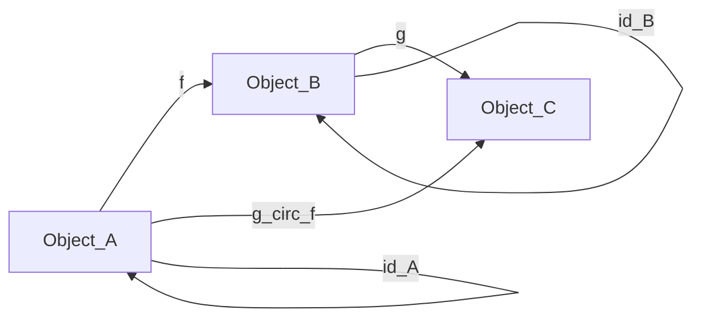
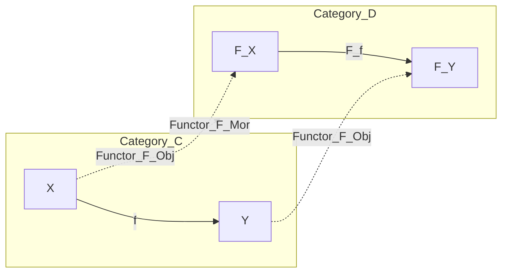
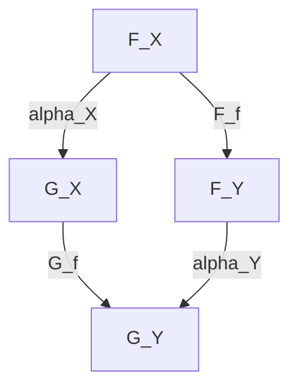
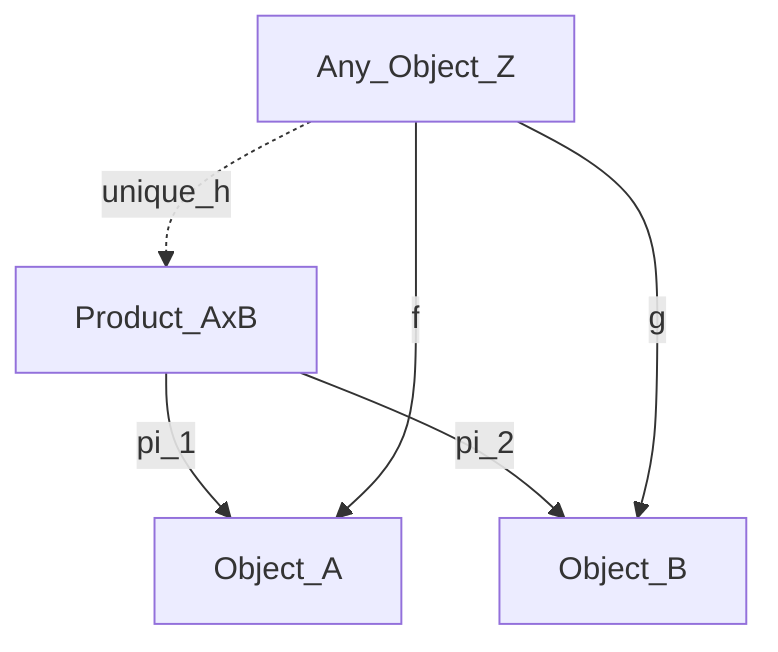
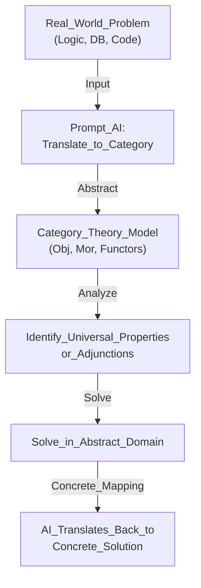
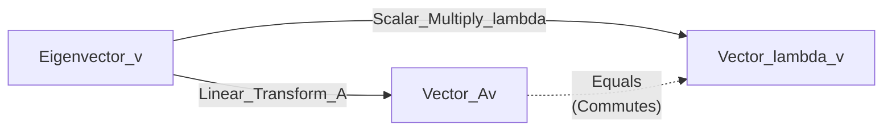
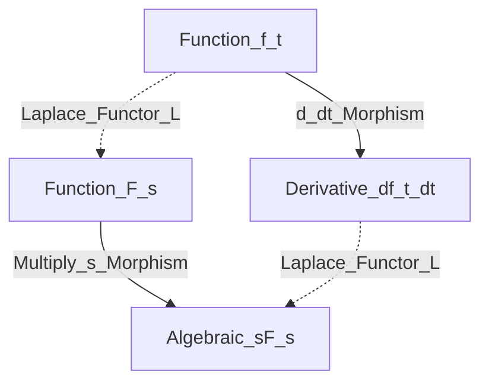
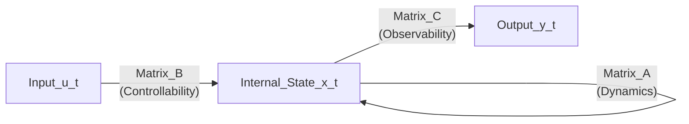

# 圏論まるわかり♪ ～圏論？何それおいしいの？ から、圏論って超便利♪になる15ページ～

**【はじめに：このレポートの目的】**
本書は、「集合論や論理学はなんとなく知っているけれど、圏論は全くの初心者」という方が、AIを相棒にして圏論を「実用的な道具」として使いこなせるようになるための完全ガイドです。A4用紙15枚分のエッセンスを、体系的かつ網羅的にこの1ファイルに凝縮しました。

---

## 第1部：視点の転換 ～「中身」から「関係性」へ～ (Pages 1-2)

### 1.1 集合論と圏論の違い

私たちが学校で習う「集合論」は、基本的に**「中身（要素）」**に注目します。
「集合 $A$ の中には $x, y, z$ という要素が入っている」というミクロな視点です。

一方、圏論は中身を一切見ません。対象（Object）をブラックボックス化し、対象と対象の間の**「関係性＝矢印（射）」**にだけ注目します。要素が分からなくても、外側からの矢印の繋がり方だけで、そのものの本質を捉えようとするマクロな視点です。

### 1.2 なぜ「関係性」だけを見るのか？

現代のソフトウェア設計や複雑なシステムでは、「内部実装（中身）」はカプセル化されて見えないことが多くなっています。APIの設計などはまさに「外部とどうやり取りするか（矢印）」だけでシステムを定義します。圏論は、この「矢印だけで世界を記述する」ための最強の数学的フレームワークなのです。

---

## 第2部：圏の基礎 ～世界のルールを定義する～ (Pages 3-4)

圏（Category）を名乗るためには、以下の4つの要素とルールが必要です。

1. **対象（Object）:** 点。集合、空間、命題、データ型など。
2. **射（Morphism）:** 矢印。関数、変換、推論規則、プログラムの関数など。
3. **合成（Composition）:** 矢印をつなぐルール。 $f$ と $g$ があれば、必ず $g \circ f$ が存在する。
4. **恒等射（Identity）:** 「何もしない」という矢印。対象には必ず自分自身へ向かう矢印が存在する。

**title:** Category_Definition_Rules

上の図は、圏の基本的な公理（合成と恒等射）を表しています。 $A$ から $B$ へ行き、 $B$ から $C$ へ行く道があるなら、必ず $A$ から $C$ への直行ルート（合成射）が存在しなければなりません。また、各対象には必ず「自分に留まる」矢印（ $id$ ）があります。

### 2.1 集合論と論理学を「圏」として見る

あなたが知っている知識を圏論に当てはめるとこうなります。

- **集合の圏 $\mathbf{Set}$:** 対象は「集合」、射は「関数」。
- **論理学の圏 $\mathbf{Logic}$:** 対象は「命題（PやQ）」、射は「推論（P ならば Q）」。

「P $\implies$ Q」であり「Q $\implies$ R」なら「P $\implies$ R」ですよね？ これがまさに**射の合成**です。「P $\implies$ P」は常に真ですよね？ これが**恒等射**です。論理学は立派な圏論の一部なのです。

---

## 第3部：関手（Functor） ～世界を翻訳する橋～ (Pages 5-6)

圏の中のルールが分かったら、次は「圏と圏の間」の移動です。
**関手（Functor）** は、ある圏 $\mathcal{C}$ の対象と射を、別の圏 $\mathcal{D}$ の対象と射へ、**「構造（矢印の繋がり方）を保ったまま」** お引越しさせるマッピングのことです。

**title:** Functor_Mapping_Concept

この図が示すように、関手 $F$ は、圏 $C$ の対象 $X, Y$ を圏 $D$ の対象 $F(X), F(Y)$ に移すだけでなく、その間の射 $f$ も、ちゃんと対応する射 $F(f)$ に移します。「矢印の繋がりが壊れない」ことが関手の絶対条件です。

### 3.1 身近な関手の例

- **プログラミングにおけるList:** データ型 $A$ を受け取って「 $A$ のリスト（List[A]）」を作る操作は関手です。関数 $f(A \to B)$ も、リスト全体に適用する関数 $map(f)$ に変換できます。
- **忘却関手と自由関手:** 前回のレポートで触れた通り、構造を忘れる関手と、構造を自由に作る関手も、立派な世界の翻訳機です。

---

## 第4部：自然変換 ～翻訳機のチューニング～ (Pages 7-8)

圏論の創始者たちは、「圏論は自然変換を定義するために作られた」と言っています。
2つの異なる関手 $F$ と $G$ （つまり2つの異なる翻訳方法）があったとき、**翻訳結果の $F(X)$ を、別の翻訳結果 $G(X)$ へ、矛盾なくスムーズに変換するルール**のことです。

**title:** Natural_Transformation_Square

上の図は「可換図式（Commutative Diagram）」と呼ばれる圏論の強力なツールです。
左側から下に行くルート（ $F(X) \to F(Y) \to G(Y)$ ）と、下に行ってから右に行くルート（ $F(X) \to G(X) \to G(Y)$ ）が**全く同じ結果になる**ことを示しています。これが自然変換 $\alpha$ です。

---

## 第5部：普遍性（Universal Property） ～最適解の形～ (Pages 9-10)

圏論において「最も無駄がなく、最も代表的なもの」を定義する魔法の言葉が**普遍性**です。
ここでは「直積（Product）」を例にとります。

集合論では、集合 $A$ と $B$ の直積 $A \times B$ は「ペアの集合 $(a, b)$」と要素で定義します。
しかし圏論では要素を見ません。次のように**矢印だけ**で定義します。

**title:** Universal_Property_of_Product

この図の意味はこうです。
「 $A$ と $B$ の両方に矢印を伸ばせる都合の良い対象 $Z$ は世の中にたくさんある。しかし、真の直積 $P$ （ $A \times B$ ）は特別だ。どんな $Z$ が来ても、必ず $Z$ から $P$ を経由する**ただ1つの矢印（ unique $h$ ）**に綺麗にまとめることができる」

この「どんなものが来ても、必ずただ1つの矢印でまとまる」という性質が普遍性です。データベースのJOINや、論理学の「AND（論理積）」も、全く同じこの図式で表現できます。

---

## 第6部：随伴（Adjunction） ～宇宙の調和～ (Pages 11-12)

第3部で登場した「関手」の中に、完璧にピタリと噛み合うペアが存在します。それが**随伴（ $F \dashv U$ ）**です。

ある圏 $\mathcal{C}$ から $\mathcal{D}$ への関手 $F$ （例：自由関手）と、逆向きの関手 $U$ （例：忘却関手）があるとき、以下の数式が成り立つことを随伴と言います。

$$
\mathrm{Hom}_{\mathcal{D}}(F(X), Y) \cong \mathrm{Hom}_{\mathcal{C}}(X, U(Y))
$$

### 6.1 随伴の「超便利」な本質

論理学やプログラミングで随伴がなぜ重要なのか？ それは**「難しい問題を、解きやすい世界に移動させて解き、また戻すことができる」**からです。

例えば、論理学において「カリー化（Currying）」という概念があります。
「 $(A \text{ AND } B) \implies C$ 」という証明は、「 $A \implies (B \implies C)$ 」と全く同じです。
これも実は、直積（AND）を作る関手と、指数（含意 $\implies$ ）を作る関手の間の**随伴関係**なのです。圏論を知っていれば、論理の構造変換が「あ、随伴のペアを使えば一発で変換できるな」と俯瞰できるようになります。

---

## 第7部：米田の補題 ～哲学の数学的証明～ (Pages 13-14)

圏論のクライマックスです。**米田の補題（Yoneda Lemma）** は、世界に対する哲学的な問いを数学的に証明したものです。

「対象 $A$ の中身（要素）が一切見えなくても、世界の他のすべての対象から $A$ に対して『どんな矢印が向かっているか（あるいは $A$ からどんな矢印が出ているか）』を完全に把握できれば、対象 $A$ の正体は完全に決定される」

$$
\mathrm{Hom}( \mathrm{Hom}(A, -), F) \cong F(A)
$$

### 7.1 なぜこれが実用的（おいしい）のか？

システム開発において、サードパーティのAPIやレガシーシステムなど「中身がブラックボックス化されたモジュール（対象 $A$ ）」があるとします。
米田の補題は、「中身のソースコードを見なくても、すべての可能な入力パターンと、それに対する出力パターン（すべての矢印）を網羅的にテストできれば、そのシステムの仕様（対象 $A$ ）を完全に特定したことと同義である」と保証してくれます。

つまり、**「振る舞い（関係性）こそが、そのものの実態である」**というモデリングの極意を数学的に裏付けているのです。

---

## 第8部：AI×圏論で実務をハックする（超便利♪な実践術） (Page 15)

ここまで読んだあなたは、圏論の「視点（矢印で考えること）」と「ボキャブラリー（関手、随伴、普遍性）」を手に入れました。
最後に、これをAI（私）に投げかけて、現実の問題を解くための**プロンプト設計**を伝授します。

**title:** AI_Category_Theory_Problem_Solving

このフローに従って、複雑な問題に直面したときは、以下のように私（AI）にプロンプトを投げてください。

### 実用プロンプト・テンプレート集

**1. システム統合やデータ変換で悩んだとき（関手と自然変換の応用）**

> 「現在、システムA（データ構造X）からシステムB（データ構造Y）への移行を設計しています。この2つのシステムを『圏』と見立て、データ変換処理を『関手』とした場合、データの整合性を保つため（関手性を満たすため）に注意すべき制約条件を洗い出して。また、変換ルールのバージョンアップを『自然変換』としてモデル化して。」

**2. アーキテクチャの最適解を見つけたいとき（普遍性の応用）**

> 「3つの異なるマイクロサービスからデータを集約するAPIゲートウェイを作りたい。このAPIゲートウェイが圏論における『直積（Product）』としての『普遍性』を満たす（つまり、最も無駄がなく、各サービスへの矢印がただ1つに定まる）ような、最適なインターフェース設計を提案して。」

**3. 複雑なロジックをシンプルにしたいとき（随伴の応用）**

> 「現在抱えているこの複雑な条件分岐のロジック（論理学の問題）に、『随伴（Adjunction）』関係にある別のシンプルなモデル（例えばカリー化や、別のデータ構造へのマッピング）は存在しないか？ 難しい世界から簡単な世界へ『関手』で移動させて解くアプローチを考えて。」

### 結び

圏論は、それ単体で計算をするためのものではなく、**「AIという強力な計算機に対して、最も的確で抽象度の高い『設計図』を指示するための言語」**として使うときに最大の威力を発揮します。

さあ、あなたの抱えている具体的な課題（集合論的なデータベースの悩みでも、論理学的な条件分岐のバグでも構いません）を、この「圏論の言葉」を使って私に投げてみてください。抽象と具象を行き来する、最高にエキサイティングな問題解決の旅を始めましょう！

# Appendix: 工学・数学の強力な武器を圏論で再解釈する

本編で触れた「米田の補題と鳳・テブナンの定理のノリが一緒」というあなたの直感は、まさに圏論の真髄を射抜いています。このAppendixでは、あなたが直感的に理解している「現代制御理論」「フーリエ／ラプラス変換」「線形代数」といった工学・数学の強力な武器たちが、圏論の言葉（関手や自然変換など）でどう表現されるのかを解説します。

---

# Appendix A: 鳳・テブナンの定理と米田の補題（究極のブラックボックス解析）

### 「中身」を捨てて「振る舞い」を見る

電気回路の設計において、巨大なICチップや複雑な回路網の中にあるトランジスタ1つ1つの挙動（要素）をすべて計算するのは不可能です。そこでエンジニアは**鳳・テブナンの定理**を使います。「どんなに複雑なブラックボックス回路でも、外側の端子から測った振る舞い（開放電圧 $V_{th}$ と内部抵抗 $R_{th}$ ）さえ分かれば、その回路の正体を完全に特定し、シンプルな等価回路で代替できる」という強力な定理です。

方程式で表すと、外部の電流 $I$ と電圧 $V$ の関係は以下のようになります。

$$
V = V_{th} - R_{th} I
$$

圏論における**米田の補題（Yoneda Lemma）**も、これと全く同じ「ブラックボックス解析の哲学」を持っています。
「中身（要素）が全く分からない対象 $X$ があったとしても、外部のすべての対象から $X$ に向かってどのような矢印（射）が伸びているか、という関係性の集まり $\mathrm{Hom}(-, X)$ が完全に分かれば、対象 $X$ の正体は（同型を除いて）完全に決定される」という定理です。

| 概念             | 鳳・テブナンの定理（電気回路）                                                                    | 米田の補題（圏論）                                                                      |
| :--------------- | :------------------------------------------------------------------------------------------------ | :-------------------------------------------------------------------------------------- |
| **対象**         | 中身が分からない複雑な回路網（ブラックボックス）                                                  | 中身（要素）が分からない対象 $X$                                                        |
| **観測方法**     | 外側の端子に電圧計や電流計を繋いでテストする                                                      | 他のすべての対象から $X$ へ矢印（射）を飛ばしてテストする                               |
| **得られる結果** | 外部から見た V-I 特性（振る舞い）                                                                 | $X$ に向かってくるすべての射の集まり（関手）                                            |
| **結論**         | 中身を知らなくても、等価電圧源と内部抵抗（ $V_{th}$ と $R_{th}$ ）という1つの「正体」に決定できる | 中身を知らなくても、外部からの射の集まりが分かれば対象 $X$ の「正体」は完全に特定される |

**title:** Thevenin_Yoneda_Analogy

```mermaid
flowchart TD
    subgraph Electrical_Circuit_Thevenin
        BlackBox_Circuit["Complex_BlackBox_Circuit<br/>(Unknown_Internal)"]
        External_Probe["External_Measurement<br/>(Voltmeter_Ammeter)"]
        Equivalent_Circuit["Equivalent_Circuit_Determined<br/>V_th, R_th"]

        BlackBox_Circuit -->|"Connect_Terminals"| External_Probe
        External_Probe -->|"Determine_Behavior"| Equivalent_Circuit
    end

    subgraph Category_Theory_Yoneda
        Object_X["Object_X<br/>(Unknown_Elements)"]
        Morphisms_In["External_Morphisms<br/>Hom(-,X)"]
        Determine_Identity["Determine_Identity<br/>(Up_to_Isomorphism)"]

        Object_X -->|"Interact_via_Arrows"| Morphisms_In
        Morphisms_In -->|"Determine_from_Relations"| Determine_Identity
    end
```

上の図は、電気回路における鳳・テブナンのアプローチと、圏論における米田の補題のアプローチが、構造的に全く同じであることを示しています。

左側の電気回路では、未知の回路（BlackBox_Circuit）に対して外部から測定（External_Probe）を行うことで、等価回路（Equivalent_Circuit）という「本質」を抽出します。
右側の圏論では、未知の対象（Object_X）に対して外部からの射（Morphisms_In）という「テストケース」を網羅することで、その対象の正体（Determine_Identity）を決定します。

### ソフトウェアテストへの応用

この「鳳・テブナンのノリ」は、現代のソフトウェア開発における**モック（Mock）**や**ブラックボックステスト**の理論的裏付けそのものです。
あるモジュールのソースコード（中身）を見なくても、あらゆる入力と出力のペア（外部からの射）に対する振る舞いが完全にテストされていれば、そのモジュールの仕様（対象 $X$ ）は数学的に確定したとみなせます。圏論は、あなたが普段行っているエンジニアリングの感覚が、宇宙の真理（数学的定理）に裏付けられていることを教えてくれるのです。

## Appendix B: ベクトルの線形変換・固有値と自然変換

線形代数の主役である「行列」や「ベクトル空間」も圏論の得意分野です。

- **対象（Object）：** ベクトル空間 $V$
- **射（Morphism）：** 行列 $A$ による線形変換（ベクトルを別のベクトルへ移す矢印）

ここで「固有値と固有ベクトル」を圏論的に解釈してみましょう。
行列 $A$ で変換しても、向きが変わらず長さが $\lambda$ 倍になるだけの特別なベクトル $v$ が固有ベクトルです。

$$
A v = \lambda v
$$

これは「行列による複雑な変換（射）」と「ただのスカラー倍（射）」が、特定の対象の上では完全に一致する、という**自然変換（あるいは可換図式の一種）**として捉えることができます。また、基底（座標軸）の取り方を変える操作（ $P^{-1} A P$ ）は、圏論における**自然同型（Natural Isomorphism）**に相当し、「見方が変わっても本質的な構造（固有値など）は変わらない」ことを保証してくれます。

**title:** Eigenvalue_Commutative_Diagram

この図が示すように、本来なら複雑な空間の歪み（行列 $A$ ）をもたらす変換が、固有ベクトル $v$ という特定の軸の上では、単なる伸び縮み（スカラー倍 $\lambda$ ）という非常にシンプルな射に還元されるわけです。

## Appendix C: フーリエ変換・ラプラス変換と関手（Functor）

微分方程式を解くとき、私たちはラプラス変換やフーリエ変換を使って、時間領域 $t$ の問題を、周波数領域 $s$ や $\omega$ の問題にすり替えます。
これは圏論において、**「難しい圏（微分方程式の世界）」から「簡単な圏（代数方程式の世界）」への関手（Functor）** として完璧に記述できます。

- **時間領域の圏 $\mathbf{Time}$ ：** 対象は関数 $f(t)$ 、射は微分演算子 $\frac{d}{dt}$ などの操作。
- **周波数領域の圏 $\mathbf{Freq}$ ：** 対象は関数 $F(s)$ 、射は $s$ を掛ける（ $\times s$ ）などの代数的操作。

ラプラス変換という関手 $\mathcal{L}$ は、微分の操作をただの掛け算に「翻訳」してくれます。

**title:** Laplace_Transform_Functor

この図は、微分の世界での操作が、関手 $\mathcal{L}$ を通じて掛け算の世界の操作に綺麗に写されていること（可換図式）を示しています。

数式で表すと以下のようになります。（初期値をゼロとした場合）

$$
\mathcal{L} \left( \frac{d}{dt} f(t) \right) = s \cdot \mathcal{L}(f(t))
$$

関手によって「解きやすい世界」に移動し、そこで代数計算（四則演算）をしてから、逆ラプラス変換（逆関手）で元の時間領域に戻す。これは圏論の**「随伴（Adjunction）」や「同型（Isomorphism）」を使った問題解決の最も成功した実例**と言えます。

---

## Appendix D: 現代制御理論（可制御／可観測と双対性）

現代制御理論における「状態空間モデル」は、ブラックボックスの中身（状態）を数式化したものですが、ここにも圏論の「米田の補題」と「双対性（Duality）」が隠れています。

- **可観測性（Observability）：** 出力 $y(t)$ の振る舞いだけから、内部状態 $x(t)$ を完全に推定できるか？という性質です。これはまさに「外部に向かう矢印（射）の集まりから、対象の正体を決定する」という **米田の補題** そのものです。
- **可制御性（Controllability）：** 入力 $u(t)$ を操作することで、内部状態 $x(t)$ を好きな場所へ持っていけるか？という性質です。圏論では、矢印の向きをすべて逆にした「双対（反対圏）」を考えます。可制御性と可観測性は、矢印の向きが逆になっただけの**双対関係（Dual）**にあります。

**title:** State_Space_Control_Theory

上の図は状態空間モデルを表しています。対象 `State_x` を直接見ることができなくても、 `Input_u` から入る矢印（可制御性）と、 `Output_y` へ出ていく矢印（可観測性）の振る舞いを見れば、対象を完全にコントロール・把握できるという思想は、圏論のネットワーク的思考と完全に一致します。

---

### 結び

鳳・テブナンの定理、線形代数、ラプラス変換現代制御、皆さんが工学や数学で培ってきた「便利なノリ」は、すべて圏論という一つの巨大なパラダイム（関手、自然変換、米田の補題）に統合されます。圏論は新しいことを覚える学問ではなく、**「あなたがすでに知っている便利な道具たちの、根本的な共通設計図を暴く学問」**なのです。
