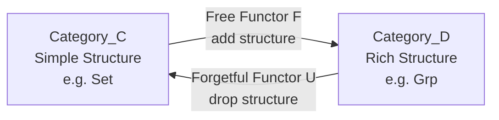
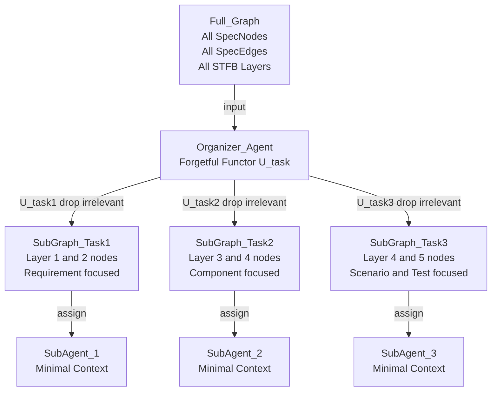
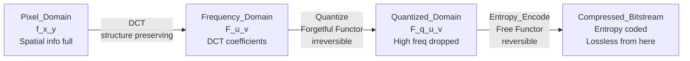
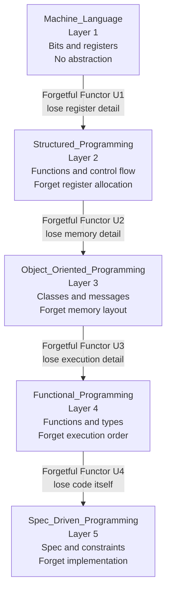
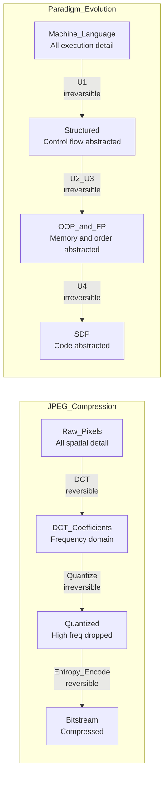

## Appendix E: 忘却関手と「具体→抽象」― コンテキスト最小化の数学的基盤

### 「抽象化」とは何を忘れることか

圏論において、**忘却関手（Forgetful Functor）** $U: \mathcal{D} \to \mathcal{C}$ とは、豊かな構造を持つ圏 $\mathcal{D}$ から、その構造の一部を「意図的に捨てて」より単純な圏 $\mathcal{C}$ へ写す関手である。

典型例として、群の圏 $\mathbf{Grp}$ から集合の圏 $\mathbf{Set}$ への忘却関手 $U$ がある。群 $(G, \cdot)$ は集合 $G$ に「掛け算のルール（群演算）」という構造を付与したものだが、$U$ はその演算構造を丸ごと忘れ、素の集合 $G$ だけを返す。

$$
U: \mathbf{Grp} \to \mathbf{Set}, \quad (G, \cdot) \mapsto G
$$

重要なのは、**忘却は一般に逆転できない**という非対称性である。集合 $G$ だけを見ても、元の群演算 $\cdot$ は復元できない。この非対称性こそが「抽象化」の本質である。

### 自由関手との随伴ペア

忘却関手 $U$ には、必ずといっていいほど**自由関手（Free Functor）** $F: \mathcal{C} \to \mathcal{D}$ が随伴として対応する。

$$
\mathrm{Hom}_{\mathcal{D}}(F(X), Y) \cong \mathrm{Hom}_{\mathcal{C}}(X, U(Y))
$$

自由関手 $F$ は「最小限の仮定だけで構造を自由に生成する」方向、忘却関手 $U$ は「余分な構造を捨てて本質だけ残す」方向である。この随伴ペアが「具体 $\leftrightarrow$ 抽象」の往復運動を圏論的に定式化したものである。

**title: Forgetful_Free_Functor_Adjunction**

自由関手 $F$ が「構造を付与する（具体化）」方向、忘却関手 $U$ が「構造を捨てる（抽象化）」方向に対応する。両者は随伴のペアを成し、具体と抽象の間の双方向の橋渡しを担う。

### 「具体→抽象」の4操作との対応

Category-Theory本編の第4部（自然変換）で述べた「具体/抽象」ペアは、忘却関手と自由関手の随伴として正確に定式化できる。

| 操作       | 圏論的対応                          | 何をするか                   |
| :--------- | :---------------------------------- | :--------------------------- |
| 具体化     | 自由関手 $F$（構造の付与）          | パラメータを加える           |
| 抽象化     | 忘却関手 $U$（構造の除去）          | パラメータを取り除く         |
| 往復の保証 | 随伴 $F \dashv U$                   | 具体と抽象の対応が矛盾しない |
| 不可逆性   | $U \circ F \neq \mathrm{Id}$ 一般に | 抽象化で失った情報は戻らない |

「パラメータを取り除く」という操作が単なる「削除」ではなく、数学的に定義された**関手**であるという点が重要である。関手であるということは、対象の変換だけでなく**射（関係性）の変換も構造を保って行われる**ことを意味する。単なる情報の切り捨てではなく、構造を保ったままの情報の圧縮である。

### ANMSの忘却関手 ― コンテキスト最小化

big-anms-essayにおける「忘却関手によるコンテキスト最小化」は、上記の圏論的定義の直接的な応用である。

オーガナイザーエージェントがフルグラフ $\mathcal{G}$ からサブエージェント用の最小グラフ $\mathcal{G}_{sub}$ を切り出す操作を、忘却関手 $U_{task}$ として定式化する。

$$
U_{task}: \mathcal{G} \to \mathcal{G}_{sub}, \quad \text{タスクに無関係なノードとエッジを除去}
$$

**title: ANMS_Forgetful_Functor_Context**

オーガナイザーは STFB 層とタスク境界に基づき、各サブエージェントに「必要最小限の構造」だけを渡す。このとき射（エッジ、すなわち依存関係）も合わせて写されることが、単純なフィルタリングと忘却関手の本質的な違いである。

### 忘却は不可逆だがトレーサブル

注意すべきは、ANMSにおける忘却関手は**完全な不可逆ではない**という点である。

捨てられた情報（タスク外のノードとエッジ）はフルグラフ $\mathcal{G}$ とGit（ $\mathcal{V}$ ）に保存されたままであり、オーガナイザーはいつでも再クエリによって復元できる。これは純粋数学の忘却関手とは異なり、**「今見ない」と「存在しない」を厳密に分離する**設計である。コンテキストウィンドウは有限だが、真実（グラフとGit）は失われない。

---

## Appendix F: JPEG圧縮とプログラミングパラダイム進化 ― 「有損圧縮と無損圧縮」で読む抽象化の歴史

### 着想：圧縮とパラダイムは同じ構造を持つ

JPEG圧縮と、マシン語からSDP（仕様駆動プログラミング）へのパラダイム進化は、表面的には無関係に見える。しかし両者は「**情報を圧縮し、必要な部分だけを残す**」という同一の構造を持つ。この類似を圏論の忘却関手（Appendix E参照）を軸に整理する。

### JPEG圧縮の仕組み ― 忘却関手としての離散コサイン変換

JPEG圧縮は以下のステップで構成される。

1. **離散コサイン変換（DCT）**: 空間領域（ピクセル値）を周波数領域（空間周波数成分）へ変換
2. **量子化**: 高周波成分（人間の目に見えにくい細部）を粗く丸める ← **有損圧縮の核心**
3. **エントロピー符号化**: 残った情報をハフマン符号等で無損圧縮

$$
F(u,v) = \frac{2}{N} \sum_{x=0}^{N-1} \sum_{y=0}^{N-1} f(x,y) \cos\frac{\pi(2x+1)u}{2N} \cos\frac{\pi(2y+1)v}{2N}
$$

ここで $f(x,y)$ がピクセル値、 $F(u,v)$ がDCT係数である。量子化ステップで高周波成分 $F(u,v)$ の多くがゼロに丸められ、**人間の知覚に不要な情報が忘却関手として除去される**。

**title: JPEG_Compression_Functor**

量子化（Quantize）ステップだけが**有損（不可逆）**であり、その前後は可逆変換である。有損圧縮の本質は「人間の知覚モデルに基づく選択的忘却」であり、これは忘却関手 $U$ の直接的な実装である。

### プログラミングパラダイムの進化 ― 有損圧縮の連鎖

プログラミングのパラダイム進化も、各世代で「人間が直接扱う情報の粒度（抽象度）」が上がり、下位の詳細が**有損圧縮されて見えなくなる**構造を持つ。

| 世代 | パラダイム           | 人間が書くもの     | 忘却される詳細               | 圧縮の種別                     |
| :--- | :------------------- | :----------------- | :--------------------------- | :----------------------------- |
| 1    | マシン語             | レジスタ・ビット列 | なし（全部見える）           | 非圧縮                         |
| 2    | 構造化（C）          | 関数・制御構造     | レジスタ割当、メモリアドレス | 有損：命令列が見えない         |
| 3    | OOP（C++・Java）     | クラス・メッセージ | メモリ管理、vtable           | 有損：実行順序が見えない       |
| 4    | FP（Haskell・Scala） | 関数合成・型       | 評価戦略、副作用管理         | 有損：実行タイミングが見えない |
| 5    | SDP（ANMS）          | 仕様・制約・関係性 | コード実装そのもの           | 有損：実装詳細が見えない       |

各世代の「忘却」は**不可逆**である。Cプログラマーはアセンブリを書かなくてよくなった代わりに、コンパイラが生成するアセンブリを制御できなくなった。OOPプログラマーはメモリ管理を書かなくてよくなった代わりに、GCのタイミングを制御できなくなった。

**title: Programming_Paradigm_Compression**

各パラダイム間の遷移は忘却関手 $U_1, U_2, U_3, U_4$ の連鎖として表現できる。上位に行くほど「人間が扱う情報の密度（信号対雑音比）」が上がり、下位の詳細は有損圧縮される。

### JPEGとパラダイム進化の構造的同一性

**title: JPEG_vs_Paradigm_Analogy**

| 概念       | JPEG圧縮                       | パラダイム進化                             |
| :--------- | :----------------------------- | :----------------------------------------- |
| 信号源     | 生ピクセル列                   | マシン語・ビット列                         |
| 変換       | DCT（周波数分解）              | パラダイム間の関手                         |
| 有損圧縮   | 量子化（高周波成分の除去）     | 下位詳細の忘却                             |
| 知覚モデル | 人間の視覚（高周波に鈍感）     | 人間の認知（実装詳細に鈍感）               |
| 圧縮の基準 | 視覚的品質の維持               | 仕様・意図の維持                           |
| 不可逆性   | 量子化後は元ピクセルに戻れない | 上位パラダイムからアセンブリは復元できない |
| 品質保証   | 量子化テーブルの設計           | ANMS・型システム・SOLID原則                |

### 有損圧縮の「品質保証問題」

JPEGにおいて量子化テーブルの設計が粗いと、高周波成分が過剰に捨てられ**ブロックノイズ（アーティファクト）**が発生する。圧縮の代償として品質が劣化するのである。

プログラミングのパラダイム進化でも同様の問題が各世代で発生した。

| 世代   | 有損圧縮のアーティファクト（バグ）   | 導入された品質保証手段         |
| :----- | :----------------------------------- | :----------------------------- |
| 構造化 | バッファオーバーフロー、ポインタ破壊 | 型システム                     |
| OOP    | 継承の乱用、God Object               | SOLID原則、デザインパターン    |
| FP     | モナドの複雑性、型推論の難解さ       | 型クラス、コンパイラ支援       |
| SDP    | ハルシネーション、仕様の曖昧さ       | **ANMS（STFBとCAによる制約）** |

**ANMSのグラフスキーマとSTFB方向制約は、SDPパラダイムにおける量子化テーブルの設計に相当する。** 量子化テーブルが「どの周波数成分をどの粒度で捨てるか」を制御するように、ANMSは「AIが仕様のどの層をどの依存方向で解釈するか」を構造的に制御する。

### 「進研ゼミでやった奴」としての統一

忘却関手、JPEG圧縮、プログラミングパラダイム進化は、すべて同一の構造を持つ。

$$
U: \mathcal{D}_{rich} \to \mathcal{C}_{simple}, \quad \text{知覚モデルに基づく選択的な構造の除去}
$$

- JPEG：視覚の知覚モデルに基づき、高周波成分を捨てる
- パラダイム進化：人間の認知モデルに基づき、実装詳細を捨てる
- ANMS：AIのコンテキストモデルに基づき、タスク外ノードを捨てる

三者はすべて「知覚モデル（何が重要か）」と「忘却関手（何を捨てるか）」の組み合わせである。そして三者とも、**捨て方が雑だとアーティファクトが発生する**。品質は「何を捨てるか」の設計精度に依存する。これが Appendix E と Appendix F を通じた核心的な主張である。
