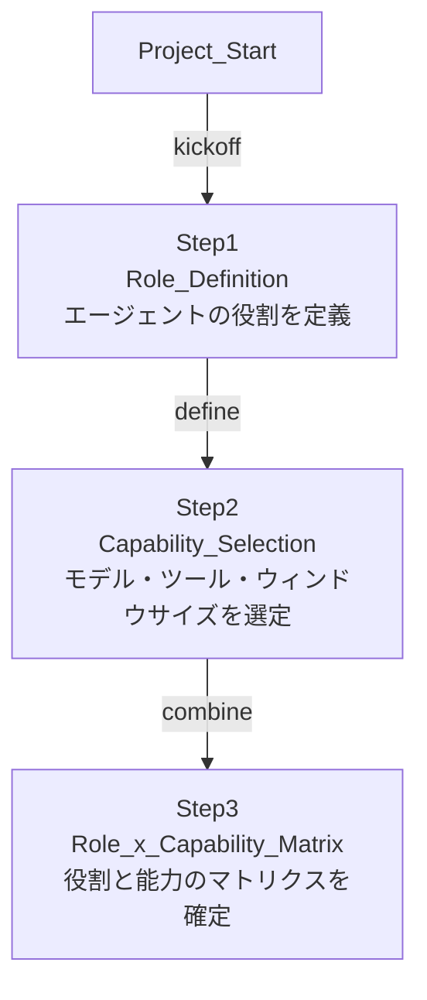
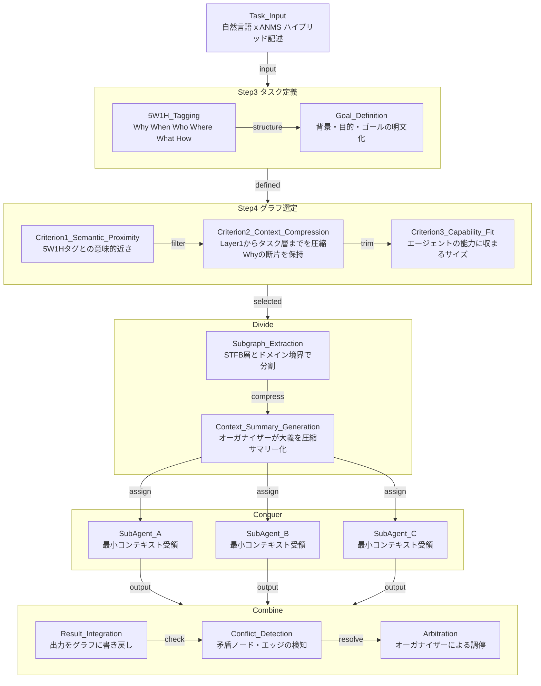
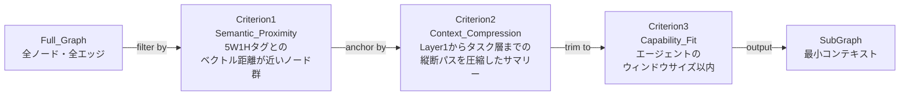
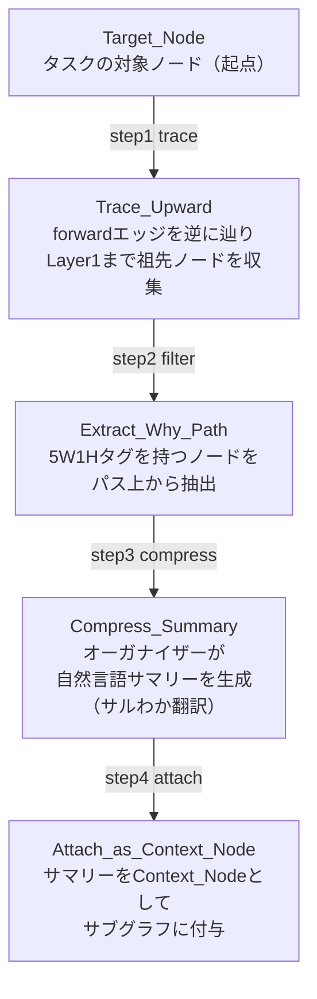
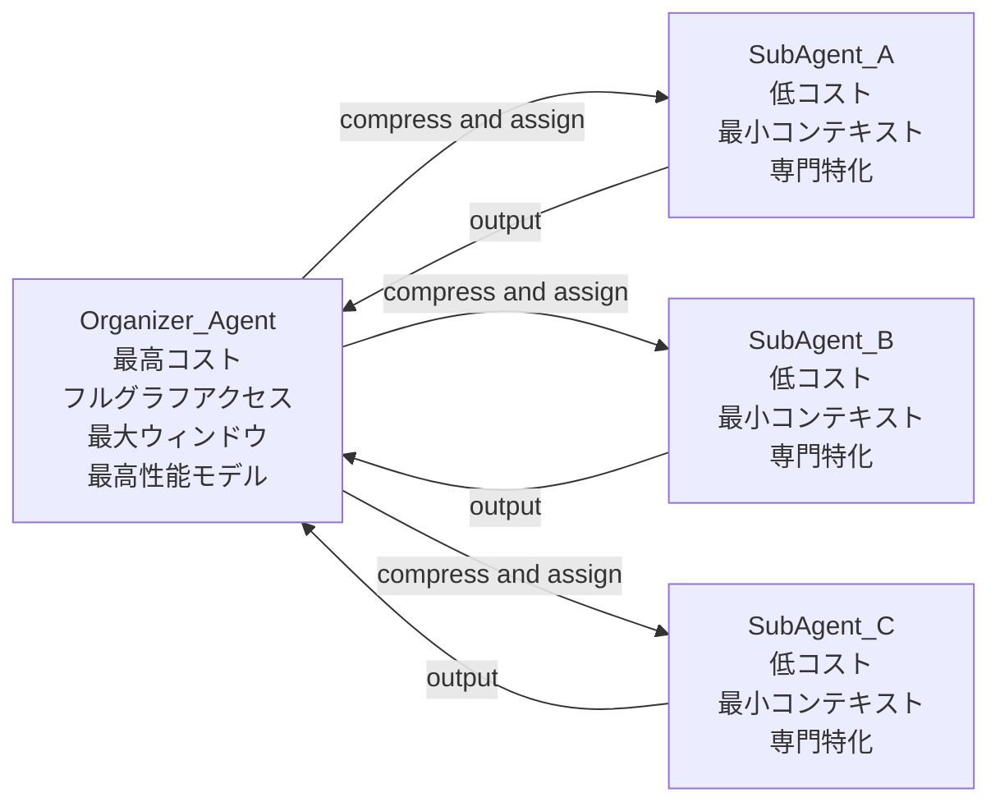

## Appendix G: タスク割り当てアルゴリズム — オーガナイザーによるDivide and Conquer

### 概要

オーガナイザーエージェントの仕事は2つの関手の合成である。

$$
\text{Organizer} = F_{decompose} \circ U_{compress}
$$

- $U_{compress}$ : 全体グラフを圧縮し、大義（Why）を抽出する忘却関手
- $F_{decompose}$ : 大義をサブタスクに分割し、サブエージェントへ具体化する自由関手

オーガナイザーはフルグラフへのアクセス権と最大のコンテキストウィンドウを必要とする、システム中で最高コストのコンポーネントである。その品質がシステム全体のアウトプット品質の上限を決定する。

---

### フェーズ1: 準備フェーズ（静的・プロジェクト起動時に一回）

**title: Phase1_Preparation_Flow**

準備フェーズでは、エージェントのロール（何者か）と能力・リソース（何ができるか）を静的に確定する。この2つは掛け算の関係であり、片方がゼロなら出力もゼロになる。

$$
\text{Agent} = \text{Role} \times \text{Capability}
$$

| 項目           | 内容                                             | ANMSでの対応                 |
| :------------- | :----------------------------------------------- | :--------------------------- |
| Role定義       | エージェントの責務・専門領域                     | STFB層での立ち位置           |
| Capability選定 | モデル性能・ツール・コンテキストウィンドウサイズ | 扱えるサブグラフの最大サイズ |

---

### フェーズ2: タスクフェーズ（動的・タスク毎に実行）

**title: Phase2_Task_Assignment_Flow**

タスクフェーズはStep3（タスク定義）とStep4（グラフ選定）を経て、Divide・Conquer・Combineの3段階で実行される。

---

### グラフ選定の3基準

**title: Graph_Selection_Criteria**

3つの基準は順序を持つフィルタリングパイプラインである。

| 基準           | 操作                       | 忘却の対象               | 保持するもの                    |
| :------------- | :------------------------- | :----------------------- | :------------------------------ |
| 1. 意味的近さ  | ベクトル距離でノードを絞る | 無関係なドメインのノード | タスクと意味的に近いノード群    |
| 2. Context圧縮 | Layer1→タスク層を縦断圧縮  | 詳細な中間ノード         | Whyの断片（大義の欠片）         |
| 3. 能力適合    | ウィンドウサイズで打ち切り | 優先度の低いノード       | Role×Capabilityに収まる最大情報 |

基準2が設計の核心である。**捨てるべきは詳細であってWhyではない。** Layer1（Foundation・Glossary）の全ノードを渡す必要はないが、タスクの大義に繋がるパスは圧縮されて必ず残る。これはJPEGの量子化において低周波成分（構造的な輪郭）を保持し高周波成分（細部）を捨てる操作と同型である。

---

### Context圧縮アルゴリズム（基準2の詳細）

オーガナイザーによるContext圧縮は以下の手順で実行する。

**title: Context_Compression_Algorithm**

手順3「サルわか翻訳」がオーガナイザーの最高コスト操作である。Layer1からタスク層までの縦断的な意味を、サブエージェントが扱える粒度の自然言語に圧縮する。この圧縮の質がサブエージェントのアウトプット品質を直接規定する。

$$
\text{Context\_Node} = U_{compress}(\text{Path}(\text{Layer1} \to \text{Target\_Node}))
$$

---

### Combineフェーズの矛盾検知

サブエージェントの出力をグラフに書き戻す際、以下の矛盾パターンを検知する。

| 矛盾パターン         | 検知方法                                      | 調停方法                                   |
| :------------------- | :-------------------------------------------- | :----------------------------------------- |
| エッジ方向の違反     | direction制約（forward/trace/meta）チェック   | オーガナイザーが該当ノードを差し戻し       |
| STFB層の逆転依存     | source.stfb_layer と target.stfb_layer の比較 | 依存方向を修正または設計判断（ADR）を追加  |
| 同一ノードの競合更新 | Git diff による衝突検出                       | オーガナイザーが調停しコミット             |
| 5W1Hタグとの意味乖離 | 出力ノードのベクトルとタスクタグの距離計算    | サブエージェントへ差し戻しまたは再タスク化 |

Combineフェーズの調停コストもオーガナイザーに集中する。**Divideの分割精度が高いほどCombineの矛盾は減る。** 良いオーガナイザーは前段のDivideで矛盾の種を摘む。

---

### コスト構造のまとめ

**title: Cost_Distribution**

オーガナイザーのコストが高い理由は構造的必然である。$U_{compress} \circ F_{decompose}$ の合成操作はフルグラフの理解を前提とし、圧縮サマリーの生成は高い抽象化能力を要求する。サブエージェントが低コストで高品質な出力を出せるのは、オーガナイザーが高コストの前処理を担っているからである。これは優秀な中間管理職が経営理念を現場の言葉に翻訳することで、現場が迷わず動ける構造と同型である。
