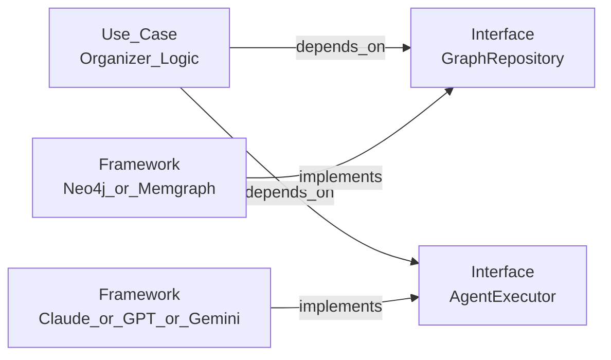
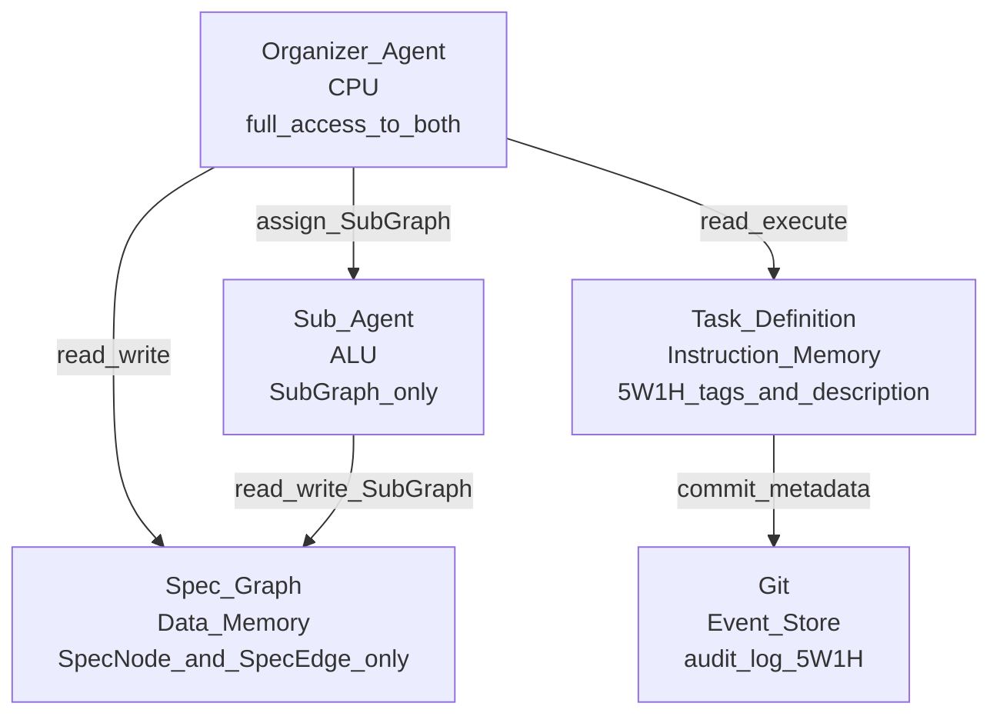
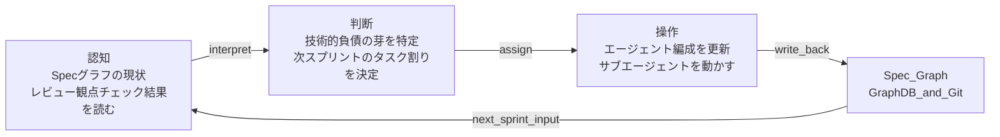
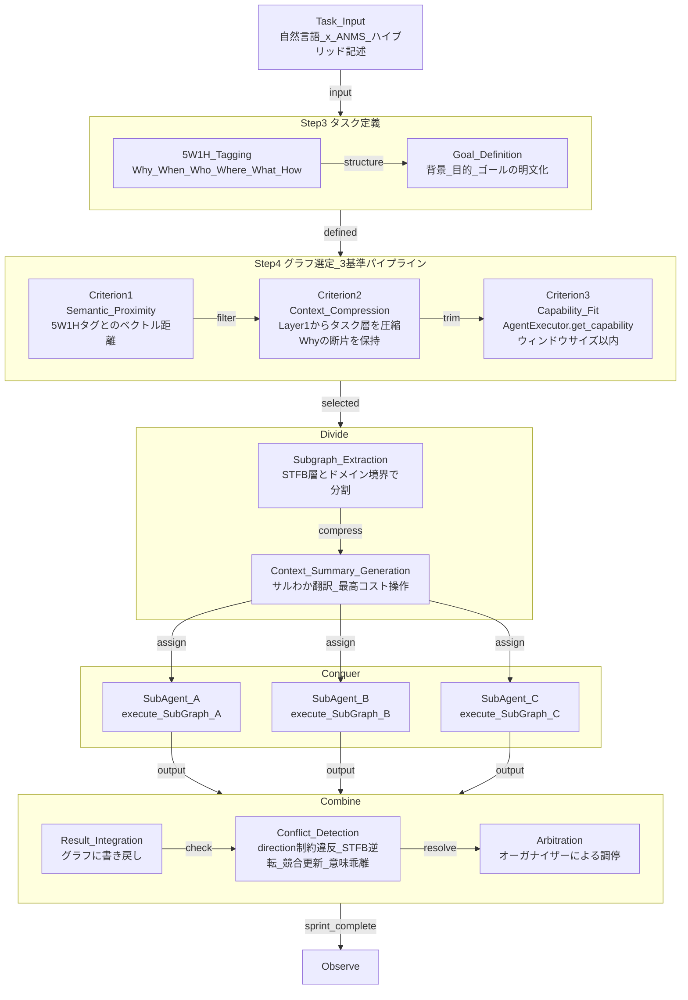

# 引継ぎドキュメント: big-anms-essay 論文反映内容

## 概要

本ドキュメントは、議論で確定した設計判断を論文（big-anms-essay-ja.md）に反映するための引継ぎである。
追記・修正箇所を論文のセクション単位で整理する。

---

## 1. Section 2.4 修正 — GraphDBはFramework層（追記）

### 追記内容

ClaudeをはじめとするLLMエージェントもGraphDBと同様にFramework層の実装詳細である。
DIPにより、ANMSのオーガナイザーロジックはAgentExecutorインターフェースにのみ依存し、
具体的なLLM実装（Claude・GPT・Gemini等）はインターフェースを実装する。

**title: DIP_Architecture_Extended**



オーガナイザーロジックはGraphRepositoryとAgentExecutorの2つのインターフェースにのみ依存する。
DBとLLMの両方が差し替え可能であり、ANMSの設計はどちらの実装詳細にも依存しない。

### AgentExecutor I/F定義

**title: AgentExecutor_Interface**

```python
from abc import ABC, abstractmethod
from dataclasses import dataclass

@dataclass
class Capability:
    model_name: str
    context_window_size: int   # トークン数
    tools: list[str]           # 利用可能なツール名リスト

class AgentExecutor(ABC):
    """
    Clean Architecture Framework層のインターフェース。
    Claude / GPT / Gemini 等の具体実装はこのインターフェースを実装する。
    オーガナイザーはこのインターフェースにのみ依存する（DIP）。
    """

    @abstractmethod
    def execute(
        self,
        subgraph: SubGraph,
        context_summary: str,  # オーガナイザーが生成したサルわか圧縮済みのWhy
        role: str,             # エージェントのRole定義
    ) -> SubGraph:
        """
        SubGraph・context_summary・roleを受け取り、
        タスクを実行して結果SubGraphを返す。
        """
        ...

    @abstractmethod
    def get_capability(self) -> Capability:
        """
        このエージェントの能力（コンテキストウィンドウサイズ・ツール・モデル性能）を返す。
        オーガナイザーがグラフ選定の基準3（Capability_Fit）に使用する。
        """
        ...
```

AgentExecutorはANMSとLLMの境界を定義する唯一のI/Fである。
Claudeの実装では、context_summaryをSystem Promptに、subgraphをtool_useのinputに、
roleをSKILL.mdに対応させる。

| ANMSの概念      | Claudeの実装                     |
| :-------------- | :------------------------------- |
| role            | System Prompt + SKILL.md         |
| Capability      | Tools定義（input_schema）        |
| context_summary | System Promptの一部              |
| subgraph        | コンテキストウィンドウに渡す内容 |

---

## 2. Section 3 追記 — SpecとTaskの分離（ハーバードアーキテクチャ類比）

### 追記内容

SpecグラフとTaskDefinitionは別物であり、同じデータ構造に混在させない。
この分離はハーバードアーキテクチャの「データメモリと命令メモリの分離」と同型である。

| ハーバードアーキテクチャ       | ANMSの対応                                     |
| :----------------------------- | :--------------------------------------------- |
| データメモリ（読み書き）       | Specグラフ $\mathcal{G}$（SpecNode・SpecEdge） |
| 命令メモリ（実行）             | TaskDefinition（5W1Hタグ付きタスク記述）       |
| CPU（両バスにアクセス）        | オーガナイザーエージェント                     |
| 演算ユニット（データバスのみ） | サブエージェント                               |

ノイマン型（SpecとTaskを同一構造に混在）にするとデータと命令が干渉し、
スプリント毎の再編成時にSpecグラフの汚染が起きる。
ハーバード型に分離することでSpecグラフの純粋性が保たれる。

**title: Harvard_Architecture_ANMS**



5W1H等の監査情報はSpecグラフのノードプロパティには追加しない。
Gitのコミットメタデータとして記録し、Specグラフのシンプルさを維持する。
これによりSpecNodeは id・stfb_layer・content_ref の3プロパティのみを保持する原則が守られる。

---

## 3. Section 5 修正 — オーガナイザーの動作（大幅追記）

### 3.1 グラウンディングの定義（新規追加）

オーガナイザーがタスクをSpecグラフのノードIDに対応付ける操作を**グラウンディング**と定義する。

$$
\text{Grounding} = f(\text{自然言語タスク記述})
$$

$$
f = \text{Role} \times \text{Context}
$$

RoleとContextは掛け算の関係であり、片方がゼロなら出力もゼロになる。
Roleのみ（何をするか）では局所最適しか出せない。
Contextのみ（なぜするか）では実行できない。
両者が揃って初めて「魂のこもった」グラウンディングが成立する。

| 要素    | ANMSでの対応                      | 役割               |
| :------ | :-------------------------------- | :----------------- |
| Role    | エージェントのSTFB層での立ち位置  | 何を担当するか     |
| Context | 上位層（Layer1・2）の圧縮サマリー | なぜそれをやるのか |

### 3.2 忘却アルゴリズムの制約（修正）

現行論文の「忘却関手で最小化」という記述に以下の制約を明示的に追加する。

> **忘却の対象はタスクに無関係な同層・下位層ノードである。**
> **上位層のContext（Why）は忘却してはいけない。**

捨てるべきは詳細であってWhyではない。
Layer1（Foundation・Glossary）の全ノードを渡す必要はないが、
タスクの大義に繋がるパスは圧縮されて必ず残る。

$$
\text{Context\_Node} = U_{compress}(\text{Path}(\text{Layer1} \to \text{Target\_Node}))
$$

この圧縮（サルわか翻訳）がオーガナイザーの最高コスト操作である。

### 3.3 スプリントループの修正（静的→動的）

現行論文の「準備フェーズは静的」という記述を以下に修正する。

**誤:** Role定義・Capability選定はプロジェクト起動時に一回だけ行う（静的）

**正:** Role定義・Capability選定はプロジェクト起動時に初期値を定めるが、
スプリント毎に「認知→判断→操作」ループで動的に再編成される。

$$
\text{AgentConfig}_{n+1} = f(\text{SprintReview}_n,\ \text{GraphState}_n)
$$

OODAではなく「認知→判断→操作」の3ステップを採用する理由：
OODAのOrientが独立している理由は「敵の行動予測（他者モデルの更新）」のためであり、
ANMSのオーガナイザーにはその要件がない。認知の中に解釈を畳み込んだ3ステップで十分である。

**title: Sprint_Loop_Dynamic**



スプリントの句切れはOODA・PDCA等どのループモデルでも代替可能であり、
プロジェクトの性質に応じて選択する。重要なのはループの存在であり、モデルの名称ではない。

### 3.4 タスク割り当てフロー（全体像・新規追加）

**title: Task_Assignment_Full_Flow**



---

## 4. Appendix G 新規追加 — タスク割り当てアルゴリズム

### 追加内容の概要

以下のAppendixを新規追加する。本文Section 5の実装可能レベルの詳細化として位置づける。

- **Appendix G-1**: タスク割り当てフロー（上記Section 5に統合でも可）
- **Appendix G-2**: グラフ選定の3基準詳細
- **Appendix G-3**: Context圧縮アルゴリズム
- **Appendix G-4**: Combineフェーズの矛盾検知パターン
- **Appendix G-5**: Pythonスケルトン（AgentExecutor・OrganizerAgent・SubAgent）

### コスト構造の命題（追加）

> オーガナイザーの品質がシステム全体のアウトプット品質の上限を決定する。

オーガナイザーが高コストである理由は構造的必然である。

- データバス（Specグラフ）と命令バス（TaskDefinition）の両方にアクセスする
- $U_{compress} \circ F_{decompose}$ の合成操作はフルグラフの理解を前提とする
- Context圧縮（サルわか翻訳）は高い抽象化能力を要求する
- Combineフェーズの矛盾調停もオーガナイザーに集中する

Divideの分割精度が高いほどCombineの矛盾は減る。
良いオーガナイザーは前段のDivideで矛盾の種を摘む。

---

## 5. Appendix E・F 新規追加 — 忘却関手とJPEG圧縮類比

### 追加内容の概要

以下のAppendixを新規追加する。Section 5「忘却関手によるコンテキスト最小化」の
理論的基盤として位置づける。

- **Appendix E**: 忘却関手と「具体→抽象」— コンテキスト最小化の数学的基盤
  - 忘却関手 $U: \mathcal{D} \to \mathcal{C}$ の定義
  - 自由関手との随伴ペア $F \dashv U$
  - ANMSの $U_{task}$ としての定式化
  - 「忘却は不可逆だがトレーサブル」という設計原則

- **Appendix F**: JPEG圧縮とプログラミングパラダイム進化
  - JPEG量子化 = 忘却関手の実装例
  - パラダイム進化（マシン語→構造化→OOP→FP→SDP）= 忘却関手の連鎖
  - 有損圧縮のアーティファクト = 各世代のバグパターン
  - ANMSのグラフスキーマ = SDPパラダイムの量子化テーブル

### 三者の統一命題

$$
U: \mathcal{D}_{rich} \to \mathcal{C}_{simple}, \quad \text{知覚モデルに基づく選択的な構造の除去}
$$

| 対象           | 知覚モデル                         | 忘却関手       | アーティファクト |
| :------------- | :--------------------------------- | :------------- | :--------------- |
| JPEG圧縮       | 人間の視覚（高周波に鈍感）         | 量子化         | ブロックノイズ   |
| パラダイム進化 | 人間の認知（実装詳細に鈍感）       | 各世代の抽象化 | 各世代のバグ     |
| ANMS           | AIのコンテキスト（タスク外に鈍感） | $U_{task}$     | ハルシネーション |

---

## 6. 反映優先順位

| 優先度 | 対象          | 内容                                                       |
| :----- | :------------ | :--------------------------------------------------------- |
| 高     | Section 5     | 忘却制約の明示・グラウンディング定義・スプリントループ修正 |
| 高     | Section 2.4   | AgentExecutor I/F追加・ハーバード型分離の追記              |
| 中     | Appendix G    | タスク割り当てアルゴリズム全体（フロー・スケルトン）       |
| 低     | Appendix E・F | 忘却関手・JPEG類比（理論的補強）                           |
