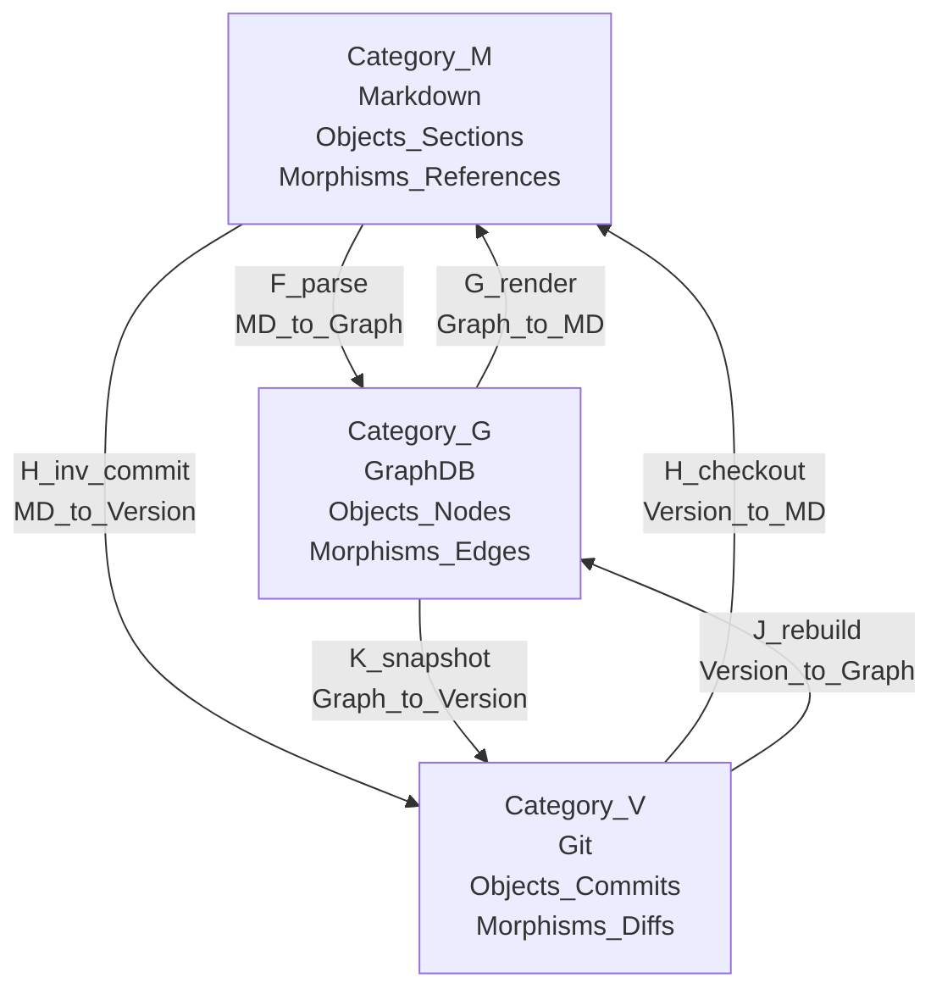
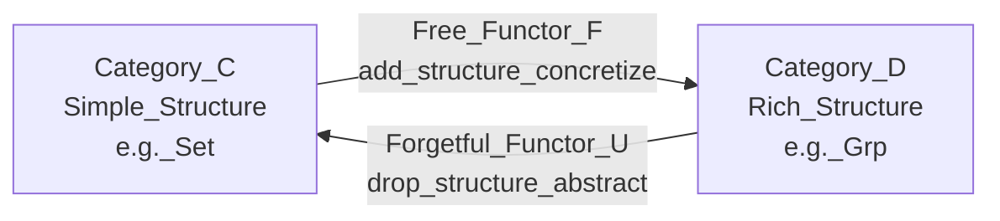
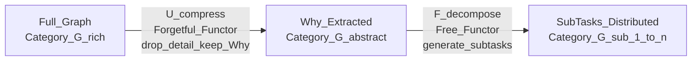
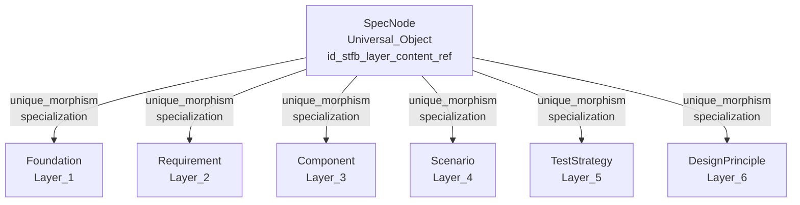
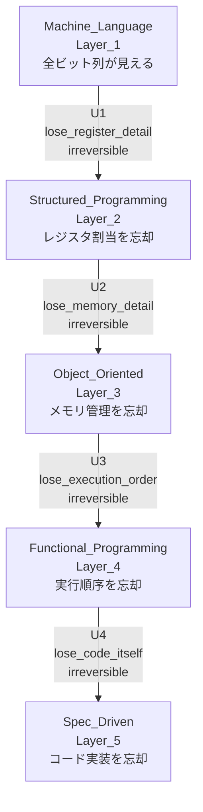

# 圏論まとめ: big-anms-essay の理論的基盤

## 概要

本ドキュメントは、big-anms-essayで使用している圏論の概念を体系的に整理したものである。
「形式的証明のための数学」ではなく「設計の概念化ツール」として使用する立場を維持する。

---

## 1. 基本構造 — ANMSの三圏

### 1.1 三圏の定義

仕様管理に関わる三要素を圏として定義する。

| 圏                        | 管理対象     | 対象（Object）             | 射（Morphism）       |
| :------------------------ | :----------- | :------------------------- | :------------------- |
| $\mathcal{M}$（Markdown） | 表現・ビュー | IDを持つMDセクション       | テキスト内の相互参照 |
| $\mathcal{G}$（GraphDB）  | 構造・空間軸 | ノード＝仕様要素           | エッジ＝依存関係     |
| $\mathcal{V}$（Git）      | 変遷・時間軸 | コミット＝スナップショット | diff＝状態遷移       |

### 1.2 三圏の関手マップ

**title: Three_Categories_Functor_Map**

三角関係の核心は $\mathcal{V} \leftrightarrow \mathcal{G}$ の直接経路（ $J$ と $K$ ）が存在することである。
$\mathcal{M}$ を経由しない直接経路により、MDがボトルネック・単一障害点になることを防ぐ。

### 1.3 可換条件

$$
F \circ H \cong J
$$

MD経由の経路（checkout→parse）と直接経路（rebuild）が同じ結果を返すことが
システム整合性の数学的保証となる。**可換性の破れはバグである。**

---

## 2. 関手 — ANMSにおける「翻訳機」

### 2.1 6つの関手の定義

| 関手                                  | 方向        | 意味                                                   |
| :------------------------------------ | :---------- | :----------------------------------------------------- |
| $F: \mathcal{M} \to \mathcal{G}$      | MD→GraphDB  | パース。MDから構造を抽出しグラフ化する                 |
| $G: \mathcal{G} \to \mathcal{M}$      | GraphDB→MD  | レンダリング。グラフをMDに表現する                     |
| $H: \mathcal{V} \to \mathcal{M}$      | Git→MD      | チェックアウト。バージョンをMDとして展開する           |
| $H^{-1}: \mathcal{M} \to \mathcal{V}$ | MD→Git      | コミット。MDの変更をバージョンとして記録する           |
| $J: \mathcal{V} \to \mathcal{G}$      | Git→GraphDB | 再構築。バージョンからグラフを直接構築する             |
| $K: \mathcal{G} \to \mathcal{V}$      | GraphDB→Git | スナップショット。グラフ状態をバージョンとして記録する |

### 2.2 ラプラス変換との類比（Appendix F参照）

ラプラス変換は「時間領域（微分方程式の圏）」から「周波数領域（代数方程式の圏）」への関手である。

$$
\mathcal{L}\left(\frac{d}{dt}f(t)\right) = s \cdot \mathcal{L}(f(t))
$$

ANMSの関手 $F, J$ も同様に「難しい圏（自然言語・Markdown）」から
「簡単な圏（グラフ・代数的クエリ）」への翻訳機として機能する。

---

## 3. 忘却関手と自由関手 — コンテキスト最小化の核心

### 3.1 忘却関手の定義

忘却関手 $U: \mathcal{D} \to \mathcal{C}$ は、豊かな構造を持つ圏 $\mathcal{D}$ から
構造の一部を意図的に捨てて、より単純な圏 $\mathcal{C}$ へ写す関手である。

$$
U: \mathbf{Grp} \to \mathbf{Set}, \quad (G, \cdot) \mapsto G
$$

群演算 $\cdot$ という構造を忘却し、素の集合 $G$ だけを返す。
**忘却は一般に不可逆である。** 集合 $G$ だけを見ても群演算 $\cdot$ は復元できない。

### 3.2 自由関手との随伴ペア

$$
\mathrm{Hom}_{\mathcal{D}}(F(X), Y) \cong \mathrm{Hom}_{\mathcal{C}}(X, U(Y))
$$

| 関手         | 方向      | 操作                                     |
| :----------- | :-------- | :--------------------------------------- |
| 自由関手 $F$ | 単純→豊か | 最小限の仮定で構造を自由に生成（具体化） |
| 忘却関手 $U$ | 豊か→単純 | 余分な構造を捨てて本質だけ残す（抽象化） |

**title: Forgetful_Free_Adjunction**

自由関手が「具体化（パラメータを加える）」、忘却関手が「抽象化（パラメータを取り除く）」に対応する。

### 3.3 ANMSにおける忘却関手 $U_{task}$

オーガナイザーがフルグラフ $\mathcal{G}$ からサブエージェント用の最小グラフ $\mathcal{G}_{sub}$ を切り出す操作。

$$
U_{task}: \mathcal{G} \to \mathcal{G}_{sub}, \quad \text{タスクに無関係なノードとエッジを除去}
$$

**忘却の制約（重要）:**

$$
U_{task}(\text{Why\_nodes}) \neq \emptyset
$$

捨てるべきは詳細（同層・下位層の無関係ノード）であってWhyではない。
上位層のContextは圧縮されて必ず残る。

### 3.4 グラウンディングの定式化

タスクの自然言語記述をSpecグラフのノードIDに対応付ける操作。

$$
\text{Grounding} = f(\text{自然言語タスク記述})
$$

$$
f = \text{Role} \times \text{Context}
$$

RoleとContextは掛け算の関係。片方がゼロなら出力もゼロ。

| 要素      | ANMSでの対応                     | 圏論での位置づけ               |
| :-------- | :------------------------------- | :----------------------------- |
| Role      | エージェントのSTFB層での立ち位置 | 射の始域を定める               |
| Context   | 上位層の圧縮サマリー（Why）      | 射の終域（目標対象）を定める   |
| Grounding | ノードIDへの対応付け             | 自然言語圏からグラフ圏への関手 |

### 3.5 Context圧縮 — サルわか翻訳の定式化

$$
\text{Context\_Node} = U_{compress}(\text{Path}(\text{Layer1} \to \text{Target\_Node}))
$$

Layer1からタスク対象ノードまでの縦断パスを、
エージェントが扱える粒度の自然言語に圧縮する操作。
これがオーガナイザーの最高コスト操作であり、品質がシステム全体のアウトプットを規定する。

---

## 4. オーガナイザーの関手合成

### 4.1 オーガナイザーの定義

$$
\text{Organizer} = F_{decompose} \circ U_{compress}
$$

| 関手            | 操作   | 内容                                                         |
| :-------------- | :----- | :----------------------------------------------------------- |
| $U_{compress}$  | 抽象化 | フルグラフを圧縮し大義（Why）を抽出する忘却関手              |
| $F_{decompose}$ | 具体化 | 大義をサブタスクに分割しサブエージェントへ具体化する自由関手 |

**title: Organizer_Functor_Composition**

$U_{compress}$ が忘却関手（抽象化・高コスト）、
$F_{decompose}$ が自由関手（具体化・分割）として機能する。

### 4.2 Divide and Conquer の圏論的解釈

| D and C のステップ | 圏論的操作                                  | ANMSでの実装                         |
| :----------------- | :------------------------------------------ | :----------------------------------- |
| Divide             | $U_{compress} \circ$ 対比の認知操作         | STFB層とドメイン境界でグラフを分割   |
| Conquer            | 各 $\mathcal{G}_{sub}$ 上での局所的射の構成 | サブエージェントが専門領域で実行     |
| Combine            | 分割されたサブグラフの余積（coproduct）     | オーガナイザーが結果を統合・矛盾調停 |

---

## 5. 普遍性 — グラフスキーマの設計原理

### 5.1 SpecNodeの普遍性

ANMSのグラフスキーマにおいて、SpecNodeは全仕様要素の普遍的な表現である。

**title: SpecNode_Universal_Property**

どの具体ノードタイプも SpecNode からの唯一の射（specialization）として定義される。
これが普遍性の構造であり、ANMSのスキーマ拡張可能性を保証する。

### 5.2 エッジ方向制約の圏論的意味

SpecEdgeの `direction` 制約（forward/trace/meta）は、
Clean Architectureの依存性逆転原則（DIP）をグラフレベルで強制する射の制約である。

| direction | 制約                                   | 圏論的意味                          |
| :-------- | :------------------------------------- | :---------------------------------- |
| forward   | source.stfb_layer >= target.stfb_layer | 外側→内側。安定依存の原則           |
| trace     | source.stfb_layer < target.stfb_layer  | 内側→外側。トレーサビリティ用途限定 |
| meta      | source.stfb_layer = 6                  | メタ層からの横断評価。自然変換的    |

---

## 6. 米田の補題 — ブラックボックス解析の保証

### 6.1 ANMSへの適用

$$
\mathrm{Hom}(\mathrm{Hom}(A, -), F) \cong F(A)
$$

「中身（ソースコード）が見えないモジュール（対象 $A$ ）であっても、
すべての可能な入力と出力のペア（外部からの射）を網羅的にテストすれば、
そのシステムの仕様は完全に特定される」

ANMSのシナリオ（Layer4）とテスト戦略（Layer5）が
この「外部からの射の網羅」を担う構造として設計されている。

### 6.2 鳳・テブナンの定理との類比

| 概念 | 鳳・テブナン（電気回路）    | 米田の補題（圏論）    | ANMSでの対応             |
| :--- | :-------------------------- | :-------------------- | :----------------------- |
| 対象 | 複雑な回路網                | 対象 $X$              | SpecNode（Component等）  |
| 観測 | 端子に計器を繋ぐ            | 外部から射を飛ばす    | Scenarioノードが射を定義 |
| 結論 | $V_{th}$ と $R_{th}$ に決定 | 対象 $X$ の正体が確定 | 仕様が完全に特定される   |

---

## 7. JPEG圧縮・パラダイム進化との統一構造

### 7.1 三者の統一命題

$$
U: \mathcal{D}_{rich} \to \mathcal{C}_{simple}, \quad \text{知覚モデルに基づく選択的な構造の除去}
$$

| 対象             | 知覚モデル                         | 忘却関手の実装   | アーティファクト（失敗時） |
| :--------------- | :--------------------------------- | :--------------- | :------------------------- |
| JPEG圧縮         | 人間の視覚（高周波に鈍感）         | 量子化テーブル   | ブロックノイズ             |
| パラダイム進化   | 人間の認知（実装詳細に鈍感）       | 各世代の抽象化層 | 各世代固有のバグ           |
| ANMSエージェント | AIのコンテキスト（タスク外に鈍感） | $U_{task}$       | ハルシネーション           |

### 7.2 パラダイム進化の忘却関手連鎖

**title: Paradigm_Forgetful_Functor_Chain**

各世代の遷移は忘却関手 $U_1, U_2, U_3, U_4$ の連鎖である。
抽象度が上がるほど「人間が扱う情報の信号対雑音比」が上がり、
各世代で固有のアーティファクト（バグ）が発生した。
ANMSはSDPパラダイムにおける「量子化テーブルの設計」に相当する制約である。

### 7.3 品質保証の対応

| 世代   | アーティファクト       | 導入された制約 | 圏論的対応            |
| :----- | :--------------------- | :------------- | :-------------------- |
| 構造化 | バッファオーバーフロー | 型システム     | 射の型制約            |
| OOP    | 継承の乱用             | SOLID原則      | 依存方向の制約        |
| FP     | モナドの複雑性         | 型クラス       | 関手の法則            |
| SDP    | ハルシネーション       | **ANMS**       | $U_{task}$ の設計制約 |

---

## 8. ハーバードアーキテクチャ類比 — Spec と Task の分離

### 8.1 圏論的解釈

SpecグラフとTaskDefinitionを同一の圏に混在させないことは、
圏論における「異なる圏の対象を混同しない」原則に対応する。

| ハーバードアーキテクチャ | ANMSの圏                    | 圏論的対応                         |
| :----------------------- | :-------------------------- | :--------------------------------- |
| データメモリ             | $\mathcal{G}$（Specグラフ） | データの圏                         |
| 命令メモリ               | TaskDefinition              | 命令の圏                           |
| CPU（両バスアクセス）    | オーガナイザー              | 両圏間の関手を持つ対象             |
| ALU（データバスのみ）    | サブエージェント            | $\mathcal{G}_{sub}$ 上の射のみ操作 |

オーガナイザーだけが両圏にアクセスできる。
サブエージェントは $\mathcal{G}_{sub}$（データ圏のサブ圏）しか持たない。
これがオーガナイザーのコストが構造的に高い理由である。

---

## 9. 圏論概念の索引

| 圏論概念                              | ANMSでの対応箇所                                   | 論文セクション |
| :------------------------------------ | :------------------------------------------------- | :------------- |
| 圏（Category）                        | $\mathcal{M}$・$\mathcal{G}$・$\mathcal{V}$ の三圏 | Section 2.1    |
| 関手（Functor）                       | 三圏間の6つの変換（F・G・H・H⁻¹・J・K）            | Section 2.1    |
| 可換図式                              | $F \circ H \cong J$（整合性保証）                  | Section 2.1    |
| 忘却関手                              | $U_{task}$（コンテキスト最小化）                   | Section 5.2    |
| 自由関手                              | $F_{decompose}$（サブタスク生成）                  | Section 5.2    |
| 随伴 $F \dashv U$                     | 具体化と抽象化の往復（認知操作4番）                | Section 4      |
| 普遍性                                | SpecNodeの継承構造・DirectProduct                  | Section 3      |
| 自然変換                              | metaエッジ（DesignPrincipleによる横断評価）        | Section 3.2    |
| 米田の補題                            | シナリオ・テストによる仕様の完全特定               | Section 5      |
| 積圏 $\mathcal{G} \times \mathcal{V}$ | 仕様の本体（MDはビュー）                           | Section 2.2    |
