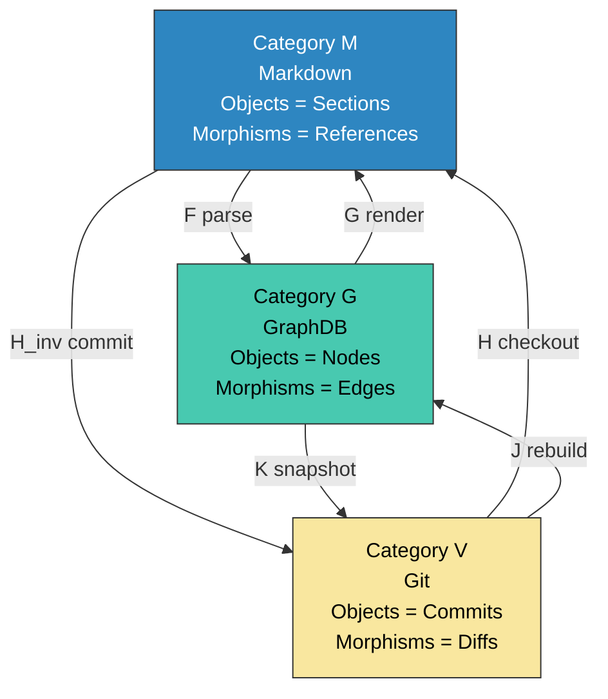
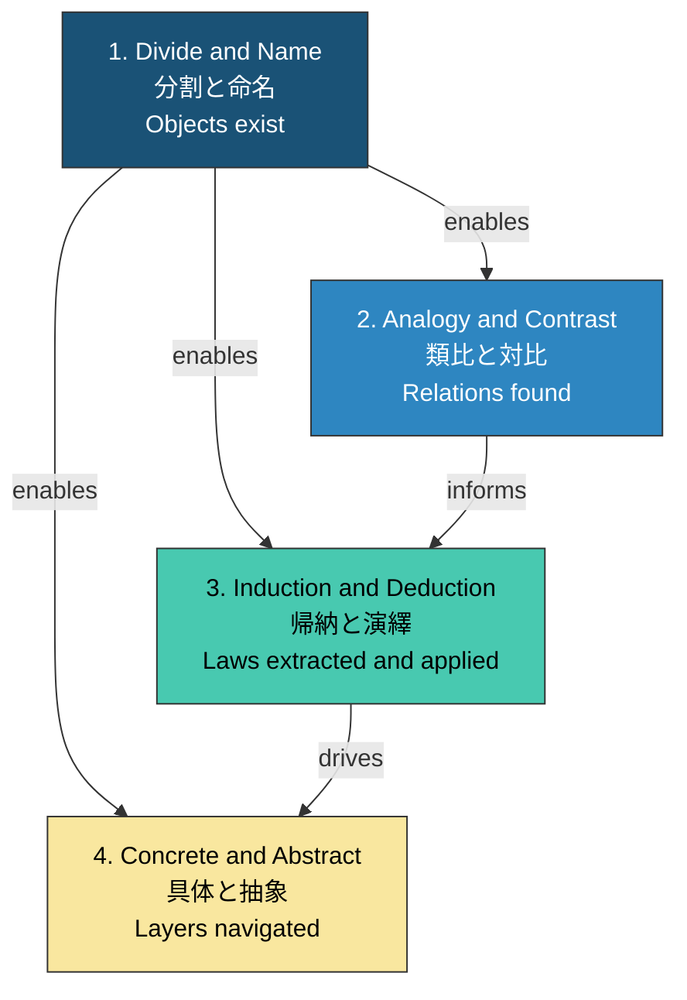
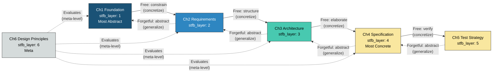
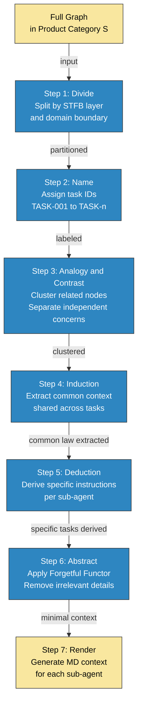
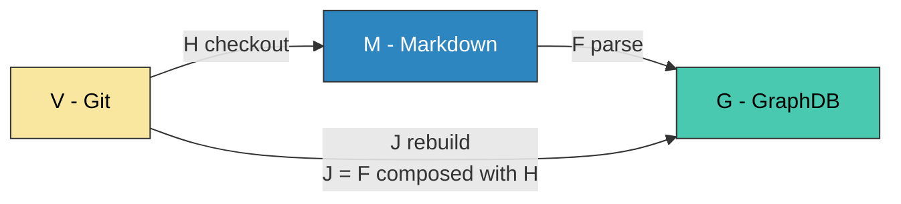

``````markdown
# 圏論によるANMS大規模スケーリングの基礎設計 v2

## 1. 前提：3つの要素と4つの認知操作

### 1.1 三要素

| 要素 | 役割 | 性質 |
|---|---|---|
| **Markdown (M)** | 人間可読な仕様の表現 | テキスト。人間のインターフェース |
| **Git (V)** | 状態遷移の記録 | 時間軸。変更の履歴と差分 |
| **GraphDB (G)** | 構造と関係の管理 | 空間軸。ノードとエッジの集合 |

### 1.2 四つの認知操作ペア

記事「The Symbol for All of Us is Null」より、仕様を扱う上で根本となる4つの認知操作ペアを定義する。

| # | ペア | 順方向 | 逆方向 | 数学的対応 |
|---|---|---|---|---|
| 1 | **分割 / 命名** | 対象を分ける | 分けたものに名前をつける | 集合の分割（partition）とラベリング |
| 2 | **類比 / 対比** | 共通点を見出す | 相違点を見出す | 線形変換（同方向/逆方向への射影） |
| 3 | **帰納 / 演繹** | 具体例から法則を抽出する | 法則から具体を予測する | ベクトル演算（ノイズ除去/法則適用） |
| 4 | **具体 / 抽象** | パラメータを加える | パラメータを取り除く | 次元の増減（情報の付与/忘却） |

これらは「思考のプリミティブ」であり、人間の設計行為もAIエージェントの推論も、すべてこの4ペアの組み合わせで記述できる。

---

## 2. 三圏の三角関係

### 2.1 三つの圏

| 圏 | 対象（Object） | 射（Morphism） |
|---|---|---|
| $\mathcal{M}$ (Markdown) | IDを持つMDセクション | テキスト内の相互参照 |
| $\mathcal{G}$ (GraphDB) | ノード | エッジ |
| $\mathcal{V}$ (Git) | コミット（スナップショット） | diff（状態遷移） |

### 2.2 三角関係図

V⇔M⇔G の直線関係ではなく、V⇔G を含む三角関係として捉える。MDを経由せずともGitとGraphDBは直接関係する。

**Three_Categories:**



上図は3つの圏が三角形を構成し、どの2圏間にも双方向の関手が存在することを示す。これにより、MDは必須の中継点ではなくなる。例えば、GraphDBのスナップショットを直接Git管理する（K）、あるいはGitの特定バージョンからMDを経由せずグラフを再構築する（J）といった経路が可能になる。

### 2.3 三角関係が重要な理由

直線 V⇔M⇔G では、MDが常にボトルネックかつ単一障害点になる。三角関係では：

| 経路 | 用途 | MDの関与 |
|---|---|---|
| M → G（parse） | 人間が書いたMDをグラフ化 | 起点 |
| G → M（render） | グラフからMDを生成して人間に見せる | 終点 |
| V → M（checkout） | 過去バージョンのMDを取得 | 終点 |
| **V → G（rebuild）** | 過去バージョンのグラフを直接再構築 | **不要** |
| **G → V（snapshot）** | グラフの状態をバージョンとして直接保存 | **不要** |
| M → V（commit） | MDの変更をバージョン記録 | 起点 |

V⇔Gの直接経路があることで、MDは「人間のためのビュー」に徹することができる。エージェント同士のやりとりではMDを経由する必要がない。

---

## 3. 四つの認知操作と仕様設計への適用

### 3.1 分割 / 命名 — すべての基盤

> 「分かる」とは「分ける」こと。分けたものに名前をつけて初めて、操作可能になる。

これがANMS大規模化の**第一原理**。

| 操作 | 仕様設計での意味 | 実装 |
|---|---|---|
| **分割（Divide）** | 仕様を独立した要素に分解する | STFB層分割、コンポーネント分割、シナリオ分割 |
| **命名（Name）** | 各要素にIDを付与する | FR-xxx, SC-xxx, CMP-xxx, ADR-xxx, DGM-xxx, GLO-xxx |

分割と命名が行われていない仕様は、グラフDBに格納できない。IDがなければエッジを張れない。エッジがなければ走査できない。走査できなければエージェントに切り出せない。

$$
\text{Divide}(spec) \to \{e_1, e_2, \ldots, e_n\}
$$

$$
\text{Name}(e_i) \to (id_i, e_i) \quad \forall i
$$

**分割/命名がない仕様 = グラフ圏 $\mathcal{G}$ の対象が定義できない = 圏が存在しない。**

よって、分割と命名は他の3操作すべての前提条件である。

**Cognitive_Operations_Dependency:**



上図は4つの認知操作の依存関係を示す。分割/命名が他の全操作の基盤（前提）であり、類比/対比が帰納/演繹に情報を提供し、帰納/演繹が具体/抽象の層移動を駆動する。

### 3.2 類比 / 対比 — 関係の発見

> 類比 = 共通の方向への射影（「りんごとみかんは甘い」）
> 対比 = 差異の方向への射影（「りんごは赤い。みかんは黄色い」）

| 操作 | 仕様設計での意味 | グラフ操作 |
|---|---|---|
| **類比（Analogy）** | 仕様要素間の共通性を見出す | 同種エッジの発見、クラスタリング |
| **対比（Contrast）** | 仕様要素間の差異を見出す | 差分検出、境界の明確化 |

グラフ上では：

- **類比:** 共通のプロパティや接続パターンを持つノード群を発見する → コミュニティ検出アルゴリズム
- **対比:** 異なるクラスタ間の境界エッジを特定する → グラフカット

これがオーガナイザーの「どこでサブグラフを切るか」の判断基盤になる。類比で固まるものはまとめて1エージェントに渡し、対比で分かれるものは別エージェントに分配する。

### 3.3 帰納 / 演繹 — 法則の抽出と適用

> 帰納 = 具体的事実から法則ベクトルを抽出する
> 演繹 = 法則ベクトルを適用して予測する

| 操作 | 仕様設計での意味 | 圏論的対応 |
|---|---|---|
| **帰納（Induction）** | 複数のシナリオ（Ch4）から要求（Ch2）やアーキテクチャパターン（Ch3）を発見する | 下位→上位への射の抽出。具体から抽象への一般化 |
| **演繹（Deduction）** | 要求（Ch2）から未定義のシナリオ（Ch4）を導出する | 上位→下位への射の適用。抽象から具体への展開 |

$$
\text{Induction}: \{SC\text{-}001, SC\text{-}002, SC\text{-}003\} \to FR\text{-}new
$$

$$
\text{Deduction}: FR\text{-}001 \to \{SC\text{-}new\text{-}a, SC\text{-}new\text{-}b\}
$$

AIエージェントにとって：

- **帰納** = 実装済みコードやテスト結果からパターンを抽出し、仕様にフィードバックする（ボトムアップ）
- **演繹** = 仕様から未実装の部分を導出し、コード生成する（トップダウン）

これはSTFBの双方向走査そのもの。

### 3.4 具体 / 抽象 — STFB層の移動

> 具体化 = object ⊕ parameters（情報の付与）
> 抽象化 = object ⊖ parameters（情報の忘却）

| 操作 | 仕様設計での意味 | STFB対応 |
|---|---|---|
| **具体化（Concretize）** | 上位層の要素を下位層に展開する | Ch1→Ch2→Ch3→Ch4 方向 |
| **抽象化（Abstract）** | 下位層の要素から上位層の本質を抽出する | Ch4→Ch3→Ch2→Ch1 方向 |

圏論的には：

- **具体化 = 自由関手（Free Functor）:** 構造を追加する。制約のないパラメータを加え、具体的なシナリオやコンポーネントを生成する
- **抽象化 = 忘却関手（Forgetful Functor）:** 構造を取り除く。詳細を捨てて本質だけを残す

$$
\text{Free}: \mathcal{G}_{Ch_n} \to \mathcal{G}_{Ch_{n+1}} \quad (\text{具体化: パラメータ追加})
$$

$$
\text{Forgetful}: \mathcal{G}_{Ch_{n+1}} \to \mathcal{G}_{Ch_n} \quad (\text{抽象化: パラメータ忘却})
$$

**STFB_as_Adjunction:**



上図はSTFBの各層間を自由関手（実線、具体化方向）と忘却関手（点線、抽象化方向）のペアで接続した構造を示す。Ch6はメタレベルとして全層を横断的に評価する。

---

## 4. 四操作の圏論的マッピング

### 4.1 統合マッピング表

| 認知操作 | 圏論の概念 | グラフDB操作 | Git操作 | MD操作 |
|---|---|---|---|---|
| **分割** | 対象（Object）の定義 | ノードの作成 | ファイル分割 | セクション分割 |
| **命名** | ラベリング（ID付与） | ノードプロパティid設定 | ファイル名/パス命名 | 見出しとID付記 |
| **類比** | 同型射（Isomorphism）の探索 | 共通パターンのノード群検出 | 類似diffの検出 | 類似記述の検出 |
| **対比** | 非同型の確認 | クラスタ境界の特定 | 差分（diff）の生成 | 差分記述の比較 |
| **帰納** | 余極限（Colimit）方向 | 複数ノードの共通上位抽出 | 複数commitからのパターン抽出 | 複数セクションの共通要求抽出 |
| **演繹** | 極限（Limit）方向 | 上位ノードからの下位展開 | テンプレート適用 | 要求からシナリオの導出 |
| **具体化** | 自由関手（Free Functor） | プロパティ/エッジの追加 | 新ファイル/セクション追加 | 詳細記述の追加 |
| **抽象化** | 忘却関手（Forgetful Functor） | プロパティ/エッジの除去 | ファイル統合/簡略化 | 要約/本質抽出 |

### 4.2 オーガナイザーエージェントの動作を四操作で記述

オーガナイザーがサブエージェントに仕事を配分する過程は、4つの認知操作の連鎖として記述できる。

**Organizer_Workflow:**



上図はオーガナイザーエージェントが積圏 $\mathcal{S}$ からサブエージェント用のMDコンテキストを生成するまでの7ステップを示す。各ステップは4つの認知操作ペアのいずれかに対応する。

---

## 5. 関手の三角構造

### 5.1 六つの関手

三角関係における6つの関手の定義。

| 関手 | 方向 | 意味 | 認知操作との対応 |
|---|---|---|---|
| $F: \mathcal{M} \to \mathcal{G}$ | MD → GraphDB | パース。MDから構造を抽出 | 分割/命名（テキストをノード/エッジに分解） |
| $G: \mathcal{G} \to \mathcal{M}$ | GraphDB → MD | レンダリング。グラフをMDに表現 | 具体化（構造にテキストというパラメータを付与） |
| $H: \mathcal{V} \to \mathcal{M}$ | Git → MD | チェックアウト。バージョンをMDに展開 | 具体化（バージョンを実体化） |
| $H^{-1}: \mathcal{M} \to \mathcal{V}$ | MD → Git | コミット。MDの変更を記録 | 抽象化（変更をdiffに圧縮） |
| $J: \mathcal{V} \to \mathcal{G}$ | Git → GraphDB | 再構築。バージョンからグラフを直接構築 | 分割/命名（バージョンをノード/エッジに直接分解） |
| $K: \mathcal{G} \to \mathcal{V}$ | GraphDB → Git | スナップショット。グラフ状態をバージョン記録 | 抽象化（グラフ状態をバージョンに圧縮） |

### 5.2 可換条件

三角形が「正しく機能する」ためには、どの経路で辿っても同じ結果になる必要がある（可換図式）。

$$
F \circ H \cong J \quad (\mathcal{V} \to \mathcal{G} \text{ はMD経由でも直接でも同じ})
$$

$$
G \circ K^{-1} \cong H \quad (\mathcal{V} \to \mathcal{M} \text{ はGraphDB経由でも直接でも同じ})
$$

**Commutative_Triangle:**



上図は可換条件 $F \circ H \cong J$ を示す。V→M→G の経路（checkout→parse）と V→G の直接経路（rebuild）が同じ結果を返すことが、システム整合性の数学的保証となる。

### 5.3 可換性の破れ = バグ

可換性が成立しない場合、それは同期の不整合を意味する。

- $F \circ H \ncong J$ → Git からMD経由でグラフを構築した結果と、直接構築した結果が異なる → パーサーまたはリビルダーにバグがある
- $G \circ K^{-1} \ncong H$ → GraphDBからMD経由でバージョンを取得した結果と、直接チェックアウトした結果が異なる → レンダラーまたはスナップショッターにバグがある

**可換性のテストは、このシステムの結合テストの本質である。**

---

## 6. 本質の再定義

### 6.1 要件管理と構成管理

| 管理領域 | 圏 | 主要な認知操作 | 問い |
|---|---|---|---|
| **要件管理** | $\mathcal{G}$ (空間) | 分割/命名 → 類比/対比 → 帰納/演繹 | 「何が何と繋がっているか」 |
| **構成管理** | $\mathcal{V}$ (時間) | 具体/抽象（バージョン間の差分と統合） | 「何がいつ変わったか」 |
| **表現** | $\mathcal{M}$ (ビュー) | 具体化（レンダリング） | 「人間にどう見せるか」 |

### 6.2 データ構造 = 圏の定義

大事なのはDBの選定ではなく、データ構造の定義。そしてデータ構造の定義とは、圏を定義することに等しい。

| 定義すべきもの | 圏論の概念 | 具体的な設計作業 |
|---|---|---|
| ノードの種類とプロパティ | 対象（Object）の集合 | Foundation, Requirement, Component, Scenario, ... の定義 |
| エッジの種類と意味 | 射（Morphism）の集合 | CONSTRAINS, STRUCTURES, TRACES_TO, ... の定義 |
| 合成規則 | 射の合成 | 「AがBに依存し、BがCに依存するなら、AはCに依存する」等のルール |
| ID体系 | ラベリング | FR-xxx, SC-xxx, CMP-xxx の命名規則 |
| STFB層の定義 | 順序構造 | 安定度に基づく層の序列 |
| 関手の定義 | 圏間の写像 | M⇔G⇔V間の変換ルール |

### 6.3 アルゴリズム = 圏上の操作

| アルゴリズム | 認知操作 | 入力 → 出力 |
|---|---|---|
| **影響分析** | 演繹（上位→下位の展開） | 変更ノード → 影響を受けるノード集合 |
| **トレーサビリティ走査** | 類比（共通の要求に紐づくもの） | 要求ID → 関連シナリオ/テスト/コンポーネント |
| **サブグラフ切り出し** | 分割 + 対比（境界の特定） | ルートノード + ホップ数 → 部分グラフ |
| **要求カバレッジ分析** | 帰納（具体→法則の確認） | シナリオ集合 → 未カバーの要求 |
| **忘却（コンテキスト削減）** | 抽象（パラメータ除去） | フルグラフ → エージェント用最小グラフ |
| **バージョン差分** | 対比（時間軸の差異） | コミットA, コミットB → 変更ノード/エッジ集合 |

---

## 7. まとめ

| 問い | v1の答え | v2の答え |
|---|---|---|
| 三圏の関係は？ | V⇔M⇔G（直線） | **V⇔M⇔G⇔V（三角）。MDは中継点ではなくビュー** |
| 最重要の操作は？ | Null（始対象） | **分割/命名。対象が定義されなければ圏は存在しない** |
| 他の操作は？ | （未整理） | **類比/対比 → 帰納/演繹 → 具体/抽象の依存チェーン** |
| 可換性とは？ | 自然変換（round-trip） | **三角形の可換条件。破れ = バグ** |
| 設計の本質は？ | 積圏の定義 | **データ構造（圏の定義）+ アルゴリズム（圏上の操作）。どちらも4つの認知操作で記述可能** |
``````
