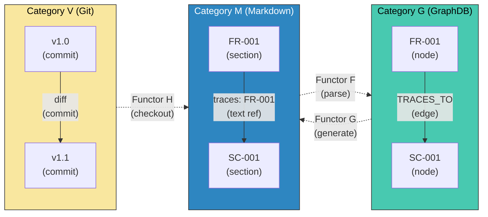
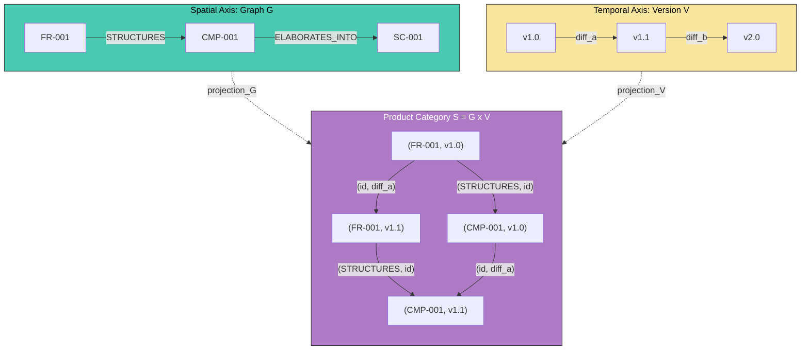

``````markdown
# 圏論によるANMS大規模スケーリングの基礎設計

## 1. 前提：3つの要素と1つの武器

| 要素 | 役割 | 性質 |
|---|---|---|
| **Markdown (MD)** | 人間可読な仕様の表現 | テキスト。人間のインターフェース |
| **Git** | 状態遷移の記録 | 時間軸。変更の履歴と差分 |
| **GraphDB** | 構造と関係の管理 | 空間軸。ノードとエッジの集合 |

**武器：圏論（Category Theory）**

これら3要素を統一的に扱うための数学的フレームワーク。

---

## 2. 圏の定義 — 対象（Object）と射（Morphism）

### 2.1 三つの圏

MD、Git、GraphDBはそれぞれ独立した**圏（Category）**である。同じ現実（仕様）を異なる視点で写し取っている。

#### 圏 $\mathcal{M}$ （Markdown圏）

- **対象（Object）:** IDを持つMarkdownセクション。`FR-001`, `SC-002`, `CMP-003`, `ADR-001` 等
- **射（Morphism）:** セクション間の参照。`(traces: FR-001)`, `(see: ADR-001)` 等のテキスト内リンク
- **合成:** 参照の推移。FR-001 → SC-001 → TST-001 は FR-001 → TST-001 に合成可能
- **恒等射:** 自分自身への参照（各セクションは自身のIDを持つ）

#### 圏 $\mathcal{G}$ （GraphDB圏）

- **対象（Object）:** ノード。`{id: "FR-001", type: "Requirement", stfb_layer: 2, ...}`
- **射（Morphism）:** エッジ。`FR-001 --TRACES_TO--> SC-001`
- **合成:** パス走査。2ホップ、3ホップの経路は1本の射に合成可能
- **恒等射:** 自己ループ（各ノードは自分自身に到達可能）

#### 圏 $\mathcal{V}$ （Git/Version圏）

- **対象（Object）:** ある時点の仕様のスナップショット（コミット）。`v1.0`, `v1.1`, `v2.0`
- **射（Morphism）:** コミット（diff）。スナップショット間の変換（状態遷移）
- **合成:** diffの連鎖。`v1.0 → v1.1 → v1.2` は `v1.0 → v1.2` に合成可能（rebase/squash）
- **恒等射:** 空コミット（変更なし）

**Three_Categories:**



上図は、3つの圏（M, G, V）とそれらを繋ぐ関手（Functor）を示す。同一の仕様を3つの異なる圏で表現し、関手で構造を保ちながら変換する。

### 2.2 射の本質 — 「変換」こそがすべて

ユーザーの記事の核心を借りると：

> 抽象化 = パラメータを取り除く = 情報を失う
> 具体化 = パラメータを加える = 情報を得る

ANMSのSTFBにおける射（Morphism）も同じ構造を持つ：

| 方向 | 操作 | 情報量 | 記事との対応 |
|---|---|---|---|
| Ch1 → Ch2 → Ch3 → Ch4 | CONSTRAINS → STRUCTURES → ELABORATES_INTO | 増加（具体化） | Concretize: object ⊕ parameters |
| Ch4 → Ch3 → Ch2 → Ch1 | 抽象化の方向（TRACES_TO等の逆参照） | 減少（抽象化） | Abstract: object ⊖ parameters |

STFBの上位層は「抽象」、下位層は「具体」。この階層を昇ることは次元削減（PCA）であり、降りることは次元追加である。

$$
\text{Abstract}(r) = r \ominus \text{parameters} \quad (\text{Ch4} \to \text{Ch1方向})
$$

$$
\text{Concretize}(r) = r \oplus \text{parameters} \quad (\text{Ch1} \to \text{Ch4方向})
$$

そして、究極まで抽象化すると — Foundation（Ch1）のさらに上、プロジェクトの存在理由 — に到達する。それは「ユーザーの意図」であり、言語化される前の状態、すなわち **Null** である。

---

## 3. 関手（Functor）— 圏と圏をつなぐ構造保存写像

関手は「ある圏の構造を壊さずに別の圏に写す」変換。これが3要素間の**同期メカニズム**の正体。

### 3.1 関手の定義

| 関手 | 始域 → 終域 | 意味 | 実装 |
|---|---|---|---|
| $F: \mathcal{M} \to \mathcal{G}$ | Markdown → GraphDB | MDをパースしてグラフに変換 | IDとトレース参照を抽出し、ノードとエッジを生成 |
| $G: \mathcal{G} \to \mathcal{M}$ | GraphDB → Markdown | グラフからMDを生成 | ノードのcontent_refからMarkdownを組み立て |
| $H: \mathcal{V} \to \mathcal{M}$ | Git → Markdown | 特定バージョンのMDをチェックアウト | `git checkout v1.0 -- spec/` |
| $F \circ H: \mathcal{V} \to \mathcal{G}$ | Git → GraphDB | 特定バージョンのグラフを構築 | チェックアウト→パース |

**関手が保存するもの:**

- 対象の対応（FR-001というMDセクション ↔ FR-001というノード）
- 射の対応（MDのテキスト参照 ↔ GraphDBのエッジ）
- 合成の保存（MDで A→B→C ならば GraphDBでも A→B→C）

### 3.2 自然変換（Natural Transformation）— 同期の正体

関手 $F$（MD→GraphDB）と関手 $G$（GraphDB→MD）の間に**自然変換** $\eta$ が存在するとき、MDとGraphDBは「同じ情報を異なる形式で表現している」と数学的に保証される。

$$
\eta: G \circ F \Rightarrow \text{Id}_{\mathcal{M}}
$$

これは「MDをパースしてGraphDBに入れ、再びMDに戻したら元に戻る」ということ。完全な往復（round-trip）が保証されれば、MDとGraphDBの同期問題は解消する。

**逆に、この自然変換が成立しない部分こそが「同期で失われる情報」であり、設計上の制約として明示すべきもの。**

---

## 4. 本質 — 要件管理と構成管理の圏論的統一

### 4.1 要件管理 = 圏 $\mathcal{G}$ の管理

要件管理とは、仕様のグラフ構造（ノードとエッジ）を管理すること。

- 要件の追加 = ノードの追加
- 要件間の依存定義 = エッジの追加
- トレーサビリティ = パス走査（射の合成）
- 影響分析 = 逆方向のパス走査
- エージェントへの文脈切り出し = サブグラフの抽出

### 4.2 構成管理 = 圏 $\mathcal{V}$ の管理

構成管理とは、仕様の時間的変遷（コミットとdiff）を管理すること。

- バージョニング = 対象（スナップショット）の列
- 変更追跡 = 射（diff）の記録
- ブランチ = 圏の分岐（並行する射の列）
- マージ = 分岐した射の合流（余積/pushout）

### 4.3 統一：2つの圏の積

要件管理（空間）と構成管理（時間）は直交する2軸。これらの**積圏（Product Category）**が、ANMS大規模管理の全体像となる。

$$
\mathcal{S} = \mathcal{G} \times \mathcal{V}
$$

- $\mathcal{S}$ の対象：（グラフノード, バージョン）のペア。例：`(FR-001, v1.2)` = 「v1.2時点でのFR-001」
- $\mathcal{S}$ の射：（エッジ, diff）のペア。空間的関係と時間的変化を同時に記述

**Product_Category:**



上図は積圏 $\mathcal{S}$ を示す。空間軸（グラフ構造）と時間軸（バージョン履歴）の積として、「いつの、どの仕様が、何と繋がっているか」を統一的に管理する。四角形が可換であること（どの経路で辿っても同じ結果になる）が整合性の保証となる。

### 4.4 MDの位置づけ — 表現関手

MDは独立した圏ではなく、積圏 $\mathcal{S}$ からの**表現関手（Representable Functor）**と見なせる。

$$
\text{Render}: \mathcal{S} \to \mathcal{M}
$$

つまり、MDは積圏の「ビュー」であり、本体ではない。

- GraphDB = 構造の本体（空間）
- Git = 変遷の本体（時間）
- MD = 人間が読むためのレンダリング結果

Clean Architectureで言えば：

| CA層 | ANMS圏論モデル |
|---|---|
| Entity | 積圏 $\mathcal{S} = \mathcal{G} \times \mathcal{V}$ のデータ構造（ノード・エッジ・バージョンの定義） |
| Use Case | 積圏上のアルゴリズム（影響分析、サブグラフ切り出し、トレーサビリティ走査） |
| Adapter | 関手 $F, G, H$（MD↔GraphDB↔Git間の変換インターフェース） |
| Framework | 具体的なDB（Kuzu等）、具体的なGitホスティング、具体的なMDレンダラー |

---

## 5. Nullの位置 — 始対象と終対象

ユーザーの記事より：

> $\mathbb{R}^3 \to \mathbb{R}^2 \to \mathbb{R}^1 \to \mathbb{R}^0 = \{*\} \to \emptyset = \text{Null}$

ANMSのSTFB階層で同じ次元削減を適用すると：

```
Ch4 Specification（最も具体的、高次元）
  ↑ 抽象化
Ch3 Architecture
  ↑ 抽象化
Ch2 Requirements
  ↑ 抽象化
Ch1 Foundation（最も抽象的、低次元）
  ↑ 抽象化
{*} = ユーザーの意図（点、言語化以前）
  ↑ 抽象化
∅ = Null（プロジェクトが存在しない状態）
```

圏論で言えば：

- **始対象（Initial Object）** = Null = $\emptyset$。どの対象へも唯一の射が存在する。「無から何でも生まれ得る」
- **終対象（Terminal Object）** = 完成したシステム。どの対象からも唯一の射が存在する。「すべてがここに収束する」

プロジェクトのライフサイクルは、始対象（Null）から終対象（完成システム）への射の合成として記述できる。

$$
\emptyset \xrightarrow{\text{intent}} \text{Foundation} \xrightarrow{\text{constrain}} \text{Requirements} \xrightarrow{\text{structure}} \text{Architecture} \xrightarrow{\text{elaborate}} \text{Specification} \xrightarrow{\text{implement}} \text{System}
$$

---

## 6. オーガナイザーエージェントの役割 — 関手の選択

大規模SWでオーガナイザーが行う「切り分け」は、圏論的には**部分圏（Subcategory）の選択**と**忘却関手（Forgetful Functor）の適用**である。

1. **部分圏の選択:** 積圏 $\mathcal{S}$ から、あるエージェントに必要なサブグラフ（部分圏）を切り出す
2. **忘却関手の適用:** そのエージェントに不要な情報（プロパティ、エッジ）を忘却して、コンテキストウィンドウに収まるサイズにする
3. **表現関手の適用:** 部分圏をMDにレンダリングしてエージェントに渡す

$$
\mathcal{S} \xrightarrow{\text{Subcategory}} \mathcal{S'} \xrightarrow{\text{Forgetful}} \mathcal{S''} \xrightarrow{\text{Render}} \mathcal{M'}
$$

これがまさにユーザーの記事で述べられた**抽象化（Abstract: object ⊖ parameters）**の実装である。エージェントに渡すコンテキストは、必要な次元だけを残した射影（projection）になる。

---

## 7. まとめ — データ構造の定義

| 問い | 答え |
|---|---|
| 対象（Object）は？ | IDを持つ仕様要素（FR-xxx, SC-xxx, CMP-xxx等）× バージョン |
| 射（Morphism）は？ | 空間軸: エッジ（CONSTRAINS, TRACES_TO等）。時間軸: diff（コミット） |
| 圏は？ | $\mathcal{G}$（グラフ/空間）、$\mathcal{V}$（Git/時間）、$\mathcal{M}$（MD/表現） |
| 本体は？ | 積圏 $\mathcal{S} = \mathcal{G} \times \mathcal{V}$（要件管理 × 構成管理） |
| MDは？ | 積圏からの表現関手。ビューであり本体ではない |
| Nullは？ | 始対象。プロジェクト以前の「無」。STFBを究極まで抽象化した先 |
| DBは？ | Framework層。Adapterで抽象化して差し替え可能にする |
| オーガナイザーは？ | 部分圏の選択 + 忘却関手の適用 + 表現関手によるレンダリング |
``````
