# 圏論まるわかり♪

## ～圏論？何それおいしいの？ から、圏論って超便利♪になる25ページ～

**【はじめに：このレポートの目的】**  
本書は、「集合論や論理学はなんとなく知っているけれど、圏論は全くの初心者」という方が、AIを相棒にして圏論を「実用的な道具」として使いこなせるようになるための完全ガイドです。圏論のエッセンスを、体系的かつ網羅的にこの1ファイルに凝縮しました。

---

## 第1章：視点の転換 ～「中身」から「関係性」へ～

### 1.1 集合論と圏論の違い

私たちが学校で習う「集合論」は、基本的に **「中身（要素）」** に注目します。
「集合 $A$ の中には $x, y, z$ という要素が入っている」というミクロな視点です。

一方、圏論は中身を一切見ません。対象（Object）をブラックボックス化し、対象と対象の間の **「関係性＝矢印（射）」** にだけ注目します。要素が分からなくても、外側からの矢印の繋がり方だけで、そのものの本質を捉えようとするマクロな視点です。

### 1.2 なぜ「関係性」だけを見るのか？

現代のソフトウェア設計や複雑なシステムでは、「内部実装（中身）」はカプセル化されて見えないことが多くなっています。APIの設計などはまさに「外部とどうやり取りするか（矢印）」だけでシステムを定義します。圏論は、この「矢印だけで世界を記述する」ための最強の数学的フレームワークなのです。

---

## 第2章：圏の基礎 ～世界のルールを定義する～

圏（Category）を名乗るためには、以下の4つの要素とルールが必要です。

1. **対象（Object）:** 点。集合、空間、命題、データ型など。
2. **射（Morphism）:** 矢印。関数、変換、推論規則、プログラムの関数など。
3. **合成（Composition）:** 矢印をつなぐルール。 $f$ と $g$ があれば、必ず $g \circ f$ が存在する。
4. **恒等射（Identity）:** 「何もしない」という矢印。対象には必ず自分自身へ向かう矢印が存在する。

**title:** Category_Definition_Rules

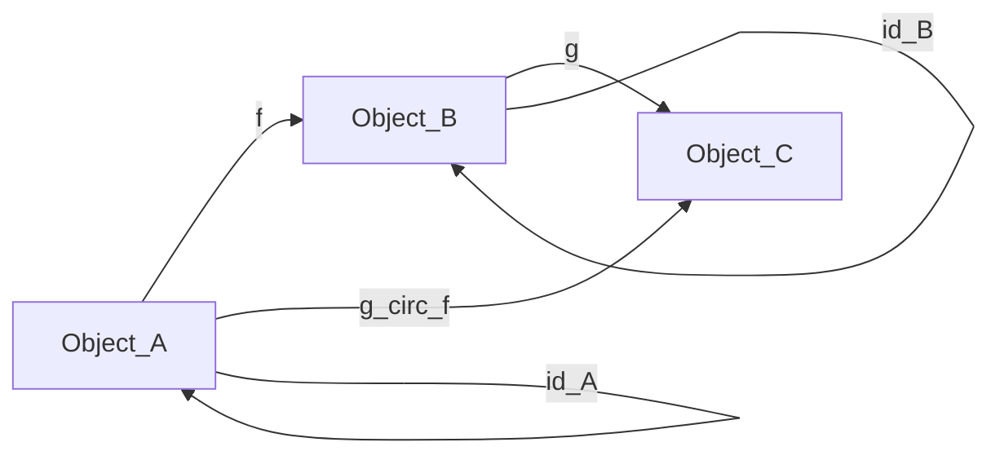

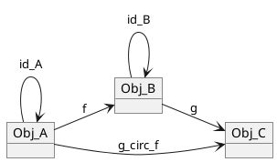

上の図は、圏の基本的な公理（合成と恒等射）を表しています。 $A$ から $B$ へ行き、 $B$ から $C$ へ行く道があるなら、必ず $A$ から $C$ への直行ルート（合成射）が存在しなければなりません。また、各対象には必ず「自分に留まる」矢印（ $id$ ）があります。

### 2.1 集合論と論理学を「圏」として見る

あなたが知っている知識を圏論に当てはめるとこうなります。

- **集合の圏 $\mathbf{Set}$:** 対象は「集合」、射は「関数」。
- **論理学の圏 $\mathbf{Logic}$:** 対象は「命題（PやQ）」、射は「推論（P ならば Q）」。

「P $\implies$ Q」であり「Q $\implies$ R」なら「P $\implies$ R」ですよね？ これがまさに**射の合成**です。「P $\implies$ P」は常に真ですよね？ これが**恒等射**です。論理学は立派な圏論の一部なのです。

---

## 第3章：関手（Functor） ～世界を翻訳する橋～

圏の中のルールが分かったら、次は「圏と圏の間」の移動です。
**関手（Functor）** は、ある圏 $\mathcal{C}$ の対象と射を、別の圏 $\mathcal{D}$ の対象と射へ、**「構造（矢印の繋がり方）を保ったまま」** お引越しさせるマッピングのことです。

**title:** Functor_Mapping_Concept

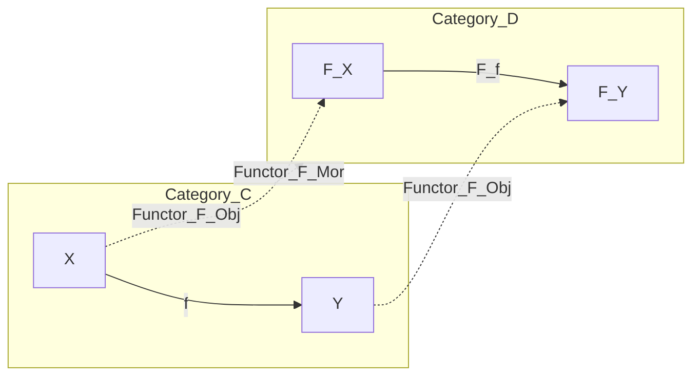

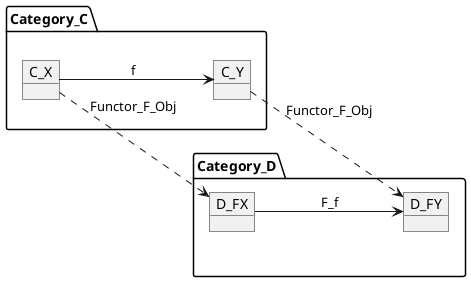

この図が示すように、関手 $F$ は、圏 $C$ の対象 $X, Y$ を圏 $D$ の対象 $F(X), F(Y)$ に移すだけでなく、その間の射 $f$ も、ちゃんと対応する射 $F(f)$ に移します。「矢印の繋がりが壊れない」ことが関手の絶対条件です。

### 3.1 身近な関手の例

- **プログラミングにおけるList:** データ型 $A$ を受け取って「 $A$ のリスト（List[A]）」を作る操作は関手です。関数 $f(A \to B)$ も、リスト全体に適用する関数 $map(f)$ に変換できます。
- **忘却関手と自由関手:** 構造を忘れる関手と、構造を自由に作る関手も、立派な世界の翻訳機です。次章で詳しく掘り下げます。

---

## 第4章：忘却関手と抽象化の本質 ～捨てることの数学～

### 4.1 「抽象化」とは何を忘れることか

第3章で関手は「構造を保って翻訳する」と学びました。しかし世の中には、**構造の一部をわざと捨てる**ことで物事を単純化する翻訳もあります。それが**忘却関手（Forgetful Functor）**です。

忘却関手 $U: \mathcal{D} \to \mathcal{C}$ とは、豊かな構造を持つ圏 $\mathcal{D}$ から、その構造の一部を「意図的に捨てて」より単純な圏 $\mathcal{C}$ へ写す関手です。

典型例として、群の圏 $\mathbf{Grp}$ から集合の圏 $\mathbf{Set}$ への忘却関手 $U$ があります。群 $(G, \cdot)$ は集合 $G$ に「掛け算のルール（群演算）」という構造を付与したものですが、 $U$ はその演算構造を丸ごと忘れ、素の集合 $G$ だけを返します。

$$
U: \mathbf{Grp} \to \mathbf{Set}, \quad (G, \cdot) \mapsto G
$$

重要なのは、**忘却は一般に逆転できない**という非対称性です。集合 $G$ だけを見ても、元の群演算 $\cdot$ は復元できません。同じ集合 $\{0, 1, 2, 3\}$ に対して、足し算で群を作ることも、別の演算で群を作ることもできてしまう。この非対称性こそが「抽象化」の本質です。

### 4.2 自由関手 ～「捨てる」の相棒～

忘却関手 $U$ には、必ずといっていいほど**自由関手（Free Functor）** $F: \mathcal{C} \to \mathcal{D}$ が相棒として対応します。

自由関手 $F$ は「最小限の仮定だけで構造を自由に生成する」方向です。集合 $S$ を受け取って「 $S$ の元だけから、余計な関係を一切仮定せずに作った群」＝**自由群** $F(S)$ を返します。

**title:** Forgetful_Free_Functor_Adjunction

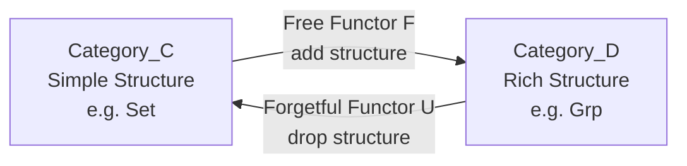

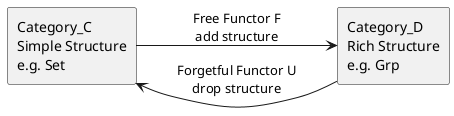

自由関手 $F$ が「構造を付与する（具体化）」方向、忘却関手 $U$ が「構造を捨てる（抽象化）」方向に対応します。両者は**随伴のペア** $F \dashv U$ を成し、具体と抽象の間の双方向の橋渡しを担います（随伴の詳細は第7章で）。

$$
\mathrm{Hom}_{\mathcal{D}}(F(X), Y) \cong \mathrm{Hom}_{\mathcal{C}}(X, U(Y))
$$

### 4.3 忘却関手の4つの性質

| 性質       | 圏論的対応                             | 意味                         |
| :--------- | :------------------------------------- | :--------------------------- |
| 具体化     | 自由関手 $F$（構造の付与）             | パラメータを加える           |
| 抽象化     | 忘却関手 $U$（構造の除去）             | パラメータを取り除く         |
| 往復の保証 | 随伴 $F \dashv U$                      | 具体と抽象の対応が矛盾しない |
| 不可逆性   | $U \circ F \neq \mathrm{Id}$（一般に） | 抽象化で失った情報は戻らない |

「パラメータを取り除く」という操作が単なる「削除」ではなく、数学的に定義された**関手**であるという点が重要です。関手であるということは、対象の変換だけでなく**射（関係性）の変換も構造を保って行われる**ことを意味します。単なる情報の切り捨てではなく、**構造を保ったままの情報の圧縮**なのです。

### 4.4 なぜ忘却関手は実用的か？

私たちは日常的に忘却関手を使っています。

- **地図**は、3次元の地形から高さ情報を忘却して2次元に射影する忘却関手です。
- **要約**は、文章から詳細を忘却して骨子だけ残す忘却関手です。
- **インタフェース（API）**は、実装の詳細を忘却して入出力の型だけ残す忘却関手です。

いずれも「何を捨て、何を残すか」の設計が品質を決めます。捨て方が雑だと、地図は使えないし、要約は意味を失うし、APIは必要な情報を隠しすぎる。忘却関手は「良い抽象化とは何か」を数学的に問う道具なのです。

---

## 第5章：自然変換 ～翻訳機のチューニング～

圏論の創始者たちは、「圏論は自然変換を定義するために作られた」と言っています。
2つの異なる関手 $F$ と $G$ （つまり2つの異なる翻訳方法）があったとき、**翻訳結果の $F(X)$ を、別の翻訳結果 $G(X)$ へ、矛盾なくスムーズに変換するルール**のことです。

**title:** Natural_Transformation_Square

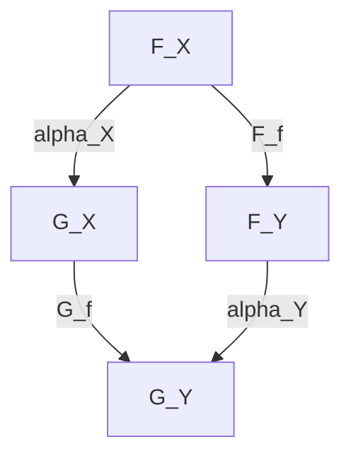

```plantuml
@startuml
skinparam ranksep 80
skinparam nodesep 80

object FX as "F_X"
object FY as "F_Y"
object GX as "G_X"
object GY as "G_Y"

FX --> FY : F_f
GX --> GY : G_f
FX --> GX : alpha_X
FY --> GY : alpha_Y
@enduml
```

上の図は「可換図式（Commutative Diagram）」と呼ばれる圏論の強力なツールです。
左上から右下に行くルート（ $F(X) \xrightarrow{F(f)} F(Y) \xrightarrow{\alpha_Y} G(Y)$ ）と、左上から左下を経由するルート（ $F(X) \xrightarrow{\alpha_X} G(X) \xrightarrow{G(f)} G(Y)$ ）が**全く同じ結果になる**ことを示しています。これが自然変換 $\alpha$ の条件です。

数式で書くと以下の通りです。

$$
\alpha_Y \circ F(f) = G(f) \circ \alpha_X
$$

この等式がすべての射 $f$ に対して成り立つとき、 $\alpha$ は自然変換であるといいます。

---

## 第6章：普遍性（Universal Property） ～最適解の形～

圏論において「最も無駄がなく、最も代表的なもの」を定義する魔法の言葉が**普遍性**です。
ここでは「直積（Product）」を例にとります。

集合論では、集合 $A$ と $B$ の直積 $A \times B$ は「ペアの集合 $(a, b)$ 」と要素で定義します。  
しかし圏論では要素を見ません。次のように**矢印だけ**で定義します。

**title:** Universal_Property_of_Product

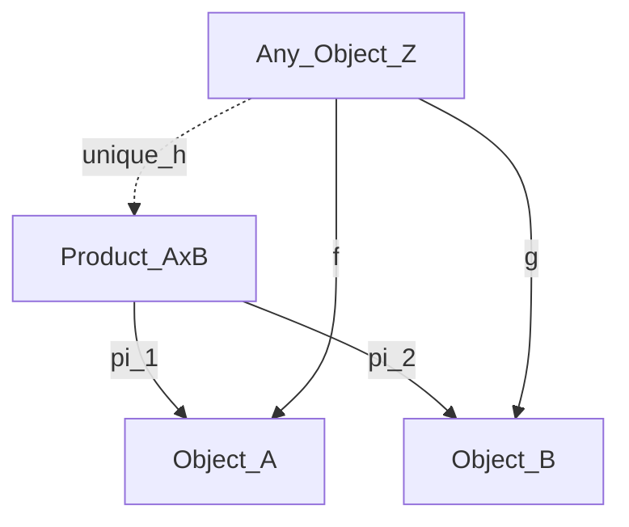

```plantuml
@startuml
skinparam ranksep 70
skinparam nodesep 70

object P as "Product_AxB"
object A as "Object_A"
object B as "Object_B"
object Z as "Any_Object_Z"

P --> A : pi_1
P --> B : pi_2
Z --> A : f
Z --> B : g
Z ..> P : unique_h
@enduml
```

この図の意味はこうです。
「 $A$ と $B$ の両方に矢印を伸ばせる都合の良い対象 $Z$ は世の中にたくさんある。しかし、真の直積 $P$ （ $A \times B$ ）は特別だ。どんな $Z$ が来ても、必ず $Z$ から $P$ を経由する**ただ1つの矢印（ unique $h$ ）**に綺麗にまとめることができる」

この「どんなものが来ても、必ずただ1つの矢印でまとまる」という性質が普遍性です。データベースのJOINや、論理学の「AND（論理積）」も、全く同じこの図式で表現できます。

### 6.1 双対：余積（Coproduct）

矢印の向きを全部逆にすると、直積の双対である**余積（Coproduct）**が得られます。

**title:** Universal_Property_of_Coproduct

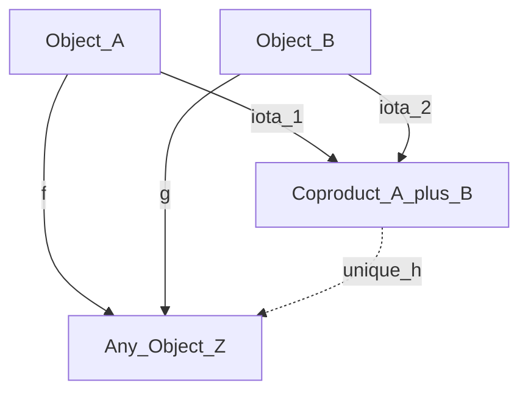

```plantuml
@startuml
skinparam ranksep 70
skinparam nodesep 70

object S as "Coproduct_A_plus_B"
object A as "Object_A"
object B as "Object_B"
object Z as "Any_Object_Z"

A --> S : iota_1
B --> S : iota_2
A --> Z : f
B --> Z : g
S ..> Z : unique_h
@enduml
```

プログラミングでは直積は「構造体（struct）」や「タプル」、余積は「直和型（union / enum）」に対応します。論理学では直積が「AND」、余積が「OR」です。圏論は、矢印を逆にするだけで双対な概念が自動的に生成されるのです。

---

## 第7章：随伴（Adjunction） ～宇宙の調和～

第3章で登場した「関手」の中に、完璧にピタリと噛み合うペアが存在します。それが**随伴（ $F \dashv U$ ）**です。

ある圏 $\mathcal{C}$ から $\mathcal{D}$ への関手 $F$ （例：自由関手）と、逆向きの関手 $U$ （例：忘却関手）があるとき、以下の数式が成り立つことを随伴と言います。

$$
\mathrm{Hom}_{\mathcal{D}}(F(X), Y) \cong \mathrm{Hom}_{\mathcal{C}}(X, U(Y))
$$

第4章で学んだ忘却関手と自由関手のペアは、実はこの随伴の最も代表的な例でした。第4章では具体例として先に体験し、ここでその一般論を学ぶという構成です。

### 7.1 随伴の「超便利」な本質

随伴がなぜ重要なのか？ それは**「難しい問題を、解きやすい世界に移動させて解き、また戻すことができる」**からです。

例えば、論理学において「カリー化（Currying）」という概念があります。  
「 $(A \text{ AND } B) \implies C$ 」という証明は、「 $A \implies (B \implies C)$ 」と全く同じです。  
これも実は、直積（AND）を作る関手と、指数（含意 $\implies$ ）を作る関手の間の**随伴関係**なのです。

**title:** Currying_as_Adjunction

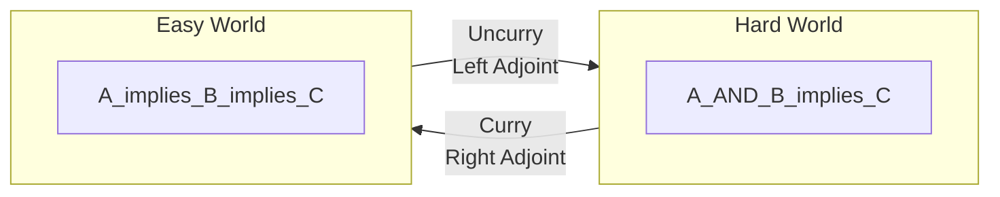

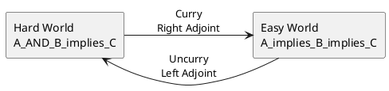

圏論を知っていれば、論理の構造変換が「あ、随伴のペアを使えば一発で変換できるな」と俯瞰できるようになります。

### 7.2 カリー化と対偶 ～似て非なる2つの操作～

カリー化を学ぶと、論理学の**対偶（ $P \implies Q$ ならば $\lnot Q \implies \lnot P$ ）**も同じ仕組みに見えるかもしれません。  
しかし、両者は圏論的には全く異なる操作です。

| 比較項目   | カリー化                                        | 対偶                                                 |
| :--------- | :---------------------------------------------- | :--------------------------------------------------- |
| 操作の本質 | 引数の再配置（多引数 → 1引数の連鎖）            | 矢印の反転（ $P \to Q$ を $\lnot Q \to \lnot P$ へ） |
| 圏論的正体 | **随伴**（ $(-) \times B \dashv (-)^B$ ）       | **反変関手**（否定 $\lnot$ が矢印を逆転）            |
| 矢印の方向 | **変わらない**（ $A \to (B \to C)$ は同じ向き） | **逆になる**（ $\lnot$ が向きを反転）                |
| 情報の保存 | 完全に可逆（curry / uncurry）                   | 完全に可逆（二重否定で元に戻る）                     |

**title:** Currying_vs_Contrapositive

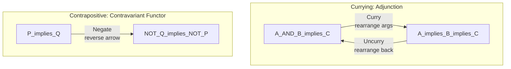

```plantuml
@startuml
skinparam ranksep 60
skinparam nodesep 60

package "Currying: Adjunction" {
  object C1 as "A_AND_B_implies_C"
  object C2 as "A_implies_B_implies_C"
  C1 --> C2 : Curry\nrearrange args
  C2 --> C1 : Uncurry\nrearrange back
}

package "Contrapositive: Contravariant Functor" {
  object P1 as "P_implies_Q"
  object P2 as "NOT_Q_implies_NOT_P"
  P1 --> P2 : Negate\nreverse arrow
}
@enduml
```

カリー化は「同じ方向の矢印の形を変える（引数の束ね方を変える）」操作であり、随伴という**共変的**な構造です。  
一方、対偶は否定 $\lnot$ という**反変関手**が矢印の向きそのものを逆転させる操作です。  
第6章で学んだ双対（矢印の反転）の具体例が対偶であり、本章で学んだ随伴（世界の間の架け橋）の具体例がカリー化です。  
両者は圏論の異なる層に属する、似て非なる概念なのです。

### 7.3 随伴の実例まとめ

| 左随伴 $F$              | 右随伴 $U$       | 意味                                    |
| :---------------------- | :--------------- | :-------------------------------------- |
| 自由関手                | 忘却関手         | 構造の付与 $\leftrightarrow$ 構造の除去 |
| 直積関手 $(-) \times B$ | 指数関手 $(-)^B$ | カリー化 $\leftrightarrow$ 非カリー化   |
| 離散化関手              | 忘却関手         | 位相空間 $\leftrightarrow$ 集合         |
| 存在量化 $\exists$      | 置換関手         | 論理の随伴                              |

随伴は圏論の至る所に現れ、一見無関係な分野の概念を統一的に捉える最強のレンズです。

---

## 第8章：米田の補題 ～哲学の数学的証明～

圏論のクライマックスです。**米田の補題（Yoneda Lemma）** は、世界に対する哲学的な問いを数学的に証明したものです。

「対象 $A$ の中身（要素）が一切見えなくても、世界の他のすべての対象から $A$ に対して『どんな矢印が向かっているか（あるいは $A$ からどんな矢印が出ているか）』を完全に把握できれば、対象 $A$ の正体は完全に決定される」

$$
\mathrm{Nat}(\mathrm{Hom}(A, -), F) \cong F(A)
$$

### 8.1 なぜこれが実用的（おいしい）のか？

システム開発において、サードパーティのAPIやレガシーシステムなど「中身がブラックボックス化されたモジュール（対象 $A$ ）」があるとします。
米田の補題は、「中身のソースコードを見なくても、すべての可能な入力パターンと、それに対する出力パターン（すべての矢印）を網羅的にテストできれば、そのシステムの仕様（対象 $A$ ）を完全に特定したことと同義である」と保証してくれます。

つまり、 **「振る舞い（関係性）こそが、そのものの実態である」** というモデリングの極意を数学的に裏付けているのです。

### 8.2 米田埋め込み ～対象を射の世界に埋め込む～

米田の補題から導かれる重要な帰結が **米田埋め込み（Yoneda Embedding）** です。

任意の圏 $\mathcal{C}$ の対象 $A$ に対して、関手 $\mathrm{Hom}(A, -)$ を対応させる写像は **忠実充満関手（fully faithful functor）** になります。  
つまり、どんな圏も、関手の圏（矢印の集まりの世界）の中に「情報を失わずに」埋め込める。

これは第1章で述べた「関係性だけで世界を記述できる」という圏論の哲学の、数学的な完全証明です。

---

## 第9章：AI×圏論で実務をハックする（超便利♪な実践術）

ここまで読んだあなたは、圏論の「視点（矢印で考えること）」と「ボキャブラリー（関手、忘却関手、随伴、普遍性）」を手に入れました。  
最後に、これをAI（私）に投げかけて、現実の問題を解くための**プロンプト設計**を伝授します。

**title:** AI_Category_Theory_Problem_Solving

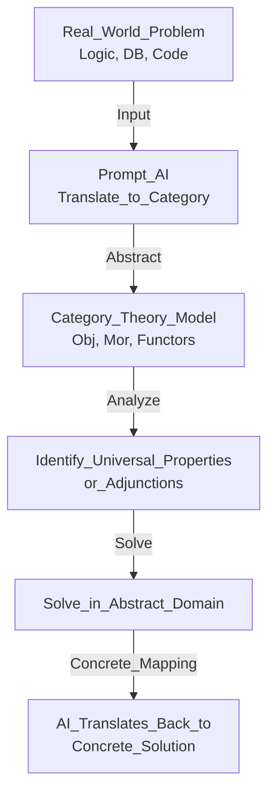

```plantuml
@startuml
skinparam ranksep 50
skinparam nodesep 50

object User_Problem as "Real_World_Problem\nLogic, DB, Code"
object Prompt_AI as "Prompt_AI\nTranslate_to_Category"
object CT_Model as "Category_Theory_Model\nObj, Mor, Functors"
object Find_Adj as "Identify_Universal_Properties\nor_Adjunctions"
object Solve_Abs as "Solve_in_Abstract_Domain"
object Translate as "AI_Translates_Back_to\nConcrete_Solution"

User_Problem --> Prompt_AI : Input
Prompt_AI --> CT_Model : Abstract
CT_Model --> Find_Adj : Analyze
Find_Adj --> Solve_Abs : Solve
Solve_Abs --> Translate : Concrete_Mapping
@enduml
```

このフローに従って、複雑な問題に直面したときは、以下のように私（AI）にプロンプトを投げてください。

### 実用プロンプト・テンプレート集

**1. システム統合やデータ変換で悩んだとき（関手と自然変換の応用）**

> 「現在、システムA（データ構造X）からシステムB（データ構造Y）への移行を設計しています。この2つのシステムを『圏』と見立て、データ変換処理を『関手』とした場合、データの整合性を保つため（関手性を満たすため）に注意すべき制約条件を洗い出して。また、変換ルールのバージョンアップを『自然変換』としてモデル化して。」

**2. アーキテクチャの最適解を見つけたいとき（普遍性の応用）**

> 「3つの異なるマイクロサービスからデータを集約するAPIゲートウェイを作りたい。このAPIゲートウェイが圏論における『直積（Product）』としての『普遍性』を満たす（つまり、最も無駄がなく、各サービスへの矢印がただ1つに定まる）ような、最適なインターフェース設計を提案して。」

**3. 複雑なロジックをシンプルにしたいとき（随伴の応用）**

> 「現在抱えているこの複雑な条件分岐のロジック（論理学の問題）に、『随伴（Adjunction）』関係にある別のシンプルなモデル（例えばカリー化や、別のデータ構造へのマッピング）は存在しないか？ 難しい世界から簡単な世界へ『関手』で移動させて解くアプローチを考えて。」

**4. 抽象化のレベルを設計したいとき（忘却関手の応用）**

> 「このシステムのAPIインタフェースを設計している。内部実装の詳細のうち、何を外部に公開し、何を隠蔽すべきか？ 『忘却関手』の視点で、構造を保ったまま不要な情報を捨てる最適な抽象化レベルを提案して。捨てすぎ（情報不足）と捨てなさすぎ（複雑すぎ）のバランスを分析して。」

### 結び

圏論は、それ単体で計算をするためのものではなく、 **「AIという強力な計算機に対して、最も的確で抽象度の高い『設計図』を指示するための言語」** として使うときに最大の威力を発揮します。

さあ、あなたの抱えている具体的な課題（集合論的なデータベースの悩みでも、論理学的な条件分岐のバグでも構いません）を、この「圏論の言葉」を使ってAIに投げてみてください。  
抽象と具象を行き来する、最高にエキサイティングな問題解決の旅を始めましょう！

---

# Appendix: 工学・数学の強力な武器を圏論で再解釈する

本編で学んだ圏論の概念が、工学・数学のさまざまな分野にどう現れるかを、Appendixごとに具体的に解説します。各Appendixは対応する本編の章と紐づいています。

---

## Appendix A: ラプラス変換・フーリエ変換と関手 （対応：第3章 関手）

微分方程式を解くとき、私たちはラプラス変換やフーリエ変換を使って、時間領域 $t$ の問題を、周波数領域 $s$ や $\omega$ の問題にすり替えます。
これは圏論において、**「難しい圏（微分方程式の世界）」から「簡単な圏（代数方程式の世界）」への関手（Functor）** として完璧に記述できます。

- **時間領域の圏 $\mathbf{Time}$ ：** 対象は関数 $f(t)$ 、射は微分演算子 $\frac{d}{dt}$ などの操作。
- **周波数領域の圏 $\mathbf{Freq}$ ：** 対象は関数 $F(s)$ 、射は $s$ を掛ける（ $\times s$ ）などの代数的操作。

ラプラス変換という関手 $\mathcal{L}$ は、微分の操作をただの掛け算に「翻訳」してくれます。

**title:** Laplace_Transform_Functor

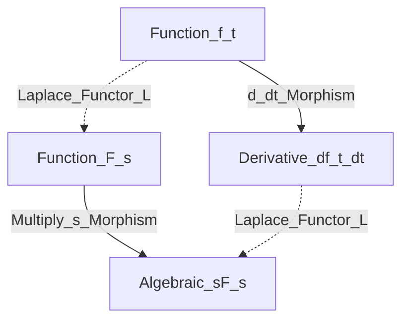

```plantuml
@startuml
skinparam ranksep 80
skinparam nodesep 80

object Time_f as "Function_f_t"
object Time_df as "Derivative_df_t_dt"
object Freq_F as "Function_F_s"
object Freq_sF as "Algebraic_sF_s"

Time_f --> Time_df : d_dt Morphism
Freq_F --> Freq_sF : Multiply_s Morphism
Time_f ..> Freq_F : Laplace Functor L
Time_df ..> Freq_sF : Laplace Functor L
@enduml
```

この図は、微分の世界での操作が、関手 $\mathcal{L}$ を通じて掛け算の世界の操作に綺麗に写されていること（可換図式）を示しています。

数式で表すと以下のようになります。（初期値をゼロとした場合）

$$
\mathcal{L} \left( \frac{d}{dt} f(t) \right) = s \cdot \mathcal{L}(f(t))
$$

関手によって「解きやすい世界」に移動し、そこで代数計算（四則演算）をしてから、逆ラプラス変換（逆関手）で元の時間領域に戻す。  
これは圏論の **「随伴（Adjunction）」を使った問題解決の最も成功した実例** と言えます。

---

## Appendix B: JPEG圧縮と忘却関手 （対応：第4章 忘却関手）

### 圧縮とは「何を忘れるか」の設計である

第4章で学んだ忘却関手の最も直感的な応用例が、JPEG画像圧縮です。JPEG圧縮は以下の3ステップで構成されます。

1. **離散コサイン変換（DCT）**: 空間領域（ピクセル値）を周波数領域（空間周波数成分）へ変換
2. **量子化**: 高周波成分（人間の目に見えにくい細部）を粗く丸める ← **忘却関手の核心**
3. **エントロピー符号化**: 残った情報をハフマン符号等で無損圧縮

$$
F(u,v) = \frac{2}{N} \sum_{x=0}^{N-1} \sum_{y=0}^{N-1} f(x,y) \cos\frac{\pi(2x+1)u}{2N} \cos\frac{\pi(2y+1)v}{2N}
$$

ここで $f(x,y)$ がピクセル値、 $F(u,v)$ がDCT係数です。  
量子化ステップで高周波成分 $F(u,v)$ の多くがゼロに丸められ、 **人間の知覚に不要な情報が忘却関手として除去されます** 。

**title:** JPEG_Compression_as_Forgetful_Functor

```mermaid
flowchart LR
    Pixel["Pixel_Domain<br/>f_x_y<br/>Spatial info full"]
    DCT["Frequency_Domain<br/>F_u_v<br/>DCT coefficients"]
    Quantized["Quantized_Domain<br/>F_q_u_v<br/>High freq dropped"]
    Compressed["Compressed_Bitstream<br/>Entropy coded<br/>Lossless from here"]

    Pixel -->|"DCT<br/>structure preserving<br/>reversible"| DCT
    DCT -->|"Quantize<br/>Forgetful Functor U<br/>irreversible"| Quantized
    Quantized -->|"Entropy_Encode<br/>lossless<br/>reversible"| Compressed
```

```plantuml
@startuml
skinparam ranksep 60
skinparam nodesep 60
left to right direction

object Pixel as "Pixel_Domain\nf_x_y\nSpatial info full"
object DCT as "Frequency_Domain\nF_u_v\nDCT coefficients"
object Quantized as "Quantized_Domain\nF_q_u_v\nHigh freq dropped"
object Compressed as "Compressed_Bitstream\nEntropy coded\nLossless from here"

Pixel --> DCT : DCT\nstructure preserving\nreversible
DCT --> Quantized : Quantize\nForgetful Functor U\nirreversible
Quantized --> Compressed : Entropy_Encode\nlossless\nreversible
@enduml
```

量子化（Quantize）ステップだけが**有損（不可逆）**であり、その前後は可逆変換です。

### 忘却関手としての構造

この3ステップを圏論的に整理すると以下のようになります。

| ステップ           | 圏論的対応                           | 可逆性     |
| :----------------- | :----------------------------------- | :--------- |
| DCT                | 同型関手（圏の間の可逆な翻訳）       | 可逆       |
| 量子化             | **忘却関手 $U$（構造の選択的除去）** | **不可逆** |
| エントロピー符号化 | 同型関手（表現を変えるだけ）         | 可逆       |

有損圧縮の本質は「人間の知覚モデルに基づく選択的忘却」です。量子化テーブルが「どの周波数成分をどの粒度で捨てるか」を制御し、その設計が粗いと **ブロックノイズ** が発生します。このような「忘却（情報の切り捨て）によって生じる意図せぬ劣化・歪み」を、信号処理の分野では **アーティファクト（artifact）** と呼びます（ソフトウェア開発の「成果物」とは別の意味です）。

これは第4章で述べた「捨て方が雑だと品質が劣化する」という忘却関手の一般原則そのものです。  
**良い圧縮とは、良い忘却関手の設計にほかなりません。**

---

## Appendix C: プログラミングパラダイムの変遷と忘却関手 （対応：第4章 忘却関手）

### 抽象化の歴史は忘却の連鎖である

Appendix BのJPEG圧縮が「1回の忘却」の例だとすれば、プログラミングパラダイムの進化は **忘却関手の連鎖（合成）** の例です。  
各世代で「人間が直接扱う情報の粒度（抽象度）」が上がり、下位の詳細が不可逆に忘却されてきました。

| 世代 | パラダイム           | 人間が書くもの     | 忘却される詳細               |
| :--- | :------------------- | :----------------- | :--------------------------- |
| 1    | マシン語             | レジスタ・ビット列 | なし（全部見える）           |
| 2    | 構造化（C）          | 関数・制御構造     | レジスタ割当、メモリアドレス |
| 3    | OOP（C++・Java）     | クラス・メッセージ | メモリ管理、vtable           |
| 4    | FP（Haskell・Scala） | 関数合成・型       | 評価戦略、副作用管理         |

**title:** Programming_Paradigm_Forgetful_Chain

```mermaid
flowchart TD
    ML["Machine_Language<br/>Bits and registers<br/>No abstraction"]
    SP["Structured_Programming<br/>Functions and control flow<br/>Forget register allocation"]
    OOP["Object_Oriented_Programming<br/>Classes and messages<br/>Forget memory layout"]
    FP["Functional_Programming<br/>Functions and types<br/>Forget execution order"]

    ML -->|"Forgetful Functor U1<br/>lose register detail"| SP
    SP -->|"Forgetful Functor U2<br/>lose memory detail"| OOP
    OOP -->|"Forgetful Functor U3<br/>lose execution detail"| FP
```

```plantuml
@startuml
skinparam ranksep 60
skinparam nodesep 60

object ML as "Machine_Language\nBits and registers\nNo abstraction"
object SP as "Structured_Programming\nFunctions and control flow\nForget register allocation"
object OOP as "Object_Oriented_Programming\nClasses and messages\nForget memory layout"
object FP as "Functional_Programming\nFunctions and types\nForget execution order"

ML --> SP : Forgetful Functor U1\nlose register detail
SP --> OOP : Forgetful Functor U2\nlose memory detail
OOP --> FP : Forgetful Functor U3\nlose execution detail
@enduml
```

各パラダイム間の遷移は忘却関手 $U_1, U_2, U_3$ の連鎖として表現できます。

### 不可逆性とアーティファクト

各世代の「忘却」は **不可逆** です。Cプログラマーはアセンブリを書かなくてよくなった代わりに、コンパイラが生成するアセンブリを制御できなくなりました。OOPプログラマーはメモリ管理を書かなくてよくなった代わりに、GCのタイミングを制御できなくなりました。

そしてJPEGの量子化と同様に、各世代の忘却には固有の **アーティファクト（Appendix B参照：忘却に起因する意図せぬ劣化）** が伴います。

| 世代   | アーティファクト（忘却による劣化）   | 導入された品質保証手段      |
| :----- | :----------------------------------- | :-------------------------- |
| 構造化 | バッファオーバーフロー、ポインタ破壊 | 型システム                  |
| OOP    | 継承の乱用、God Object               | SOLID原則、デザインパターン |
| FP     | モナドの複雑性、型推論の難解さ       | 型クラス、コンパイラ支援    |

### JPEGとの構造的同一性

| 概念       | JPEG圧縮                       | パラダイム進化                             |
| :--------- | :----------------------------- | :----------------------------------------- |
| 信号源     | 生ピクセル列                   | マシン語・ビット列                         |
| 有損圧縮   | 量子化（高周波成分の除去）     | 下位詳細の忘却                             |
| 知覚モデル | 人間の視覚（高周波に鈍感）     | 人間の認知（実装詳細に鈍感）               |
| 不可逆性   | 量子化後は元ピクセルに戻れない | 上位パラダイムからアセンブリは復元できない |
| 品質保証   | 量子化テーブルの設計           | 型システム・SOLID原則                      |

両者はすべて「知覚モデル（何が重要か）」と「忘却関手（何を捨てるか）」の組み合わせです。  
**品質は「何を捨てるか」の設計精度に依存する**  
 ――これがJPEGとパラダイム進化に共通する忘却関手の教訓です。

---

## Appendix D: データベースの変遷と忘却関手 （対応：第4章 忘却関手）

### データモデルの進化も忘却の連鎖である

Appendix Cではプログラミングの「制御フローの抽象化」を忘却関手の連鎖として見ました。データベースの歴史も、**データ構造の抽象化**という別の軸で忘却関手の連鎖を形成しています。

| 世代 | データモデル                | データへのアクセス方法       | 忘却される詳細             |
| :--- | :-------------------------- | :--------------------------- | :------------------------- |
| 1    | 階層型DB（IMS）             | ポインタを辿る木構造走査     | なし（物理配置が見える）   |
| 2    | ネットワーク型DB（CODASYL） | ポインタを辿る任意グラフ走査 | 木構造制約（多対多を許容） |
| 3    | RDB（SQL）                  | 宣言的クエリ（SQL）          | 物理的なポインタ・走査経路 |
| 4    | ドキュメントDB（MongoDB等） | キーによるドキュメント取得   | 正規化制約・結合構造       |
| 5    | グラフDB（Neo4j等）         | パターンマッチングクエリ     | テーブル・行・列という構造 |

**title:** Database_Evolution_Forgetful_Chain

```mermaid
flowchart TD
    Hier["Hierarchical_DB<br/>Tree structure<br/>Physical pointers visible"]
    Net["Network_DB<br/>Arbitrary graph<br/>Forget tree constraint"]
    RDB["Relational_DB<br/>Declarative SQL<br/>Forget physical navigation"]
    Doc["Document_DB<br/>Flexible schema<br/>Forget normalization"]
    Graph["Graph_DB<br/>Pattern matching<br/>Forget tabular structure"]

    Hier -->|"Forgetful Functor U1<br/>lose tree constraint"| Net
    Net -->|"Forgetful Functor U2<br/>lose physical pointers"| RDB
    RDB -->|"Forgetful Functor U3a<br/>lose normalization"| Doc
    RDB -->|"Forgetful Functor U3b<br/>lose tabular structure"| Graph
```

```plantuml
@startuml
skinparam ranksep 60
skinparam nodesep 60

object Hier as "Hierarchical_DB\nTree structure\nPhysical pointers visible"
object Net as "Network_DB\nArbitrary graph\nForget tree constraint"
object RDB as "Relational_DB\nDeclarative SQL\nForget physical navigation"
object Doc as "Document_DB\nFlexible schema\nForget normalization"
object Graph as "Graph_DB\nPattern matching\nForget tabular structure"

Hier --> Net : Forgetful Functor U1\nlose tree constraint
Net --> RDB : Forgetful Functor U2\nlose physical pointers
RDB --> Doc : Forgetful Functor U3a\nlose normalization
RDB --> Graph : Forgetful Functor U3b\nlose tabular structure
@enduml
```

注目すべきは、RDB以降の進化が**線形ではなく分岐している**点です。ドキュメントDBとグラフDBはRDBから異なるものを忘却した結果として生まれた、**異なる忘却関手の適用結果**です。

### 各遷移で何を忘れ、何を得たか

**階層型 → ネットワーク型（ $U_1$ ）：木構造制約の忘却**

階層型DBは親子関係（木構造）しか表現できませんでした。ネットワーク型は「1つの親しか持てない」という制約を忘却し、多対多の関係を許容しました。代償として、データ構造の単純さ（木はシンプル）を失いました。

**ネットワーク型 → RDB（ $U_2$ ）：物理ポインタの忘却**

これが最も革命的な忘却です。Coddの関係モデルは「プログラマーが物理的な格納構造やポインタ走査経路を意識する」必要を忘却し、代わりに**宣言的なSQL**という射を導入しました。「どうやってデータに辿り着くか」を忘れ、「どんなデータが欲しいか」だけを記述する世界へ。

$$
U_2: \mathbf{Network} \to \mathbf{Relational}, \quad \text{navigation path} \mapsto \text{forgotten}
$$

**RDB → ドキュメントDB（ $U_{3a}$ ）：正規化の忘却**

RDBの正規化理論（1NF〜BCNF）は冗長性を排除する強力な制約でした。ドキュメントDBはこれを忘却し、データの冗長な埋め込み（denormalization）を許容しました。JOINが不要になるという利点と引き換えに、データの一貫性を自分で管理する責任を負います。

**RDB → グラフDB（ $U_{3b}$ ）：テーブル構造の忘却**

グラフDBは「行と列で構成されるテーブル」という構造を忘却し、代わりに**ノードとエッジ**というプリミティブで世界を記述します。興味深いことに、これは圏論の視点（対象と射）に最も近いデータモデルです。

### アーティファクトの対応

プログラミングパラダイムと同様に、各世代の忘却にはアーティファクト（忘却による劣化）が伴います。

| 世代           | アーティファクト（忘却による劣化）  | 品質保証手段                       |
| :------------- | :---------------------------------- | :--------------------------------- |
| ネットワーク型 | ポインタの迷路、走査の複雑性        | スキーマ定義言語                   |
| RDB            | インピーダンスミスマッチ（ORM問題） | 正規化理論、ACID保証               |
| ドキュメントDB | データ冗長性、整合性の欠如          | アプリケーション層の整合性管理     |
| グラフDB       | クエリの複雑性、最適化の困難さ      | パターンマッチング言語（Cypher等） |

### 統一的な視点

Appendix B（JPEG）、C（プログラミング）、D（データベース）は、すべて同一の構造を持ちます。

$$
U: \mathcal{D}_{rich} \to \mathcal{C}_{simple}, \quad \text{知覚モデルに基づく選択的な構造の除去}
$$

- **JPEG：** 人間の視覚モデルに基づき、高周波成分を捨てる
- **プログラミング：** 人間の認知モデルに基づき、実行詳細を捨てる
- **データベース：** 人間のクエリモデルに基づき、格納詳細を捨てる

三者とも「捨て方が雑だとアーティファクトが発生する」。**良い抽象化とは、良い忘却関手の設計にほかなりません。**

---

## Appendix E: 線形代数と自然変換 （対応：第5章 自然変換）

線形代数の主役である「行列」や「ベクトル空間」も圏論の得意分野です。

- **対象（Object）：** ベクトル空間 $V$
- **射（Morphism）：** 行列 $A$ による線形変換（ベクトルを別のベクトルへ移す矢印）

ここで「固有値と固有ベクトル」を圏論的に解釈してみましょう。
行列 $A$ で変換しても、向きが変わらず長さが $\lambda$ 倍になるだけの特別なベクトル $v$ が固有ベクトルです。

$$
A v = \lambda v
$$

これは「行列による複雑な変換（射）」と「ただのスカラー倍（射）」が、特定の対象の上では完全に一致する、という**可換図式**として捉えることができます。

**title:** Eigenvalue_Commutative_Diagram

```mermaid
flowchart LR
    Vector_v["Eigenvector_v"]
    Transformed_v["Vector_Av"]
    Scaled_v["Vector_lambda_v"]

    Vector_v -->|"Linear_Transform_A"| Transformed_v
    Vector_v -->|"Scalar_Multiply_lambda"| Scaled_v
    Transformed_v -.->|"Equals<br/>Commutes"| Scaled_v
```

```plantuml
@startuml
skinparam ranksep 80
skinparam nodesep 80
left to right direction

object Vec as "Eigenvector_v"
object Av as "Vector_Av"
object Lv as "Vector_lambda_v"

Vec --> Av : Linear_Transform_A
Vec --> Lv : Scalar_Multiply_lambda
Av ..> Lv : Equals\nCommutes
@enduml
```

この図が示すように、本来なら複雑な空間の歪み（行列 $A$ ）をもたらす変換が、固有ベクトル $v$ という特定の軸の上では、単なる伸び縮み（スカラー倍 $\lambda$ ）という非常にシンプルな射に還元されます。

### 基底変換と自然同型

基底（座標軸）の取り方を変える操作（ $P^{-1} A P$ ）は、圏論における**自然同型（Natural Isomorphism）**に相当します。「見方が変わっても本質的な構造（固有値など）は変わらない」ことを保証してくれます。

異なる基底 $\beta_1, \beta_2$ による座標表現を2つの関手 $F_{\beta_1}, F_{\beta_2}$ と見なせば、基底変換行列 $P$ は自然変換 $\alpha: F_{\beta_1} \Rightarrow F_{\beta_2}$ に対応します。第5章の可換図式の条件がここでも成立し、

$$
\alpha_Y \circ F_{\beta_1}(f) = F_{\beta_2}(f) \circ \alpha_X
$$

が「基底を変えてから線形変換しても、線形変換してから基底を変えても同じ」という、線形代数の基本事実を圏論的に表現しています。

---

## Appendix F: 対偶と反変関手 （対応：第6章 普遍性・双対）

### 論理学の「矢印反転」を圏論で読み解く

第6章では「矢印を全部逆にすると双対な概念が得られる」と学びました。論理学における**対偶（Contrapositive）**は、この双対性の最も身近で強力な実例です。

命題 $P \implies Q$ （「雨が降れば地面が濡れる」）が真であるとき、対偶 $\lnot Q \implies \lnot P$ （「地面が濡れていなければ雨は降っていない」）も必ず真になります。この操作を圏論的に見ると、否定 $\lnot$ は**反変関手（Contravariant Functor）**として機能しています。

### 反変関手とは何か

通常の関手（共変関手）は、射 $f: A \to B$ を同じ向きの射 $F(f): F(A) \to F(B)$ に移します。一方、**反変関手**は射の向きを逆転させます。

$$
f: A \to B \quad \Longrightarrow \quad \lnot(f): \lnot B \to \lnot A
$$

否定 $\lnot$ を反変関手として見ると、 $P \implies Q$ （ $P$ から $Q$ への射）が $\lnot Q \implies \lnot P$ （ $\lnot Q$ から $\lnot P$ への射）に変換される――これがまさに対偶です。

**title:** Contravariant_Functor_Contrapositive

```mermaid
flowchart TD
    subgraph Covariant["Covariant Functor: preserves direction"]
        A1["A"]
        B1["B"]
        FA1["F_A"]
        FB1["F_B"]
        A1 -->|"f"| B1
        FA1 -->|"F_f"| FB1
    end

    subgraph Contravariant["Contravariant Functor: reverses direction"]
        P["P"]
        Q["Q"]
        NQ["NOT_Q"]
        NP["NOT_P"]
        P -->|"P_implies_Q"| Q
        NQ -->|"NOT_Q_implies_NOT_P"| NP
    end
```

```plantuml
@startuml
skinparam ranksep 60
skinparam nodesep 60

package "Covariant Functor: preserves direction" {
  object A1 as "A"
  object B1 as "B"
  object FA1 as "F_A"
  object FB1 as "F_B"
  A1 --> B1 : f
  FA1 --> FB1 : F_f
}

package "Contravariant Functor: reverses direction" {
  object P as "P"
  object Q as "Q"
  object NQ as "NOT_Q"
  object NP as "NOT_P"
  P --> Q : P_implies_Q
  NQ --> NP : NOT_Q_implies_NOT_P
}
@enduml
```

上の図の左側が通常の関手（矢印の向き保存）、右側が反変関手（矢印の向き反転）です。対偶が成り立つのは、否定が「ちゃんとした反変関手」である（合成と恒等射を保存する）からにほかなりません。

### 対偶の圏論的証明

論理学の圏 $\mathbf{Logic}$ では、対象は命題、射は推論（含意）です。否定 $\lnot$ を反変関手と見たとき、以下が成立します。

1. $P \implies Q$ は圏 $\mathbf{Logic}$ の射 $f: P \to Q$
2. 反変関手 $\lnot$ を適用すると、射の向きが反転して $\lnot(f): \lnot Q \to \lnot P$
3. これは $\lnot Q \implies \lnot P$ という推論に他ならない

つまり、対偶は**「反変関手を一回適用する」**という一言で説明が完了します。

### 二重否定と関手の合成

反変関手を2回適用するとどうなるでしょうか。

$$
\lnot \circ \lnot: f: A \to B \quad \mapsto \quad \lnot\lnot(f): \lnot\lnot A \to \lnot\lnot B
$$

矢印を2回逆転させると元の向きに戻ります。反変関手の合成は**共変関手**です。古典論理では $\lnot\lnot P \iff P$ （二重否定の除去）が成り立つため、 $\lnot \circ \lnot$ は恒等関手と自然同型になります。

| 操作            | 関手の種類                   | 矢印の向き | 論理的な意味   |
| :-------------- | :--------------------------- | :--------- | :------------- |
| 否定1回         | 反変関手 $\lnot$             | 逆転       | 対偶           |
| 否定2回         | 共変関手 $\lnot \circ \lnot$ | 元に戻る   | 二重否定の除去 |
| 否定0回（恒等） | 恒等関手 $\mathrm{Id}$       | そのまま   | 元の命題       |

### 反変関手の工学的な例

反変関手は論理学だけのものではありません。

- **双対空間:** 線形代数において、ベクトル空間 $V$ の双対空間を $V^\star$ と書きます。
  この対応は反変関手です。線形写像 $f: V \to W$ に対して双対写像は逆向きの $f^\star: W^\star \to V^\star$ になります。
  Appendix Eの基底変換と組み合わせると、共変テンソルと反変テンソルの区別がまさにこの関手の型の違いに対応します。
- **プルバック（引き戻し）:** 微分幾何学で、写像 $f: M \to N$ があるとき、 $N$ 上の微分形式を $M$ 上に引き戻す操作 $f^\star$ は反変関手です。
  「矢印の向きに逆らって情報を引き戻す」のが反変関手の直感です。

### 対偶 vs 裏・逆

対偶が反変関手なら、よく混同される「裏」と「逆」は圏論的に何でしょうか？

| 論理操作 | 変換                                        | 真偽の保存   | 圏論的正体                     |
| :------- | :------------------------------------------ | :----------- | :----------------------------- |
| 対偶     | $P \implies Q$ → $\lnot Q \implies \lnot P$ | 保存される   | 反変関手（構造を保つ）         |
| 裏       | $P \implies Q$ → $\lnot P \implies \lnot Q$ | 保存されない | 関手ではない（構造を保たない） |
| 逆       | $P \implies Q$ → $Q \implies P$             | 保存されない | 関手ではない（構造を保たない） |

「裏」と「逆」は**関手の条件を満たさない**――つまり、射の合成や恒等射の保存が壊れます。対偶だけが真偽を保存するのは、対偶だけが「正当な反変関手」だからです。この事実は、圏論が「なぜ対偶だけが論理的に正しいのか」に構造的な理由を与えてくれます。

---

## Appendix G: ラムダ式・ラムダ計算と随伴 （対応：第7章 随伴）

### Excelのラムダ式から始めよう

「ラムダ」と聞くと難しそうですが、最も身近な例は**Excelの LAMBDA 関数**です。

```
=LAMBDA(x, y, x + y)(3, 4)    → 7
```

これは「引数 $x$ と $y$ を受け取って $x + y$ を返す名前のない関数」を作り、すぐに $(3, 4)$ を与えて実行しています。Excel以外にも、Python、JavaScript、TypeScriptなど多くの言語が同様の**ラムダ式（無名関数）**をサポートしています。

```
Python:    add = lambda x, y: x + y
JS/TS:     const add = (x, y) => x + y
```

ここで重要な疑問が生まれます。これらのラムダ式は**引数をいくつでも取れます**。しかし、数学の**ラムダ計算（λ-calculus）**では、関数は**必ず1引数**です。この違いは何でしょうか？

### ラムダ式 vs ラムダ計算：引数の数の秘密

| 概念         | ラムダ式（実用）           | ラムダ計算（理論）                  |
| :----------- | :------------------------- | :---------------------------------- |
| 引数の数     | 複数OK                     | **常に1つだけ**                     |
| 例           | $\lambda(x, y).\, x + y$   | $\lambda x.\, (\lambda y.\, x + y)$ |
| 多引数の扱い | そのまま渡す               | **カリー化**で1引数の連鎖に変換     |
| 歴史         | 各プログラミング言語の構文 | 1930年代にAlonzo Churchが考案       |

実は、Excelの `LAMBDA(x, y, x + y)` を計算機が内部で処理する際、理論上は以下のように分解できます。

$$
\lambda(x, y).\, x + y \quad \longrightarrow \quad \lambda x.\, (\lambda y.\, x + y)
$$

「2引数の関数」を「1引数を受け取って、残りの1引数を受け取る関数を返す関数」に変換する――これが第7章で学んだ**カリー化**です。つまり、私たちが日常的に使っているラムダ式の裏側では、ラムダ計算のカリー化（随伴）が静かに動いているのです。

### カリー化 ＝ 随伴の再確認

この変換は、第7章の随伴の式そのものです。

$$
\mathrm{Hom}(A \times B, C) \cong \mathrm{Hom}(A, C^B)
$$

左辺が「ペア $(A \times B)$ を受け取って $C$ を返す関数」（Excelのラムダ式の形）、右辺が「 $A$ を受け取って、 $B \to C$ という関数を返す関数」（ラムダ計算の形）。この2つの形が**数学的に完全に等価**であることを随伴が保証しています。だからこそ、プログラミング言語は安心して多引数のラムダ式を提供でき、計算機は内部で1引数に分解して処理できるのです。

### カルテシアン閉圏：ラムダ計算の「住む世界」

ラムダ計算が正しく動作するための圏論的条件が**カルテシアン閉圏（Cartesian Closed Category, CCC）**です。CCCとは以下の3つの構造を持つ圏です。

| 構造              | 圏論的定義                       | ラムダ計算での意味        |
| :---------------- | :------------------------------- | :------------------------ |
| 終対象 $1$        | すべての対象から唯一の射が存在   | unit型（値が1つだけの型） |
| 直積 $A \times B$ | 第6章の普遍性を満たす積          | タプル型、ペア            |
| 指数対象 $B^A$    | 随伴 $(-) \times A \dashv (-)^A$ | 関数型 $A \to B$          |

**title:** Cartesian_Closed_Category_Lambda

```mermaid
flowchart LR
    subgraph CCC["Cartesian Closed Category"]
        Terminal["Terminal_Object_1<br/>unit type"]
        Product["Product_AxB<br/>tuple type"]
        Exponential["Exponential_B_to_A<br/>function type"]

        Product -->|"Adjunction<br/>Curry"| Exponential
        Exponential -->|"Adjunction<br/>Uncurry"| Product
    end

    subgraph Lambda["Lambda Calculus"]
        Abs["Lambda_Abstraction<br/>lambda_x_dot_body"]
        App["Function_Application<br/>f_x"]

        Abs -->|"corresponds_to"| Exponential
        App -->|"corresponds_to"| Product
    end
```

```plantuml
@startuml
skinparam ranksep 60
skinparam nodesep 60
left to right direction

package "Cartesian Closed Category" {
  object Terminal as "Terminal_Object_1\nunit type"
  object Product as "Product_AxB\ntuple type"
  object Exponential as "Exponential_B_to_A\nfunction type"
  Product --> Exponential : Adjunction\nCurry
  Exponential --> Product : Adjunction\nUncurry
}

package "Lambda Calculus" {
  object Abs as "Lambda_Abstraction\nlambda_x_dot_body"
  object App as "Function_Application\nf_x"
  Abs ..> Exponential : corresponds_to
  App ..> Product : corresponds_to
}
@enduml
```

重要なのは、CCCの3つの構造のうち、指数対象が**随伴によって定義される**ことです。つまり、ラムダ計算が成立するための必要十分条件が随伴の存在なのです。

### Curry-Howard-Lambek対応：3つの世界の統一

ラムダ計算と随伴の関係を掘り下げると、数学・計算機科学・論理学を統一する深い対応関係に行き着きます。これが**Curry-Howard-Lambek対応**です。

| 圏論（Lambek）    | ラムダ計算（Curry）        | 論理学（Howard）          |
| :---------------- | :------------------------- | :------------------------ |
| 対象              | 型（Type）                 | 命題（Proposition）       |
| 射                | プログラム（Term）         | 証明（Proof）             |
| 直積 $A \times B$ | ペア型 $(A, B)$            | 論理積 $A \land B$        |
| 余積 $A + B$      | 直和型 $A \mid B$          | 論理和 $A \lor B$         |
| 指数 $B^A$        | 関数型 $A \to B$           | 含意 $A \implies B$       |
| 射の合成          | 関数合成                   | 三段論法                  |
| 恒等射            | 恒等関数 $\lambda x. \, x$ | 自明な証明 $A \implies A$ |

この対応において、随伴 $(-) \times A \dashv (-)^A$ は3つの世界すべてに同時に現れます。

- **圏論：** 直積関手と指数関手の随伴
- **ラムダ計算：** カリー化（λ抽象 $\leftrightarrow$ 関数適用）
- **論理学：** $(A \land B) \implies C$ と $A \implies (B \implies C)$ の同値性

$$
\underbrace{(A \times B) \to C}_{\text{uncurried}} \;\cong\; \underbrace{A \to (B \to C)}_{\text{curried}} \;\cong\; \underbrace{(A \land B) \implies C \;\equiv\; A \implies (B \implies C)}_{\text{logic}}
$$

### なぜこれが実用的か

現代の型付きプログラミング言語（Haskell、Scala、TypeScript、Rust等）は、すべてCCCの構造を内蔵しています。

- **型推論**は、CCCの中での射の合成の一意性を利用している
- **ジェネリクス（総称型）**は、CCCの上の関手として理解できる
- **パターンマッチ**は、直積と余積の普遍性を利用した操作である

ラムダ計算を「随伴から生まれた体系」として理解すると、プログラミング言語の設計が「CCCのどの構造を実装しているか」という統一的な視点で見えるようになります。Appendix Cで見たプログラミングパラダイムの進化も、「CCCの構造をより忠実に実装する方向へ」進んできたと再解釈できるのです。

---

## Appendix H: 鳳・テブナンの定理と米田の補題 （対応：第8章 米田の補題）

### 「中身」を捨てて「振る舞い」を見る

電気回路の設計において、巨大なICチップや複雑な回路網の中にあるトランジスタ1つ1つの挙動（要素）をすべて計算するのは不可能です。そこでエンジニアは**鳳・テブナンの定理**を使います。「どんなに複雑なブラックボックス回路でも、外側の端子から測った振る舞い（開放電圧 $V_{th}$ と内部抵抗 $R_{th}$ ）さえ分かれば、その回路の正体を完全に特定し、シンプルな等価回路で代替できる」という強力な定理です。

$$
V = V_{th} - R_{th} I
$$

圏論における**米田の補題（Yoneda Lemma）**も、これと全く同じ「ブラックボックス解析の哲学」を持っています。
「中身（要素）が全く分からない対象 $X$ があったとしても、外部のすべての対象から $X$ に向かってどのような矢印（射）が伸びているか、という関係性の集まり $\mathrm{Hom}(-, X)$ が完全に分かれば、対象 $X$ の正体は（同型を除いて）完全に決定される」

| 概念             | 鳳・テブナンの定理（電気回路）               | 米田の補題（圏論）                                        |
| :--------------- | :------------------------------------------- | :-------------------------------------------------------- |
| **対象**         | 中身が分からない複雑な回路網                 | 中身（要素）が分からない対象 $X$                          |
| **観測方法**     | 外側の端子に電圧計や電流計を繋いでテストする | 他のすべての対象から $X$ へ矢印（射）を飛ばしてテストする |
| **得られる結果** | 外部から見た V-I 特性（振る舞い）            | $X$ に向かってくるすべての射の集まり（関手）              |
| **結論**         | 等価電圧源と内部抵抗で正体が決定できる       | 外部からの射の集まりで対象の正体が完全に特定される        |

**title:** Thevenin_Yoneda_Analogy

```mermaid
flowchart TD
    subgraph Electrical_Circuit_Thevenin
        BlackBox_Circuit["Complex_BlackBox_Circuit<br/>Unknown_Internal"]
        External_Probe["External_Measurement<br/>Voltmeter_Ammeter"]
        Equivalent_Circuit["Equivalent_Circuit<br/>V_th and R_th determined"]

        BlackBox_Circuit -->|"Connect_Terminals"| External_Probe
        External_Probe -->|"Determine_Behavior"| Equivalent_Circuit
    end

    subgraph Category_Theory_Yoneda
        Object_X["Object_X<br/>Unknown_Elements"]
        Morphisms_In["External_Morphisms<br/>Hom_minus_X"]
        Determine_Identity["Identity_Determined<br/>Up_to_Isomorphism"]

        Object_X -->|"Interact_via_Arrows"| Morphisms_In
        Morphisms_In -->|"Determine_from_Relations"| Determine_Identity
    end
```

```plantuml
@startuml
skinparam ranksep 50
skinparam nodesep 50

package "Electrical Circuit Thevenin" {
  object BB as "Complex_BlackBox_Circuit\nUnknown_Internal"
  object EP as "External_Measurement\nVoltmeter_Ammeter"
  object EQ as "Equivalent_Circuit\nV_th and R_th determined"
  BB --> EP : Connect_Terminals
  EP --> EQ : Determine_Behavior
}

package "Category Theory Yoneda" {
  object OX as "Object_X\nUnknown_Elements"
  object MI as "External_Morphisms\nHom_minus_X"
  object DI as "Identity_Determined\nUp_to_Isomorphism"
  OX --> MI : Interact_via_Arrows
  MI --> DI : Determine_from_Relations
}
@enduml
```

上の図は、電気回路における鳳・テブナンのアプローチと、圏論における米田の補題のアプローチが、構造的に全く同じであることを示しています。

### ノートンの定理と双対性

鳳・テブナンの定理には双対として**ノートンの定理**があります（電圧源 + 直列抵抗 → 電流源 + 並列抵抗）。これは圏論における**反対圏（Opposite Category）**での米田の補題に対応します。

- テブナン：外部から $X$ に入ってくる射 $\mathrm{Hom}(-, X)$（電圧で測定）
- ノートン：$X$ から外部に出ていく射 $\mathrm{Hom}(X, -)$（電流で測定）

矢印の向きを逆にしただけで双対な定理が得られる――圏論の双対性の力がここにも現れています。

### ソフトウェアテストへの応用

この「鳳・テブナンのノリ」は、現代のソフトウェア開発における**モック（Mock）**や**ブラックボックステスト**の理論的裏付けそのものです。
あるモジュールのソースコード（中身）を見なくても、あらゆる入力と出力のペア（外部からの射）に対する振る舞いが完全にテストされていれば、そのモジュールの仕様（対象 $X$ ）は数学的に確定したとみなせます。圏論は、あなたが普段行っているエンジニアリングの感覚が、宇宙の真理（数学的定理）に裏付けられていることを教えてくれるのです。

---

## Appendix I: 現代制御理論と米田の補題 （対応：第8章 米田の補題）

### 状態空間モデルと圏論

現代制御理論における「状態空間モデル」は、ブラックボックスの中身（状態）を数式化したものですが、ここにも圏論の「米田の補題」と「双対性（Duality）」が隠れています。

- **可観測性（Observability）：** 出力 $y(t)$ の振る舞いだけから、内部状態 $x(t)$ を完全に推定できるか？という性質です。これはまさに「外部に向かう矢印（射）の集まりから、対象の正体を決定する」という **米田の補題** そのものです。
- **可制御性（Controllability）：** 入力 $u(t)$ を操作することで、内部状態 $x(t)$ を好きな場所へ持っていけるか？という性質です。圏論では、矢印の向きをすべて逆にした「反対圏（Opposite Category）」を考えます。可制御性と可観測性は、矢印の向きが逆になっただけの**双対関係（Dual）**にあります。

**title:** State_Space_Control_Theory

```mermaid
flowchart LR
    Input_u["Input_u_t"]
    State_x["Internal_State_x_t"]
    Output_y["Output_y_t"]

    Input_u -->|"Matrix_B<br/>Controllability"| State_x
    State_x -->|"Matrix_A<br/>Dynamics"| State_x
    State_x -->|"Matrix_C<br/>Observability"| Output_y
```

```plantuml
@startuml
skinparam ranksep 80
skinparam nodesep 60
left to right direction

object Input_u as "Input_u_t"
object State_x as "Internal_State_x_t"
object Output_y as "Output_y_t"

Input_u --> State_x : Matrix_B\nControllability
State_x --> State_x : Matrix_A\nDynamics
State_x --> Output_y : Matrix_C\nObservability
@enduml
```

上の図は状態空間モデルを表しています。

$$
\dot{x}(t) = Ax(t) + Bu(t), \quad y(t) = Cx(t)
$$

### 可観測性 ＝ 米田の補題

可観測性行列

$$
\mathcal{O} = \begin{bmatrix} C \\ CA \\ CA^2 \\ \vdots \\ CA^{n-1} \end{bmatrix}
$$

のランクがフル（ $= n$ ）であるとき、出力 $y(t)$ という「外部への射」だけで内部状態 $x(t)$ を完全に復元できます。これは米田の補題の「外部からの射ですべてが決まる」の制御理論版です。

### 可制御性 ＝ 反対圏での米田の補題

可制御性行列

$$
\mathcal{C} = \begin{bmatrix} B & AB & A^2B & \cdots & A^{n-1}B \end{bmatrix}
$$

のランクがフルであるとき、入力 $u(t)$ という「外部からの射」で内部状態を任意に操作できます。これは矢印の向きを逆にした**双対**として理解できます。

| 概念           | 可観測性                             | 可制御性                                       |
| :------------- | :----------------------------------- | :--------------------------------------------- |
| 圏論の対応     | 米田の補題（ $\mathrm{Hom}(X, -)$ ） | 反対圏での米田の補題（ $\mathrm{Hom}(-, X)$ ） |
| 矢印の方向     | 状態 → 出力（外へ出る射）            | 入力 → 状態（外から入る射）                    |
| 意味           | 外から観測して正体を知る             | 外から操作して状態を決める                     |
| 電気回路の類推 | テブナンの定理                       | ノートンの定理                                 |

対象 `State_x` を直接見ることができなくても、`Input_u` から入る矢印（可制御性）と、`Output_y` へ出ていく矢印（可観測性）の振る舞いを見れば、対象を完全にコントロール・把握できる。この思想は、圏論のネットワーク的思考と完全に一致します。

---

### 結び

鳳・テブナンの定理、JPEG圧縮、プログラミング・データベースの変遷、線形代数、ラプラス変換、現代制御理論――皆さんが工学や数学で培ってきた「便利なノリ」は、すべて圏論という一つの巨大なパラダイム（関手、忘却関手、自然変換、米田の補題）に統合されます。

圏論は新しいことを覚える学問ではなく、**「あなたがすでに知っている便利な道具たちの、根本的な共通設計図を暴く学問」**なのです。
