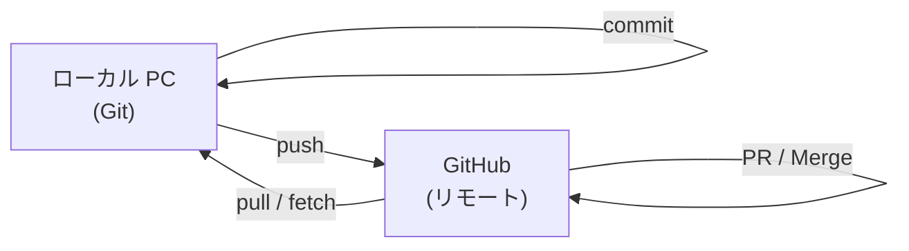
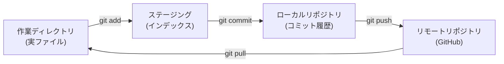
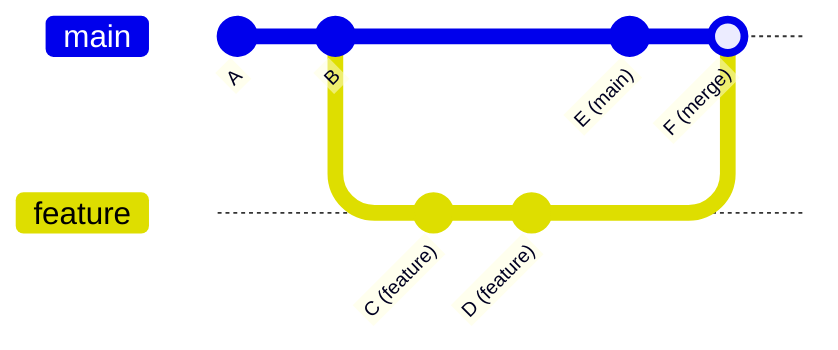
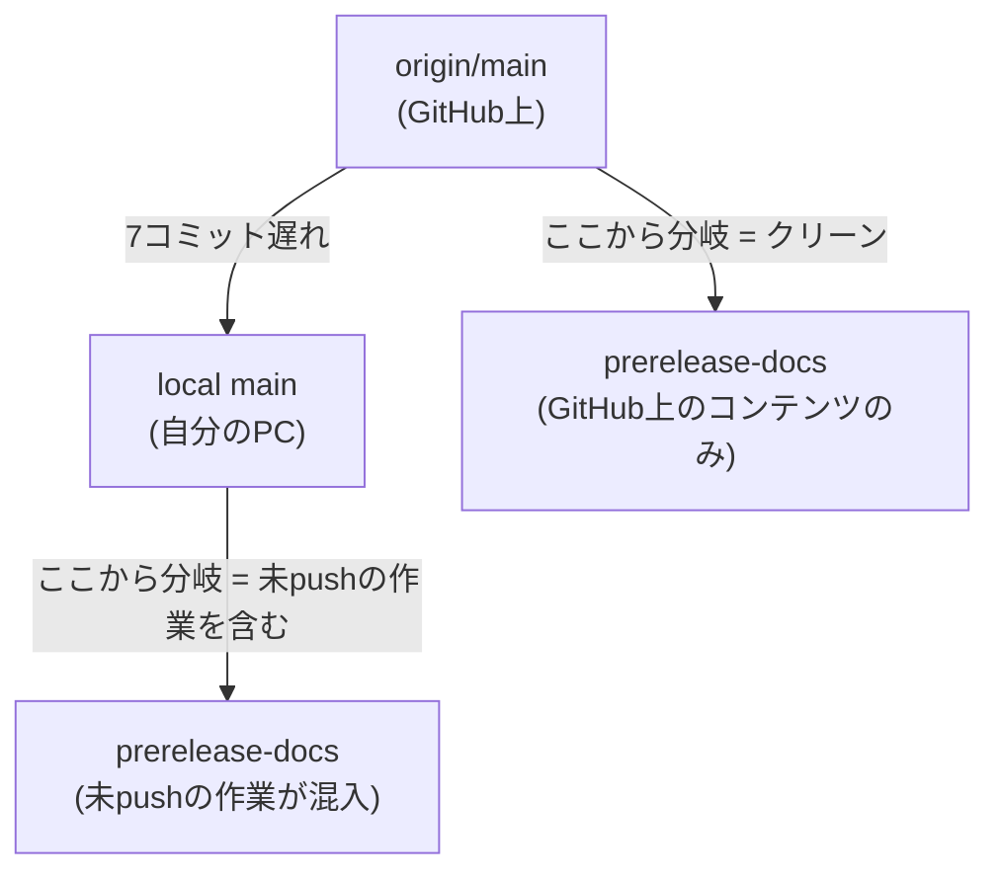
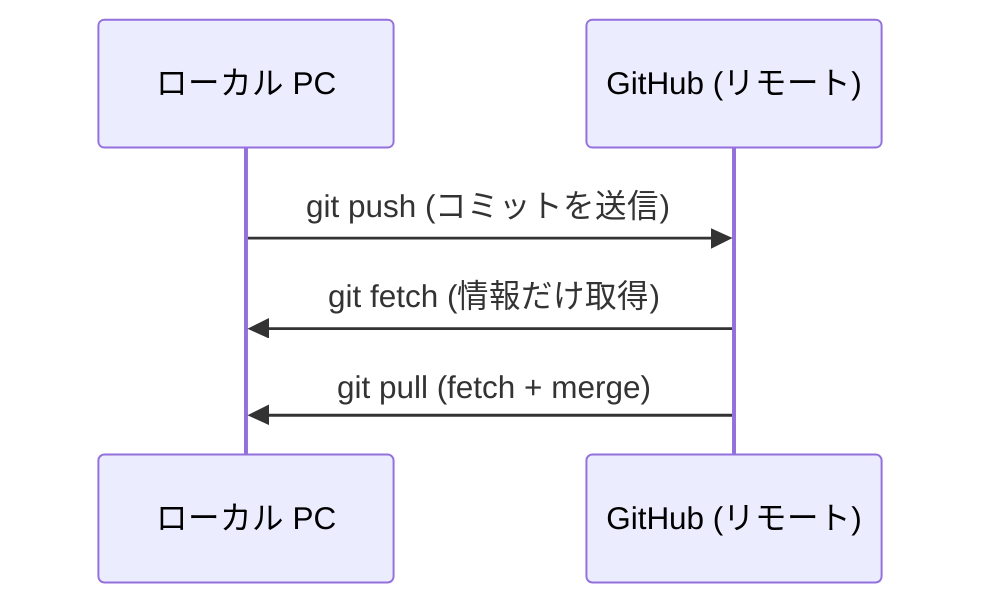
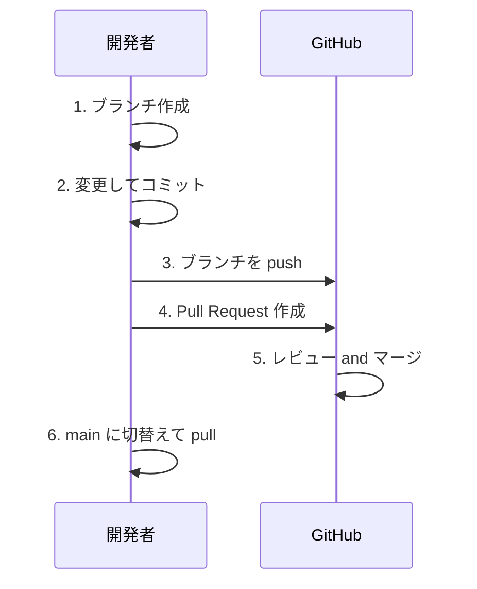
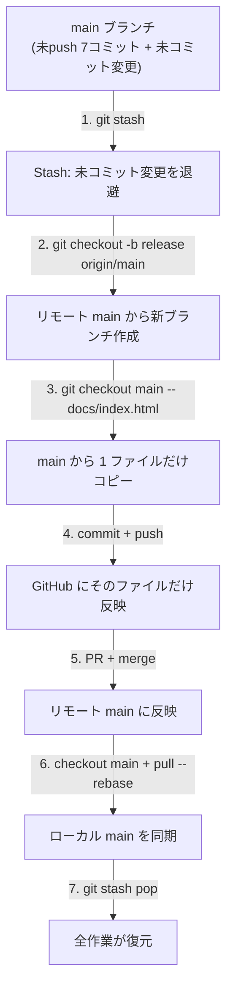

``````markdown
# Git / GitHub クイックマニュアル

GoodRelax GRSMD プロジェクト -- 実践リファレンス

---

## 1. 基本概念 (Git vs GitHub)

**Git と GitHub の関係:**



| 用語 | 意味 | たとえ |
|------|------|--------|
| **Git** | PC 上で動くバージョン管理ツール | ファイル履歴をローカルに保存する仕組み |
| **GitHub** | Git リポジトリのクラウドホスティング | コード版 Google Drive |
| **リポジトリ (repo)** | Git で管理されたプロジェクトフォルダ | プロジェクトのルート |
| **ローカル (local)** | 自分の PC 上のリポジトリ | 自分の作業場 |
| **リモート (origin)** | GitHub 上のリポジトリ | クラウドのバックアップ |

---

## 2. 主要な用語

### 2.1 スナップショットと履歴

| 用語 | 意味 |
|------|------|
| **commit (コミット)** | 変更のスナップショット。ゲームのセーブポイントのようなもの |
| **HEAD** | 現在のブランチの最新コミット |
| **hash (ハッシュ)** | コミットの一意な ID (例: `bc91870`) |
| **log (ログ)** | コミットの履歴 |

### 2.2 作業エリア

**Git の 3 つの領域:**



| 領域 | 説明 | GitHub Desktop での表示 |
|------|------|-------------------------|
| **作業ディレクトリ** | ディスク上の実際のファイル | Changes タブに変更が表示される |
| **ステージング (インデックス)** | 次のコミットに含めるファイル | Changes のチェックボックス ON |
| **ローカルリポジトリ** | PC 上のコミット履歴 | History タブ |
| **リモートリポジトリ** | GitHub 上のコピー | GitHub Web サイト |

### 2.3 ファイルの状態

| 状態 | 意味 | GitHub Desktop |
|------|------|----------------|
| **Untracked (未追跡)** | 新規ファイル。Git がまだ認識していない | 緑の `+` アイコン |
| **Modified (変更済み)** | 前回のコミットから変更された | 黄色のドット |
| **Staged (ステージ済み)** | 次のコミットに含める予定 | チェックボックス ON |
| **Committed (コミット済み)** | 履歴に保存済み | History タブに表示 |

---

## 3. ブランチ

### 3.1 ブランチとは

ブランチは**並行する開発ライン**。プロジェクトのコピーを作り、本流に影響を与えずに変更できる仕組み。

**ブランチの概念:**



| 用語 | 意味 |
|------|------|
| **main** | デフォルトの主ブランチ。本番コードが置かれる |
| **branch (ブランチ)** | コミットの列に付けた名前付きポインタ |
| **checkout (チェックアウト)** | 別のブランチに切り替える |
| **merge (マージ)** | あるブランチを別のブランチに統合する |
| **base (ベース)** | マージ先のブランチ (通常 main) |
| **compare (コンペア)** | マージ元のブランチ (自分の作業ブランチ) |

### 3.2 ブランチ命名規則

| パターン | 用途 | 例 |
|----------|------|-----|
| `feature/xxx` | 新機能 | `feature/code-view` |
| `fix/xxx` | バグ修正 | `fix/scroll-flicker` |
| `release/xxx` | リリース準備 | `release/v2.0` |
| `prerelease-xxx` | プレリリーステスト | `prerelease-docs` |

### 3.3 ブランチ操作 (GitHub Desktop)

| 操作 | GitHub Desktop | CLI |
|------|---------------|-----|
| ブランチ作成 | Branch > New branch | `git checkout -b name` |
| ブランチ切替 | ブランチドロップダウンで選択 | `git checkout name` |
| ブランチ削除 | Branch > Delete | `git branch -d name` |
| ブランチ公開 | Push origin (初回) | `git push -u origin name` |

### 3.4 重要: ブランチの起点 (base)

ブランチを作るとき、**どこから分岐するかが重要**:

- **local main から分岐** = ローカルの未 push コミットが全部含まれる
- **origin/main から分岐** = GitHub と同じクリーンな状態

**起点の違い:**



GitHub Desktop は常に **local main** から分岐する。**origin/main** から分岐するには CLI が必要:

**CLI コマンド:**

```bash
git checkout -b branch-name origin/main
```

これが今日ハマったポイント。

---

## 4. Stash (スタッシュ)

### 4.1 Stash とは

Stash = 未コミットの変更を一時的に**退避**する機能。机の上の書類を引き出しにしまうようなもの。

| 操作 | GitHub Desktop | CLI |
|------|---------------|-----|
| 退避 | Branch > Stash all changes | `git stash` |
| 復元 | Branch > Pop stash | `git stash pop` |
| 一覧表示 | (GUI では見えない) | `git stash list` |

### 4.2 Stash を使う場面

- ブランチ切替前 (未コミットの変更が衝突する場合)
- リモートの変更を pull する前
- 作業中の変更を一時的に脇に置きたいとき

### 4.3 Stash の注意点

- Stash は**ローカル専用** (GitHub には push されない)
- `pop` = 復元して stash を削除
- `apply` = 復元するが stash を残す (安全)
- 複数の stash はスタック構造 (LIFO: 後入れ先出し)

---

## 5. リモート操作

### 5.1 Push / Pull / Fetch

**リモート操作の流れ:**



| 操作 | 何をするか | 使う場面 |
|------|-----------|----------|
| **push** | ローカルのコミットを GitHub に送信 | コミット後、共有/バックアップしたいとき |
| **fetch** | リモートの情報をダウンロード (ファイルは変更しない) | GitHub に何か新しいものがあるか確認 |
| **pull** | fetch + リモートの変更をローカルにマージ | 他デバイスや他人の変更を取り込む |

### 5.2 Diverged (分岐) 状態

ローカルとリモートに異なるコミットがある場合:

```
origin/main:  A -- B -- X (誰かが X を push)
local main:   A -- B -- Y -- Z (自分が Y, Z をコミット)
```

これが **diverged (分岐)** 状態。解消方法:

| 方法 | 結果 | リスク |
|------|------|--------|
| `git pull` (マージ) | マージコミットが作られる | 安全だが履歴が複雑 |
| `git pull --rebase` | 自分のコミットをリモートの上に載せ替える | 履歴がきれいだがコンフリクトの可能性あり |

---

## 6. Pull Request (PR)

### 6.1 PR とは

Pull Request = GitHub 上であるブランチを別のブランチに**マージする提案**。マージ前にレビューできる仕組み。

**PR のワークフロー:**



### 6.2 GitHub Desktop での PR 作成手順

1. ブランチを push (Publish branch)
2. "Preview Pull Request" または "Create Pull Request" をクリック
3. ブラウザで GitHub の PR 作成ページが開く
4. **base** (マージ先) と **compare** (自分のブランチ) を設定
5. "Create pull request" をクリック
6. "Merge pull request" > "Confirm merge" をクリック

### 6.3 マージ方法

| 方法 | 結果 | 使う場面 |
|------|------|----------|
| **Merge commit** | 全コミット保持 + マージコミット追加 | デフォルト、安全 |
| **Squash and merge** | 全コミットを 1 つにまとめる | 履歴をきれいにしたい |
| **Rebase and merge** | コミットを直線的に並べ替える | 直線的な履歴にしたい |

---

## 7. コンフリクト解消

### 7.1 コンフリクトとは

**同じファイル**が**両方のブランチ**で変更された場合、Git は自動マージできない。どちらの変更を残すか手動で選ぶ必要がある。

### 7.2 コンフリクトマーカー

**コンフリクト例:**

```text
<<<<<<< HEAD
自分のローカルの変更
=======
リモートの変更
>>>>>>> origin/main
```

| マーカー | 意味 |
|----------|------|
| `<<<<<<< HEAD` | 自分の変更の開始 |
| `=======` | 区切り |
| `>>>>>>> origin/main` | リモートの変更の開始 |

### 7.3 解消方法 (CLI)

| コマンド | 意味 |
|----------|------|
| `git checkout --ours file` | 自分の変更を採用 |
| `git checkout --theirs file` | 相手の変更を採用 |
| 手動編集 | 両方から取捨選択 |
| `git rebase --abort` | rebase を中止して元に戻る |

---

## 8. GitHub Pages

### 8.1 GitHub Pages とは

GitHub リポジトリから無料で静的ウェブサイトをホスティングする仕組み。リポジトリがそのままウェブサイトになる。

### 8.2 設定

Settings > Pages > Source:

| 設定 | 意味 |
|------|------|
| **Branch** | デプロイするブランチ (通常 `main`) |
| **Folder** | 配信するフォルダ: `/` (root) または `/docs` |

### 8.3 GRSMD の現状設定

| 項目 | 値 |
|------|-----|
| Branch | `main` |
| Folder | `/` (root) |
| URL | `https://goodrelax.github.io/gr-simple-md-renderer/` |
| 配信ファイル | リポジトリ root の `index.html` (旧版) |

`/docs` フォルダに変更した場合:

| 項目 | 値 |
|------|-----|
| 配信ファイル | `docs/index.html` (Vite ビルド出力) |
| URL | 同じ (変更なし) |

> push 前に必ず GitHub Pages の配信元を確認すること。ユーザーが何を見ているか把握していないと事故になる。

---

## 9. よくあるシナリオ

### 9.1 1 ファイルだけ push したい (今日のケース)

**1 ファイル push の戦略:**



### 9.2 直前のコミットを取り消す (変更は残す)

```bash
git reset --soft HEAD~1
```

コミットを取り消すが、変更はステージングに残る。

### 9.3 未コミットの変更を全部捨てる

```bash
git checkout -- .
```

未コミットの変更を全て破棄する。**取り消し不可。極めて慎重に使うこと。**

### 9.4 ローカルとリモートの差分を確認

```bash
git log origin/main..HEAD --oneline
```

ローカルにあって GitHub にないコミットを表示する。

### 9.5 コミットが多すぎる場合の整理 (squash)

```bash
git rebase -i HEAD~N
```

`N` を整理したいコミット数に置き換える。エディタで `pick` を `squash` に変更して統合する。注意: 対話型エディタが必要。

---

## 10. GitHub Desktop vs CLI 対応表

| 操作 | GitHub Desktop | CLI |
|------|---------------|-----|
| 状態確認 | Changes タブ | `git status` |
| ステージング | チェックボックス ON | `git add file` |
| コミット | メッセージ入力 + Commit ボタン | `git commit -m "msg"` |
| プッシュ | Push origin ボタン | `git push` |
| プル | Fetch + Pull | `git pull` |
| ブランチ作成 | Branch > New branch | `git checkout -b name` |
| ブランチ切替 | ブランチドロップダウン | `git checkout name` |
| Stash | Branch > Stash all changes | `git stash` |
| Stash 復元 | Branch > Pop stash | `git stash pop` |
| 履歴表示 | History タブ | `git log --oneline` |
| PR 作成 | Branch > Create PR | `gh pr create` |

### 10.1 GUI だけでは出来ないこと

以下は GitHub Desktop では不可能。CLI を使う必要がある:

| 操作 | CLI コマンド |
|------|-------------|
| origin/main からブランチ作成 | `git checkout -b name origin/main` |
| 別ブランチからファイルをコピー | `git checkout branch -- file` |
| リベース | `git pull --rebase` |
| コンフリクト解消 (相手側採用) | `git checkout --theirs file` |
| リモートブランチ一覧 | `git branch -r` |
| コミット圧縮 | `git rebase -i HEAD~N` |

---

## 11. 安全ルール

1. **main に force push しない** (`git push --force` on main = 危険)
2. **ブランチ切替前に stash** (未コミット変更がある場合)
3. **push 前に pull** (コンフリクト回避)
4. **push 前に GitHub Pages の配信元を確認** -- ユーザーが何を見ているか把握する
5. **迷ったら聞く** -- 破壊的操作 (reset, clean, force) は実行前に確認
6. **コミットは頻繁に、push は慎重に** -- コミットはローカルで安全、push は公開

---

## 12. 用語集 (アルファベット順)

| 用語 | 日本語 | 意味 |
|------|--------|------|
| **branch** | ブランチ (枝) | 並行する開発ライン |
| **checkout** | チェックアウト (切替) | ブランチの切替やファイルの復元 |
| **clone** | クローン (複製) | GitHub からリポジトリを初回ダウンロード |
| **commit** | コミット (記録) | ステージ済み変更のスナップショットを保存 |
| **conflict** | コンフリクト (衝突) | 2 つのブランチが同じファイルを変更した状態 |
| **diff** | ディフ (差分) | 2 つの状態の差分 |
| **diverge** | ダイバージ (分岐) | ローカルとリモートに異なるコミットがある状態 |
| **fetch** | フェッチ (取得) | リモートの情報をダウンロード (マージしない) |
| **fork** | フォーク (分岐コピー) | 他人のリポジトリを自分のアカウントにコピー |
| **HEAD** | ヘッド (先頭) | コミット履歴の現在位置 |
| **merge** | マージ (統合) | 2 つのブランチを結合 |
| **origin** | オリジン (元) | リモート (GitHub) のデフォルト名 |
| **pull** | プル (引込み) | リモートから fetch + merge |
| **push** | プッシュ (送信) | ローカルのコミットをリモートに送信 |
| **rebase** | リベース (付替え) | コミットを別のブランチの先端に載せ替える |
| **remote** | リモート (遠隔) | サーバー上のリポジトリ (GitHub) |
| **repo** | リポジトリ (倉庫) | プロジェクトフォルダ |
| **squash** | スカッシュ (圧縮) | 複数のコミットを 1 つにまとめる |
| **stage** | ステージ (準備) | 次のコミットに含めるファイルを選択 |
| **stash** | スタッシュ (退避) | 未コミットの変更を一時的に退避 |
| **tag** | タグ (札) | 特定コミットに付ける名前 (例: v1.0) |
| **tracking** | トラッキング (追跡) | ローカルとリモートのブランチの紐付け |
| **upstream** | アップストリーム (上流) | ローカルブランチが追跡するリモートブランチ |
``````
