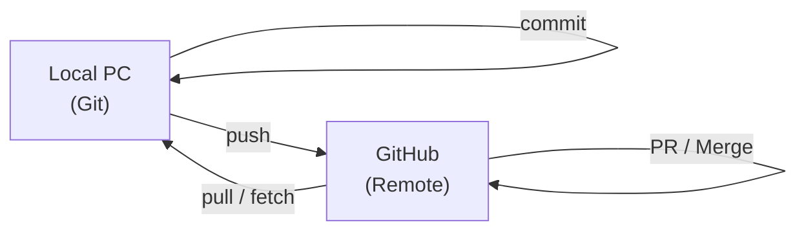
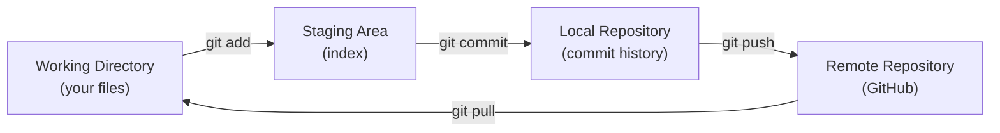
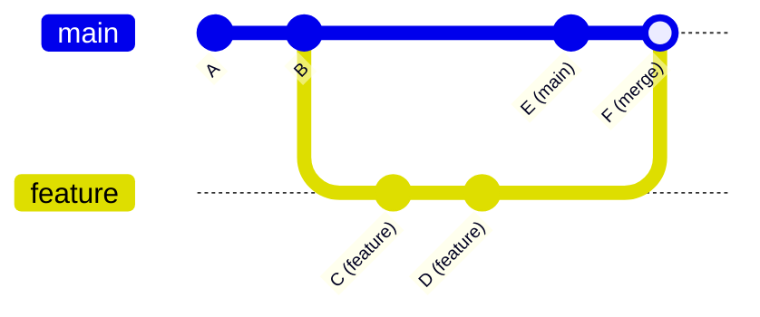
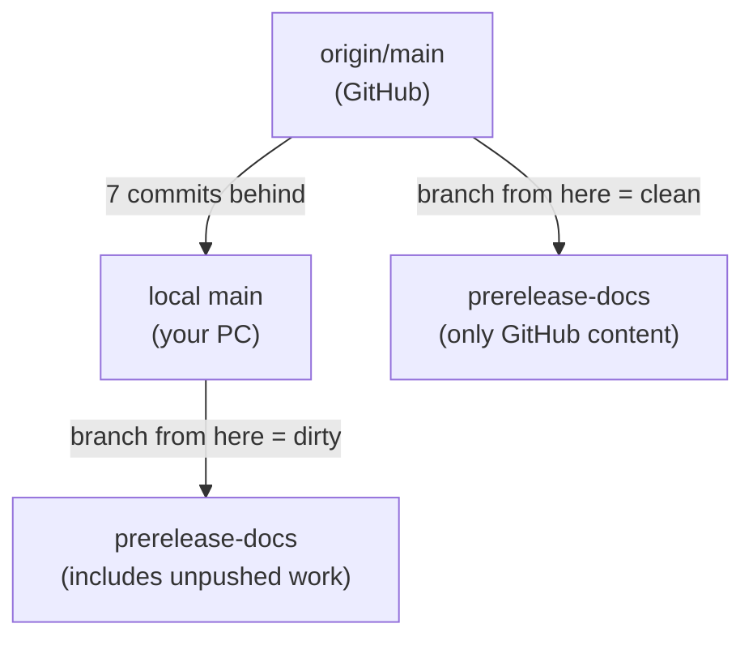
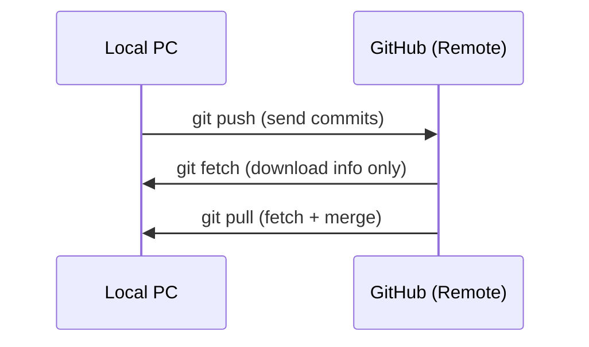
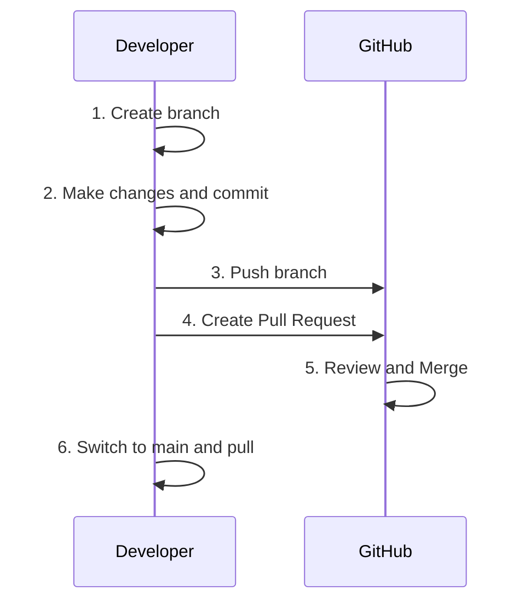
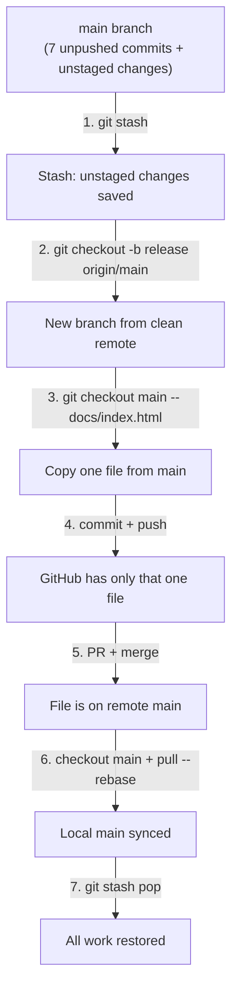

``````markdown
# Git / GitHub Quick Manual

GoodRelax GRSMD Project -- Practical Reference

---

## 1. Core Concepts (Git vs GitHub)

**Mermaid Diagram: Git vs GitHub:**



| Term | Meaning | Analogy |
|------|---------|---------|
| **Git** | Local version control tool on your PC | Save file history locally |
| **GitHub** | Cloud hosting for Git repositories | Google Drive for code |
| **Repository (repo)** | A project folder tracked by Git | The project root |
| **Local** | Your PC's copy of the repo | Your workspace |
| **Remote (origin)** | GitHub's copy of the repo | The cloud backup |

---

## 2. Key Terminology

### 2.1 Snapshots and History

| Term | Meaning |
|------|---------|
| **commit** | A snapshot of your changes. Like a checkpoint/save point |
| **HEAD** | The latest commit on your current branch |
| **hash** | The unique ID of a commit (e.g. `bc91870`) |
| **log** | History of commits |

### 2.2 Working Areas

**Mermaid Diagram: Three Areas of Git:**



| Area | Description | GitHub Desktop |
|------|-------------|----------------|
| **Working Directory** | Your actual files on disk | "Changes" tab shows modifications |
| **Staging Area (Index)** | Files selected for next commit | Checked files in "Changes" |
| **Local Repository** | Committed history on your PC | "History" tab |
| **Remote Repository** | GitHub's copy | GitHub website |

### 2.3 File States

| State | Meaning | GitHub Desktop |
|-------|---------|----------------|
| **Untracked** | New file, Git doesn't know about it | Green `+` icon |
| **Modified** | Changed since last commit | Yellow dot |
| **Staged** | Marked for next commit | Checkbox checked |
| **Committed** | Saved in history | Appears in History tab |

---

## 3. Branches

### 3.1 What Is a Branch?

A branch is a **parallel line of development**. Think of it as a copy of your project where you can make changes without affecting the original.

**Mermaid Diagram: Branch Concept:**



| Term | Meaning |
|------|---------|
| **main** | The default/primary branch. Production code lives here |
| **branch** | A named pointer to a line of commits |
| **checkout** | Switch to a different branch |
| **merge** | Combine one branch into another |
| **base** | The branch you are merging INTO (usually main) |
| **compare** | The branch you are merging FROM (your feature branch) |

### 3.2 Branch Naming Conventions

| Pattern | Use Case | Example |
|---------|----------|---------|
| `feature/xxx` | New feature | `feature/code-view` |
| `fix/xxx` | Bug fix | `fix/scroll-flicker` |
| `release/xxx` | Release preparation | `release/v2.0` |
| `prerelease-xxx` | Pre-release testing | `prerelease-docs` |

### 3.3 Branch Operations (GitHub Desktop)

| Operation | GitHub Desktop | CLI Equivalent |
|-----------|---------------|----------------|
| Create branch | Branch > New branch | `git checkout -b name` |
| Switch branch | Click branch dropdown > select | `git checkout name` |
| Delete branch | Branch > Delete | `git branch -d name` |
| Publish branch | Push origin (first time) | `git push -u origin name` |

### 3.4 Important: Branch Base

When creating a branch, **the base matters**:

- **Based on local main** = includes all local unpushed commits
- **Based on origin/main** = clean, matches what's on GitHub

**Mermaid Diagram: Branch Base Difference:**



GitHub Desktop always creates branches from **local main**. To branch from **origin/main**, use CLI:

**CLI Command:**

```bash
git checkout -b branch-name origin/main
```

This is exactly the situation we encountered today.

---

## 4. Stash

### 4.1 What Is Stash?

Stash = temporarily **shelve** uncommitted changes. Like putting papers in a drawer to clear your desk.

| Operation | GitHub Desktop | CLI |
|-----------|---------------|-----|
| Save stash | Branch > Stash all changes | `git stash` |
| Restore stash | Branch > Pop stash | `git stash pop` |
| View stash list | (not visible in GUI) | `git stash list` |

### 4.2 When to Use Stash

- Before switching branches (uncommitted changes would conflict)
- Before pulling remote changes
- To temporarily set aside work in progress

### 4.3 Stash Caution

- Stash is **local only** (not pushed to GitHub)
- `pop` applies AND deletes the stash
- `apply` applies but KEEPS the stash (safer)
- Multiple stashes stack (LIFO: last in, first out)

---

## 5. Remote Operations

### 5.1 Push / Pull / Fetch

**Mermaid Diagram: Remote Operations:**



| Operation | What It Does | When to Use |
|-----------|-------------|-------------|
| **push** | Send local commits to GitHub | After committing, to share/backup |
| **fetch** | Download remote info without changing local files | To check what's new on GitHub |
| **pull** | Fetch + merge remote changes into local | To sync with teammates/other devices |

### 5.2 Diverged State

When local and remote have different commits:

```
origin/main:  A -- B -- X (someone pushed X)
local main:   A -- B -- Y -- Z (you committed Y, Z)
```

This is a **diverged** state. Resolution options:

| Method | Result | Risk |
|--------|--------|------|
| `git pull` (merge) | Creates a merge commit | Safe but messy history |
| `git pull --rebase` | Replays your commits on top of remote | Clean history, may cause conflicts |

---

## 6. Pull Request (PR)

### 6.1 What Is a PR?

A Pull Request is a **proposal to merge** one branch into another on GitHub. It allows review before merging.

**Mermaid Diagram: PR Workflow:**



### 6.2 PR in GitHub Desktop

1. Push your branch (Publish branch)
2. Click "Preview Pull Request" or "Create Pull Request"
3. Browser opens GitHub PR creation page
4. Set **base** (where to merge into) and **compare** (your branch)
5. Click "Create pull request"
6. Click "Merge pull request" > "Confirm merge"

### 6.3 Merge Methods

| Method | Result | When to Use |
|--------|--------|-------------|
| **Merge commit** | Keeps all commits + adds merge commit | Default, safe |
| **Squash and merge** | Combines all commits into one | Clean history |
| **Rebase and merge** | Replays commits linearly | Linear history |

---

## 7. Conflict Resolution

### 7.1 What Is a Conflict?

When the **same file** is changed in **both branches**, Git cannot automatically merge. You must manually choose which version to keep.

### 7.2 Conflict Markers

**Conflict Example:**

```text
<<<<<<< HEAD
Your local change
=======
Remote change
>>>>>>> origin/main
```

| Marker | Meaning |
|--------|---------|
| `<<<<<<< HEAD` | Start of YOUR changes |
| `=======` | Separator |
| `>>>>>>> origin/main` | Start of REMOTE changes |

### 7.3 Resolution Options (CLI)

| Command | Meaning |
|---------|---------|
| `git checkout --ours file` | Keep YOUR version |
| `git checkout --theirs file` | Keep THEIR version |
| Edit manually | Pick and choose from both |
| `git rebase --abort` | Cancel rebase, go back to before |

---

## 8. GitHub Pages

### 8.1 What Is GitHub Pages?

Free static website hosting from a GitHub repository. Your repo becomes a website.

### 8.2 Configuration

Settings > Pages > Source:

| Setting | Meaning |
|---------|---------|
| **Branch** | Which branch to deploy (usually `main`) |
| **Folder** | Which folder to serve: `/` (root) or `/docs` |

### 8.3 GRSMD Current Setup

| Item | Value |
|------|-------|
| Branch | `main` |
| Folder | `/` (root) |
| URL | `https://goodrelax.github.io/gr-simple-md-renderer/` |
| Served file | `index.html` at repo root (legacy) |

When we change to `/docs` folder:

| Item | Value |
|------|-------|
| Served file | `docs/index.html` (Vite build output) |
| URL | Same as above (unchanged) |

---

## 9. Common Scenarios

### 9.1 Push Only One File (Today's Case)

**Mermaid Diagram: Push One File Strategy:**



### 9.2 Undo Last Commit (Keep Changes)

```bash
git reset --soft HEAD~1
```

This undoes the commit but keeps all changes staged.

### 9.3 Discard All Uncommitted Changes

```bash
git checkout -- .
```

This throws away ALL uncommitted changes. Use with extreme caution.

### 9.4 Check What's Different Between Local and Remote

```bash
git log origin/main..HEAD --oneline
```

Shows commits that exist locally but not on GitHub.

### 9.5 Clean Up Too Many Commits (Squash)

```bash
git rebase -i HEAD~N
```

Replace `N` with the number of commits to squash. In the editor, change `pick` to `squash` for commits to combine. Note: requires interactive editor (not available in all CLI environments).

---

## 10. GitHub Desktop vs CLI Quick Reference

| Task | GitHub Desktop | CLI |
|------|---------------|-----|
| See status | Changes tab | `git status` |
| Stage file | Check the checkbox | `git add file` |
| Commit | Write message + Commit button | `git commit -m "msg"` |
| Push | Push origin button | `git push` |
| Pull | Fetch + Pull | `git pull` |
| Create branch | Branch > New branch | `git checkout -b name` |
| Switch branch | Branch dropdown | `git checkout name` |
| Stash | Branch > Stash all changes | `git stash` |
| Pop stash | Branch > Pop stash | `git stash pop` |
| View history | History tab | `git log --oneline` |
| Create PR | Branch > Create PR | `gh pr create` |

### 10.1 When GUI Is Not Enough

GitHub Desktop cannot do these. Use CLI:

| Task | CLI Command |
|------|-------------|
| Branch from origin/main | `git checkout -b name origin/main` |
| Copy file from another branch | `git checkout branch -- file` |
| Rebase | `git pull --rebase` |
| Resolve conflict (theirs) | `git checkout --theirs file` |
| View remote branches | `git branch -r` |
| Squash commits | `git rebase -i HEAD~N` |

---

## 11. Safety Rules

1. **Never force push to main** (`git push --force` on main = danger)
2. **Stash before branch switch** if you have uncommitted changes
3. **Pull before push** to avoid conflicts
4. **Check GitHub Pages source** before pushing -- know what users see
5. **When in doubt, ask** before destructive operations (reset, clean, force)
6. **Commit often, push carefully** -- commits are local and safe; push is public

---

## 12. Glossary (Alphabetical)

| Term | Japanese Hint | Definition |
|------|---------------|------------|
| **branch** | 枝 | Parallel line of development |
| **checkout** | 切り替え | Switch to a branch or restore files |
| **clone** | 複製 | Download a repo from GitHub for the first time |
| **commit** | 記録 | Save a snapshot of staged changes |
| **conflict** | 衝突 | Two branches changed the same file |
| **diff** | 差分 | The difference between two states |
| **diverge** | 分岐 | Local and remote have different commits |
| **fetch** | 取得 | Download remote info without merging |
| **fork** | 分岐コピー | Copy someone else's repo to your account |
| **HEAD** | 先頭 | Current position in commit history |
| **merge** | 統合 | Combine two branches |
| **origin** | 元 | Default name for the remote (GitHub) |
| **pull** | 引き込み | Fetch + merge from remote |
| **push** | 送信 | Send local commits to remote |
| **rebase** | 付け替え | Replay commits on top of another branch |
| **remote** | 遠隔 | Server copy of the repo (GitHub) |
| **repo** | 倉庫 | Repository; the project folder |
| **squash** | 圧縮 | Combine multiple commits into one |
| **stage** | 準備 | Mark a file for the next commit |
| **stash** | 退避 | Temporarily shelve uncommitted changes |
| **tag** | 札 | A named reference to a specific commit (e.g. v1.0) |
| **tracking** | 追跡 | Link between local and remote branch |
| **upstream** | 上流 | The remote branch your local branch tracks |
``````
