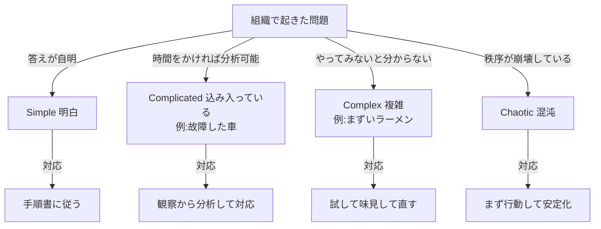
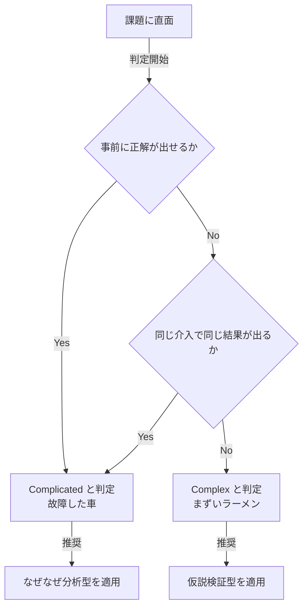
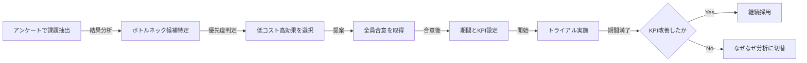
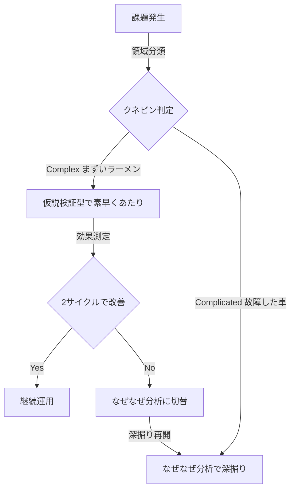

# 組織課題はどちらの「複雑」か?

## —「故障した車」と「まずいラーメン」で考える、なぜなぜ信仰の問い直し

---

## 3行まとめ

- ビジネスの「複雑な問題」を解決したい——だが実は、「複雑」には2種類ある。**Complicated(故障車型)**=原因を1つ突き止めれば直る問題と、**Complex(まずいラーメン型)**=全体のバランスの問題で、やってみないと分からない問題だ。
- 定番の**なぜなぜ分析は、Complicated(故障車型)にしか効かない**。だが**組織・人間関係の問題はたいてい Complex(まずいラーメン型)で、原因を分析しきってから動くやり方は、犯人探しや分析麻痺を生む**。
- だから **Complex 型の存在を理解し、味見しながら直す(仮説検証)を主に、効かなければなぜなぜへ切り替えるハイブリッド**で解く。これが現実的な道だ。

---

## 1.「複雑な問題」には2種類ある

「チームがうまくいかない」「なぜか成果が出ない」「メンバーが受け身」——こうした厄介な問題を、私たちはまとめて「複雑な問題」と呼ぶ。そして複雑だからこそ、原因をしっかり分析してから手を打とうとする。

ところが、ここに大きな落とし穴がある。**実は「複雑」には、性質のまったく違う2種類があるのだ。** 英語では別の単語で呼び分けるのに、日本語ではどちらも「複雑」と訳してしまうため、ごちゃ混ぜにされている。

- **Complicated(込み入っている)=「故障した車」型** — 原因を1つ突き止めれば直る
- **Complex(複雑)=「まずいラーメン」型** — 全体のバランスの問題で、やってみないと分からない

この2つを、具体的な場面で掴んでほしい。

### 故障した車 — Complicated

夜、車のエンジンがかからない。整備工場に持ち込むと、整備士はボンネットを開け、配線をたどり、テスターを当て、こう言う。「ここのヒューズが飛んでますね」。ネジ1本、ヒューズ1個——どこかの部品が**具体的に**壊れている。替えれば直る。**原因は1つ、直し方も1つ。**

### まずいラーメン — Complex

一方、開店したばかりのラーメン屋。「なんか、まずい」。でも、どこが悪いのか一言では言えない。塩か、しょうゆか、出汁か、麺か——どれか1つが「壊れている」わけではない。塩を強くすれば出汁がぼやけ、麺を替えればスープとの絡みが変わる。**全体のバランスの問題**だ。直す方法は「味見して、少し直して、また味見する」しかない。

### あなたの問題は、どっちか?

製造ラインの不良品や、コードのバグは「故障した車」型でいい。原因を特定して対策する、で解ける。では「チームの雰囲気が悪い」「なぜか成果が出ない」は? これは「まずいラーメン」型だ。原因を1つには切り出せない。

ここに、この資料の出発点がある。定番の解決法である**なぜなぜ分析(5回のなぜ)は、「故障した車」型にしか効かない。** なのに私たちは、ラーメン型の問題にまで「原因を1つ突き止めて直す」やり方で挑み、犯人探しや分析麻痺に陥ってしまう。

> だからまず、目の前の問題が「故障した車」か「まずいラーメン」かを見分ける。そして——**車型にはなぜなぜ分析を、ラーメン型には味見のやり方(仮説検証)を。両方を使い分ける(ハイブリッド)。** これがこの資料の主張だ。前提知識は不要。

**問い:今のチームでは、どんな問題が起きても「まず原因探し(なぜなぜ分析)」になっていないか?**

---

## 2. Cynefin(クネビン)— 問題を4領域に分ける

第1章で見た **Complicated(故障した車)** と **Complex(まずいラーメン)** は、もっと大きな地図の一部だ。その地図が Cynefin。Dave Snowden が提唱した、問題を性質で4つに分類するフレームワークで、「問題には種類があり、種類ごとに正しい対処法が違う」という考え方である。

**図1:クネビンの4領域と推奨アプローチ:**

**表1:4領域の性質と対処:**

| 領域                       | 性質                     | 例                                                                   | 対処法                     |
| -------------------------- | ------------------------ | -------------------------------------------------------------------- | -------------------------- |
| Simple 明白                | 答えが既知               | 経費精算ミス、手順違反                                               | ベストプラクティスを適用   |
| Complicated 込み入っている | 分析で解ける             | **故障した車**、エンジン不調、税務申告、複雑なバグ                   | 専門家が分析し設計する     |
| Complex 複雑               | 事後にしか因果が見えない | **まずいラーメン**、チームの士気、新製品ヒット予測、組織文化、子育て | 小さく試して反応を見る     |
| Chaotic 混沌               | 秩序崩壊・緊急事態       | 事故対応、システム全停止                                             | まず応急行動、安定後に分析 |

**つまり:** 問題を一色で塗るのは危険。まず「これは車か、ラーメンか」を判定する。

**問い:今の問題は、本当に「分析すれば解ける(故障した車)」問題か? それとも「やってみないと分からない(まずいラーメン)」問題ではないか?**

---

## 3. Complicated と Complex — 2つの「複雑」

日本語ではどちらも「複雑」と訳されてしまうが、中身はまったく別物だ。ここを掴むことがこの資料の心臓部。さっきの2つの場面で考えよう。

### 「故障した車」= Complicated(込み入っている)

車は部品の集まりだ。壊れたら、どこかの部品が**具体的に**壊れている。整備士は順番に切り分けていけば、必ず原因にたどり着く。

- **原因は「もう存在している」** — あなたが調べる前から、ヒューズはすでに飛んでいる。あとは探し出すだけ。
- **因果が一本道** — エンジンがかからない ← 燃料が来ない ← ポンプが止まっている ← ヒューズが飛んだ。「なぜ?」を遡れば根本にたどり着く。
- **再現する** — 同じ壊れ方なら、同じ直し方。誰がやっても同じ結果。
- **調べても車は変わらない** — 分解して観察しても、車が「気を悪くして」別の壊れ方をしたりはしない。
- **だから専門家が強い** — 整備士の知識と経験が、そのまま答えになる。

これはまさに、**なぜなぜ分析**が輝く場所だ。「なぜ?」を5回繰り返してネジ1本・ヒューズ1個にたどり着く——トヨタの現場が磨き上げた、強力なやり方。

### 「まずいラーメン」= Complex(複雑)

ラーメンが「まずい」とき、壊れた部品はない。あるのは**バランスの崩れ**だ。

- **「まずい」原因を1つに切り出せない** — 塩・しょうゆ・出汁・麺・脂・温度・茹で時間、すべての絡み合い。「出汁の質が悪いせい」に見えても、出汁だけ替えると今度は塩が立ちすぎる。
- **「うまさ」は創発する(組み合わさって初めて生まれる)** — どの部品にも単体では「うまさ」は入っていない。混ざり合って初めて立ち上がる。だから分解したら消える。
- **やってみないと分からない** — 完璧な一杯を、頭の中の計算だけで出すことはできない。**味見して、直して、また味見する**しかない。
- **同じことをしても結果が違う** — 同じレシピでも、その日の湿度、食べる人、組み合わせる具で「うまさ」は変わる。
- **名人でも「分析」だけでは解けない** — 名店の店主は「まずさの根本原因」を5回なぜなぜ分析したりしない。味を見て、少し動かして、また見る。これを延々と繰り返す。

そして気づいてほしい——**この「味見して直して、また味見する」こそ、仮説検証(小さく試して観察して応答する)そのものだ。**

### 2つを並べる

**表2:Complicated と Complex の違い:**

| 観点           | Complicated「故障した車」    | Complex「まずいラーメン」        |
| -------------- | ---------------------------- | -------------------------------- |
| ひとことで     | 分析すれば分かる             | やってみないと分からない         |
| 因果関係       | 一本道でたどれる             | 絡み合い、事後にしか見えない     |
| 原因の在りか   | 調べる前から存在する         | 手を加えて初めて立ち上がる       |
| 再現性         | あり(同じ入力→同じ出力)      | なし(同じことをしても結果が違う) |
| 専門家の有効性 | 非常に有効(整備士)           | 限定的(名人でも味見する)         |
| 正解           | 存在する(Good Practice)      | 創発する(Emergent Practice)      |
| 直し方         | 原因を特定して部品を替える   | 味見して少しずつ調整する         |
| 昔ながらの比喩 | 時計(分解して組み立て直せる) | 生態系(分解したら死ぬ)           |
| 仕事での典型例 | 故障、バグ、税務、財務分析   | チーム運営、市場、子育て、文化   |

**見分ける問い:腕のいい専門家に十分な時間を与えれば、手を付ける前に答えを出せるか?**

- Yes → Complicated(故障した車)
- No → Complex(まずいラーメン)

**問い:チーム業務の不調は、「故障した車」か、それとも「まずいラーメン」か?**
大半は後者だ。人の相互作用、感情、これまでの経緯、外部環境が絡み合い、同じ施策を打っても毎回違う結果が出る。まさにラーメンのバランスと同じである。

---

## 4. なぜこの区別が重要か

**「まずいラーメン」に「故障した車」のやり方を使うと、失敗する。** 典型的な失敗パターンを3つ挙げる。

### 4.1 分析麻痺 — いつまでも味見しない

「真の原因が分かるまで動けない」と調査を続ける。だが「まずいラーメン」に単一の真因はない。出汁を疑い、塩を疑い、麺を疑い……机上で原因を探している間に、客は帰ってしまう。Complex では「これが原因だ」と確定する前に、**まず一口味見する(小さく試す)**ほうが早い。

### 4.2 犯人探し — ラーメンを「壊れた部品」扱いする

「故障した車」なら、犯人(壊れた部品)を名指しして交換すればいい。部品は傷つかない。だが同じ発想を**人**に向けると——「なぜあなたは〜」が連鎖し、特定の個人が「壊れた部品」として名指しされる。実際にはラーメンのバランス問題、つまり**構造の問題**なのに、人を犯人にしてしまう。直る効果より、心理的安全性が壊れる副作用のほうが大きい。

### 4.3 効かない「根本対策」 — 出汁だけ高級品に替える

「出汁が原因だ」と1点に絞り、高い出汁に総入れ替え——ところが今度は塩との**バランス**が崩れて、かえってまずくなる。Complex では1つをいじると全体が動く。根本原因を1つに絞った大規模対策ほど、外れやすい。介入そのものが系を変えてしまうからだ。

**問い:過去の改善施策で、「ちゃんと分析したのに効かなかった」経験はないか?** あるなら、それは「まずいラーメン」を「故障した車」と取り違えていた可能性が高い。

---

## 5. 2つのアプローチ —「整備士」か「料理人」か

### 5.1 なぜなぜ分析(整備士のやり方)

- **出自:** トヨタ生産方式、大野耐一
- **手順:**「なぜ?」を5回繰り返して根本原因(壊れた部品)に到達する
- **得意:**「故障した車」型——物理的・機械的・再現性のある問題
- **思想:** 原因を特定してから直す

### 5.2 仮説検証型(料理人のやり方)

- **出自:** Lean Startup(Eric Ries)、制約理論(Eliyahu Goldratt)、クネビン
- **手順:** あたりを付ける → 少し変えてみる → 味見(計測) → 学ぶ → 次の一手
- **得意:**「まずいラーメン」型——人間系・組織系・市場系の問題
- **思想:** 動きながら(味見しながら)学ぶ

**表3:2つのアプローチの比較:**

| 観点         | なぜなぜ分析(整備士)      | 仮説検証型(料理人)          |
| ------------ | ------------------------- | --------------------------- |
| 適合する問題 | Complicated(故障した車)   | Complex(まずいラーメン)     |
| 起点         | 「壊れているのはどこか?」 | 「何を味見すれば分かるか?」 |
| 速度         | 遅い(数日〜数週)          | 速い(数時間〜数日)          |
| 実施コスト   | 高(深掘りに工数)          | 低(アンケート+小さな試行)   |
| 採用する手法 | 「観察→分析→対応」方式    | 「試行→観察→対応」方式      |
| 心理的副作用 | 犯人探しになりやすい      | 参加感・合意が作りやすい    |
| 失敗モード   | 誤った根本原因に固執      | 表層対策で終わる            |
| 再発防止力   | 強い(うまくいけば)        | 弱い(症状対処寄り)          |

**注:** 「観察→分析→対応」方式 = Sense-Analyze-Respond / 「試行→観察→対応」方式 = Probe-Sense-Respond。出典:Snowden & Boone "A Leader's Framework for Decision Making"(2007)。

**問い:今のチームは、すべての問題を整備士のやり方で処理していないか?** **道具箱にハンマーしか入っていなければ、すべてが釘に見える**。

---

## 6. 使い分け判定

**図2:判定フロー:**

2問とも No なら Complex(まずいラーメン)。チーム運営系の問題は、ほぼこちらに落ちる。

---

## 7. 仮説検証型の実践設計

Complex 領域で使う仮説検証型は、雑に運用すると「やった感」だけで終わる。以下の5原則で精度を担保する。

### 7.1 五つの原則

1. **あたりをつける** — あるあるパターン集やアンケートでボトルネック候補を抽出(**付録A 参照**)
2. **実施コスト低・効果高から** — 最小の投資で最大の学びを取りに行く
3. **(ほぼ)全員同意** — 合意なき施策は形骸化する。無記名で同意を取ると精度が上がる
4. **トライアル期間を区切る** — 「いつ止めるか」を先に決める。決めないと撤退できない
5. **KPI を定めて定期観察** — 先行指標(1on1実施率、発言分布など)と遅行指標(成果、離職率など)の両方を置く

### 7.2 実践ステップ

**図3:仮説検証型の実行ループ(味見して直すループ):**

### 7.3 切替基準を先に決めておく

仮説検証型の弱点は、症状対処で終わる可能性があること。これを防ぐため、**「2サイクル回して KPI が改善しなければ、なぜなぜ分析に切り替える」といった撤退基準を最初に明文化する**。味見をいくら繰り返してもまずいままなら、いったん厨房の設備(構造)を疑う、ということだ。

**問い:撤退基準のない施策を走らせていないか?**

---

## 8. 注意点と限界

### 8.1 仮説検証型(料理人)の落とし穴

- **アンケート設計が結果を支配する**:選択肢の粒度と言葉で結論が変わる。可能なら妥当化済みの既存サーベイを最低1つ混ぜる(Google の Project Aristotle、Lencioni『5つの機能不全』由来の診断など)
- **パターン集が偏ると当てはめも偏る**:網羅性のあるチェックリストや学術フレームで補強する
- **介入そのものが系を変える**:厳密な効果測定(対照群との比較など)は困難。そこは割り切る

### 8.2 なぜなぜ分析(整備士)の落とし穴

- **人に向けると犯人探しになる**:「なぜ彼は〜」ではなく「なぜこの仕組みは〜」と構造に向ける
- **Complex 領域では真因が収束しない**:5回 Why を繰り返しても、別の要因が次々顔を出す(まずさの原因が出汁→塩→麺と移っていく)
- **結論が分析者のバイアスに寄る**:深掘りの方向は分析者の仮説に依存する

### 8.3 共通の落とし穴

- **やった満足で終わる**:KPI を置かないと改善実感だけで判断してしまう
- **振り返りがない**:どちらの手法も、施策後のレトロ(振り返り)がないと学習が蓄積しない

---

## 9. 提案:ハイブリッド運用

どちらか一方ではない。**順番と切替基準**を決めて両方使う。料理人として味見で素早くあたりをつけ、それでも直らなければ整備士として構造を分解する。

**図4:ハイブリッド運用のフロー:**

**最終的な問いかけ:**

- 今のチームは、問題を「故障した車」と「まずいラーメン」に仕分けているか、それとも全部「なぜなぜ」で処理していないか?
- 現在進行中の改善施策に、トライアル期間と KPI と撤退基準はあるか?
- メンバーは施策に「(ほぼ)全員同意」しているか、それとも声の大きい人に押されているか?

整備士の工具箱だけでは、ラーメンは作れない。道具はなぜなぜ分析だけで良いのか?——この問いを、本日の出発点にしたい。

---

## 参考文献

- Dave Snowden & Mary Boone "A Leader's Framework for Decision Making" Harvard Business Review(2007)— クネビンの定式化
- Eric Ries "The Lean Startup"(2011)— Build-Measure-Learn ループ
- Eliyahu Goldratt "The Goal"(1984)— 制約理論、ボトルネック集中攻撃
- 大野耐一『トヨタ生産方式』(1978)— なぜなぜ分析の原典
- John Kotter "Leading Change"(1996)— Quick Wins で勢いをつける変革論
- Patrick Lencioni "The Five Dysfunctions of a Team"(2002)— チーム機能不全モデル
- Amy Edmondson "The Fearless Organization"(2018)— 心理的安全性
- Google re:Work "Project Aristotle"(Web公開資料)— 効果的チームの5要素

---

## 付録A:組織課題のあるあるパターンと対策

本表は仮説検証型の「あたりをつける」段階で使うチェックリスト。自チームに当てはまるものをアンケートで抽出し、低コスト高効果の対策から試行する。関連用語は付録Bを参照。

**表A1:8カテゴリの組織課題と対策:**

| カテゴリ                         | あるあるパターン                                                             | 低コスト対策                                                                   | 関連用語                                                                                        |
| -------------------------------- | ---------------------------------------------------------------------------- | ------------------------------------------------------------------------------ | ----------------------------------------------------------------------------------------------- |
| 目標・方向性                     | ゴールが曖昧、優先順位不明、成功基準が未定義、四半期ごとに方針がブレる       | キックオフで合意形成、SMART 目標設定、優先順位リストを壁に貼る、四半期レビュー | SMART、OKR                                                                                      |
| 役割・責任                       | 誰がやるか不明、責任のなすりつけ、スキルとタスクのミスマッチ、兼務過多       | RACI 図の作成、タスクごとにオーナー1名を明示、スキルマップ作成                 | RACI、DACI                                                                                      |
| コミュニケーション               | 情報サイロ化、心理的安全性の欠如、会議過多/不足、フィードバックがない        | 情報共有ルール策定、週次1on1、レトロスペクティブ導入、意思決定のドキュメント化 | 心理的安全性、1on1、レトロスペクティブ                                                          |
| リーダーシップ・意思決定         | 決断が遅い、マイクロマネジメント、意思決定プロセスが不透明、責任者不明       | DACI で決定権を明示、期限付き決定、権限委譲のルール化                          | DACI、権限委譲                                                                                  |
| プロセス・進捗管理               | 進捗が不可視、優先順位がつけられない、ボトルネック放置、手戻り多発           | カンバン導入、WIP 制限、定期レビュー、ポストモーテム                           | カンバン、WIP制限、ポストモーテム                                                               |
| モチベーション・エンゲージメント | 社会的手抜き、評価不公平感、燃え尽き、目的意識の欠如                         | 個人貢献の可視化、公正な評価基準、休息設計、パーパス共有、チームサイズ見直し   | 社会的手抜き、リンゲルマン効果、パーパス共有、2枚のピザ                                         |
| 集団心理バイアス                 | 同調圧力で反対意見が出ない、全員反対なのに進む、外部案の拒絶、誰も指摘しない | 悪魔の代弁者を指名、匿名インプット、プレモーテム、外部視点の導入               | グループシンク、アビリーンのパラドックス、NIH症候群、悪魔の代弁者、プレモーテム、匿名インプット |
| 外部環境・リソース               | 予算/時間/人員不足、経営支援の欠如、他部署連携不足、仕様変更の頻発           | バッファ確保、スポンサー確保、関係者マップ作成、変更管理プロセス               | ステークホルダーマネジメント                                                                    |

**使い方:**

- アンケートで「自チームに当てはまるパターン」を無記名で投票させる
- 得票上位のパターンを2〜3個選び、対応する「低コスト対策」から1つ選んで試行
- トライアル期間(例:1ヶ月)と KPI を事前に定めて開始
- 期間終了後、KPI 改善を確認。改善なければ別パターンへ、または本編9章のなぜなぜ分析へ切替

**問い:この表のパターン、今のチームにいくつ当てはまるか?**

---

## 付録B:用語一覧

**目標・計画系:**

- **SMART** — Specific/Measurable/Achievable/Relevant/Time-bound。目標設定の5原則
- **OKR** — Objectives and Key Results。野心的な目標(O)と測定可能な成果指標(KR)で運用する目標管理手法
- **Quick Wins** — 短期間で達成できる小さな成功。変革の勢いをつける(John Kotter)
- **Build-Measure-Learn** — Lean Startup のループ。作る→測る→学ぶ(Eric Ries)
- **制約理論** — 全体の処理能力はボトルネックで決まるという理論(Goldratt)

**役割・意思決定系:**

- **RACI** — Responsible/Accountable/Consulted/Informed。タスクごとの役割を4種類で整理する表
- **DACI** — Driver/Approver/Contributors/Informed。意思決定の役割を4種類で明確化するフレーム
- **権限委譲** — 上位者の決定権を下位者に移すこと。意思決定速度を上げる

**プロセス・運営系:**

- **カンバン** — タスクの状態(To Do/Doing/Done)を可視化し、流れを管理する手法
- **WIP制限** — Work In Progress 制限。同時進行タスク数に上限を設け、完了率向上を狙う
- **2枚のピザ** — Amazon 発。チームは「ピザ2枚で足りる人数(6〜8人)」までとする原則
- **レトロスペクティブ** — 一定期間の活動を振り返り改善点を共有する会。アジャイル用語、略してレトロ
- **1on1** — 上司と部下の定期的な1対1面談。成長支援とフィードバックが目的

**チーム心理系:**

- **心理的安全性** — 対人リスクを取っても罰されないと信じられるチームの状態(Amy Edmondson)
- **パーパス共有** — 組織や仕事の存在意義(Purpose)を言語化し、メンバーで共有すること
- **社会的手抜き** — 集団で作業すると個人の責任感が薄れ本気を出さなくなる現象
- **リンゲルマン効果** — 集団の人数が増えるほど1人あたりの貢献度が減る現象。社会的手抜きの原因

**集団心理バイアス系:**

- **グループシンク** — 集団浅慮。調和を優先するあまり批判的思考や代替案検討が抑制される状態(Irving Janis)
- **アビリーンのパラドックス** — 全員が内心反対なのに誰も言い出さず集団の決定に従う現象(Jerry Harvey)
- **NIH症候群** — Not Invented Here。外部で作られたものを排除し自前にこだわる組織病理
- **悪魔の代弁者** — Devil's Advocate。議論で意図的に反対意見を出す役を設ける技法。多数派バイアス対策
- **匿名インプット** — 発言者を特定せずに意見を集める方法。社会的望ましさバイアスや同調圧力を回避

**振り返り系:**

- **モーテム** — Post-mortem(死後分析)の語幹。事後または事前の振り返り行為を指す総称
- **プレモーテム** — 施策開始前に「失敗したと仮定して原因を議論する」手法(Gary Klein)
- **ポストモーテム** — 障害や失敗の後に原因と教訓を分析する会。IT・医療分野で普及
- **ブレームレス** — Blameless。個人を責めず構造と仕組みの改善に焦点を当てる姿勢

**関係者調整系:**

- **ステークホルダーマネジメント** — 施策の影響を受ける関係者を特定し、期待管理と調整を行うこと
