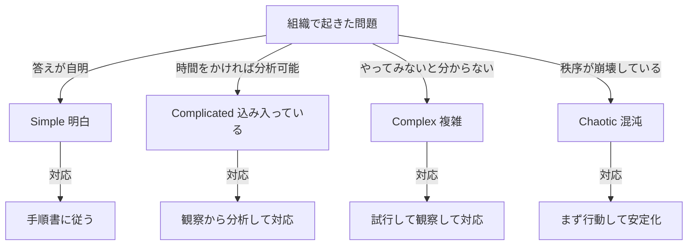
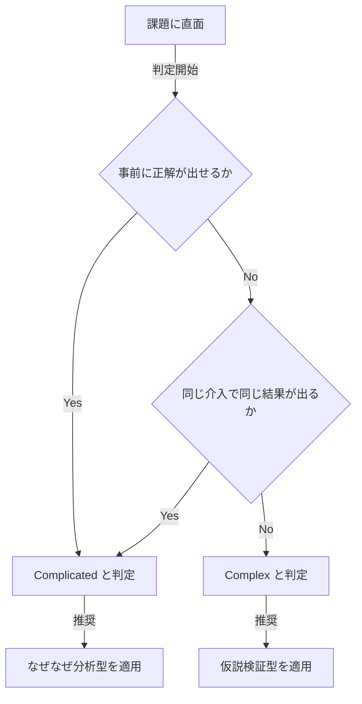
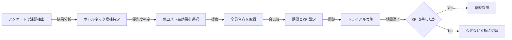
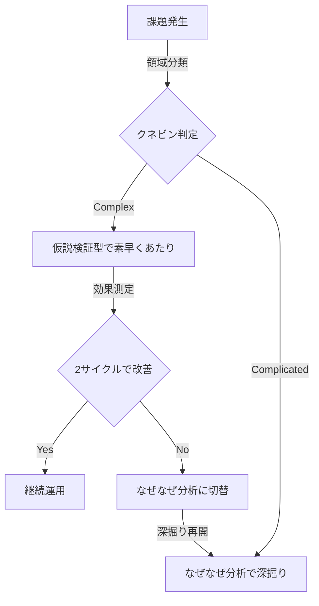

# 組織課題はどちらの「複雑」か?
## —「なぜなぜ信仰」を問い直す

---

## 3行まとめ

- 組織・人間系の課題の多くは「複雑(Complex)」領域にあり、原因を分析しきってから動くアプローチでは解けない。
- なぜなぜ分析は技術系・因果追跡可能な問題に強いが、人間関係や組織の問題では分析麻痺や犯人探しに陥りやすい。
- 「小さく試して観察して応答する」仮説検証型を主、改善しなければなぜなぜ分析へ切り替えるハイブリッド運用が現実的。

---

## 1. 組織課題はどちらの「複雑」か?

チーム業務がうまくいかない。原因を特定して対策しよう — この発想は正しいか?

製造ラインで不良品が出たのなら正しい。コードのバグが出たのなら正しい。では、「チームの雰囲気が悪い」「なぜか成果が出ない」「メンバーが受け身」でも同じか?

**問い:今のチームでは、どんな問題が起きても「まずなぜなぜ分析」になっていないか?**

この資料は、問題の性質でアプローチを選び分ける枠組みを提示する。前提知識は不要。

---

## 2. Cynefin(クネビン)— 問題を4領域に分ける

Cynefin は Dave Snowden が提唱した、問題を性質で4つに分類するフレームワーク。「問題には種類があり、種類ごとに正しい対処法が違う」という考え方。

**図1:クネビンの4領域と推奨アプローチ:**

**表1:4領域の性質と対処:**

| 領域 | 性質 | 例 | 対処法 |
|---|---|---|---|
| Simple 明白 | 答えが既知 | 経費精算ミス、手順違反 | ベストプラクティスを適用 |
| Complicated 込み入っている | 分析で解ける | エンジン故障、税務申告、複雑なバグ | 専門家が分析し設計する |
| Complex 複雑 | 事後にしか因果が見えない | チームの士気、新製品ヒット予測、組織文化 | 小さく試して反応を見る |
| Chaotic 混沌 | 秩序崩壊・緊急事態 | 事故対応、システム全停止 | まず応急行動、安定後に分析 |

**つまり:** 問題を一色で塗るのは危険。まずどの領域かを判定する。

**問い:今の問題は、本当に「分析すれば解ける(Complicated)」問題か? それとも「やってみないと分からない(Complex)」問題ではないか?**

---

## 3. Complicated と Complex — 2つの「複雑」

日本語ではどちらも「複雑」と訳されるが、本質は別物。この違いを掴むことがこの資料の核心。

**一言で言うと:**

- **Complicated(込み入っている)= 分析すれば分かる**
- **Complex(複雑)= やってみないと分からない**

**表2:Complicated と Complex の違い:**

| 観点 | Complicated 込み入っている | Complex 複雑 |
|---|---|---|
| 因果関係 | 追跡可能 | 事後にしか見えない |
| 再現性 | あり(同じ入力→同じ出力) | なし(同じことをしても結果が違う) |
| 専門家の有効性 | 非常に有効 | 限定的 |
| 正解 | 存在する(Good Practice) | 創発する(Emergent Practice) |
| 比喩 | 時計(分解して組立直せる) | 生態系(分解したら死ぬ) |
| 典型例 | 故障、バグ、税務、財務分析 | チーム運営、市場、子育て、文化 |

**見分ける問い:専門家に十分な時間を与えれば、やる前に答えを出せるか?**

- Yes → Complicated
- No → Complex

**問い:チーム業務の不調は、前者か後者か?**
大半は後者である。人の相互作用、感情、歴史的経緯、外部環境が絡み、同じ施策を打っても毎回違う結果が出るからだ。

---

## 4. なぜこの区別が重要か

**Complex な問題に Complicated のアプローチを使うと失敗する。**

典型的な失敗パターンを3つ挙げる。

### 4.1 分析麻痺
「真の原因が分かるまで動けない」と調査を続け、結論が出ないまま時間だけが溶ける。Complex では「真の原因」が単一では存在しないことが多い。

### 4.2 犯人探し
なぜなぜ分析を人間関係に適用すると、「なぜあなたは〜」が連鎖し、特定個人が原因として名指しされる。しかし大抵の組織問題は構造の問題であり、個人の問題ではない。心理的安全性が崩壊する副作用のほうが大きい。

### 4.3 効かない「根本対策」
根本原因を1つに絞って大規模対策を打っても、他の要因が相互作用して効果が出ない。Complex では介入そのものが系を変えるため、事前の大計画はしばしば外れる。

**問い:過去にやった改善施策で、「ちゃんと分析したのに効かなかった」経験はないか?** あるなら、それは領域の取り違いだった可能性が高い。

---

## 5. 2つのアプローチ

### 5.1 なぜなぜ分析(因果追跡型)

- **出自:**トヨタ生産方式、大野耐一
- **手順:**「なぜ?」を5回繰り返して根本原因に到達する
- **得意:**物理的・機械的・再現性のある問題
- **思想:**原因を特定してから対策する

### 5.2 仮説検証型

- **出自:**Lean Startup(Eric Ries)、制約理論(Eliyahu Goldratt)、クネビン
- **手順:**あたりを付ける → 小さく試す → 計測 → 学習 → 次の一手
- **得意:**人間系・組織系・市場系の問題
- **思想:**動きながら学ぶ

**表3:2つのアプローチの比較:**

| 観点 | なぜなぜ分析 | 仮説検証型 |
|---|---|---|
| 適合する問題領域 | Complicated | Complex |
| 起点 | 「真の原因は何か?」 | 「何を試せば分かるか?」 |
| 速度 | 遅い(数日〜数週) | 速い(数時間〜数日) |
| 実施コスト | 高(深掘りに工数) | 低(アンケート+小さな試行) |
| 採用する手法 | 「観察→分析→対応」方式 | 「試行→観察→対応」方式 |
| 心理的副作用 | 犯人探しになりやすい | 参加感・合意が作りやすい |
| 失敗モード | 誤った根本原因に固執 | 表層対策で終わる |
| 再発防止力 | 強い(うまくいけば) | 弱い(症状対処寄り) |

**注:** 「観察→分析→対応」方式 = Sense-Analyze-Respond / 「試行→観察→対応」方式 = Probe-Sense-Respond。出典:Snowden & Boone "A Leader's Framework for Decision Making"(2007)。

**問い:今のチームは、すべての問題を前者で処理していないか?** 道具箱にハンマーしか入っていなければ、すべてが釘に見える。

---

## 6. 使い分け判定

**図2:判定フロー:**

2問とも No なら Complex。チーム運営系の問題はほぼこちらに落ちる。

---

## 7. 仮説検証型の実践設計

Complex 領域で使う仮説検証型は、雑に運用すると「やった感」だけで終わる。以下の5原則で精度を担保する。

### 7.1 五つの原則

1. **あたりをつける** — あるあるパターン集やアンケートでボトルネック候補を抽出(**付録A 参照**)
2. **実施コスト低・効果高から** — 最小の投資で最大の学びを取りに行く
3. **(ほぼ)全員同意** — 合意なき施策は形骸化する。無記名で同意を取ると精度が上がる
4. **トライアル期間を区切る** — 「いつ止めるか」を先に決める。決めないと撤退できない
5. **KPI を定めて定期観察** — 先行指標(1on1実施率、発言分布など)と遅行指標(成果、離職率など)の両方を置く

### 7.2 実践ステップ

**図3:仮説検証型の実行ループ:**

### 7.3 切替基準を先に決めておく

仮説検証型の弱点は、症状対処で終わる可能性があること。これを防ぐため、**「2サイクル回して KPI が改善しなければ、なぜなぜ分析に切り替える」といった撤退基準を最初に明文化する**。

**問い:撤退基準のない施策を走らせていないか?**

---

## 8. 注意点と限界

### 8.1 仮説検証型の落とし穴

- **アンケート設計が結果を支配する**:選択肢の粒度と言葉で結論が変わる。可能なら妥当化済みの既存サーベイを最低1つ混ぜる(Google の Project Aristotle、Lencioni『5つの機能不全』由来の診断など)
- **パターン集が偏ると当てはめも偏る**:網羅性のあるチェックリストや学術フレームで補強する
- **介入そのものが系を変える**:厳密な効果測定(対照群との比較など)は困難。そこは割り切る

### 8.2 なぜなぜ分析の落とし穴

- **人に向けると犯人探しになる**:「なぜ彼は〜」ではなく「なぜこの仕組みは〜」と構造に向ける
- **Complex 領域では真因が収束しない**:5回 Why を繰り返しても別の要因が顔を出す
- **結論が分析者のバイアスに寄る**:深掘りの方向は分析者の仮説に依存する

### 8.3 共通の落とし穴

- **やった満足で終わる**:KPI を置かないと改善実感だけで判断してしまう
- **振り返りがない**:どちらの手法も、施策後のレトロ(振り返り)がないと学習が蓄積しない

---

## 9. 提案:ハイブリッド運用

どちらか一方ではない。**順番と切替基準**を決めて両方使う。

**図4:ハイブリッド運用のフロー:**

**最終的な問いかけ:**

- 今のチームは、問題を領域で仕分けているか、それとも全部「なぜなぜ」で処理していないか?
- 現在進行中の改善施策に、トライアル期間と KPI と撤退基準はあるか?
- メンバーは施策に「(ほぼ)全員同意」しているか、それとも声の大きい人に押されているか?

道具はなぜなぜ分析だけで良いのか? この問いを本日の出発点にしたい。

---

## 参考文献

- Dave Snowden & Mary Boone "A Leader's Framework for Decision Making" Harvard Business Review(2007)— クネビンの定式化
- Eric Ries "The Lean Startup"(2011)— Build-Measure-Learn ループ
- Eliyahu Goldratt "The Goal"(1984)— 制約理論、ボトルネック集中攻撃
- 大野耐一『トヨタ生産方式』(1978)— なぜなぜ分析の原典
- John Kotter "Leading Change"(1996)— Quick Wins で勢いをつける変革論
- Patrick Lencioni "The Five Dysfunctions of a Team"(2002)— チーム機能不全モデル
- Amy Edmondson "The Fearless Organization"(2018)— 心理的安全性
- Google re:Work "Project Aristotle"(Web公開資料)— 効果的チームの5要素

---

## 付録A:組織課題のあるあるパターンと対策

本表は仮説検証型の「あたりをつける」段階で使うチェックリスト。自チームに当てはまるものをアンケートで抽出し、低コスト高効果の対策から試行する。関連用語は付録Bを参照。

**表A1:8カテゴリの組織課題と対策:**

| カテゴリ | あるあるパターン | 低コスト対策 | 関連用語 |
|---|---|---|---|
| 目標・方向性 | ゴールが曖昧、優先順位不明、成功基準が未定義、四半期ごとに方針がブレる | キックオフで合意形成、SMART 目標設定、優先順位リストを壁に貼る、四半期レビュー | SMART、OKR |
| 役割・責任 | 誰がやるか不明、責任のなすりつけ、スキルとタスクのミスマッチ、兼務過多 | RACI 図の作成、タスクごとにオーナー1名を明示、スキルマップ作成 | RACI、DACI |
| コミュニケーション | 情報サイロ化、心理的安全性の欠如、会議過多/不足、フィードバックがない | 情報共有ルール策定、週次1on1、レトロスペクティブ導入、意思決定のドキュメント化 | 心理的安全性、1on1、レトロスペクティブ |
| リーダーシップ・意思決定 | 決断が遅い、マイクロマネジメント、意思決定プロセスが不透明、責任者不明 | DACI で決定権を明示、期限付き決定、権限委譲のルール化 | DACI、権限委譲 |
| プロセス・進捗管理 | 進捗が不可視、優先順位がつけられない、ボトルネック放置、手戻り多発 | カンバン導入、WIP 制限、定期レビュー、ポストモーテム | カンバン、WIP制限、ポストモーテム |
| モチベーション・エンゲージメント | 社会的手抜き、評価不公平感、燃え尽き、目的意識の欠如 | 個人貢献の可視化、公正な評価基準、休息設計、パーパス共有、チームサイズ見直し | 社会的手抜き、リンゲルマン効果、パーパス共有、2枚のピザ |
| 集団心理バイアス | 同調圧力で反対意見が出ない、全員反対なのに進む、外部案の拒絶、誰も指摘しない | 悪魔の代弁者を指名、匿名インプット、プレモーテム、外部視点の導入 | グループシンク、アビリーンのパラドックス、NIH症候群、悪魔の代弁者、プレモーテム、匿名インプット |
| 外部環境・リソース | 予算/時間/人員不足、経営支援の欠如、他部署連携不足、仕様変更の頻発 | バッファ確保、スポンサー確保、関係者マップ作成、変更管理プロセス | ステークホルダーマネジメント |

**使い方:**
- アンケートで「自チームに当てはまるパターン」を無記名で投票させる
- 得票上位のパターンを2〜3個選び、対応する「低コスト対策」から1つ選んで試行
- トライアル期間(例:1ヶ月)と KPI を事前に定めて開始
- 期間終了後、KPI 改善を確認。改善なければ別パターンへ、または本編9章のなぜなぜ分析へ切替

**問い:この表のパターン、今のチームにいくつ当てはまるか?**

---

## 付録B:用語一覧

**目標・計画系:**

- **SMART** — Specific/Measurable/Achievable/Relevant/Time-bound。目標設定の5原則
- **OKR** — Objectives and Key Results。野心的な目標(O)と測定可能な成果指標(KR)で運用する目標管理手法
- **Quick Wins** — 短期間で達成できる小さな成功。変革の勢いをつける(John Kotter)
- **Build-Measure-Learn** — Lean Startup のループ。作る→測る→学ぶ(Eric Ries)
- **制約理論** — 全体の処理能力はボトルネックで決まるという理論(Goldratt)

**役割・意思決定系:**

- **RACI** — Responsible/Accountable/Consulted/Informed。タスクごとの役割を4種類で整理する表
- **DACI** — Driver/Approver/Contributors/Informed。意思決定の役割を4種類で明確化するフレーム
- **権限委譲** — 上位者の決定権を下位者に移すこと。意思決定速度を上げる

**プロセス・運営系:**

- **カンバン** — タスクの状態(To Do/Doing/Done)を可視化し、流れを管理する手法
- **WIP制限** — Work In Progress 制限。同時進行タスク数に上限を設け、完了率向上を狙う
- **2枚のピザ** — Amazon 発。チームは「ピザ2枚で足りる人数(6〜8人)」までとする原則
- **レトロスペクティブ** — 一定期間の活動を振り返り改善点を共有する会。アジャイル用語、略してレトロ
- **1on1** — 上司と部下の定期的な1対1面談。成長支援とフィードバックが目的

**チーム心理系:**

- **心理的安全性** — 対人リスクを取っても罰されないと信じられるチームの状態(Amy Edmondson)
- **パーパス共有** — 組織や仕事の存在意義(Purpose)を言語化し、メンバーで共有すること
- **社会的手抜き** — 集団で作業すると個人の責任感が薄れ本気を出さなくなる現象
- **リンゲルマン効果** — 集団の人数が増えるほど1人あたりの貢献度が減る現象。社会的手抜きの原因

**集団心理バイアス系:**

- **グループシンク** — 集団浅慮。調和を優先するあまり批判的思考や代替案検討が抑制される状態(Irving Janis)
- **アビリーンのパラドックス** — 全員が内心反対なのに誰も言い出さず集団の決定に従う現象(Jerry Harvey)
- **NIH症候群** — Not Invented Here。外部で作られたものを排除し自前にこだわる組織病理
- **悪魔の代弁者** — Devil's Advocate。議論で意図的に反対意見を出す役を設ける技法。多数派バイアス対策
- **匿名インプット** — 発言者を特定せずに意見を集める方法。社会的望ましさバイアスや同調圧力を回避

**振り返り系:**

- **モーテム** — Post-mortem(死後分析)の語幹。事後または事前の振り返り行為を指す総称
- **プレモーテム** — 施策開始前に「失敗したと仮定して原因を議論する」手法(Gary Klein)
- **ポストモーテム** — 障害や失敗の後に原因と教訓を分析する会。IT・医療分野で普及
- **ブレームレス** — Blameless。個人を責めず構造と仕組みの改善に焦点を当てる姿勢

**関係者調整系:**

- **ステークホルダーマネジメント** — 施策の影響を受ける関係者を特定し、期待管理と調整を行うこと

