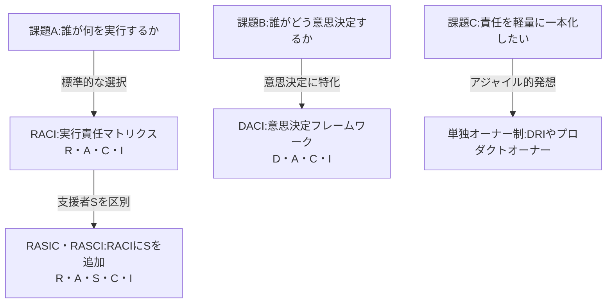
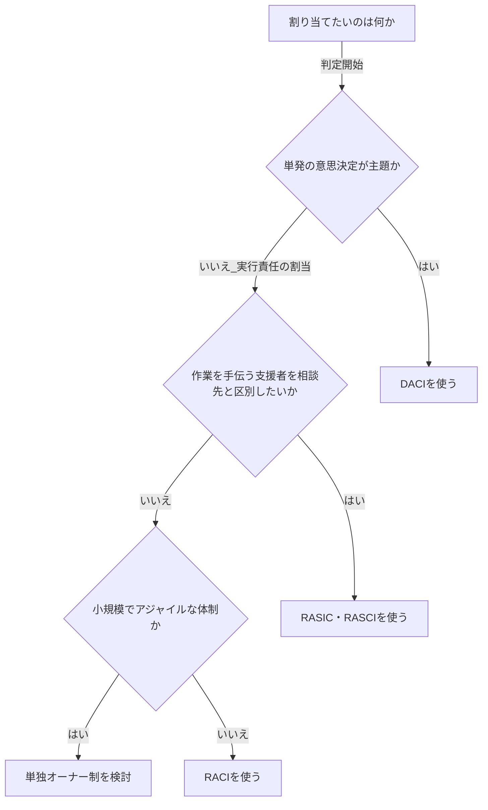

# DACI・RACI・RASIC 徹底比較 — 責任分担と意思決定のフレームワーク

> 同フォルダの `beyond-five-whys.md` 付録B(用語一覧)の RACI / DACI 項目を補完する詳細版。

---

## 0. 結論(先出し)

- この3つは「同じ穴のムジナ」ではない。**RACI と RASIC は「実行責任」の割当**、**DACI は「意思決定」の割当**。解いている問題が違う。
- **RASIC は「古い」のではなく「ニッチ化」した。** 時代遅れ(obsolete)ではない。支援者(Support)を明示する実益がある大規模・複雑・規制産業では今も現役。ただし流行の中心ではない。詳細は §7。
- ざっくり選び方: **継続タスクの割当 → RACI** / **手伝う人を区別したい複雑案件 → RASIC** / **単発の意思決定 → DACI** / **小規模アジャイル → そもそも単独オーナー制(DRI)に寄せる**。

---

## 1. 共通の土台:責任分担マトリクス(RAM)

RACI も RASIC も、根っこは **責任分担マトリクス(RAM = Responsibility Assignment Matrix)** という1枚の表だ。

- **行** = タスク / 成果物
- **列** = 人 / 役割
- **セル** = その人がそのタスクに対して負う役割の記号(R, A, C, I …)

目的はただ一つ、**「誰が何に責任を持つか」の曖昧さを消す**こと。「誰かがやると思ってた」「聞いてない」を撲滅する道具である。DACI も表形式で使える点は同じだが、行が「タスク」ではなく「意思決定事項」になる。

---

## 2. RACI — 実行責任の標準形

最も広く使われる、事実上の標準。4つの役割の頭字語。

| 記号 | 名称 | 日本語 | 役割 | 人数の目安 |
|---|---|---|---|---|
| R | Responsible | 実行責任者 | 実際に手を動かして作業する | 1人以上 |
| A | Accountable | 説明責任者 | 最終的に成果の責任を負い、承認する。「責任の終着点」 | 各行ちょうど1人 |
| C | Consulted | 相談先 | 着手前・途中に意見や専門知識を提供する(双方向) | 必要に応じて |
| I | Informed | 報告先 | 結果・進捗を一方的に知らされる(一方向) | 必要に応じて |

**運用ルール(定番):**

- A は各タスクに **ちょうど1人**(複数いると責任が分散して機能しない)。
- R は **最低1人**。A が R を兼ねることもある。
- C(相談)と I(報告)を増やしすぎると会議地獄になる。最小限に。

**よくある混同:** R(実行する人)と A(責任を負う人)の取り違え。「作業者=責任者」とは限らない。

---

## 3. RASIC / RASCI — RACI に「支援者」を足したもの

### 3.1 正体

**RASIC = RACI + S(Support)**。RACI の4役に **Support(ive)= 支援者** を1つ加えた5役モデル。

| 記号 | 名称 | 日本語 | 役割 |
|---|---|---|---|
| R | Responsible | 実行責任者 | 作業を行う |
| A | Accountable | 説明責任者 | 結果の責任を負い承認する |
| S | Support(ive) | 支援者 | **実行責任者の作業を手伝う・リソースを提供する(手を動かす側の補助)** |
| I | Informed | 報告先 | 知らされる |
| C | Consulted | 相談先 | 意見・知識を提供する |

### 3.2 「RASIC」と「RASCI」は同じもの

- どちらも **R・A・S・C・I の5役**で、**頭字語の並び順が違うだけ**。中身は同一、というのが一般的な理解。
- 「RASCI」表記のほうがやや一般的。質問の「RASIC」も同義として扱ってよい。

### 3.3 核心: S(支援)と C(相談)はどう違う?

ここが RASIC を使う唯一にして最大の理由。

- **C(Consulted / 相談先)= 助言する人。** 専門知識や意見を出すが、**作業そのものはしない**。
- **S(Support / 支援者)= 手伝う人。** 実行責任者と一緒に**手を動かして作業を進める**側の補助。

> 「アドバイスをくれる人(C)」と「実作業を手伝ってくれる人(S)」を分けたい——この区別に実益がある現場でだけ、RASIC は RACI に勝る。

### 3.4 注意:A の解釈に揺れ

RASIC の "A" は通常 **Accountable(説明責任)** だが、業界によっては **Approve(承認)** の意味で使う変種もある。表を配る前に定義をそろえておくこと。

---

## 4. DACI — 意思決定の割当

RACI/RASIC が「実行」の表なのに対し、DACI は **「意思決定」専用**のフレームワーク。テック/プロダクト系の組織で広まった。

| 記号 | 名称 | 日本語 | 役割 | 人数の目安 |
|---|---|---|---|---|
| D | Driver | 推進者 | 意思決定を前に進める旗振り役。情報を集め、関係者を巻き込み、期限を守らせる。**決定者とは限らない** | 1人 |
| A | Approver | 承認者 | **最終決定を下す**人 | 理想は1人 |
| C | Contributor | 貢献者 | 知識・作業・意見を提供する。RACI の R+C に近い | 複数可 |
| I | Informed | 報告先 | 決定結果を知らされる | 複数可 |

**DACI の肝は D(Driver)。** 「決める人(A)」と「決定プロセスを回す人(D)」を分けたのが RACI との最大の違い。会議が長引き結論が出ない問題に効く。

**RACI とのざっくり対応:**

| DACI | 近い RACI の役割 |
|---|---|
| Driver | (RACI に明確な対応なし。あえて言えばプロジェクトを回す R) |
| Approver | Accountable |
| Contributor | Responsible + Consulted |
| Informed | Informed |

---

## 5. 横断比較表

| 観点 | RACI | RASIC / RASCI | DACI |
|---|---|---|---|
| 主目的 | 実行責任の割当 | 実行責任の割当(支援者を明示) | 意思決定の割当 |
| 解く問い | 誰が何をやるか | 誰が何をやり、誰が手伝うか | 誰がどう決めるか |
| 役割数 | 4 | 5 | 4 |
| 単一であるべき役割 | A(説明責任) | A(説明責任) | A(承認者)/ D(推進者) |
| 「手伝う人」の扱い | C か R に内包 | **S として独立** | C(貢献者)に内包 |
| 最適な対象 | 継続的プロジェクトのタスク群 | 大規模・複雑・多関与の案件 | 単発〜重要な意思決定 |
| 典型的な利用領域 | 汎用・PM全般 | 建設・製造・EPC・ERP導入・規制産業 | テック・プロダクト・アジャイル組織 |
| 主な弱点・批判 | 役割が形骸化/A と R の混同 | 役割過多で複雑/S と C の境界が曖昧 | 実行タスクの網羅には不向き |
| 現在の勢い(目安) | 高(事実上の標準) | 中〜低(ニッチ) | 中〜高(伸長) |

---

## 6. 3つの関係性

**3フレームワークの位置づけ:**

RACI を基準に、横へ「支援者の区別」を足したのが RASIC、別問題である「意思決定」へ振ったのが DACI、という関係。DACI は RACI の上位互換ではなく、**別の用途**である点が重要。

---

## 7.「RASIC はもう古いのか?」— 核心の問い

### 判定:**「古い」のではなく「ニッチ化」した。obsolete ではない。**

一律に「もう古い」と切るのは誤り。正確には「**流行の中心から外れたが、特定領域では今も最適**」である。

### 7.1 「古い」と感じられる3つの理由

1. **RACI が標準化しすぎた。** 5役の RASIC より4役の RACI が覚えやすく、教育・ツール・テンプレが RACI に集中。S は「C に寄せれば足りる」と省かれがち。
2. **アジャイル/リーンの潮流。** 重厚なマトリクスより、**単独オーナー制(DRI = Directly Responsible Individual、プロダクトオーナー)** で責任を一本化する流れ。役割が多い RASIC は「重い」と見られる。
3. **意思決定系の新顔が目立つ。** DACI・RAPID などが脚光を浴び、相対的に RASIC の話題が減った。

### 7.2 それでも生き残る3つの理由

1. **支援者(S)の区別に実益がある領域が存在する。** 建設・EPC・製造・ERP導入・医療機器・規制産業など、「助言者」と「実作業の手伝い」を分けないと現場が回らない大規模案件では、RASCI が今も標準的に使われる。
2. **置き換える"より良い実行責任モデル"が出ていない。** RASIC を陳腐化させたのは「上位互換」ではなく「RACI への簡素化」と「単独オーナー制への軽量化」。つまり**過剰だから削られた**だけで、**間違っているわけではない**。
3. **精度が要るときの精密ツール。** 役割の粒度が欲しい局面では、RASIC のほうが現実を正確に写し取れる。

### 7.3 ありがちな誤解:「DACI が出たから RASIC は古い」

これは**カテゴリ違い**。DACI が解くのは「意思決定」、RASIC が解くのは「実行責任の割当」。守備範囲が違うので、DACI は RASIC の代替にならない。「新しい方が良い」ではなく「**用途が別**」。

### 7.4 まとめると

- **古くはない。が、流行ってもいない。** 使いどころが「大規模・複雑・支援者の区別が要る案件」に限定されただけ。
- 多くの現代的な小〜中規模チームでは、**RACI(または単独オーナー制)で十分**で、わざわざ RASIC を持ち出す必要は薄い。
- よって実務的な落とし所は「**既定は RACI、複雑案件で S が要るなら RASIC、意思決定は DACI**」。

---

## 8. 使い分けガイド

**フレームワーク選択フロー:**

意思決定が主題なら DACI。実行責任の割当で、支援者の区別が要るなら RASIC、要らないなら(小規模アジャイルは単独オーナー制、それ以外は)RACI。

---

## 9. よくある落とし穴(全フレーム共通)

- **記号を埋めて満足する。** 表の完成が目的化し、運用されない「飾り表」になる。
- **A / Approver を複数置く。** 責任の終着点が複数あると、誰も決めない・誰も責任を取らない。
- **C と I を盛りすぎる。** 相談先・報告先が多いほど合意コストが爆発する。
- **定義を共有しない。** 特に RASIC の S と C、DACI の D と A は誤解されやすい。配布前に1行定義を添える。
- **作って終わり、見直さない。** 体制やフェーズが変われば責任も変わる。定期的に更新する。

---

## 10. 補足:関連フレームワーク

RACI 系・DACI 系には派生が多い。代表例(いずれも「広く知られる説明」であり、定義の細部は資料により差がある)。

- **RAPID**(Bain & Company 提唱)— Recommend / Agree / Perform / Input / Decide。意思決定特化。
- **DARE** — Decider / Advisor / Recommender / Execution。軽量な意思決定フレーム。
- **CARS** — Communicate / Approve / Responsible / Support。
- **PACSI** — Perform / Accountable / Control / Suggest / Informed。RACI の派生で「Control(検証)」を持つのが特徴。
- **DRI**(Apple の運用に由来するとされる)— Directly Responsible Individual。1タスク1責任者に振り切る軽量モデル。アジャイル文脈で人気。

---

## 11. 出典についての注記(推測・捏造はしない方針)

- 本レポートは、各フレームワークについて**広く流通している一般的な定義**に基づいて記述している。
- RACI は責任分担マトリクス(RAM)の代表例として、プロジェクトマネジメント分野で古くから用いられてきた。
- DACI は **Intuit が考案し、Atlassian が普及させた**と一般に説明される。RAPID は **Bain & Company** が提唱。DRI は **Apple** の運用に由来するとされる。
- ただし、**各手法の正確な初出年・考案者・定義の細部は資料により差異がある**。厳密な引用・出典が必要な場合は、各社の公式ドキュメントや PMI 等の一次資料を確認すること。
- 「現在の勢い(目安)」欄および §7 の流行度評価は、一般的傾向に基づく**筆者の定性的な見立て**であり、定量的な調査結果ではない。
